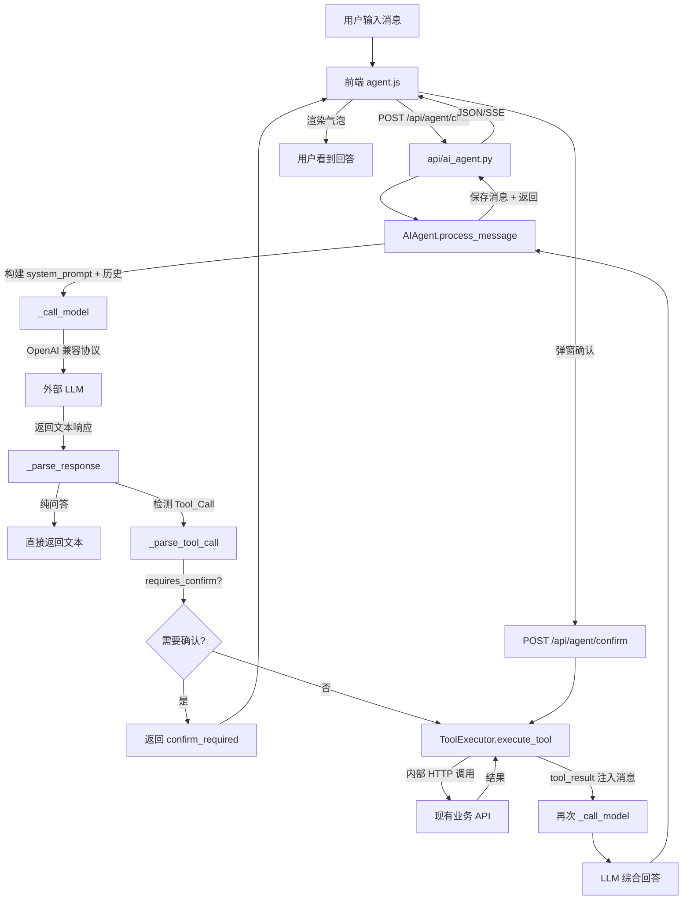
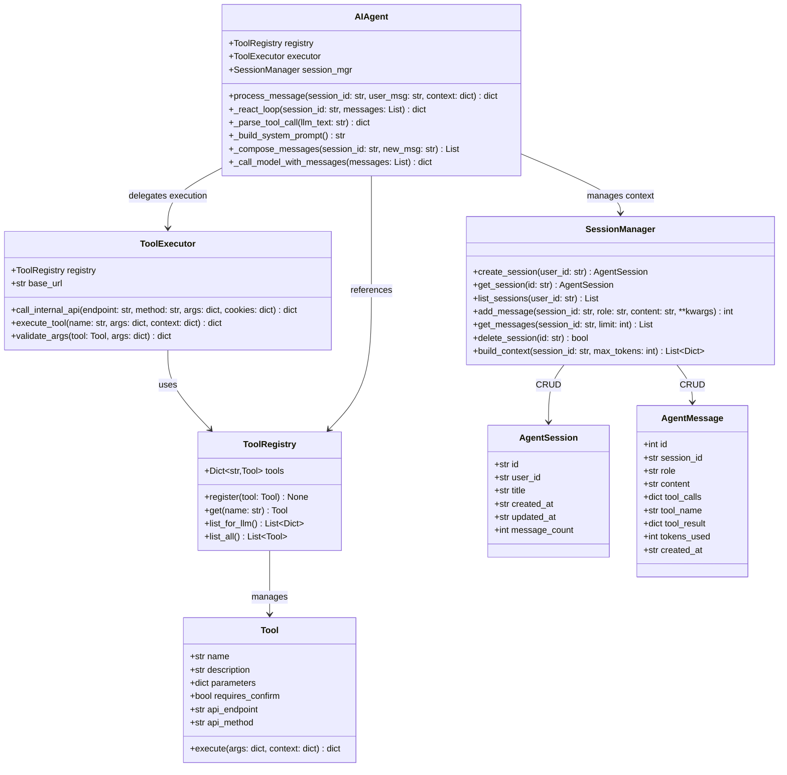
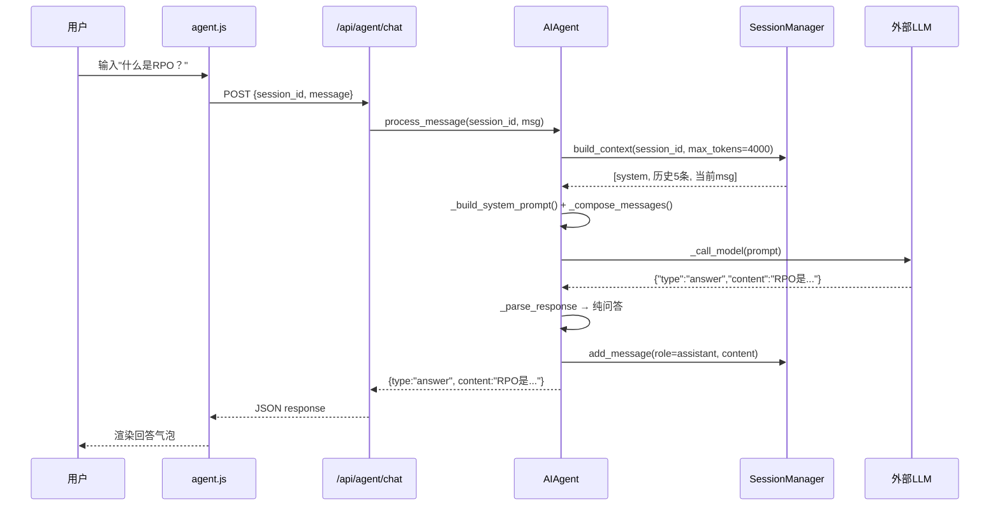
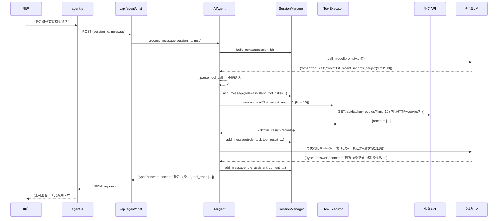
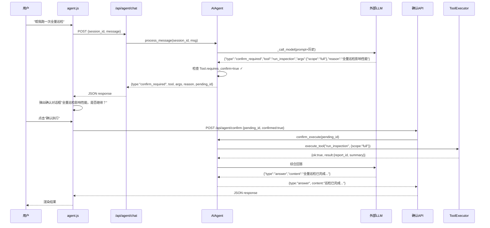
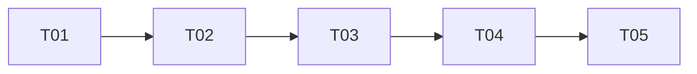

# AI 智能助手系统架构设计

> 版本: v1.0 | 作者: 高见远(架构师) | 日期: 2025-08-01
> 基于 PRD `ai-agent-prd.md` 及现有代码分析

---

## 1. 总体架构图



**核心循环**: ReAct（Reason → Act → Observe），最多 3 轨工具调用后强制输出。

---

## 2. 关键设计决策

### 决策 1: ReAct Prompt vs OpenAI Function Calling

| 维度 | Function Calling | ReAct Prompt |
|------|-----------------|-------------|
| 通用性 | 需 provider 支持（智谱/Qwen 部分支持） | 任何兼容 chat/completions 的 provider |
| 改动量 | 需改 `_call_model` 消息结构 + 增加 tools 字段 | 仅改 prompt 文本，复用现有调用 |
| 可控性 | SDK 自动解析，调试黑盒 | 文本解析可控，可加兜底正则 |
| 幻觉风险 | 低（schema 约束参数） | 中（需 prompt 强约束 + 参数校验） |

**建议**: **ReAct Prompt** + JSON 输出格式约束。理由：
1. 现有 `_call_model` 用 urllib 直发 `{"role":"user","content":prompt}`，改造成本最低
2. 支持 MoMA/智谱/Qwen/DeepSeek 全部 provider，无兼容碎片
3. MVP 先跑通，P2 阶段可加 Function Calling 双模

### 决策 2: 工具定义格式

**建议**: 用 **OpenAI tools JSON Schema 格式** 定义参数 schema（便于未来切 Function Calling），但 ReAct 模式下在 prompt 中以文本+JSON 示例方式呈现给 LLM。`Tool.parameters` 存标准 JSON Schema，`list_for_llm()` 转成 prompt 段落。

### 决策 3: 会话存储 Schema

**建议**: 两表设计（`ai_sessions` + `ai_messages`），同库同实例。理由：
1. 与现有 `meta.db` 一致，零额外依赖
2. `ai_messages.tool_calls / tool_result` 用 JSON TEXT 存储，灵活扩展
3. 上下文窗口：取最近 N 条消息 + token 滑窗截断（max 4000 token），超长历史用摘要压缩（P2）

### 决策 4: 危险操作确认机制

**建议**: **前端弹窗 + 后端标记**。理由：
1. LLM 自 ask 不可靠（幻觉跳过确认 → 100% 不可接受）
2. `Tool.requires_confirm=true` → Agent 检测到后返回 `{confirm_required, tool_name, args}` → 前端弹窗 → 用户确认 → `POST /api/agent/confirm` → 后端二次校验 session + 工具标记 → 执行
3. 后端做最终守门：`confirm` 请求无 `confirmed=true` 标记则拒绝执行

---

## 3. 文件清单及相对路径

```
# 新增文件
core/ai_agent/__init__.py           # 模块入口，导出 AIAgent 单例
core/ai_agent/tools.py              # ToolRegistry + 7 个 Tool 定义
core/ai_agent/executor.py           # ToolExecutor: 内部 HTTP 调用业务 API
core/ai_agent/session.py            # SessionManager: SQLite CRUD + 上下文构建
core/ai_agent/agent.py              # AIAgent 核心: ReAct 循环 + 消息编排
api/ai_agent.py                     # REST API 路由
templates/agent.html                # 聊天全屏页面
static/js/agent.js                  # 聊天前端逻辑（IIFE，与 app.js 同风格）
static/css/agent.css                # 聊天样式（Slate+Teal 体系）
tests/test_ai_agent.py              # Agent 模块单元/集成测试

# 修改文件
api/__init__.py                     # 增加 ai_agent 模块导入
app.py                              # 增加 /agent 页面路由
templates/base.html                 # 侧边栏增加 💬AI 助手入口
core/db.py                          # SCHEMA 增加 ai_sessions + ai_messages 表
```

---

## 4. 数据模型

```sql
CREATE TABLE IF NOT EXISTS ai_sessions (
    id              TEXT PRIMARY KEY,          -- UUID
    user_id         TEXT NOT NULL,             -- session["user"]
    title           TEXT DEFAULT '新对话',     -- 首条消息摘要生成
    created_at      TEXT NOT NULL,             -- ISO 8601
    updated_at      TEXT NOT NULL,
    message_count   INTEGER DEFAULT 0,
    is_deleted      INTEGER DEFAULT 0          -- 软删除标记
);

CREATE TABLE IF NOT EXISTS ai_messages (
    id              INTEGER PRIMARY KEY AUTOINCREMENT,
    session_id      TEXT NOT NULL REFERENCES ai_sessions(id),
    role            TEXT NOT NULL,             -- user / assistant / tool / system
    content         TEXT,                      -- 消息文本
    tool_calls      TEXT,                      -- JSON: [{name, args}]
    tool_name       TEXT,                      -- 单次工具名（便于查询）
    tool_result     TEXT,                      -- JSON: 工具返回结果
    confirm_required INTEGER DEFAULT 0,        -- 是否需要确认标记
    tokens_used     INTEGER DEFAULT 0,         -- 本次消耗 token
    created_at      TEXT NOT NULL
);

CREATE INDEX IF NOT EXISTS idx_ai_messages_session
    ON ai_messages(session_id, created_at);
CREATE INDEX IF NOT EXISTS idx_ai_sessions_user
    ON ai_sessions(user_id, updated_at);
```

---

## 5. 工具注册表设计



### MVP 7 工具完整定义

| 工具名 | 描述（LLM视角） | 参数(JSON Schema) | 需确认 | API端点 | 方法 |
|--------|-----------------|-------------------|--------|---------|------|
| `run_backup_task` | 立即运行指定备份任务，返回执行状态 | `{task_id: {type:string,required:true}, task_type: {type:string}}` | ✅ | `/api/tasks/{task_id}/run` | POST |
| `run_inspection` | 立即执行巡检，可指定任务或全量 | `{task_id: {type:string}, scope: {type:string,enum:[quick,full]}}` | ✅(scope=full) | `/api/inspection/run` | POST |
| `list_recent_records` | 查询最近备份记录 | `{task_id: {type:string}, limit: {type:int,default:20}}` | ❌ | `/api/backup-records` | GET |
| `list_alert_predictions` | 查询AI预测告警列表 | `{metric: {type:string}, days: {type:int,default:7}}` | ❌ | `/api/alerts/predictions` | GET |
| `get_storage_usage` | 查询存储空间用量 | `{target_id: {type:string}}` | ❌ | `/api/storage/usage` | GET |
| `list_tasks` | 列出所有备份任务 | `{type: {type:string}, enabled: {type:string}}` | ❌ | `/api/tasks` | GET |
| `get_inspection_report` | 获取巡检报告详情 | `{record_id: {type:string,required:true}}` | ❌ | `/api/inspection/records` | GET |

---

## 6. ReAct Prompt 设计

```python
SYSTEM_PROMPT = """你是数据备份管理平台的 AI 智能助手。你可以回答运维知识问题，也可以通过工具执行备份/巡检/查询等操作。

## 可用工具

{tools_description}

## 输出格式

你必须严格按以下 JSON 格式输出（不要包含任何其他文字）：

### 纯问答（不调用工具）：
```json
{{"type": "answer", "content": "你的回答文本"}}
```

### 调用工具：
```json
{{"type": "tool_call", "tool": "工具名", "args": {{参数对象}}}}
```

### 需要确认的危险操作：
```json
{{"type": "confirm_required", "tool": "工具名", "args": {{参数对象}}, "reason": "需要确认的原因"}}
```

## Few-shot 示例

用户: "最近备份有没有失败？"
助手: ```json
{{"type": "tool_call", "tool": "list_recent_records", "args": {{"limit": 10}}}}
```

用户: "帮我跑一次生产库巡检"
助手: ```json
{{"type": "confirm_required", "tool": "run_inspection", "args": {{"scope": "quick"}}, "reason": "巡检操作会影响数据库性能，请确认"}}
```

用户: "什么是RPO？"
助手: ```json
{{"type": "answer", "content": "RPO（Recovery Point Objective）是恢复点目标，指灾难发生后允许丢失的数据量时间窗口…"}}
```

## 约束
1. 一次只调用一个工具
2. 涉及执行操作（备份/巡检）时必须先确认
3. 不确定参数时回答"请提供更多信息"
4. 绝不虚构 task_id，不确定时先用 list_tasks 查询"""
```

工具描述段由 `ToolRegistry.list_for_llm()` 动态生成，格式：

```
- list_tasks: 列出所有备份任务。参数: {type?:string, enabled?:string}
- run_backup_task: 立即运行指定备份任务（⚠需确认）。参数: {task_id:string(必填)}
...
```

---

## 7. 时序图

### 7.1 普通问答流程



### 7.2 工具调用流程



### 7.3 危险操作确认流程



---

## 8. 任务列表

按实现顺序，MVP 优先（T01-T03 即可跑通最小可用循环）。

### T01: 数据模型 + 工具注册表
**输入**: PRD 工具清单 + 现有 API 端点映射
**输出**: `core/db.py` 新增表 + `core/ai_agent/tools.py` + `core/ai_agent/__init__.py`
**文件**: `core/db.py`(修改SCHEMA), `core/ai_agent/__init__.py`, `core/ai_agent/tools.py`
**依赖**: 无
**优先级**: P0

### T02: 核心后端（会话 + 执行器 + Agent）
**输入**: T01 的工具注册表 + 现有 `_call_model` / `_compose_prompt` / `_parse_response`
**输出**: `core/ai_agent/session.py` + `core/ai_agent/executor.py` + `core/ai_agent/agent.py`
**文件**: `core/ai_agent/session.py`, `core/ai_agent/executor.py`, `core/ai_agent/agent.py`
**依赖**: T01
**优先级**: P0
**说明**: executor 复用现有 `api/` 下的业务函数（通过内部 HTTP 请求+cookie 透传），不重写业务逻辑

### T03: REST API + 路由集成
**输入**: T02 的 AIAgent 类
**输出**: `api/ai_agent.py` + `api/__init__.py`(修改) + `app.py`(修改) + `templates/agent.html`(骨架)
**文件**: `api/ai_agent.py`, `api/__init__.py`, `app.py`, `templates/agent.html`
**依赖**: T02
**优先级**: P0
**说明**: 三个端点：`POST /api/agent/chat`、`GET /api/agent/sessions`、`POST /api/agent/confirm`；MVP 先用同步 JSON 返回

### T04: 聊天前端 UI + 危险确认
**输入**: T03 的 API 端点
**输出**: `static/js/agent.js` + `static/css/agent.css` + `templates/agent.html`(完整) + `templates/base.html`(修改侧边栏)
**文件**: `static/js/agent.js`, `static/css/agent.css`, `templates/agent.html`, `templates/base.html`
**依赖**: T03
**优先级**: P1
**说明**: 聊天区 + 输入框 + 会话列表 + 确认弹窗 + 工具调用折叠卡片；IIFE 结构与 app.js 一致

### T05: 集成测试 + SSE 流式 + 文档
**输入**: T01-T04 全部产出
**输出**: `tests/test_ai_agent.py` + SSE 支持 + 最终文档
**文件**: `tests/test_ai_agent.py`, `api/ai_agent.py`(增加SSE), `static/js/agent.js`(增加SSE解析)
**依赖**: T04
**优先级**: P1（测试 P0，SSE P2）
**说明**: 测试覆盖工具注册/会话CRUD/Agent循环/确认拦截；SSE 为增强功能

### 任务依赖图



---

## 9. 共享知识（跨文件约定）

- **鉴权**: 工具执行器通过 Flask `test_client` 或内部 HTTP 请求复用用户 session cookie（`request.cookies` 透传），不另起 API Key
- **API 响应格式**: `{ok: bool, data?: any, error?: string, type?: string}`，与现有 `api/` 端点一致
- **日志**: 统一用 `core.db.get_logger("ai_agent")`，格式 `[ai_agent] 模块.动作: 详情`
- **数据库连接**: 复用 `core.db` 的 `_write_lock + get_conn()`，不另开连接池
- **LLM 配置**: 复用 `AIPredictor.get_config().ai_model`，API Key 通过 `decrypt_api_key` 解密
- **日期格式**: 全部 ISO 8601 UTC，与现有 `db.now_iso()` 一致
- **前端风格**: IIFE + `window.*` 暴露函数（与 app.js 一致），Bootstrap 5 组件，Slate+Teal 色系

---

## 10. 待明确事项

1. **ReAct 轮数上限**: 建议 3 轨，超过强制输出纯文本回答，是否可接受？
2. **LLM 配置复用**: Agent 是否复用 AI 告警的 `ai_model` 配置（同一个 provider/endpoint/key），还是独立配置？建议复用，减少配置负担
3. **内部 API 调用方式**: ToolExecutor 调用业务 API 是用 Flask `test_client`（进程内调用，零网络开销）还是内部 HTTP 请求？建议 `test_client` 更高效
4. **会话标题生成**: 首条消息后是否用 LLM 生成摘要标题？MVP 可用首条消息前 20 字
5. **并发限制**: 同一用户同时只能有一个工具在执行中，多请求排队？建议 MVP 单进程无并发问题，P2 加排队
6. **模型切换**: 用户能否在对话中切换模型？建议 MVP 不支持，复用全局配置
