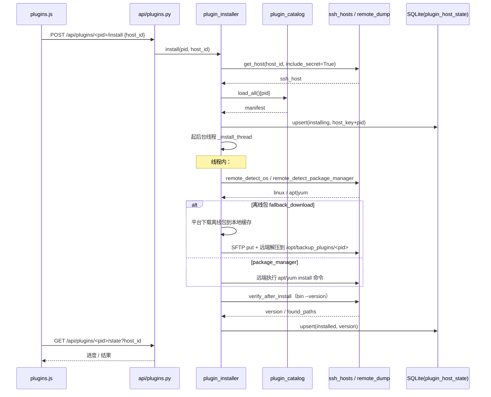
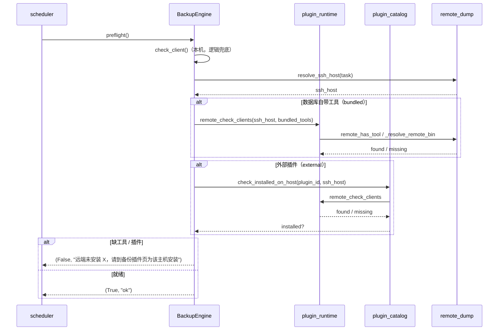
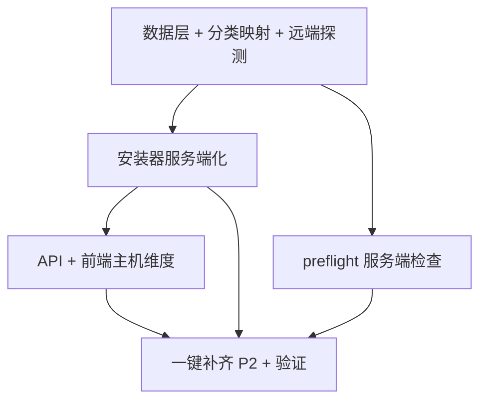

# 架构设计：物理备份插件安装与调度逻辑优化（服务端侧）

> 项目：backup_plugin_serverside_optimization
> 日期：2026-08-13
> 作者：Architect (Bob)
> 上游输入：`docs/prd_backup_plugin_serverside_2026-08-13.md`
> 范围：仅设计文档，不改业务代码。

---

## Part A：系统设计

### 1. 实现方案 + 框架选型

#### 1.1 核心难点

1. **安装目标从「平台本机」迁移到「可指定 SSH 服务端」**：现有 `plugin_installer` 用 `subprocess.run(shell=True)` 在平台主机执行，`detect_os()/detect_package_manager()` 用 `shutil.which()` 探测本机 OS/包管理器。改造后所有安装动作都要落到远端数据库服务器上，但状态/日志仍落平台（供前端轮询），形成「**远端执行 + 平台观测**」的分离。
2. **物理备份工具二分类判定**：必须把「数据库自带工具」（rman/pg_basebackup/sys_basebackup/dmrman，直接 SSH 执行、不走插件）与「外部插件」（xtrabackup/mariabackup/pgbackrest/mongodump/redis-cli，先装服务端再执行）在调度前检查里区分对待，否则会出现「平台装好了、远端没装」却仍放行的误判。
3. **状态按「主机」维度持久化**：单插件状态要扩展为「主机 × 插件」二维，且要跨进程/重启可见（不能只依赖易失的状态文件）。
4. **无 Agent 约束下的远程探测与幂等**：复用现有 paramiko SSH/SFTP，探测远端 OS、包管理器、二进制版本；多主机同名插件互不影响。

#### 1.2 框架与库选型（沿用现有，零新增依赖）

| 维度 | 选型 | 理由 |
|---|---|---|
| SSH/SFTP | **paramiko（现有）** | `core/remote_dump._connect()` / `core/engines/file._get_ssh_client()` / `_ssh_exec_pipe()` 已具备成熟的连接池、login-shell（`_wrap_login`）、二进制流式执行能力，直接复用，不引入 Agent。 |
| 远端探测 | **复用 `remote_dump.remote_has_tool()` / `_resolve_remote_bin()`** | 已有远端 `command -v` + `find` 兜底探测，天然解决 paramiko 非交互 shell 的 PATH 缺失问题。 |
| 状态持久化 | **SQLite 新表 `plugin_host_state`（权威）+ 状态文件（实时进度）** | 表用于跨进程/重启的「已装/版本/时间」查询；`core/plugins/state/<host_key>__<pid>.json` + `logs/*.log` 沿用现有后台线程 + 前端轮询机制，承载「安装中」实时进度。 |
| 安装执行 | **平台下载离线包 → SFTP 上传 → 远端解压（优先）；远端 apt/yum（备选）** | 沿用 manifest 的 `fallback.url` / `package_managers` 结构，离线优先，符合「数据库服务器常无外网」的现实。 |
| 架构模式 | **分层 MVC 不变**：Flask API → core 服务（installer/catalog/runtime）→ SQLite/SSH | 不引入新框架，最小改动面，符合「简单 + 实用」原则。 |

#### 1.3 「自带工具 vs 外部插件」判定落地方式

采用**声明式映射表 + manifest 推导**双轨，收敛到新模块 `core/plugin_runtime.py`：

- **数据库自带物理工具**（硬编码映射，因引擎直接调用、不在 manifests 中）：
  ```
  BUNDLED_PHYSICAL_TOOLS = {
    "oracle":     ["rman"],
    "postgresql": ["pg_basebackup"],
    "kingbase":   ["sys_basebackup"],
    "dameng":     ["dmrman"],
    "mysql": [], "mariadb": [], "redis": [], "mongodb": []
  }
  ```
- **外部插件**（由 manifests 的 `supports` 推导，避免双份维护）：
  `external_plugins_for_db_type(db_type)` = `load_all()` 中 `supports` 含该 db_type 的插件。例如 mysql → `percona-xtrabackup-80 / percona-xtrabackup-24 / mariabackup`；postgresql → `pgbackrest`；mongodb → `mongodb-database-tools`；redis → `redis-tools`。

调度前检查（`preflight`）据此分流：物理备份时，**自带工具**用 `remote_check_clients(ssh_host, bundled_tools)` 查远端；**外部插件**用 `plugin_catalog.check_installed_on_host(plugin_id, ssh_host)` 查远端。缺外部插件 → 硬失败 + 引导到插件页。逻辑备份本机 `shutil.which()` 检查保留为兜底（不破坏现有逻辑备份远端 dump 流程）。

#### 1.4 关键约定

- **host_key 作为主机唯一键**：SSH 主机沿用 `ssh_hosts.host_key`（`user@hostname:port`）；平台本机保留一个保留键 **`local`**（`host_id=0`）。
- **状态文件命名**：`<safe_host_key>__<plugin_id>.json`，其中 `safe_host_key = host_key.replace("/","_").replace("\\","_").replace("@","_").replace(":","_")`。
- **远端解压目录固定**：`/opt/backup_plugins/<plugin_id>`（需 sudo 时用已纳管 root 凭据；manifest 原有 `extract_dir` 仅作软提示，统一收敛到此约定，避免多插件路径混乱）。

---

### 2. 文件列表（相对路径）

**新增：**

```
core/plugin_runtime.py                     # 工具分类映射 + 远端探测辅助（OS/包管理器/二进制/版本）
tests/test_plugin_serverside.py            # 服务端安装 + preflight 缺工具报错 + 状态落库 的端到端验证
```

**修改：**

```
core/db.py                                 # SCHEMA 增加 plugin_host_state 表 + init_schema 迁移块
core/plugin_catalog.py                     # 状态聚合/查询增加 host 维度 + 远端 check_installed
core/plugin_installer.py                   # 安装/卸载/状态改为可指定 SSH 主机，远端执行 + SFTP 上传解压 + 落库
core/remote_dump.py                        # 新增通用 remote_exec_capture / sftp_put 复用封装（供 installer 调用）
core/engines/base.py                       # preflight 物理分支改为查服务端；新增 _preflight_remote_physical
core/engines/mysql.py                      # 声明 physical_external_plugins（xtrabackup/mariabackup）
core/engines/postgresql.py                 # 声明 physical_bundled_tools=pg_basebackup；外部可选 pgbackrest
core/engines/kingbase.py                   # 声明 physical_bundled_tools=sys_basebackup
core/engines/dameng.py                     # 声明 physical_bundled_tools=dmrman
core/engines/oracle.py                     # 声明 physical_bundled_tools=rman
core/engines/redis.py                      # 声明 physical_external_plugins=redis-tools
core/engines/mongodb.py                    # 声明 physical_external_plugins=mongodb-database-tools
api/plugins.py                             # 全部路由增加 host_id；新增 GET /api/plugins/hosts
templates/plugins.html                     # 目标主机下拉 + 状态矩阵 + 按钮文案
templates/base.html                        # 导航文案微调（可选）
static/js/plugins.js                       # 主机选择 + 按主机渲染/安装/轮询
```

> 注：`core/engines/file.py`、`core/ssh_hosts.py`、`core/plugins/manifests/*.json` 基本无需改动（manifests 已含 `verify_after_install` 与 `supports`），仅作为被复用/被读取对象；若个别 manifest 缺 `verify_after_install`，可在实现时顺手补齐（属清单规范，非强制）。

---

### 3. 数据结构与接口

#### 3.1 新增表 `plugin_host_state`（SQLite）

```sql
CREATE TABLE IF NOT EXISTS plugin_host_state (
    id            INTEGER PRIMARY KEY AUTOINCREMENT,
    host_id       INTEGER,                  -- ssh_hosts.id；本机=0
    host_key      TEXT NOT NULL,            -- "user@hostname:port" 或 "local"
    plugin_id     TEXT NOT NULL,
    status        TEXT DEFAULT 'uninstalled', -- uninstalled|installing|installed|failed|manual|success_with_warn
    version       TEXT,                     -- 远端探测到的工具版本
    method        TEXT,                     -- package_manager|fallback_download|manual_only
    extract_dir   TEXT,                     -- 远端解压目录 /opt/backup_plugins/<pid>
    found_paths   TEXT,                     -- JSON {"xtrabackup": "/opt/.../bin/xtrabackup"}
    message       TEXT,
    installed_at  TEXT,
    updated_at    TEXT,
    UNIQUE(host_key, plugin_id)
);
```

#### 3.2 核心函数签名（伪代码）

```python
# ---- core/plugin_runtime.py ----
BUNDLED_PHYSICAL_TOOLS: dict[str, list[str]]  # 见 1.3

def bundled_physical_tools(db_type: str) -> list[str]
def external_plugins_for_db_type(db_type: str) -> list[dict]   # 委托 catalog.load_all() + supports
def remote_detect_os(ssh_host: dict) -> str                    # "linux"|"windows"|"unknown"
def remote_detect_package_manager(ssh_host: dict) -> str|None  # apt|apt-get|yum|dnf 逐个 remote_has_tool
def remote_check_clients(ssh_host: dict, tools: list[str]) -> dict
    # -> {"installed": bool, "missing": list[str], "found_paths": dict[str,str]}
def remote_bin_version(ssh_host: dict, bin: str, args="--version") -> str|None

# ---- core/plugin_catalog.py（改动/新增） ----
def check_installed(manifest: dict, ssh_host: dict|None = None) -> dict
    # ssh_host 为空 → 本机（沿用现有 shutil.which 逻辑）；非空 → 走 remote_check_clients + 远端 extract_dir/bin 探测
def check_installed_on_host(plugin_id: str, ssh_host: dict) -> dict
def list_plugins(filter_category=None, filter_os=None, host_id=None) -> list[dict]
def get_plugin(pid: str, host_id=None) -> dict|None
def recommend_for_host(db_types=None, host_id=None) -> list[dict]
def external_plugins_for_host(host_id: int) -> list[dict]       # P2：该主机已配置任务所需外部插件清单

# ---- core/plugin_installer.py（改动/新增） ----
def install(plugin_id: str, host_id: int|None = None) -> dict   # host_id=None → 本机（兼容旧调用）
def uninstall(plugin_id: str, host_id: int|None = None) -> dict
def get_state(plugin_id: str, host_id: int|None = None) -> dict|None
def list_states(host_id: int|None = None) -> list[dict]
def _state_key(plugin_id: str, host_key: str) -> str
def _resolve_host(host_id: int|None) -> dict|None               # None→本机；否则 ssh_hosts.get_host(include_secret=True)
def _select_strategy(manifest: dict, ssh_host: dict|None = None) -> dict|None
def _remote_run_command(ssh_host: dict, cmd: str, key: str, timeout=1800) -> dict
def _download_then_sftp_extract(ssh_host: dict, strategy: dict, key: str) -> dict
def _verify_remote(manifest: dict, ssh_host: dict, key: str) -> dict
def _upsert_state(key: str, plugin_id: str, host_id: int|None, host_key: str, state: dict) -> None

# ---- core/remote_dump.py（改动/新增，供 installer 复用） ----
def remote_exec_capture(ssh_host: dict, shell: str, timeout: int = 1800) -> dict
    # -> {"returncode": int, "stdout": str, "stderr": str}
def sftp_put(ssh_host: dict, local_path: str, remote_path: str) -> None

# ---- core/engines/base.py（改动/新增） ----
class BackupEngine:
    physical_bundled_tools: list[str] = []       # 数据库自带物理工具
    physical_external_plugins: list[str] = []    # 外部插件 plugin_id
    def preflight(self) -> tuple[bool, str]
    def _preflight_remote_physical(self, ssh_host: dict) -> tuple[bool, str]
```

#### 3.3 类图（Mermaid）

见 `docs/class-diagram.mermaid`（本文件 3.2 的同款关系图，独立保存供渲染）。

---

### 4. 程序调用流程（时序图）

#### 4.1 安装流程（选主机 → 下载 → SFTP → 远端安装 → 验证 → 回传状态）



#### 4.2 调度前检查流程（调度 → preflight → 查远端工具 → 缺工具报错引导）



---

### 5. Anything UNCLEAR（含已采用的默认假设）

1. **离线包传输**：默认「平台下载 → SFTP 上传 → 远端解压 `/opt/backup_plugins/<pid>`」，远端有外网时包管理器作为备选（不额外做远端 wget 兜底，避免引入第二套下载路径）。
2. **安装状态回传**：默认「远端 `bin --version` 验证 + 回传结果」，权威状态落 `plugin_host_state` 表，状态文件仅作实时进度。
3. **包管理器探测**：默认复用 `remote_has_tool` 逐个探测 apt/yum/dnf；解压目录固定 `/opt/backup_plugins/<pid>`；需 sudo 用已纳管 root 凭据。
4. **调度前缺工具**：默认「硬失败 + 明确报错引导到插件页」，不做自动安装联动。
5. **redis-cli/mongodump 分类**：默认仍归「外部插件」；其物理备份本就弱，逻辑备份已走远端 dump，不冲突。
6. **多主机同名插件幂等**：按 `host_key + plugin_id` 维度。

> 以上 6 条均以【默认方案】落地设计，不阻塞实施；最终以主理人/用户确认为准（详见 Part B §8）。

---

## Part B：任务分解

### 6. 依赖包列表

```
（无新增）—— 复用现有 paramiko；其余均为 Python 标准库（json/os/shutil/subprocess/threading/tarfile/urllib）。
```

### 7. 任务列表（按依赖顺序，共 5 个）

| Task | 名称 | 优先级 | Source Files | 依赖 | 验收标准 |
|---|---|---|---|---|---|
| **T01** | 数据层 + 分类映射 + 远端探测基础设施 | P0 | `core/db.py`、`core/plugin_runtime.py`(新)、`core/plugin_catalog.py` | — | `plugin_host_state` 表建好并可 upsert/查询；`plugin_runtime` 能对给定 ssh_host 返回 os/pm/二进制缺失清单；`catalog.list_plugins(host_id=)` 能返回该主机维度状态 |
| **T02** | 安装器服务端化 | P0 | `core/plugin_installer.py`、`core/remote_dump.py`、`core/plugins/manifests/*.json`(补 verify) | T01 | `install(pid, host_id)` 能把插件装到指定 SSH 主机（离线包 SFTP 上传解压或远端 apt/yum），远端 `--version` 验证通过后落 `plugin_host_state` 表；本机安装（host_id=None）兼容旧行为 |
| **T03** | 调度前检查对象改为服务端 | P0 | `core/engines/base.py`、`core/engines/mysql.py`、`core/engines/postgresql.py`、`core/engines/kingbase.py`、`core/engines/dameng.py`、`core/engines/oracle.py`、`core/engines/redis.py`、`core/engines/mongodb.py` | T01 | 物理备份调度：自带工具查远端、外部插件查远端；远端缺 xtrabackup 等外部插件时 preflight 返回 False 并给出「前往备份插件页为该主机安装」的明确报错 |
| **T04** | API + 前端：主机维度展示与操作 | P1 | `api/plugins.py`、`templates/plugins.html`、`static/js/plugins.js`、`templates/base.html` | T02 | `/plugins` 页可下拉选择目标主机，按主机展示插件状态矩阵；安装/卸载/状态/日志/批量均带 `host_id`；按钮文案明确「安装到目标主机 X」 |
| **T05** | 一键补齐（P2）+ 端到端验证 | P2 | `api/plugins.py`(batch 增强)、`core/plugin_catalog.py`(external_plugins_for_host)、`tests/test_plugin_serverside.py`(新)、`docs/`(验收记录) | T02、T03、T04 | 「一键安装本主机已配置任务所需插件」按主机计算外部插件清单并批量下发；测试脚本覆盖：远端安装成功/失败、preflight 缺工具硬失败、状态落库与主机隔离 |

> 说明：任务控制在 5 个以内；T01 为基础设施先行；T02 与 T03 仅共同依赖 T01、互不依赖，可并行；T04 依赖 T02；T05 为收尾增强。禁止拆出超过 5 个任务、禁止单文件单任务。

### 8. 共享知识（跨文件约定，供 Engineer 遵循）

- **主机唯一键**：统一用 `host_key`（SSH 主机 = `ssh_hosts.host_key`；本机 = 保留键 `"local"`）。`host_id` 仅作入参/表冗余，内部一律以 `host_key` 为判定主键。
- **状态文件命名**：`core/plugins/state/<safe_host_key>__<plugin_id>.json`，`safe_host_key` = host_key 将 `/ \ @ :` 替换为 `_`；日志同目录 `logs/<safe_host_key>__<plugin_id>.log`。
- **远端解压目录**：固定 `/opt/backup_plugins/<plugin_id>`；离线包平台缓存目录约定 `core/plugins/cache/<plugin_id>/`（下载后上传，可复用）。
- **远端命令执行**：一律 `remote_dump._wrap_login()` 包裹（`bash -lc`），保证加载 /etc/profile 后 PATH 可用；二进制探测复用 `_resolve_remote_bin`。
- **密码安全**：SSH 密码仅从 `ssh_hosts.get_host(include_secret=True)` 解密取用，进程内使用、**不落日志/状态文件**；数据库账号密码沿用 `db.decrypt_secret` + 临时 .cnf（0600）模式。
- **状态机取值**：`uninstalled / installing / installed / failed / manual / success_with_warn`，与前端 `plugins.js` 的 `statusText` 映射保持一致。
- **API 返回格式**：沿用 `{ok, ...}`；列表接口统一 `r.pop("manifest", None)` 避免 payload 过大。
- **幂等**：重复点击安装，先查 `plugin_host_state`（或远端 `check_installed_on_host`），已就绪则返回 `{ok:True, installed:True}`，不重复下发。

### 9. 任务依赖图（Mermaid）



---

## 附：待明确事项（默认方案清单，请主理人/用户最终确认）

| # | 问题 | 本设计采用的默认方案 |
|---|---|---|
| 1 | 离线包传输方式 | 平台下载离线包 → SFTP 上传远端 → 解压 `/opt/backup_plugins/<pid>`；远端有外网时包管理器备选，不做远端 wget |
| 2 | 安装状态回传与持久化 | 远端 `bin --version` 验证 + 回传；权威状态落 `plugin_host_state` 表，状态文件仅实时进度 |
| 3 | 包管理器探测 + 解压目录 + sudo | `remote_has_tool` 逐个探测 apt/yum/dnf；解压目录固定 `/opt/backup_plugins/<pid>`；需 sudo 用已纳管 root 凭据 |
| 4 | 调度前缺工具失败策略 | 硬失败 + 明确报错引导到插件页，不做自动安装联动 |
| 5 | redis-cli/mongodump 分类 | 仍归「外部插件」；逻辑备份已走远端 dump，不冲突 |
| 6 | 多主机同名插件幂等 | 按 `host_key + plugin_id` 维度独立安装/卸载/升级 |
