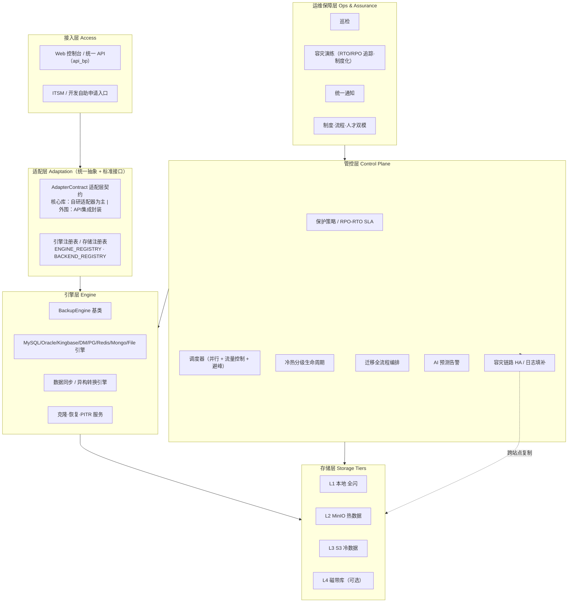
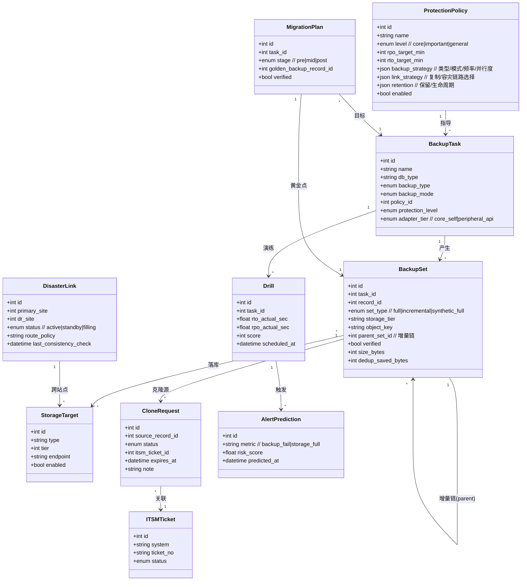

# 备份管理平台 — 银行级「三位一体」架构优化设计

> 作者：高见远（software-architect） ｜ 日期：2026-07-29
> 依据：**先读代码**（已实地阅读 `app.py / config.py / core/* / api/* / templates/* / static/js/app.js` 及 `.workbuddy/memory`），再对齐用户蓝图归纳。
> 技术栈约束（必须尊重）：Python 3.14 + Flask + SQLite + APScheduler + 原生 JS/Bootstrap5 + 共用 `api_bp` 蓝图 + minio SDK（兼容 S3）。新增蓝图挂 `api_bp`；前端走 `app.js` 的 `initXxx()`；改动须落在 `DOMContentLoaded` 启动分支内。

---

## 0. 阅读结论摘要（先读代码，再设计）

平台**已远超"起步态"**，已具备：三级存储 L1/L2/L3 + `storage_backends` 适配层（Local/MinIO/S3）+ `tier_replication` 级联复制 + 复制策略可配置；多引擎注册表 `ENGINE_REGISTRY`（mysql/oracle/kingbase/dameng/redis/mongodb/postgresql/mariadb/file）+ 逻辑/物理双模式；增量/差异/快照 `BackupType`；巡检 `inspection` + 通知 `notifier`（webhook/钉钉/企微/飞书/邮件）；数据同步 `sync`；跨主机恢复 `cross_host`；CDC 捕获（MySQL binlog / PG WAL-LSN）+ PITR + 对象级恢复 `restore_extras`；`mysql_clone_to_test` / `pg_clone_to_test` + VDB 实例表 + 部署 `deploy`；容灾演练 `drills`（RTO/RPO 估算 + 评分）；仪表盘健康评分；主机纳管 `ssh_hosts`（无 Agent SSH 远程 dump）；`DEMO_MODE` 仿真兜底。

蓝图所述多数能力**并非从零开始**，而是"已有雏形 → 需工程化闭环"。下文所有新增/改造均**复用既有抽象**（如 `StorageBackend` 基类、`BackupEngine` 基类、`ENGINE_REGISTRY`/`BACKEND_REGISTRY` 注册表、`system_config` 键值配置、`api_bp` 路由模式），不另起炉灶。

---

## 1. 总体目标架构（分层图）

**三层蓝图 → 架构分层映射**
- **核心（多层次全生命周期保护）**：ENGINE + STORAGE + CONTROL（POLICY/SCHED/LIFECYCLE/LINK/MIG）。
- **承载（信创智能统一管控）**：ADAPT（AdapterContract 统一抽象）+ CONTROL（AI/同步/克隆/迁移编排）。
- **保障（标准化常态化运维）**：OPS（INSPECT/DRILL/NOTIFY/GOV）。

---

## 2. 现有能力盘点（对照蓝图逐项打勾）

图例：✅ 已具备 ｜ ⚠️ 部分具备（雏形/单点） ｜ ❌ 缺失

### 2.1 核心：多层次、全生命周期数据保护
| 蓝图能力 | 现状 | 覆盖 |
|---|---|---|
| 本地 / 异地多级存储 | L1/L2/L3 三级存储 + 级联复制 `tier_replication` | ✅ |
| 统一存储驱动抽象 | `StorageBackend` 基类 + Local/MinIO/S3 实现 | ✅ |
| 复制策略可配置（方向/时机/重试） | `replication_strategy` 存 `system_config` | ✅ |
| 物理 + 逻辑备份模式 | `backup_mode` 分发；xtrabackup / mysqldump | ✅ |
| 增量 / 差异 / 快照类型 | `BackupType` 枚举；MySQL 已落地 xtrabackup 增量 + 逻辑 flush-logs 标记 | ⚠️ |
| **合成全量（增量合并 1%-10%）** | 无合并逻辑，仅"退化全量" | ❌ |
| **节点级并行备份** | 任务串行；仅 file 走后台线程 | ❌ |
| **动态速率 / 流量控制（避峰）** | 无 | ❌ |
| **全局去重 + 压缩** | 仅文件级 gzip / xtrabackup zstd；无跨集去重 | ⚠️ |
| 备份后自动校验 | `scheduler._verify_backup` + verified 字段 | ✅ |
| CDC 基线捕获（binlog/WAL） | `restore_extras.capture_*_cdc` | ✅ |
| PITR / 对象级恢复 | `mysql_pitr_restore` / `pg_pitr_restore` / `*_restore_object` | ✅ |
| **冷热分级生命周期自动流转** | L1→L2→L3 是"复制"非"流转/降级/到期"；无磁带 L4 | ⚠️ |
| 分层分级 RPO/RTO 策略 | 无 ProtectionPolicy 模型，RPO/RTO 仅在 drill 事后估算 | ❌ |

### 2.2 承载：面向信创的智能统一管控平台
| 蓝图能力 | 现状 | 覆盖 |
|---|---|---|
| 统一抽象层与标准接口 | 引擎/存储各自有抽象基类，但缺统一"服务门面"（备份/恢复/克隆/监控） | ⚠️ |
| **核心库自研适配器 + 外围 API 二轨** | 所有引擎同为"原生客户端"路径，无二轨区分 | ❌ |
| 多引擎无缝对接（指令级控制） | `ENGINE_REGISTRY` + `get_engine` + `_run` 指令级 | ✅ |
| 异构数据流动（Oracle→分布式转换供演练） | 无 | ❌ |
| 流程自动化编排（备份/恢复/克隆/容灾切换封装为标准服务） | 克隆零散在 `restore_extras`；无标准服务封装 | ⚠️ |
| **克隆服务标准化（申请/审批/生命周期/自助）** | `mysql_clone_to_test` 技术可行 + `vdb_instances` 表；无服务化/ITSM | ⚠️ |
| 全景监控与智能告警 | 仪表盘健康评分 + 巡检 + 通知（事后） | ⚠️ |
| **AI 预测告警（预测失败/存储不足）** | 无（仅事后巡检） | ❌ |

### 2.3 保障：标准化、常态化运维实战体系
| 蓝图能力 | 现状 | 覆盖 |
|---|---|---|
| 巡检（连通性/调度/上次状态） | `inspection.run_inspection` + 定时 cron | ✅ |
| 统一通知（钉钉/企微/飞书/邮件/webhook） | `notifier.Notifier` | ✅ |
| 容灾演练 + RTO/RPO 评分 | `drill.run_drill` + `drills` 表 | ✅ |
| **恢复演练制度化（季度排程 + 趋势追踪）** | 单点执行，无周期排程/历史趋势 | ⚠️ |
| **容灾链路 HA（双运营商选路/日志填补/一致性校验）** | 无 `DisasterLink` 概念 | ❌ |
| 数据同步（同源同类型真实 dump\|load） | `sync.run_sync`（MySQL/PG 真实，其余仿真） | ✅ |
| **备份数据价值挖掘（脱敏供分析）** | 无 | ❌ |
| **迁移全流程保护（黄金点+验证/高频增量/重心切换保留）** | 无 `MigrationPlan` | ❌ |

---

## 3. 差距分析 GAP 表

| # | 蓝图能力 | 现状 | 缺口 | 优先级 |
|---|---|---|---|---|
| G1 | 分层分级保护策略（核心/重要/一般 + RPO/RTO SLA） | 无策略模型；RPO/RTO 仅事后估算 | 新增 `ProtectionPolicy` + 任务级 SLA 字段 + 策略解析服务 | **P0** |
| G2 | 适配层接口契约标准化（统一服务门面 + 二轨：自研/外围） | 引擎/存储有基类，但无统一门面、无二轨标记 | `AdapterContract` 门面 + 引擎 `tier_tag`(core/peripheral) | **P0** |
| G3 | 合成全量（增量合并） | 无合并 | 各引擎 `synthesize_full()`；增量链管理 | **P1** |
| G4 | 并行备份 + 流量控制 + 避峰 | 串行 | 并发上限线程池 + 带宽令牌桶 + 避峰窗口 | **P1** |
| G5 | 全局去重 + 压缩（克隆副本省 90%+） | 仅文件级压缩 | 对象级去重（hash 索引）+ 压缩策略 | **P1** |
| G6 | 冷热分级生命周期自动流转（热→温→冷 + 磁带 L4） | 仅级联复制 | `LifecycleEngine`：按龄/量降级 + 可选 L4 | **P1** |
| G7 | 迁移全流程保护（黄金点+验证/高频增量/重心切换保留） | 无 | `MigrationPlan` 三阶段编排 | **P1** |
| G8 | 克隆服务标准化（申请/审批/生命周期/自助）+ ITSM | 零散函数 + VDB 表 | `CloneService` 标准服务 + `itsm` 适配层 | **P2** |
| G9 | 异构数据转换（Oracle→分布式备份集供演练"燃料"） | 无 | `hetero_convert` 引擎 | **P2** |
| G10 | 容灾链路 HA（双运营商智能选路/日志间隙填补/备端只读+总分核对） | 无 | `DisasterLink` 引擎 + 一致性校验 | **P2** |
| G11 | AI 预测告警（预测备份失败/存储不足） | 无 | `ai_alert`：规则+轻量统计（可插拔 ML） | **P2** |
| G12 | 恢复演练制度化（季度排程 + RTO/RPO 趋势优化） | 单点 | 周期排程 + 趋势/基线 | **P2** |
| G13 | 备份数据价值挖掘（脱敏供分析） | 无 | `data_mining` 脱敏导出 | **P2** |

---

## 4. 目标领域模型（核心实体）

**说明**：`BackupSet` 是新增核心实体（介于 `backup_records` 与 `storage_targets` 之间），用于承载"增量链 + 合成全量 + 去重 + 生命周期"，比现有 `backup_records` 更聚焦"备份集"语义。

---

## 5. 分阶段实施路线（5 个 Phase）

> 每 Phase 均"新增/改造文件 + 依赖 + 实现顺序"。依赖均向前序 Phase 收敛，避免长链。所有新增 API 挂 `api_bp`，前端走 `initXxx()` + base.html 导航 + 启动分支。

### Phase 0 — 基础加固：保护策略模型 + 适配层契约（P0，首期必做）
**目标**：把"分层分级"从口头约定变成可计算的 `ProtectionPolicy`，并把适配层契约标准化，为后续所有 Phase 提供"策略输入"与"接口基线"。
**新增/改造文件**：
- `core/db.py`：SCHEMA 新增 `protection_policies` 表；`backup_tasks` 迁移列 `policy_id / protection_level / adapter_tier / rpo_target_min / rto_target_min`。
- `core/models.py`：新增 `create_protection_policy / list_protection_policies / get_protection_policy / update_protection_policy / delete_protection_policy` + 任务关联读写。
- `core/policy.py`（新）：`ProtectionPolicyService` —— 按 level 解析默认 RPO/RTO、备份策略、链路/容灾选择；供调度与复制复用。
- `core/engines/__init__.py`：`ENGINE_REGISTRY` 增加 `adapter_tier` 标记（核心库=core_self，外围=peripheral_api），导出 `AdapterContract` 接口说明。
- `core/engines/base.py`：抽象方法补充 `synthesize_full()` / `list_sets()` 契约（Phase1 实现）。
- `api/policy.py`（新）：`/api/policy` CRUD + 任务绑定；`api/__init__.py` 注册。
- `templates/protection.html`（新）+ `base.html` 导航"保护策略" + `static/js/app.js` `initProtection()` + 启动分支。
**依赖**：无（基石）。**实现顺序**：db 迁移 → models → policy 服务 → api → 前端页。

### Phase 1 — 分布式全量效率 + 冷热生命周期（P1）
**目标**：攻克"难点1"——合成全量、并行/流量控制/压缩去重，及热→冷生命周期自动流转；同时把 Phase0 的 SLA 落到调度。
**新增/改造文件**：
- `core/engines/base.py`：增加 `synthesize_full()`、`run_parallel()` 钩子、`dedup`/`compress` 选项读取。
- `core/engines/mysql.py`（等）：实现 `synthesize_full()`（xtrabackup `--prepare --incremental` 合并 / 逻辑合并）；增量链落 `BackupSet`。
- `core/scheduler.py`：引入并发线程池（并发上限配置）+ 带宽令牌桶（流量控制）+ 避峰窗口（按策略跳过高峰）；调用前查 `ProtectionPolicy` 决定并行度。
- `core/storage_backends/base.py` + `minio.py`/`s3.py`：对象级去重（hash 索引写 `backup_sets.dedup_saved_bytes`）+ 分块上传。
- `core/lifecycle.py`（新）：`LifecycleEngine` —— 按龄/量在 L1→L2→L3 间"流转/降级/到期"，可选 L4 磁带；**复用并升级** `tier_replication`（从"复制"升级为"生命周期"语义）。
- `api/lifecycle.py`（新）：生命周期策略配置端点；`scheduler` 注册 `lifecycle` 定时 job。
- `templates/storage.html` 或 `settings.html`：新增"生命周期策略"卡片 + `initStorage()`/`initSettings()` 扩展。
**依赖**：Phase 0（`ProtectionPolicy` 提供并行度/保留策略）。**实现顺序**：base 契约 → 引擎实现 → scheduler 并发/流量 → 存储去重 → lifecycle 引擎 → api/前端。

### Phase 2 — 迁移全流程保护 + 克隆服务标准化 + ITSM + 异构转换（P1/P2）
**目标**：闭环"迁移全流程保护"与"克隆服务/ITSM 联动/异构数据燃料"。
**新增/改造文件**：
- `core/migration.py`（新）：`MigrationPlan` 引擎——`pre`（全量黄金点 + 恢复验证）、`mid`（高频增量/日志备份）、`post`（重心切换 + 旧备份保留期）。
- `core/clone_service.py`（新）：`CloneService` 标准服务，封装 `mysql_clone_to_test`/`pg_clone_to_test` + `vdb_instances`，提供申请/审批/生命周期/自动销毁。
- `core/hetero_convert.py`（新）：Oracle→分布式备份集转换与验证，产物供迁移演练"数据燃料"。
- `core/itsm.py`（新）：`itsm` 适配层（工单创建/审批回调），支持钉钉审批/内部接口/ServiceNow。
- `core/db.py` + `core/models.py`：新增 `migration_plans` / `clone_requests` / `hetero_jobs` / `itsm_tickets` 表与读写。
- `api/migration.py` / `api/clone.py` / `api/itsm.py`（新）：挂 `api_bp`。
- `templates/migration.html` / `templates/clone.html`（新）+ 导航 + `initMigration()` / `initClone()`。
**依赖**：Phase 0（策略/SLA）。**实现顺序**：db/models → migration → clone_service → itsm → hetero_convert → api/前端。

### Phase 3 — 容灾链路 HA + 异构数据流动 + AI 预测告警（P2）
**目标**：攻克"难点2/3"——容灾链路 HA、日志间隙填补、一致性校验；AI 预测告警。
**新增/改造文件**：
- `core/disaster_link.py`（新）：`DisasterLink` 引擎——双运营商专线智能选路、日志间隙自动填补、备端只读实例 + 总分核对一致性。
- `core/ai_alert.py`（新）：`ai_alert` —— 基于 `backup_records`/`system_logs`/`inspection_records`/存储用量，规则 + 轻量统计预测备份失败/存储不足（接口可插拔 ML）。
- `core/engines/__init__.py`：异构数据流动登记（Oracle→分布式备份集，与 `hetero_convert` 协同）。
- `core/db.py` + `core/models.py`：新增 `disaster_links` / `alert_predictions` 表。
- `api/link.py` / `api/ai_alert.py`（新）。
- `templates/drlink.html` / `templates/alert.html`（新）+ 导航 + `initDrLink()` / `initAlert()`。
**依赖**：Phase 1（存储/复制）、Phase 2（异构转换）。**实现顺序**：db/models → disaster_link → ai_alert → api/前端。

### Phase 4 — 运维保障常态化 + 演练制度化 + 价值挖掘（P2）
**目标**：把"保障层"制度化、可度量、可优化。
**新增/改造文件**：
- `core/drill.py`（增强）：季度演练自动排程（`system_config.drill_schedule`）+ RTO/RPO 历史趋势 + 评分基线对比。
- `core/data_mining.py`（新）：备份数据脱敏导出供分析（价值挖掘）。
- `api/drills.py`（增强）：趋势/基线端点；`api/datamining.py`（新）。
- `templates/drills.html`（增强趋势图）+ `templates/datamining.html`（新）+ 导航 + 启动分支。
**依赖**：Phase 0/3（策略、告警）。**实现顺序**：drill 排程/趋势 → data_mining → api/前端。

---

## 6. 关键设计决策

1. **合成全量如何实现**：复用各引擎既有能力——物理备份走 `xtrabackup --prepare --incremental-dir`（合并增量到全量，仅 1%-10% 增量数据）；逻辑备份走"全量 SQL + 增量 binlog 重放"在恢复时合成。新增 `BackupSet.set_type=synthetic_full` 记录合并产物，`parent_set_id` 串增量链。

2. **适配层接口契约**：在 `BackupEngine` 基类上定义 `AdapterContract`（备份/恢复/克隆/校验/列表 5 类方法签名）；引擎注册表增加 `adapter_tier` 字段——核心库（oracle/kingbase/dameng 等信创）标 `core_self`（自研适配器为主），外围（redis/mongodb 等）标 `peripheral_api`（API 集成封装）。向上由 `core/service_facade.py`（新，Phase2）统一暴露标准服务，屏蔽引擎差异。

3. **冷热分级触发规则**：`LifecycleEngine` 按策略（年龄阈值如 L1→L2 7天 / L2→L3 30天 / L3→L4 90天，或容量阈值如 L1 用量>85% 触发下沉）自动流转；与现有 `tier_replication` 共存——复制保证"多地多份"，生命周期负责"热→冷降级/到期清理"。

4. **流量控制策略**：调度器引入**带宽令牌桶**（全局 MB/s 上限，来自 `system_config.bandwidth_cap`）+ **避峰窗口**（如 09:00-18:00 降速，来自策略）；并行度由 `ProtectionPolicy.backup_strategy.parallel` 决定，全局并发上限在 `scheduler` 配置。

5. **AI 告警数据源**：以 `system_logs`（失败关键词）、`backup_records`（连续失败/耗时陡增/体积异常）、`inspection_records`（warn/fail 趋势）、`storage_targets` 用量（L1 磁盘 >85% 预警）为输入；首期用**规则 + 轻量统计**（滑动窗口失败率、线性趋势外推），预留 `predict(model=...)` 插拔点对接外部 ML。

6. **容灾链路 HA 与日志填补**：`DisasterLink` 维护主/备站点与多专线（双运营商），按延迟/健康智能选路；备端以只读实例接收复制，缺失日志段由源端补传（日志间隙自动填补）；一致性校验 = 备端总分核对 + 抽样校验和。

7. **克隆服务标准化与 ITSM**：`CloneService` 统一"申请→ITSM 审批→拉起 VDB→到期自动销毁"；`itsm` 适配层抽象 `create_ticket/query_status/callback`，钉钉审批/内部工单/ServiceNow 即插即用；开发自助申请走 Web 表单 → `CloneRequest` → ITSM。

---

## 7. 待确认问题（≤6，聚焦优先级与首期范围）

1. **首期范围**：Phase 0+1（保护策略 + 合成全量/并行/流量/去重/生命周期）是否定为首期落地？还是先补 Phase 2「迁移全流程保护」？
2. **信创库定位**：kingbase / dameng 等是否纳入 P0「自研适配器」轨道，还是先归「外围 API 集成」？
3. **AI 告警形态**：首期是否接受"规则+轻量统计"（无外部依赖），还是必须接入既有 ML 平台/服务？
4. **磁带库 L4**：首期是否落地物理磁带（L4 冷归档），还是仅 MinIO/S3（L1/L2/L3）？
5. **ITSM 对接**：对接哪套系统（钉钉审批 / 内部工单接口 / ServiceNow）？接口形态与审批 SLA 是？
6. **元数据高可用**：为支撑"同城双活/热备"管控面，是否需从 SQLite 演进到可部署 PostgreSQL（仅元数据库，不影响备份文件存储）？

---

### 首期建议落地范围（一句话总结）
**建议首期落地 Phase 0 + Phase 1**：先以 `ProtectionPolicy` 把"分层分级 RPO/RTO"变成可计算策略，并攻克分布式全量效率（合成全量 / 并行 / 流量控制 / 去重 / 冷热生命周期），这是银行级保护的"地基"，后续迁移保护、克隆服务、容灾链路 HA、AI 告警均建立在此之上。
