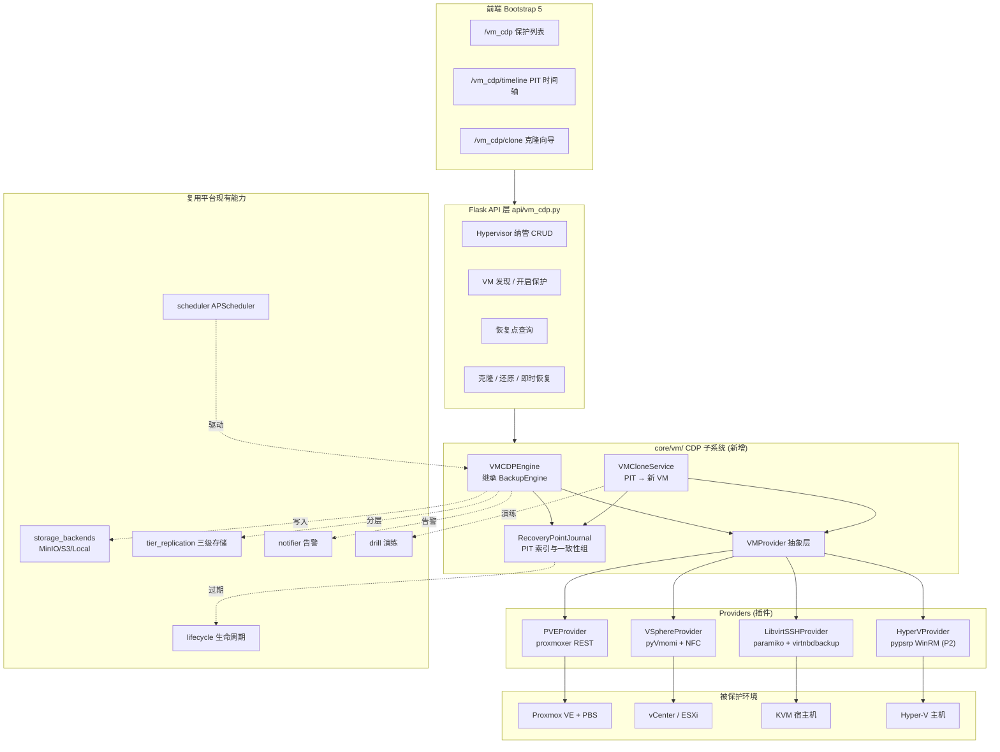
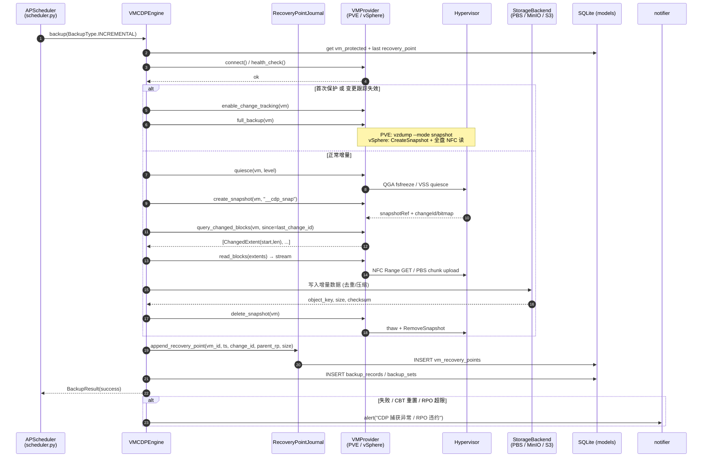
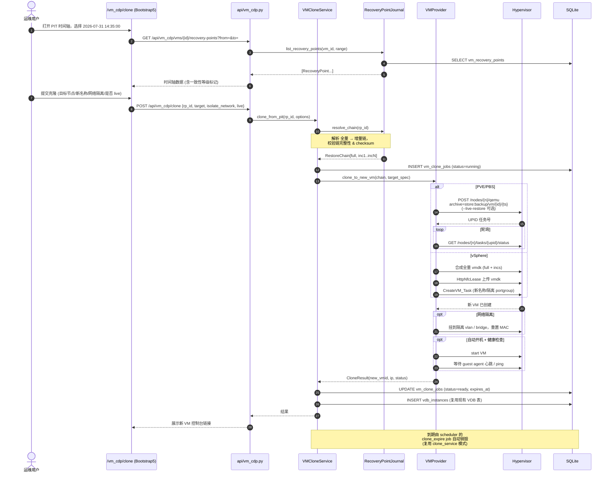
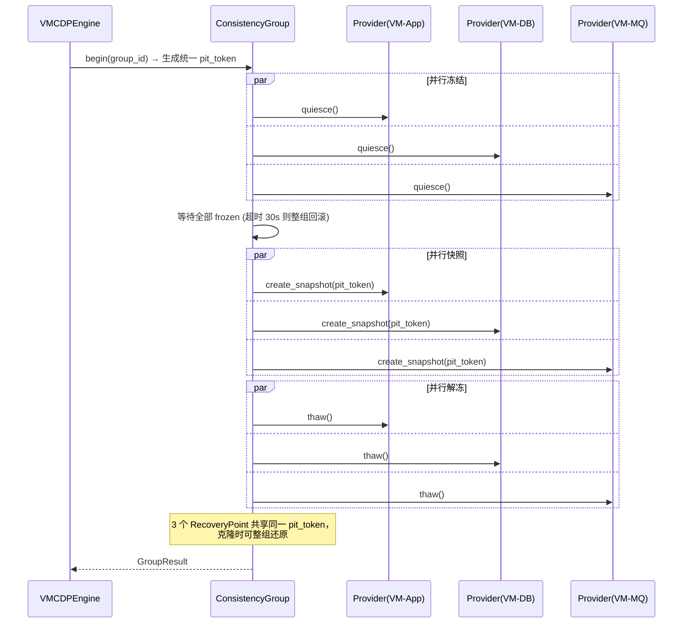
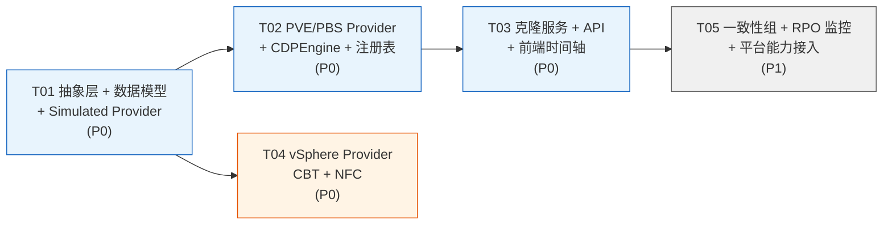

# VM 级 CDP（持续数据保护）技术调研与集成方案

> 文档版本：v1.0
> 作者：高见远（架构师）
> 日期：2026-07-31
> 目标读者：平台研发（Engineer）、产品、运维
> 关联平台：数据备份管理平台（Python 3.14.3 + Flask + SQLite + Bootstrap 5）

---

## 0. 执行摘要（TL;DR）

| 项 | 结论 |
|---|---|
| **有没有成熟 CDP 技术可引入？** | 有，但需分清「真 CDP」与「准 CDP」。**VM 级真 CDP（秒级 RPO、IO 级捕获）在开源界没有可直接集成的成熟方案**，全部由商业产品（Zerto / Veeam CDP / Commvault）以内核态 IO 过滤驱动实现，且均为闭源、按 VM 授权收费、不提供可嵌入的 SDK。 |
| **可落地的是什么？** | **准 CDP（Near-CDP）= 块级变更跟踪（CBT/RCT/dirty-bitmap）+ 高频增量（1~15 分钟）+ 恢复点日志（PIT Journal）**。这是 Veeam / PBS / oVirt / Nakivo 等主流产品的实际技术底座，开源可用、API 齐全、与本平台现有「全量+增量+备份集链」模型天然同构。 |
| **主推方案** | **方案 A：统一 VM CDP 抽象层（`core/vm/`）+ Proxmox VE/PBS Provider**。理由：纯 Python REST（`proxmoxer`），无 C SDK 依赖，Windows 管理端可直连；PBS 原生提供**块级去重 + dirty-bitmap 增量 + 任意备份点 `qmrestore` 还原为新 VM**，一步覆盖"备份 + 任意时间点克隆成虚拟机"的全部需求。 |
| **次推方案（并行）** | **方案 B：vSphere CBT Provider（`pyVmomi` + NFC/HTTPS Range 读取）**，覆盖存量 VMware 环境。**不引入 VDDK**（C SDK、需 Broadcom 授权、Windows/Linux 二进制分发复杂）。 |
| **RPO 能力预期** | 准 CDP：**5~15 分钟**（PBS/CBT 增量）；配合"应用层日志 CDP"（数据库 binlog/WAL 已在本平台实现）可对关键库做到**秒级 RPO**。真 CDP（秒级 VM 级）**建议明确不做**，或走商业产品对接（Zerto API 只做纳管，不做自研）。 |
| **工作量估算** | 抽象层 + PVE/PBS Provider + PIT 克隆闭环：**约 15~20 人日**；再加 vSphere Provider：**+10~12 人日**。 |
| **最大风险** | ①本平台管理端运行在 **Windows**，`libvirt-python`/VDDK 无可靠 Windows 轮子 → 必须走 **REST/SSH 无 Agent** 路线；②Python **3.14.3** 生态兼容性需实测；③"任意时间点"精度取决于增量频率，需与用户对齐 RPO 期望，避免"真 CDP"预期落差。 |

---

## 1. 需求解读与 CDP 概念对齐

用户提供的 CDP 材料涉及若干概念，先做工程化对齐，避免后续需求歧义。

### 1.1 真 CDP vs 准 CDP

| 维度 | 真 CDP（True CDP） | 准 CDP（Near-CDP / Snapshot-based CDP） |
|---|---|---|
| 捕获方式 | 拦截每一次写 IO，写入日志（Journal） | 周期性打快照 + 块级变更跟踪（CBT/RCT/bitmap） |
| RPO | 秒级 / 亚秒级（理论为 0） | 分钟级（1~15 min，取决于频率） |
| 恢复点粒度 | **任意时间点**（连续） | **离散时间点**（每次增量一个 PIT） |
| 实现位置 | Hypervisor 内核 IO 过滤驱动 / Guest 内 filter driver | 管理面 API 调用 |
| 生产影响 | 持续写放大，需要 Journal 卷 | 快照瞬间 stun（毫秒~秒级），影响可控 |
| 开源可得性 | ❌ 基本没有（见 §2.7） | ✅ 全部主流 Hypervisor 都开放 API |
| 代表产品 | Zerto、Veeam CDP、Commvault CDR | Veeam Backup、PBS、oVirt、Nakivo、Vinchin |

> **架构判断**：用户口中的"实时备份 + 任意时间点还原成虚拟机"，在**工程可落地**层面对应的是**准 CDP**。本方案主体按准 CDP 设计，并在数据模型上预留 Journal 扩展位（`vm_recovery_points.rp_kind` 支持 `snapshot`/`journal`），未来若对接商业 CDP 或自研 IO 过滤，模型不需重构。

### 1.2 块级 vs 文件级捕获

| | 块级（Block-level） | 文件级（File-level） |
|---|---|---|
| 对应本平台 | **新增 VM CDP 引擎** | 已有 `core/engines/file.py` |
| 变更识别 | CBT / RCT / dirty bitmap（Hypervisor 提供） | size+mtime 扫描（现有实现） |
| 能否还原成 VM | ✅ 可（整盘镜像） | ❌ 不能（只能还原文件） |
| 性能 | 增量数据量 = 实际脏块，扫描成本 O(1) | 需遍历目录树，大目录成本高 |

> **结论**：VM 级克隆必须走**块级**，现有 `file.py` 无法复用其核心逻辑，只能复用其 **SSH 连接池 / 归档落盘 / 存储分层** 等基础设施。

### 1.3 一致性等级（Consistency Level）

| 等级 | 实现手段 | 平台支持计划 |
|---|---|---|
| **崩溃一致（Crash-consistent）** | 直接打快照，等同于突然断电 | P0，默认 |
| **文件系统一致（FS-consistent）** | `guest-fsfreeze-freeze/thaw`（QEMU GA） / VSS 卷影 | P0（Linux via QGA、Windows via VSS） |
| **应用一致（App-consistent）** | VSS Writer（SQL Server/Exchange）/ pre-post 脚本 | P1（pre/post hook 钩子） |
| **一致性组（Consistency Group）** | 多 VM 同一时刻打快照，共享同一 PIT 序号 | P1，`vm_consistency_groups` 表 |

### 1.4 时间点恢复（PITR）语义

本平台需支持三类恢复动作，须在 API 上区分清楚：

1. **原位还原（Restore in-place）**：覆盖原 VM 磁盘 → 用于灾难恢复。
2. **克隆为新 VM（Clone to new VM）**：新 VMID/新 MAC/隔离网络 → **用户核心诉求**，用于演练、开发测试、勒索软件取证。
3. **即时挂载/即时恢复（Instant Recovery / Live Restore）**：直接以备份仓库为后端块设备启动 VM，秒级 RTO。PBS 的 `live-restore` 原生支持，是本方案的**差异化亮点**。

---

## 2. 技术调研

### 2.1 VMware vSphere CBT + vStorage APIs（VADP）

**技术原理**
- CBT（Changed Block Tracking）是 VMkernel 特性，为每个 vmdk 维护 `-ctk.vmdk` 位图文件，记录自某个 `changeId` 以来变化的块区间。
- 备份流程：`ReconfigVM_Task(changeTrackingEnabled=true)` → `CreateSnapshot_Task(quiesce=true)` → 读取 snapshot 的 `ConfigInfo` 拿到各盘 `changeId` → `QueryChangedDiskAreas(snapshot, diskKey, startOffset, changeId)` 返回 `[{start, length}]` 变更区间 → 按区间读盘 → `RemoveSnapshot_Task`。
- 数据读取有两条路：
  - **VDDK（VixDiskLib）**：官方 C SDK，支持 `nbd`/`nbdssl`/`hotadd`/`san` 四种 transport，性能最好。但是 **C 库 + Broadcom 授权 + 需签 TAP 协议**，Python 只能通过 `ctypes` 或 `nbdkit-vddk-plugin` 间接调用。
  - **NFC over HTTPS（无 VDDK）**：通过 `https://<vc>/folder/<vm>/<disk>-flat.vmdk?dcPath=...&dsName=...` 配合 HTTP `Range` 头按偏移读取。纯 Python 可实现，性能约为 VDDK NBD 的 60~80%，但**零 C 依赖**。这是本方案对 VMware 的推荐路径。

**关键约束（来自 VMware KB 1020128）**
- VM 硬件版本 ≥ 7；CBT 默认关闭，开启需 stun-unstun 周期（开机/迁移/快照才生效）。
- **启用 CBT 前 VM 必须无快照**，否则 `QueryChangedDiskAreas` 可能返回错误或错误数据。
- 不支持：物理兼容模式 RDM、独立磁盘（independent disk）、裸盘。
- 断电/硬关机可能导致 CBT 重置 → 必须有 **CBT reset 检测与自动降级全量** 的兜底逻辑。
- vSphere API 需 **Essentials 及以上授权**（免费版 ESXi 的 API 为只读，无法用于备份）。

**Python 生态**
| 库 | 说明 | 兼容性 |
|---|---|---|
| `pyvmomi` | VMware 官方 Python SDK（vSphere SOAP API），纯 Python | ✅ Windows/Linux 均可 |
| `vsphere-automation-sdk-python` | REST API（vCenter 8 部分能力） | ✅ 但 CBT 相关仍需 pyVmomi |
| `pyVim` | pyvmomi 附带的连接工具 | ✅ |
| VDDK | C SDK，`nbdkit` 插件形式可用 | ⚠️ 仅 Linux 实用 |

**成熟度**：⭐⭐⭐⭐⭐（20 年历史，全行业标准）

---

### 2.2 Microsoft Hyper-V RCT（Resilient Change Tracking）+ VSS

**技术原理**
- RCT 是 Hyper-V 2016+ 引入的原生变更跟踪，取代早期依赖第三方 filter driver 的方案。为每个 VHDX 维护 `.rct` / `.mrt` 文件。
- 通过 **WMI v2 命名空间 `root\virtualization\v2`** 操作：
  - `Msvm_VirtualSystemSnapshotService.CreateSnapshot`（`SnapshotType=32768` 即 Recovery Snapshot）
  - `Msvm_VirtualSystemReferencePointService.CreateReferencePoint` 创建参考点（RCT ID）
  - `Msvm_VirtualSystemReferencePointExportSettingData` + `ExportSystemDefinition` 导出变更块
- 应用一致性通过 **Guest 内 VSS**（Hyper-V Integration Services 的 VSS Requestor）实现，Windows Guest 可拿到 SQL Server / Exchange 的应用一致快照。

**Python 生态**
- 无官方 Python SDK。可行路径：
  1. `pywin32` + WMI（`win32com.client`）直调 `root\virtualization\v2` —— 仅当**平台部署在 Windows 且与 Hyper-V 主机同域**时可行。
  2. **PowerShell 远程（WinRM）**：`pypsrp` / `pywinrm` 调用 `Get-VM` / `Export-VMSnapshot` / `Checkpoint-VM`。**这是无 Agent 且跨平台的推荐路径**，与本平台现有 SSH 无 Agent 哲学一致。
  3. Hyper-V 的原生 RCT 差异导出（`Export-VMSnapshot -CaptureLiveState`）粒度不如 API 精细。

**成熟度**：⭐⭐⭐⭐（API 稳定，但可编程门槛高、Python 生态弱）

**与本平台契合度**：⚠️ 中等偏低。收益/成本比不如 PVE 与 vSphere，建议 **P2 阶段**。

---

### 2.3 KVM/QEMU dirty bitmaps + libvirt 增量备份 API

**技术原理**
- QEMU 自 2.4 起提供 `block-dirty-bitmap-add` 等 dirty bitmap 原语；qcow2 支持 **持久化 bitmap**（关机不丢）。
- libvirt **6.0.0+** 封装为公共 API：
  - `virDomainCheckpointCreateXML` → `virsh checkpoint-create-as vm --name cp1 --diskspec vda,bitmap=cp1`
  - `virDomainBackupBegin` → `virsh backup-begin vm --backupxml backup.xml`
  - 两种模式：
    - **Push 模式**：QEMU 直接把数据写到指定目标文件（格式受限于 QEMU 支持的格式）。
    - **Pull 模式**：QEMU 起一个 **NBD server**，导出 `base:allocation` 与 `qemu:dirty-bitmap:<name>` 两个 meta context，外部客户端按需拉取脏块。**这是备份软件的标准做法**（灵活、可任意落盘格式）。
- **raw 设备的增量**：libvirt ≥ 10.10.0 + qcow2 `data-file` 特性可对裸设备/LUN 做持久 bitmap（见 abbbi.github.io/datafile）。此前仅 qcow2 支持。

**开源工具**
| 工具 | 说明 |
|---|---|
| **`virtnbdbackup`**（abbbi/virtnbdbackup） | 最成熟的 libvirt 增量备份 OSS 工具。支持 full/inc/diff、pull 模式 NBD、压缩、qemu-agent fsfreeze、`virtnbdrestore` 还原、`virtnbdmap` 挂载。**可作为本平台 KVM Provider 的直接后端二进制**。 |
| `libvirt-python` | libvirt 官方 Python 绑定。**⚠️ 无 Windows 轮子**（依赖 libvirt C 库），管理端在 Windows 时必须走 SSH 远程执行 `virsh` 或直连 `qemu+ssh://` URI（后者仍需本地 libvirt 库）。 |
| `nbd` / `libnbd-python` | NBD 客户端，读取 pull 模式导出。同样是 C 库绑定，Windows 不友好。 |

**成熟度**：⭐⭐⭐⭐（API 已稳定 6 年+，但工具链碎片化，需要自己拼装）

**与本平台契合度**：⭐⭐⭐（能力强、纯开源无授权成本，但 Windows 管理端下必须"SSH 到 KVM 宿主机执行 virtnbdbackup"，落地为**半 Agent** 模式）

---

### 2.4 Proxmox Backup Server（PBS）及其 API ⭐ 主推

**技术原理**
- PBS 是 Proxmox 开源的**内容寻址、块级去重**备份服务端（Rust 实现，AGPL-3.0）。
- 与 PVE（Proxmox VE，KVM 平台）配合时：
  - PVE 侧的 QEMU 打了 `pbs` backend 补丁，**在 QEMU 进程内维护 dirty bitmap**，增量备份只上传脏块。
  - 备份数据切成 **4MB 定长 chunk（fixed index，`.fidx`）**，按 SHA-256 内容寻址，天然全局去重 + 增量永久（Incremental Forever）。
  - 传输协议：`GET /api2/json/backup` 升级为 **HTTP/2**（`proxmox-backup-protocol-v1`），恢复走 `proxmox-backup-reader-protocol-v1`。
- **恢复能力（本方案最大亮点）**：
  | 能力 | 命令/API | 说明 |
  |---|---|---|
  | 还原为**新 VM**（任意 VMID） | `POST /nodes/{node}/qemu` (`archive=<store>:backup/vm/<vmid>/<ts>`) 或 `qmrestore` | **直接满足"任意时间点克隆成虚拟机"** |
  | **Live Restore**（即时恢复） | `qmrestore --live-restore 1` | VM 立即启动，数据在后台流式回填，**RTO 秒级** |
  | 单文件恢复 | `proxmox-backup-client file-restore` | 挂载备份内的文件系统 |
  | 备份点列表 | `GET /api2/json/admin/datastore/{store}/snapshots` | **天然就是 PIT 列表** |
  | 校验 | `GET .../verify` / verify job | 与本平台"备份校验"能力对齐 |
- **备份频率**：PVE 定时任务最小粒度为分钟（cron）。通过 API 主动触发 `POST /nodes/{node}/vzdump` 可做到 **1~5 分钟一次增量**，即 **RPO ≈ 5 分钟的准 CDP**。

**Python 生态**
| 库 | 说明 | 兼容性 |
|---|---|---|
| **`proxmoxer` ≥ 2.3.0** | 纯 Python REST 封装，同时支持 PVE 与 PBS，PyPI 官方分类已声明 **Python 3.14 支持** | ✅✅ Windows/Linux 全通 |
| `requests` | proxmoxer https backend 依赖 | ✅ 本平台可能已间接依赖 |
| `proxmox-backup-client` | Rust CLI，仅 Linux。**本方案不依赖它**（走 PVE REST 触发） | — |

**成熟度**：⭐⭐⭐⭐（PBS 2020 年发布，已在大量生产环境使用；API 文档完善）

**与本平台契合度**：⭐⭐⭐⭐⭐ **最高**
- 纯 REST + 纯 Python 依赖，与现有 MinIO/S3 SDK 的集成方式同构；
- PBS 的 `snapshots` 列表可**直接映射**为本平台 `backup_sets` / `vm_recovery_points`；
- PBS 的去重 + 增量永久，天然契合本平台"三级存储 + 生命周期"模型（PBS 可作为 Tier-1，`sync-job` 推到远端 PBS/S3 作为 Tier-2/3）；
- 一次开发同时获得：块级 CDP 捕获 + PIT 索引 + 克隆为新 VM + 即时恢复 + 校验。

---

### 2.5 oVirt / RHV 备份 API

**技术原理**
- oVirt 4.4+ 提供**增量备份 API**，底层同样是 QEMU dirty bitmap：
  - `POST /ovirt-engine/api/vms/{id}/backups`（指定 `from_checkpoint_id` 做增量）
  - 通过 **ovirt-imageio**（`/images/<ticket>`）以 HTTP + `Range` 读取磁盘数据，并可通过 `GET .../map?format=qcow2` 获取脏块 extent 表。
- Python SDK：`ovirt-engine-sdk-python`（官方，纯 Python + 少量 C 扩展）、`ovirt-imageio-client`。

**现状风险**：Red Hat 已于 2022 年宣布 **RHV 生命周期终止（EOL 2026）**，转向 OpenShift Virtualization（KubeVirt）。oVirt 社区版仍在维护但活跃度显著下降。

**成熟度**：⭐⭐⭐（API 完整，但生态在收缩）

**建议**：**不纳入首批**。若客户存量环境有 oVirt，可作为 Provider 插件按需开发（架构上已预留）。同理，**KubeVirt + CDI/Velero** 是 oVirt 的继任者，若未来需要可作为 `kubevirt` Provider。

---

### 2.6 商业方案速览

| 产品 | CDP 类型 | 核心机制 | RPO | 可编程接口 | 授权/成本 | 适合本平台的姿态 |
|---|---|---|---|---|---|---|
| **Zerto**（HPE） | **真 CDP** | Hypervisor 内 **VRA** 虚拟设备拦截写 IO，写入 Journal（保留 1~30 天），支持"回退到任意秒" | **秒级** | REST API（ZVM API）完整 | 按受保护 VM 订阅，约 $x00/VM/年 | ❌ 不自研；✅ 可做**纳管对接**（读 VPG 状态、触发 failover test） |
| **Veeam** | 双轨：Backup（准 CDP，CBT）+ **Veeam CDP**（真 CDP，基于 **VMware vSphere IO Filter / VAIO**） | VAIO filter 拦截 IO → 送到 Veeam CDP Proxy → 短期恢复点（秒级）+ 长期恢复点 | CDP 版 **≈15 秒** | Veeam REST API（Enterprise Manager / VBR REST）完善 | 按实例订阅，CDP 需 Enterprise Plus | ❌ 不自研；✅ 可做纳管 |
| **Commvault** | 准 CDP + CDR（Continuous Data Replication） | IntelliSnap + CBT；CDR 用块级复制驱动 | 分钟级 / CDR 秒级 | REST API 完善 | 企业级，价格高 | ❌ |
| **Rubrik** | 准 CDP（快照 SLA Domain） | CBT + 不可变文件系统（Atlas），SLA 驱动 | 分钟级（最小 15min） | 完善 REST API | 一体机/订阅，昂贵 | ❌ |
| **Cohesity** | 准 CDP（SpanFS） | CBT + 分布式文件系统，支持 Instant Mass Restore | 分钟级 | 完善 REST API | 一体机/订阅，昂贵 | ❌ |

> **关键洞察**：即使是商业阵营，**只有 Zerto 和 Veeam CDP 是真 CDP**，且两者都依赖**只有 Hypervisor 厂商才能提供的 IO 过滤扩展点**（Zerto 的 VRA、Veeam 的 VMware VAIO）。VMware VAIO SDK 需要成为 VMware TAP Elite 伙伴才能获得。**这条路对本平台在商业与工程上都不可行。**

---

### 2.7 补充调研：开源"真 CDP"的可能路径（结论：不建议）

| 路径 | 原理 | 为什么不推荐 |
|---|---|---|
| **DRBD + drbd-proxy** | 块设备同步复制 | 只有"当前状态"，无历史 PIT，不是 CDP；需改造存储层 |
| **Ceph RBD mirroring（journal 模式）** | RBD 写入先记 journal 再同步到对端 | ①要求存储必须是 Ceph；②journal 模式性能开销大（写放大 2x），Ceph 官方已推荐 snapshot 模式；③journal 不对外提供"回放到任意时刻"的用户级接口 |
| **ZFS send/recv + 高频 snapshot** | ZFS 秒级快照 + 增量 send | 准 CDP，不是真 CDP；要求存储为 ZFS；PBS 已经做得更好 |
| **dm-era / dm-snapshot** | Linux device-mapper 变更跟踪 | 需要重构 Guest/Host 存储栈，侵入性极高，无 VM 语义 |
| **自研 QEMU block filter** | 写一个 QEMU block driver 拦截 IO 落 journal | 需维护 QEMU 分支，工程量以人年计，且用户环境无法接受非官方 QEMU |

> **架构结论（重要，需向用户明确沟通）**：
> **"VM 级真 CDP"不是一个可以通过引入开源库解决的问题，它是一个 Hypervisor 内核态工程。**
> 建议向用户传达的定位：**"分钟级准 CDP（VM 整机）+ 秒级日志 CDP（关键数据库）"的混合保护模型** —— 前者由本方案新增，后者本平台已具备（binlog/WAL/PITR 能力已在 `BackupResult` 中埋点：`binlog_file`/`binlog_pos`/`wal_lsn`）。这个组合在真实 RPO 上非常接近真 CDP，而成本与复杂度低一个数量级。

---

## 3. 方案对比表

### 3.1 综合对比

| 维度 | A. Proxmox PVE/PBS | B. VMware vSphere CBT | C. KVM/libvirt+virtnbdbackup | D. Hyper-V RCT | E. oVirt/RHV | F. 商业 CDP 纳管 |
|---|---|---|---|---|---|---|
| **技术成熟度** | ⭐⭐⭐⭐ | ⭐⭐⭐⭐⭐ | ⭐⭐⭐⭐ | ⭐⭐⭐⭐ | ⭐⭐⭐ | ⭐⭐⭐⭐⭐ |
| **开源/商业** | 开源 AGPL-3.0（企业订阅可选） | 商业（需 Essentials+ 授权） | 开源 LGPL/GPL | 商业（Windows Server 授权内含） | 开源 Apache-2.0 | 商业，昂贵 |
| **CDP 类型** | 准 CDP（min） | 准 CDP（min） | 准 CDP（min） | 准 CDP（min） | 准 CDP（min） | 真 CDP（sec） |
| **Python 依赖复杂度** | ✅ 极低（`proxmoxer`+`requests`，纯 Python） | ✅ 低（`pyvmomi` 纯 Python，不用 VDDK） | ⚠️ 高（libvirt C 绑定，Windows 不可用 → 需 SSH） | ⚠️ 中高（WinRM/`pypsrp` 或 pywin32 WMI） | ⚠️ 中（`ovirt-engine-sdk-python`） | ✅ 低（REST） |
| **外部二进制依赖** | ❌ 无（全 REST） | ❌ 无（不用 VDDK） | ✅ 需宿主机装 `virtnbdbackup`/`qemu-utils` | ❌ 无（用 PowerShell） | ❌ 无 | ❌ 无 |
| **Windows 管理端可运行** | ✅✅ | ✅✅ | ⚠️ 仅 SSH 远程模式 | ✅ | ✅ | ✅ |
| **克隆为新 VM 能力** | ✅✅ 原生 `qmrestore`（含 **live-restore**） | ✅ 需自行组装（上传 vmdk + CreateVM） | ⚠️ 需自行 `virtnbdrestore` + `virt-install` | ⚠️ 需自行 `Import-VM` | ✅ API 支持 | ✅ 原生 |
| **PIT 索引现成度** | ✅✅ PBS snapshots 列表即 PIT | ⚠️ 需自建 changeId 链 | ⚠️ 需自建 checkpoint 链 | ⚠️ 需自建 RCT 链 | ✅ checkpoints API | ✅ |
| **去重/压缩** | ✅✅ 全局块级去重（内置） | ❌ 需自研 | ⚠️ 仅压缩 | ❌ | ❌ | ✅ |
| **与本平台契合度** | ⭐⭐⭐⭐⭐ | ⭐⭐⭐⭐ | ⭐⭐⭐ | ⭐⭐ | ⭐⭐ | ⭐⭐（只做纳管） |
| **实现工作量（人日）** | **15~20** | **10~12**（在 A 的抽象层之上） | 12~15 | 15~18 | 10~12 | 5~8/家 |
| **额外成本** | 0（开源）/ 可选订阅 | vSphere Essentials 起 | 0 | 0（已有 Windows 授权） | 0 | 高 |
| **推荐优先级** | **P0 主推** | **P0 次推** | P1 | P2 | P3 | P3（仅纳管） |

### 3.2 恢复能力对比（针对"任意时间点克隆成 VM"这一核心诉求）

| 方案 | 列 PIT | 克隆为新 VM | 即时启动（Instant） | 单文件恢复 | 隔离网络克隆 |
|---|---|---|---|---|---|
| PVE/PBS | ✅ API 直出 | ✅ `qmrestore` 到新 VMID | ✅ `--live-restore` | ✅ `file-restore` | ✅ 指定 bridge/vlan |
| vSphere CBT | 需自建 | ✅ 自研组装（NFC 上传 + CreateVM_Task） | ⚠️ 需 NFS datastore 模拟 Instant VM | ⚠️ 需自研 vmdk 解析 | ✅ 指定 portgroup |
| libvirt/KVM | 需自建 | ✅ `virtnbdrestore` + `virt-install` | ⚠️ 可用 qcow2 backing file 模拟 | ✅ `virtnbdmap` + guestmount | ✅ 指定 network |

---

## 4. 推荐方案

### 4.1 总体架构

**核心思想：一层抽象、多个 Provider、一套 PIT 日志、一个克隆服务。**

不把 CDP 做成"某个 Hypervisor 的功能"，而是做成 **`core/vm/` 子系统**，通过 `VMProvider` 抽象屏蔽 PVE / vSphere / libvirt / Hyper-V 差异；对上通过一个 `VMCDPEngine` 挂进现有 `ENGINE_REGISTRY`，复用平台已有的**任务调度、备份记录、存储分层、告警、生命周期、演练**全部能力。



---

### 4.2 方案 A（主推）：PVE/PBS Provider —— 准 CDP + 任意 PIT 克隆

**为什么是它**
1. **依赖最轻**：`proxmoxer`（纯 Python，官方声明支持 Py3.14）+ `requests`。零 C 扩展、零外部二进制、Windows 管理端直接跑。
2. **能力最全**：PBS 一家把「块级增量捕获 + 去重存储 + PIT 列表 + 克隆为新 VM + 即时恢复 + 校验」全做完了，本平台只需做**编排 + 元数据 + UI**，不需要自己写块级差分算法。
3. **最短闭环**：一个 Sprint 内可跑通「注册 PVE → 发现 VM → 5 分钟增量 → 时间轴选点 → 克隆成新 VM 并开机」的完整 Demo。
4. **可平滑扩展为真正的"三级存储"**：PBS 本身支持 sync-job 推到远端 PBS / S3，可以直接接到现有 `tier_replication`。

**RPO/RTO 目标**

| 指标 | 目标 | 依据 |
|---|---|---|
| RPO | **5 分钟**（可配 1~60 min） | PVE `vzdump` + QEMU 内 dirty bitmap，增量数据量小，单次 30 GB VM 的 5 分钟增量通常 < 200 MB，耗时 10~30 s |
| RTO（live-restore） | **< 60 秒**开机可用 | PBS live-restore，数据后台回填 |
| RTO（完整 restore） | 取决于 VM 大小与网络 | 100 GB / 1 GbE ≈ 20 min |
| 快照 stun 时间 | < 1 s | QEMU 内部 bitmap，无需外部快照 |

---

### 4.3 方案 B（次推，并行推进）：vSphere CBT Provider

**定位**：覆盖存量 VMware 环境，是国内客户占比最高的虚拟化平台，**商务上几乎必做**。

**关键设计决策：不引入 VDDK**
- 理由：VDDK 是 C SDK，需 Broadcom 授权与分发协议；Python 只能 `ctypes`/`nbdkit` 间接调用；Windows 管理端集成成本高。
- 替代：**pyVmomi（控制面）+ HTTPS NFC Range 读取（数据面）**。
  - 控制面：`ReconfigVM_Task` 开 CBT、`CreateSnapshot_Task`、`QueryChangedDiskAreas`、`RemoveSnapshot_Task`。
  - 数据面：从 `VirtualDiskFlatVer2BackingInfo.fileName` 解析 datastore 路径，构造
    `https://<host>/folder/<path>?dcPath=<dc>&dsName=<ds>`，携带 `vmware_cgi_ticket` cookie，用 HTTP `Range: bytes=<start>-<end>` 逐段读取 `QueryChangedDiskAreas` 返回的脏块区间。
  - 写回（克隆）：`HttpNfcLease`（`ImportVApp` / `ExportVm`）上传 vmdk 流，再 `CreateVM_Task` / `RegisterVM_Task` 建新 VM。
- 性能预期：NBD-over-HTTPS 约 60~150 MB/s（受 vCenter 代理限制），可接受。若客户对性能敏感，**预留 `transport=vddk` 配置项**，未来在 Linux 采集节点上通过 `nbdkit-vddk-plugin` 走高速通道。

**必须实现的健壮性逻辑**
1. **CBT reset 检测**：备份前对比 VM 的 `changeTrackingEnabled` 与上次记录的 `changeId`；`QueryChangedDiskAreas` 抛 `FileFault`/`NotFound` 时**自动降级全量**并告警。
2. **快照残留清理**：`try/finally` 保证 `RemoveSnapshot_Task`；启动时扫描并清理名为 `__cdp_snap_*` 的孤儿快照。
3. **启用 CBT 前检查无快照**（VMware KB 明确警告）。
4. **不支持对象过滤**：物理兼容 RDM、独立磁盘、裸盘，自动跳过并在记录中标注。

---

### 4.4 数据流 / 时序图

#### 4.4.1 CDP 增量捕获流程（准 CDP 主循环）



#### 4.4.2 任意时间点克隆为新虚拟机



#### 4.4.3 一致性组（多 VM 同一 PIT）



---

## 5. 新增核心模块与文件清单

### 5.1 文件列表

```
backup_platform/
├── core/
│   └── vm/                                   【新增子包：VM CDP 子系统】
│       ├── __init__.py                       # Provider 注册表 + get_provider()
│       ├── types.py                          # 数据类：VMInfo/VMDisk/ChangedExtent/
│       │                                     #   SnapshotRef/RecoveryPoint/CloneSpec/CloneResult
│       ├── base.py                           # VMProvider 抽象基类（Provider 契约）
│       ├── cdp_engine.py                     # VMCDPEngine(BackupEngine) —— 接入 ENGINE_REGISTRY
│       ├── journal.py                        # RecoveryPointJournal：PIT 索引/链解析/保留策略
│       ├── consistency.py                    # ConsistencyGroup：多 VM 同刻快照编排
│       ├── clone_service.py                  # VMCloneService：PIT → 新 VM（含隔离网络/TTL）
│       ├── rpo_monitor.py                    # RPO 违约检测 → 复用 notifier 告警
│       └── providers/
│           ├── __init__.py
│           ├── pve.py                        # ★P0 PVEProvider（proxmoxer / PVE+PBS REST）
│           ├── vsphere.py                    # ★P0 VSphereProvider（pyVmomi + NFC Range）
│           ├── libvirt_ssh.py                # P1 LibvirtSSHProvider（paramiko + virtnbdbackup）
│           ├── hyperv.py                      # P2 HyperVProvider（pypsrp / WinRM + RCT）
│           └── simulated.py                  # DEMO_MODE 仿真 Provider（无真实环境自测）
│
├── core/
│   ├── engines/__init__.py                   【修改】注册 "vm_cdp": VMCDPEngine
│   ├── db.py                                 【修改】SCHEMA 追加 5 张表 + 轻量迁移
│   ├── models.py                             【修改】新增 5 组 CRUD 函数
│   └── scheduler.py                          【修改】注册 _register_vm_cdp / _register_vm_clone_expire
│
├── api/
│   ├── __init__.py                           【修改】导入 vm_cdp 蓝图模块
│   └── vm_cdp.py                             【新增】REST API（见 §7）
│
├── templates/
│   ├── vm_cdp.html                           【新增】Hypervisor 纳管 + VM 保护列表
│   ├── vm_cdp_timeline.html                  【新增】PIT 时间轴（恢复点可视化）
│   └── partials/_sidebar.html（或 base.html）【修改】增加导航入口
│
├── static/js/
│   ├── vm_cdp.js                             【新增】保护策略配置交互
│   └── vm_timeline.js                        【新增】时间轴渲染 + 克隆向导
│
├── app.py                                    【修改】新增 /vm_cdp、/vm_cdp/timeline 页面路由
├── config.py                                 【修改】CDP 相关配置项（默认间隔/并发/超时）
├── requirements.txt                          【修改】新增可选依赖（见 §8）
│
├── tests/
│   ├── test_vm_provider_contract.py          【新增】Provider 契约测试（对 simulated 跑全流程）
│   ├── test_vm_journal.py                    【新增】PIT 链解析/保留策略单测
│   └── test_vm_clone_service.py              【新增】克隆状态机单测
│
└── docs/
    └── cdp-vm-clone-research.md              【本文档】
```

**文件数量统计**：新增 20 个，修改 8 个。

### 5.2 数据库 Schema 新增（追加到 `core/db.py` 的 `SCHEMA`）

```sql
-- 1. 纳管的虚拟化平台
CREATE TABLE IF NOT EXISTS vm_hypervisors (
    id            INTEGER PRIMARY KEY AUTOINCREMENT,
    name          TEXT NOT NULL,
    provider      TEXT NOT NULL,          -- pve | vsphere | libvirt_ssh | hyperv | simulated
    endpoint      TEXT NOT NULL,          -- https://pve01:8006 / vcenter.corp.com / root@kvm01
    username      TEXT,
    password      TEXT,                   -- db.encrypt_secret 加密存储（复用现有机制）
    token_id      TEXT,                   -- PVE API Token 模式
    token_secret  TEXT,
    verify_ssl    INTEGER DEFAULT 0,
    extra_config  TEXT,                   -- JSON：datastore/pbs_storage/node/transport 等
    status        TEXT,                   -- online | offline | error
    version       TEXT,
    last_check_at TEXT,
    created_at    TEXT,
    updated_at    TEXT
);

-- 2. 受保护的虚拟机（一台 VM 一行；关联到 backup_tasks 以复用调度）
CREATE TABLE IF NOT EXISTS vm_protected (
    id               INTEGER PRIMARY KEY AUTOINCREMENT,
    hypervisor_id    INTEGER NOT NULL,
    task_id          INTEGER,             -- 关联 backup_tasks(db_type='vm_cdp')，复用调度/告警
    group_id         INTEGER,             -- 关联 vm_consistency_groups
    vm_ref           TEXT NOT NULL,       -- PVE:vmid / vSphere:moRef / libvirt:uuid
    vm_name          TEXT,
    guest_os         TEXT,
    disk_count       INTEGER DEFAULT 0,
    total_size_bytes INTEGER DEFAULT 0,
    cdp_enabled      INTEGER DEFAULT 1,
    cdp_interval_min INTEGER DEFAULT 5,        -- 准 CDP 捕获间隔（分钟）
    consistency      TEXT DEFAULT 'fs',        -- crash | fs | app
    rpo_target_min   INTEGER DEFAULT 15,       -- RPO 目标，超限告警
    retention_days   INTEGER DEFAULT 7,        -- 恢复点保留天数
    retention_points INTEGER DEFAULT 2016,     -- 恢复点保留个数（7d * 288/d）
    change_tracking  TEXT,                     -- 最近一次 changeId / bitmap 名
    last_rp_at       TEXT,
    last_status      TEXT,
    excluded_disks   TEXT,                     -- JSON 数组：跳过的盘（RDM/独立盘）
    created_at       TEXT,
    updated_at       TEXT,
    UNIQUE(hypervisor_id, vm_ref)
);

-- 3. 恢复点（PIT）—— CDP 的核心
CREATE TABLE IF NOT EXISTS vm_recovery_points (
    id              INTEGER PRIMARY KEY AUTOINCREMENT,
    vm_id           INTEGER NOT NULL,          -- → vm_protected.id
    record_id       INTEGER,                   -- → backup_records.id（复用现有记录体系）
    set_id          INTEGER,                   -- → backup_sets.id（复用备份集链）
    parent_rp_id    INTEGER,                   -- 增量链父节点；NULL 表示全量
    rp_kind         TEXT DEFAULT 'snapshot',   -- snapshot | journal（为真 CDP 预留）
    rp_type         TEXT DEFAULT 'incremental',-- full | incremental | synthetic_full
    pit_token       TEXT,                      -- 一致性组统一时间点标记
    pit_at          TEXT NOT NULL,             -- 恢复点时刻（ISO8601 UTC）
    consistency     TEXT DEFAULT 'crash',      -- crash | fs | app
    change_id       TEXT,                      -- vSphere changeId / PBS snapshot ts / libvirt checkpoint
    storage_tier    TEXT DEFAULT 'local',      -- 复用三级存储语义
    object_key      TEXT,                      -- PBS: store:backup/vm/<id>/<ts>；其他：路径/对象键
    size_bytes      INTEGER DEFAULT 0,
    dedup_ratio     REAL DEFAULT 0,
    checksum        TEXT,
    verified        INTEGER DEFAULT 0,
    verify_msg      TEXT,
    is_simulated    INTEGER DEFAULT 0,
    expires_at      TEXT,
    created_at      TEXT
);
CREATE INDEX IF NOT EXISTS idx_vm_rp_vm_time ON vm_recovery_points(vm_id, pit_at DESC);
CREATE INDEX IF NOT EXISTS idx_vm_rp_token  ON vm_recovery_points(pit_token);

-- 4. 一致性组
CREATE TABLE IF NOT EXISTS vm_consistency_groups (
    id            INTEGER PRIMARY KEY AUTOINCREMENT,
    name          TEXT NOT NULL,
    description   TEXT,
    consistency   TEXT DEFAULT 'fs',
    interval_min  INTEGER DEFAULT 5,
    freeze_timeout_sec INTEGER DEFAULT 30,
    enabled       INTEGER DEFAULT 1,
    created_at    TEXT,
    updated_at    TEXT
);

-- 5. 克隆作业（PIT → 新 VM）
CREATE TABLE IF NOT EXISTS vm_clone_jobs (
    id             INTEGER PRIMARY KEY AUTOINCREMENT,
    rp_id          INTEGER NOT NULL,           -- → vm_recovery_points.id
    vm_id          INTEGER,                    -- → vm_protected.id（源）
    mode           TEXT DEFAULT 'clone',       -- clone | restore_in_place | instant
    target_node    TEXT,
    target_name    TEXT,
    target_vm_ref  TEXT,                       -- 新建成功后回填
    isolate_network INTEGER DEFAULT 1,
    auto_start     INTEGER DEFAULT 1,
    live_restore   INTEGER DEFAULT 0,
    status         TEXT,                       -- pending|running|ready|failed|expired|deleted
    progress       INTEGER DEFAULT 0,
    external_task  TEXT,                       -- PVE UPID / vSphere task moRef
    vdb_instance_id INTEGER,                   -- 复用现有 vdb_instances
    expires_at     TEXT,                       -- TTL 自动销毁（复用 clone 过期机制）
    message        TEXT,
    operator       TEXT,
    started_at     TEXT,
    finished_at    TEXT
);
```

> **迁移注意**：`core/db.py` 已有轻量迁移模式（见 `backup_sets` 的 `CREATE TABLE IF NOT EXISTS` + `ALTER TABLE` 补列写法），新表直接追加到 `SCHEMA` 常量即可自动创建，无需 Alembic。

---

## 6. 与现有 `core/engines` 注册表的集成方式

### 6.1 集成原则

**把 VM CDP 伪装成一种 `db_type`**，让它天然复用平台已有的：任务 CRUD、APScheduler 调度、备份记录、备份集链（`backup_sets`）、存储分层、生命周期、告警、演练、报表。**不新建平行的调度体系。**

### 6.2 `core/engines/__init__.py` 修改（约 8 行）

```python
# ... 现有 import ...
from core.engines.file import FileBackupEngine
from core.vm.cdp_engine import VMCDPEngine          # ← 新增

ENGINE_REGISTRY = {
    # ... 现有 9 项不变 ...
    "file": FileBackupEngine,
    "vm_cdp": VMCDPEngine,                          # ← 新增
}

# 适配层分级：VM CDP 属于外围 API 集成
_PERIPHERAL_API = ("mysql", "mariadb", "postgresql", "redis",
                   "mongodb", "file", "vm_cdp")     # ← 追加 vm_cdp
```

> ⚠️ **循环导入风险**：`core/vm/cdp_engine.py` 需 `from core.engines.base import BackupEngine, ...`，而 `core/engines/__init__.py` 又 import `core.vm.cdp_engine`。因为 `cdp_engine` 只依赖 `core.engines.base` 而非 `core.engines` 包本身，Python 可正常解析。**但为稳妥起见，建议在 `ENGINE_REGISTRY` 中使用惰性注册**：

```python
def _lazy_vm_cdp():
    from core.vm.cdp_engine import VMCDPEngine
    return VMCDPEngine

# 或者在 get_engine 内按需 import：
def get_engine(db_type: str, task: dict, storage_root: str, logger=None):
    if db_type == "vm_cdp":
        from core.vm.cdp_engine import VMCDPEngine
        return VMCDPEngine(task, storage_root, logger)
    cls = ENGINE_REGISTRY.get(db_type)
    if not cls:
        raise ValueError(f"不支持的数据库类型: {db_type}")
    return cls(task, storage_root, logger)
```

### 6.3 契约映射：`AdapterContract` 5 类方法如何对应到 VM CDP

| 契约方法 | VM CDP 语义 | 实现要点 |
|---|---|---|
| `backup(backup_type)` | 触发一次 CDP 捕获（full/incremental） | 内部按 `vm_protected.cdp_interval_min` 由 scheduler 驱动；写 `vm_recovery_points` + `backup_records` + `backup_sets` |
| `restore(backup_path, **kwargs)` | 原位还原 VM（`mode=restore_in_place`） | `kwargs` 支持 `rp_id` / `target_node`；`backup_path` 传 `object_key` |
| `clone_to_test(**kwargs)` | **PIT 克隆为新 VM**（核心诉求） | 委托 `VMCloneService.clone_from_pit()`；登记 `vdb_instances`，复用 TTL 过期销毁 |
| `verify(backup_path)` | 恢复点校验 | PVE/PBS：调 `verify` job；vSphere：checksum + 试挂载 |
| `list_sets()` | 列恢复点 | 覆盖基类实现，从 `vm_recovery_points` 读并适配为 BackupSet 结构 |
| `synthesize_full(...)` | 合成全量（增量链合并） | PBS **不需要**（内容寻址天然增量永久）；vSphere 需实现（合并 vmdk 段） |

### 6.4 `core/scheduler.py` 修改

```python
def _register_vm_cdp(sched):
    """为每个启用 CDP 的 VM 注册高频增量捕获 job（IntervalTrigger）。"""
    from apscheduler.triggers.interval import IntervalTrigger
    import core.models as models
    for vm in models.list_protected_vms(cdp_enabled=True):
        job_id = f"vmcdp_{vm['id']}"
        try:
            sched.remove_job(job_id)
        except Exception:
            pass
        sched.add_job(
            _vm_cdp_job_wrapper,
            IntervalTrigger(minutes=int(vm.get("cdp_interval_min") or 5)),
            id=job_id, args=[vm["id"]], replace_existing=True,
            max_instances=1,               # ★ 关键：防止上一轮未完成时叠加
            coalesce=True,                 # ★ 错过的调度合并为一次
            misfire_grace_time=120)
    _logger.info("[vm_cdp] 已注册 VM CDP 捕获 job")


def _vm_cdp_job_wrapper(vm_id: int):
    try:
        from core.vm.cdp_engine import run_cdp_capture
        run_cdp_capture(vm_id)
    except Exception:
        _logger.exception("[vm_cdp] 捕获异常 vm=%s", vm_id)


def _register_vm_clone_expire(sched):
    """VM 克隆到期自动销毁（与 _register_clone_expire 同构）。"""
    from apscheduler.triggers.interval import IntervalTrigger
    sched.add_job(_vm_clone_expire_wrapper, IntervalTrigger(hours=1),
                  id="vm_clone_expire", replace_existing=True,
                  misfire_grace_time=3600)


# 在 start_scheduler() 与 reload_scheduler() 中追加两行：
#   _register_vm_cdp(_scheduler)
#   _register_vm_clone_expire(_scheduler)
```

> **并发保护要点**：`max_instances=1` + `coalesce=True` 是准 CDP 的**必备配置**。5 分钟间隔下，若某次增量耗时 8 分钟，APScheduler 默认会并发启动第二个实例，导致快照冲突与 CBT 链断裂。

### 6.5 `api/__init__.py` 修改（1 行）

```python
from . import (tasks, records, restore, system, hosts, sync, inspection, deploy,
               restore_extras_api, drills, storage, policy, lifecycle, migration,
               clone, itsm, link, ai_alert, datamining, vm_cdp)   # ← 追加 vm_cdp
```

### 6.6 `app.py` 修改（新增 2 个页面路由）

```python
@app.route("/vm_cdp")
@login_required
def vm_cdp_page():
    return render_template("vm_cdp.html", page="vm_cdp")

@app.route("/vm_cdp/timeline")
@login_required
def vm_cdp_timeline_page():
    return render_template("vm_cdp_timeline.html", page="vm_cdp")
```

---

## 7. 高层次接口设计

### 7.1 类图

```mermaid
classDiagram
    %% ============ 现有平台（复用） ============
    class BackupEngine {
        <<existing abstract>>
        +str db_type
        +str display_name
        +str adapter_tier
        +list required_clients
        +__init__(task, storage_root, logger)
        +backup(backup_type) BackupResult
        +restore(backup_path, **kwargs) BackupResult
        +synthesize_full(sets, tier, rec_id) BackupResult
        +list_sets() list
        +check_client() tuple
    }
    class BackupResult {
        <<existing dataclass>>
        +bool success
        +str status
        +str backup_path
        +int size_bytes
        +float duration_sec
        +str checksum
        +bool verified
    }

    %% ============ 数据类型 core/vm/types.py ============
    class VMInfo {
        <<dataclass>>
        +str vm_ref
        +str name
        +str guest_os
        +str power_state
        +int cpu
        +int memory_mb
        +List~VMDisk~ disks
        +bool change_tracking_enabled
        +bool supports_quiesce
    }
    class VMDisk {
        <<dataclass>>
        +str key
        +str path
        +int capacity_bytes
        +str backing_type
        +bool trackable
        +str skip_reason
    }
    class ChangedExtent {
        <<dataclass>>
        +int start
        +int length
    }
    class SnapshotRef {
        <<dataclass>>
        +str snap_ref
        +str created_at
        +Dict change_ids
        +str consistency
    }
    class RecoveryPoint {
        <<dataclass>>
        +int id
        +int vm_id
        +int parent_rp_id
        +str rp_kind
        +str rp_type
        +str pit_token
        +str pit_at
        +str consistency
        +str change_id
        +str object_key
        +int size_bytes
        +str checksum
        +bool verified
    }
    class CloneSpec {
        <<dataclass>>
        +str target_node
        +str target_name
        +str target_vm_ref
        +bool isolate_network
        +str network_ref
        +bool auto_start
        +bool live_restore
        +bool reset_mac
        +int ttl_days
    }
    class CloneResult {
        <<dataclass>>
        +bool success
        +str new_vm_ref
        +str new_vm_name
        +str ip_address
        +str console_url
        +str external_task
        +str message
    }
    class VMCapability {
        <<dataclass>>
        +bool cbt
        +bool quiesce_fs
        +bool quiesce_app
        +bool clone_to_new
        +bool live_restore
        +bool file_level_restore
        +bool consistency_group
        +int min_interval_min
    }

    %% ============ Provider 抽象 core/vm/base.py ============
    class VMProvider {
        <<abstract>>
        +str provider_key
        +str display_name
        +List~str~ required_packages
        +__init__(hypervisor_cfg, logger)
        +connect() None
        +close() None
        +health_check() dict
        +capabilities() VMCapability
        +list_vms() List~VMInfo~
        +get_vm(vm_ref) VMInfo
        +enable_change_tracking(vm_ref) bool
        +is_change_tracking_valid(vm_ref, change_id) bool
        +quiesce(vm_ref, level) bool
        +thaw(vm_ref) bool
        +create_snapshot(vm_ref, name, quiesce) SnapshotRef
        +delete_snapshot(vm_ref, snap_ref) bool
        +query_changed_blocks(vm_ref, snap, disk_key, since) List~ChangedExtent~
        +read_blocks(vm_ref, snap, disk_key, extents) Iterator
        +push_backup(vm_ref, rp_type, dest) dict
        +list_remote_recovery_points(vm_ref) List~dict~
        +clone_to_new_vm(rp, spec) CloneResult
        +restore_in_place(rp, options) CloneResult
        +delete_vm(vm_ref) bool
        +cleanup_orphan_snapshots(prefix) int
    }

    class PVEProvider {
        +str provider_key = "pve"
        -ProxmoxAPI _pve
        -ProxmoxAPI _pbs
        -str _pbs_storage
        +push_backup() dict
        +list_remote_recovery_points() List
        +clone_to_new_vm(rp, spec) CloneResult
        -_wait_task(node, upid, timeout) dict
        -_next_free_vmid() int
    }
    class VSphereProvider {
        +str provider_key = "vsphere"
        -ServiceInstance _si
        -str _transport
        +query_changed_blocks() List~ChangedExtent~
        +read_blocks() Iterator
        +clone_to_new_vm(rp, spec) CloneResult
        -_nfc_range_get(url, start, length) bytes
        -_upload_vmdk_via_lease(spec, stream) str
        -_detect_cbt_reset(vm_ref, change_id) bool
    }
    class LibvirtSSHProvider {
        +str provider_key = "libvirt_ssh"
        -SSHClient _ssh
        +push_backup() dict
        -_run_virtnbdbackup(args) dict
        -_run_virtnbdrestore(args) dict
    }
    class HyperVProvider {
        +str provider_key = "hyperv"
        -WSMan _winrm
        -_ps(script) dict
    }
    class SimulatedProvider {
        +str provider_key = "simulated"
        +note: DEMO_MODE 全流程仿真
    }

    %% ============ 服务层 ============
    class VMCDPEngine {
        +str db_type = "vm_cdp"
        +str display_name = "虚拟机 CDP"
        -VMProvider _provider
        -RecoveryPointJournal _journal
        +backup(backup_type) BackupResult
        +restore(backup_path, **kwargs) BackupResult
        +clone_to_test(**kwargs) BackupResult
        +verify(backup_path) dict
        +list_sets() list
        +synthesize_full(sets, tier, rec_id) BackupResult
        -_capture_full(vm) RecoveryPoint
        -_capture_incremental(vm, last_rp) RecoveryPoint
        -_fallback_to_full(vm, reason) RecoveryPoint
    }

    class RecoveryPointJournal {
        +append(vm_id, rp_data) RecoveryPoint
        +list_points(vm_id, start, end, limit) List~RecoveryPoint~
        +nearest_point(vm_id, target_ts, direction) RecoveryPoint
        +resolve_chain(rp_id) List~RecoveryPoint~
        +validate_chain(chain) tuple
        +prune(vm_id, retention_days, retention_points) int
        +group_points(pit_token) List~RecoveryPoint~
        +current_rpo_min(vm_id) float
    }

    class ConsistencyGroup {
        +int group_id
        +List~int~ vm_ids
        +capture(consistency, timeout_sec) dict
        -_freeze_all() bool
        -_snapshot_all(pit_token) dict
        -_thaw_all() None
        -_rollback() None
    }

    class VMCloneService {
        +clone_from_pit(rp_id, spec, operator) dict
        +clone_from_timestamp(vm_id, ts, spec) dict
        +restore_in_place(rp_id, options) dict
        +instant_recovery(rp_id, spec) dict
        +list_clone_jobs(vm_id) list
        +get_clone_job(job_id) dict
        +destroy_clone(job_id) dict
        +expire_due_clones() list
    }

    class RPOMonitor {
        +check_all() list
        +check_vm(vm_id) dict
        -_notify_violation(vm, actual, target) None
    }

    %% ============ 关系 ============
    BackupEngine <|-- VMCDPEngine : inherits
    VMCDPEngine ..> BackupResult : returns
    VMProvider <|-- PVEProvider
    VMProvider <|-- VSphereProvider
    VMProvider <|-- LibvirtSSHProvider
    VMProvider <|-- HyperVProvider
    VMProvider <|-- SimulatedProvider

    VMCDPEngine o-- VMProvider : uses
    VMCDPEngine o-- RecoveryPointJournal : uses
    VMCloneService o-- VMProvider : uses
    VMCloneService o-- RecoveryPointJournal : uses
    ConsistencyGroup o-- VMProvider : orchestrates
    RPOMonitor ..> RecoveryPointJournal : queries

    VMProvider ..> VMInfo : returns
    VMProvider ..> SnapshotRef : returns
    VMProvider ..> ChangedExtent : returns
    VMProvider ..> CloneResult : returns
    VMProvider ..> VMCapability : declares
    VMInfo *-- VMDisk : contains
    RecoveryPointJournal ..> RecoveryPoint : manages
    VMCloneService ..> CloneSpec : accepts
```



### 7.2 关键接口签名（`core/vm/base.py`）

```python
# -*- coding: utf-8 -*-
"""VM CDP Provider 抽象基类。

所有 Hypervisor Provider 必须实现本契约。设计原则：
  1. 无 Agent 优先：只通过 REST / SOAP / SSH / WinRM 与被保护环境交互；
  2. 能力自描述：capabilities() 让上层按 Provider 能力降级，而非硬编码 if provider == 'pve'；
  3. 幂等 + 可清理：任何 create_snapshot 都必须能被 cleanup_orphan_snapshots 兜底回收；
  4. 流式：read_blocks 返回迭代器，避免大盘全量读入内存。
"""
from typing import Iterator, List, Optional, Dict, Any
from core.vm.types import (VMInfo, VMDisk, ChangedExtent, SnapshotRef,
                           RecoveryPoint, CloneSpec, CloneResult, VMCapability)


class VMProvider:
    provider_key: str = "base"
    display_name: str = ""
    required_packages: List[str] = []      # 供 UI 提示"缺少 xxx 库"

    def __init__(self, hypervisor_cfg: dict, logger=None) -> None: ...

    # ---------- 连接与能力 ----------
    def connect(self) -> None: ...
    def close(self) -> None: ...
    def health_check(self) -> dict:
        """返回 {'ok': bool, 'version': str, 'message': str, 'latency_ms': int}"""
    def capabilities(self) -> VMCapability: ...

    # ---------- 发现 ----------
    def list_vms(self) -> List[VMInfo]: ...
    def get_vm(self, vm_ref: str) -> VMInfo: ...

    # ---------- 变更跟踪 ----------
    def enable_change_tracking(self, vm_ref: str) -> bool:
        """开启 CBT/RCT/bitmap。返回 True 表示已开启（可能需 stun-unstun 才生效）。"""
    def is_change_tracking_valid(self, vm_ref: str, change_id: str) -> bool:
        """检测 CBT reset。返回 False 时上层必须降级为全量。"""

    # ---------- 一致性 ----------
    def quiesce(self, vm_ref: str, level: str = "fs") -> bool:
        """level: crash | fs | app。fs → QGA fsfreeze / VSS；app → VSS Writer + pre/post hook。"""
    def thaw(self, vm_ref: str) -> bool: ...

    # ---------- 快照 ----------
    def create_snapshot(self, vm_ref: str, name: str,
                        quiesce: bool = True) -> SnapshotRef: ...
    def delete_snapshot(self, vm_ref: str, snap_ref: str) -> bool: ...
    def cleanup_orphan_snapshots(self, prefix: str = "__cdp_snap_") -> int:
        """清理历史遗留快照，平台启动时与每次捕获前调用。"""

    # ---------- 数据面（pull 模式：平台主动拉） ----------
    def query_changed_blocks(self, vm_ref: str, snap: SnapshotRef,
                             disk_key: str,
                             since_change_id: Optional[str]) -> List[ChangedExtent]:
        """since_change_id=None → 返回全部已用块（等价全量）。"""
    def read_blocks(self, vm_ref: str, snap: SnapshotRef, disk_key: str,
                    extents: List[ChangedExtent],
                    chunk_size: int = 4 * 1024 * 1024) -> Iterator[tuple]:
        """流式返回 (offset, bytes)。vSphere 走 NFC Range GET；libvirt 走 NBD。"""

    # ---------- 数据面（push 模式：Hypervisor 自己推给备份服务端） ----------
    def push_backup(self, vm_ref: str, rp_type: str,
                    dest: dict) -> dict:
        """PVE/PBS 专用：调 vzdump 让 PVE 把数据直接推到 PBS，平台只做编排与元数据。
        返回 {'object_key','size_bytes','change_id','dedup_ratio','external_task'}。"""
    def list_remote_recovery_points(self, vm_ref: str) -> List[dict]:
        """从备份服务端反查恢复点（PBS snapshots），用于对账与首次纳管补录。"""

    # ---------- 恢复 ----------
    def clone_to_new_vm(self, rp: RecoveryPoint, spec: CloneSpec) -> CloneResult:
        """★ 核心：把指定恢复点还原成一台【新】虚拟机。"""
    def restore_in_place(self, rp: RecoveryPoint,
                         options: Dict[str, Any] = None) -> CloneResult: ...
    def delete_vm(self, vm_ref: str) -> bool:
        """销毁克隆出来的临时 VM（TTL 到期由 VMCloneService 调用）。"""
```

### 7.3 `PVEProvider` 关键实现要点（伪代码，仅验证思路）

```python
class PVEProvider(VMProvider):
    provider_key = "pve"
    display_name = "Proxmox VE + PBS"
    required_packages = ["proxmoxer>=2.3.0", "requests"]

    def connect(self):
        from proxmoxer import ProxmoxAPI
        cfg = self.cfg
        if cfg.get("token_id"):                      # 推荐：API Token（避免存明文口令）
            self._pve = ProxmoxAPI(cfg["host"], user=cfg["username"],
                                   token_name=cfg["token_id"],
                                   token_value=db.decrypt_secret(cfg["token_secret"]),
                                   verify_ssl=bool(cfg.get("verify_ssl")))
        else:
            self._pve = ProxmoxAPI(cfg["host"], user=cfg["username"],
                                   password=db.decrypt_secret(cfg["password"]),
                                   verify_ssl=bool(cfg.get("verify_ssl")))
        self._pbs_storage = cfg["extra_config"]["pbs_storage"]   # 如 "pbs01"

    def push_backup(self, vm_ref, rp_type, dest):
        """PVE 侧 vzdump → PBS。增量由 QEMU 内 dirty bitmap 自动完成。"""
        node = self._node_of(vm_ref)
        upid = self._pve.nodes(node).vzdump.post(
            vmid=vm_ref,
            storage=self._pbs_storage,
            mode="snapshot",              # 在线快照，不停机
            compress="zstd",
            notes_template="cdp:{{vmid}}:{{guestname}}",
            **({"protected": 1} if dest.get("protected") else {}))
        task = self._wait_task(node, upid, timeout=dest.get("timeout", 3600))
        snap = self.list_remote_recovery_points(vm_ref)[0]   # 最新一个
        return {"object_key": f"{self._pbs_storage}:backup/vm/{vm_ref}/{snap['ctime_iso']}",
                "size_bytes": snap.get("size", 0),
                "change_id": snap["ctime_iso"],
                "external_task": upid}

    def clone_to_new_vm(self, rp, spec) -> CloneResult:
        """★ 任意 PIT → 新 VM。"""
        node = spec.target_node or self._default_node()
        new_vmid = spec.target_vm_ref or self._next_free_vmid()
        params = {
            "vmid": new_vmid,
            "archive": rp.object_key,          # store:backup/vm/<vmid>/<ISO ts>
            "storage": self.cfg["extra_config"].get("restore_storage", "local-lvm"),
            "name": spec.target_name or f"cdp-clone-{rp.vm_id}-{new_vmid}",
            "unique": 1,                       # 重新生成 MAC，避免与源 VM 冲突
            "start": 1 if spec.auto_start else 0,
        }
        if spec.live_restore:
            params["live-restore"] = 1         # ★ 秒级 RTO
        upid = self._pve.nodes(node).qemu.post(**params)
        task = self._wait_task(node, upid, timeout=7200)
        if spec.isolate_network:
            self._attach_isolated_bridge(node, new_vmid,
                                         spec.network_ref or "vmbr-isolated")
        return CloneResult(success=task["exitstatus"] == "OK",
                           new_vm_ref=str(new_vmid),
                           new_vm_name=params["name"],
                           external_task=upid,
                           console_url=f"https://{self.cfg['host']}:8006/"
                                       f"?console=kvm&novnc=1&vmid={new_vmid}&node={node}")
```

### 7.4 REST API 设计（`api/vm_cdp.py`）

统一响应格式沿用平台现有约定。

| Method | Path | 说明 |
|---|---|---|
| GET | `/api/vm_cdp/providers` | 列出可用 Provider 及依赖安装状态 |
| GET/POST | `/api/vm_cdp/hypervisors` | 纳管平台列表 / 新增 |
| PUT/DELETE | `/api/vm_cdp/hypervisors/<id>` | 修改 / 删除 |
| POST | `/api/vm_cdp/hypervisors/<id>/test` | 连通性测试（`health_check`） |
| GET | `/api/vm_cdp/hypervisors/<id>/vms` | 发现虚拟机（`list_vms`） |
| POST | `/api/vm_cdp/protect` | 开启保护（建 `vm_protected` + `backup_tasks` + 注册 job） |
| GET | `/api/vm_cdp/vms` | 受保护 VM 列表（含 RPO 实时状态） |
| PUT/DELETE | `/api/vm_cdp/vms/<id>` | 调整策略 / 解除保护 |
| POST | `/api/vm_cdp/vms/<id>/capture` | 手动立即捕获一次 |
| GET | `/api/vm_cdp/vms/<id>/recovery-points` | **PIT 时间轴数据**（支持 `from`/`to`/`limit`） |
| GET | `/api/vm_cdp/vms/<id>/rpo` | 当前实际 RPO vs 目标 |
| POST | `/api/vm_cdp/recovery-points/<rp_id>/verify` | 校验恢复点 |
| POST | `/api/vm_cdp/clone` | **PIT 克隆为新 VM**（body: `rp_id` 或 `vm_id`+`timestamp`） |
| POST | `/api/vm_cdp/restore` | 原位还原 |
| GET | `/api/vm_cdp/clone-jobs` | 克隆作业列表（含进度） |
| DELETE | `/api/vm_cdp/clone-jobs/<id>` | 销毁克隆 VM |
| GET/POST | `/api/vm_cdp/groups` | 一致性组管理 |

---

## 8. 依赖清单

### 8.1 Python 包（追加到 `requirements.txt`，全部为**可选依赖**）

```
# ---------- VM CDP（虚拟机持续数据保护）----------
# P0 主推：Proxmox VE / PBS —— 纯 Python，Windows/Linux 通用
proxmoxer>=2.3.0           # PVE + PBS REST API 封装（PyPI 已声明支持 Python 3.14）
requests>=2.31             # proxmoxer https backend 依赖

# P0 次推：VMware vSphere —— 纯 Python，不引入 VDDK
pyvmomi>=8.0.3             # vSphere SOAP SDK（CBT / 快照 / NFC）
# 说明：数据面走 HTTPS Range（requests），无需 VDDK C SDK

# P1：KVM / libvirt（仅当管理端为 Linux 或走 SSH 远程时启用）
# libvirt-python>=10.0     # ⚠️ 无 Windows 轮子，Windows 环境请勿安装，改用 SSH 模式
# paramiko>=3.0            # 已在现有依赖中（SSH 远程执行 virtnbdbackup）

# P2：Hyper-V（WinRM 无 Agent）
# pypsrp>=0.8              # PowerShell Remoting Protocol over WinRM
```

> **依赖策略**：与平台现有风格一致（`paramiko`/`PyYAML` 均为可选），全部采用**惰性 import + 友好降级**。Provider 的 `required_packages` 声明用于 UI 提示"该 Provider 需要安装 xxx"，缺失时该 Provider 在下拉列表中置灰而非整站报错。

### 8.2 外部二进制依赖

| 方案 | 平台管理端 | 被保护端（Hypervisor 宿主机） |
|---|---|---|
| **PVE/PBS（P0）** | ✅ **无** | PVE 7.x/8.x + PBS 2.x/3.x（客户已有环境） |
| **vSphere（P0）** | ✅ **无** | vCenter 6.7+ / ESXi 6.7+，VM 硬件版本 ≥ 7 |
| libvirt SSH（P1） | 无 | KVM 宿主机需装 `virtnbdbackup` ≥ 2.x、`qemu-utils`、`libvirt` ≥ 6.0（推荐 ≥ 10.10 以支持 raw 盘）、`qemu-guest-agent`（Guest 内） |
| Hyper-V（P2） | 无 | Windows Server 2016+，启用 WinRM + Integration Services |

### 8.3 API 权限清单

| 平台 | 所需权限 | 建议做法 |
|---|---|---|
| **PVE** | `VM.Backup`、`VM.Audit`、`VM.Allocate`（克隆需要）、`VM.Config.*`、`Datastore.Allocate`、`Datastore.AllocateSpace`、`SDN.Use`（隔离网络） | 建专用角色 `CDPOperator` + **API Token**（`user@pam!cdp`），**不用 root 明文口令** |
| **PBS** | `Datastore.Backup`、`Datastore.Read`、`Datastore.Verify`、`Datastore.Modify`（prune） | 独立 PBS Token，datastore 级授权 |
| **vSphere** | `Virtual machine → Provisioning → Allow read-only disk access / Allow disk access / Allow virtual machine download`、`Virtual machine → Snapshot management → Create/Remove`、`Virtual machine → Configuration → Disk change tracking`、`Virtual machine → Inventory → Create new`、`Datastore → Allocate space / Browse / Low level file operations`、`Global → Disable methods / Enable methods` | 建专用角色 `CDP-Backup`，绑定到 Datacenter 层；**vSphere Essentials 及以上授权**（免费 ESXi 的 API 只读，不可用） |
| **Hyper-V** | 本地管理员或 `Hyper-V Administrators` 组；WinRM HTTPS 监听器 | gMSA / 专用服务账号 |
| **libvirt** | SSH 用户在 `libvirt` 组；`virsh` 可执行；sudo 免密（`virtnbdbackup`） | 专用 `cdpuser` + sudoers 白名单 |

### 8.4 网络与端口

| 目标 | 端口 | 协议 |
|---|---|---|
| PVE | 8006 | HTTPS |
| PBS | 8007 | HTTPS/HTTP2 |
| vCenter / ESXi | 443 | HTTPS（SOAP + NFC） |
| ESXi NBD（如启用 VDDK） | 902 | TCP |
| libvirt SSH | 22 | SSH |
| Hyper-V WinRM | 5986 | HTTPS |

---

## 9. 风险与待确认问题

### 9.1 技术风险

| # | 风险 | 等级 | 影响 | 缓解措施 |
|---|---|---|---|---|
| R1 | **管理端运行在 Windows**（`E:\备份管理平台`），`libvirt-python`、VDDK、`libnbd` 均无可靠 Windows 轮子 | 🔴 高 | KVM 方案无法本地直连 | **架构上已规避**：P0 两个 Provider（PVE/vSphere）纯 Python REST；KVM 走 SSH 远程执行 |
| R2 | **Python 3.14.3 为新版本**，`pyvmomi`/`proxmoxer` 实测兼容性未验证 | 🟠 中 | 依赖装不上 | 立项第一天做 **spike**：`pip install proxmoxer pyvmomi` 并跑最小连接脚本。`proxmoxer` PyPI 分类已列 Py3.14；`pyvmomi` 为纯 Python，风险可控 |
| R3 | **CBT/bitmap 重置**（宿主机断电、存储迁移、快照回滚）导致增量链断裂 | 🟠 中 | 增量数据错误（**静默数据损坏，最危险**） | 每次捕获前 `is_change_tracking_valid()` 校验；异常一律**降级全量**并告警；周期性（每周）强制全量重建基线 |
| R4 | **孤儿快照堆积**导致存储爆满、VM 性能劣化 | 🟠 中 | 生产事故 | `try/finally` 保证删除；平台启动 + 每次捕获前 `cleanup_orphan_snapshots()`；巡检模块（`core/inspection.py`）加入孤儿快照检查项 |
| R5 | **APScheduler 高频 job 叠加**：5 min 间隔但单次耗时 8 min | 🟠 中 | 快照冲突、链断裂 | `max_instances=1` + `coalesce=True`；捕获耗时 > 间隔的 80% 时自动告警建议放宽间隔 |
| R6 | **SQLite 写入压力**：100 台 VM × 5 min = 每天 28800 条恢复点 | 🟠 中 | SQLite 锁竞争、DB 膨胀 | 平台已有 `_write_lock`；恢复点表加索引；`prune()` 按保留策略清理；**若 VM 数 > 200 建议评估切 PostgreSQL** |
| R7 | **存储容量爆炸**：VM 整机备份体量远大于数据库备份 | 🔴 高 | 磁盘打满 | PBS 全局去重（典型 5:1~20:1）；接入现有 `lifecycle`/`tier_replication` 做 GFS 保留（近 24h 全留 → 7 天保留每小时 → 30 天保留每天）；**容量预估与告警必须在 P0 做** |
| R8 | **克隆 VM 的 IP/MAC 冲突** 打爆生产网络 | 🔴 高 | 生产事故 | 默认 `isolate_network=True` + `unique=1`（重生成 MAC）；隔离 bridge/portgroup 必填校验；UI 二次确认 |
| R9 | **大 VM 恢复超时**（TB 级） | 🟡 低 | RTO 不达标 | 优先 `live-restore`（PVE）；恢复任务异步化 + 进度轮询；超时可配 |
| R10 | **vSphere NFC Range 读取性能**不如 VDDK | 🟡 低 | 备份窗口变长 | 并发多盘读；`transport` 配置项预留 VDDK 扩展位；实测后再决策 |
| R11 | **应用一致性依赖 Guest Agent**，Agent 未装/异常时静默降级为崩溃一致 | 🟠 中 | 恢复后数据库需要 crash recovery | 恢复点表记录 `consistency` 字段；UI 明确标注每个 PIT 的一致性等级；Agent 缺失时告警 |

### 9.2 待确认问题（需 team-lead / 产品 / 用户回答）

| # | 问题 | 为什么重要 |
|---|---|---|
| Q1 | **用户实际的虚拟化平台是什么？**（VMware / Proxmox / 华为 FusionCompute / 深信服 aCloud / ZStack / OpenStack / 信创平台？） | **决定 Provider 优先级**。若客户是 VMware 独大，则 §4.3 的方案 B 应升为主推；若是国产信创云（ZStack/FusionCompute/超融合），需**额外调研其私有 API**——这些平台大多提供自己的备份 API 但文档需商务渠道获取。**这是最关键的未知项。** |
| Q2 | **RPO 期望到底是多少？** 用户说的"实时"是"秒级"还是"分钟级可接受"？ | 若坚持秒级 VM 级 RPO，**开源无解**，只能商务采购 Zerto/Veeam CDP 做纳管。必须提前对齐，避免交付期望落差 |
| Q3 | 恢复点**保留多久**？受保护 VM **数量与总容量**？ | 直接决定存储容量规划与是否需要引入 PBS 去重 / 是否需要换掉 SQLite |
| Q4 | 平台管理端最终部署在 **Windows 还是 Linux**？（当前开发环境是 Windows） | 决定 KVM Provider 能否用原生 libvirt 绑定；也决定是否需要"采集代理节点"这个额外角色 |
| Q5 | 是否已有 **PBS 或 Veeam 等既有备份基础设施**？ | 若客户已有 PBS，方案 A 落地成本几乎为零；若已有 Veeam，可能"纳管"比"自研"更符合客户利益 |
| Q6 | 克隆出的 VM 的**网络隔离方案**：是否已有隔离 vlan/bridge？谁来分配 IP？ | R8 是生产事故高风险项，必须有明确的隔离策略 |
| Q7 | 是否需要**跨平台恢复**（如 VMware 备份 → 恢复到 KVM，即 V2V）？ | 若需要，工作量翻倍（需要引入 `virt-v2v`），且平台已有 `core/hetero_convert.py`，需评估复用 |
| Q8 | **合规要求**：是否需要 WORM/不可变备份、加密、审计日志留存？ | PBS 支持 `protected` 标记与 namespace，vSphere 侧需自行实现 |
| Q9 | 是否需要支持**物理机 CDP**（裸金属）？ | 材料中提到"块级捕获"，若含物理机则需完全不同的 Agent 方案（如 `blocksync`/`dm-era`），不在本方案范围 |

---

## 10. 实施路线图与任务分解

### 10.1 分阶段路线

| 阶段 | 目标 | 交付 | 周期 |
|---|---|---|---|
| **Phase 0（spike）** | 验证依赖可装、API 可通 | `proxmoxer`/`pyvmomi` 在 Py3.14 的最小连接脚本；PVE/vCenter 测试环境 | 1~2 天 |
| **Phase 1（P0）** | PVE/PBS 端到端闭环 | 抽象层 + PVEProvider + SimulatedProvider + PIT 时间轴 + 克隆为新 VM | 2 周 |
| **Phase 2（P0）** | 覆盖 VMware | VSphereProvider（CBT + NFC）+ 克隆组装 | 1.5 周 |
| **Phase 3（P1）** | 一致性组 + 运维闭环 | ConsistencyGroup、RPOMonitor、生命周期/巡检/演练接入 | 1 周 |
| **Phase 4（P1/P2）** | 扩展 Provider | LibvirtSSHProvider、HyperVProvider、商业 CDP 纳管 | 按需 |

### 10.2 任务分解（≤5 个任务，按依赖排序）

#### T01 — VM CDP 基础设施与抽象层（P0）
- **源文件**：`core/vm/__init__.py`、`core/vm/types.py`、`core/vm/base.py`、`core/vm/providers/__init__.py`、`core/vm/providers/simulated.py`、`core/db.py`（追加 5 张表）、`core/models.py`（5 组 CRUD）、`requirements.txt`
- **依赖**：无
- **验收**：`SimulatedProvider` 可跑通 `list_vms → create_snapshot → query_changed_blocks → read_blocks → clone_to_new_vm` 全流程；新表自动建成；`tests/test_vm_provider_contract.py` 通过
- **优先级**：P0

#### T02 — PVE/PBS Provider + CDP 引擎 + 引擎注册表集成（P0）
- **源文件**：`core/vm/providers/pve.py`、`core/vm/cdp_engine.py`、`core/vm/journal.py`、`core/engines/__init__.py`（惰性注册 `vm_cdp`）、`core/scheduler.py`（`_register_vm_cdp`）
- **依赖**：T01
- **验收**：注册 PVE → 发现 VM → 开启保护 → 5 分钟增量自动执行 → `vm_recovery_points` 正确落链；`DEMO_MODE` 下走 `SimulatedProvider` 不报错
- **优先级**：P0

#### T03 — PIT 克隆服务 + REST API + 前端页面（P0）
- **源文件**：`core/vm/clone_service.py`、`api/vm_cdp.py`、`api/__init__.py`、`app.py`、`templates/vm_cdp.html`、`templates/vm_cdp_timeline.html`、`static/js/vm_cdp.js`、`static/js/vm_timeline.js`
- **依赖**：T02
- **验收**：时间轴可视化展示恢复点；选中任意 PIT → 克隆向导 → 生成新 VM 并自动开机；克隆作业进度可查；TTL 到期自动销毁
- **优先级**：P0

#### T04 — vSphere Provider（CBT + NFC）（P0）
- **源文件**：`core/vm/providers/vsphere.py`、`core/vm/cdp_engine.py`（`synthesize_full` 补全）、`tests/test_vm_journal.py`
- **依赖**：T01（可与 T02/T03 并行）
- **验收**：对 vCenter 测试环境完成全量 + 增量 + CBT reset 降级 + 孤儿快照清理；能把某个 PIT 组装并注册为新 VM
- **优先级**：P0

#### T05 — 一致性组 / RPO 监控 / 平台能力接入 + 集成测试（P1）
- **源文件**：`core/vm/consistency.py`、`core/vm/rpo_monitor.py`、`core/inspection.py`（孤儿快照与 RPO 巡检项）、`core/lifecycle.py`（恢复点保留策略）、`core/drill.py`（VM 克隆演练）、`tests/test_vm_clone_service.py`
- **依赖**：T03
- **验收**：多 VM 同刻快照共享 `pit_token`；RPO 违约触发现有 `notifier` 告警；恢复点按 GFS 策略自动清理；演练模块可自动"克隆 → 验活 → 销毁"
- **优先级**：P1

### 10.3 任务依赖图



---

## 11. 共享知识（给 Engineer 的横切约定）

```
1. 【Provider 契约】任何新增 Provider 必须继承 core.vm.base.VMProvider 并实现全部抽象方法；
   不支持的能力在 capabilities() 中置 False，由上层降级，禁止在上层写 `if provider == 'pve'`。

2. 【惰性依赖】所有第三方库（proxmoxer/pyvmomi/libvirt/pypsrp）一律在方法内 import，
   模块顶层禁止 import，缺失时通过 required_packages 提示，绝不影响平台其余功能启动。
   —— 与现有 core/engines/file.py 内 `import paramiko` 的写法保持一致。

3. 【DEMO 兜底】沿用 BackupEngine._should_simulate() 语义：DEMO_MODE=on 或无真实环境时
   自动切换到 SimulatedProvider，保证无 Hypervisor 也能跑通自测与演示。

4. 【密钥存储】Hypervisor 口令/Token 一律经 db.encrypt_secret() 加密入库，
   读取时 db.decrypt_secret()；日志中禁止输出明文（沿用 base._run() 的脱敏做法）。

5. 【时间格式】所有时间统一 ISO 8601 UTC 字符串（db.now_iso()）；
   pit_at 必须精确到秒；与 SQLite datetime('now') 可比较。

6. 【快照命名】所有平台侧创建的快照统一前缀 `__cdp_snap_{vm_id}_{ts}`，
   便于 cleanup_orphan_snapshots() 识别与回收。禁止使用其他命名。

7. 【幂等】所有远端操作（快照/备份/克隆）必须可重入：
   已存在同名快照 → 先清理再创建；克隆任务重复提交 → 按 external_task 去重。

8. 【异步任务】远端长任务（vzdump/qmrestore/vSphere Task）一律返回 external_task 句柄，
   由轮询器更新 progress，禁止在 Flask 请求线程内阻塞等待。

9. 【错误分级】区分三类错误并分别处理：
   - 可重试（网络抖动/任务排队）→ 指数退避重试 3 次
   - 需降级（CBT reset/Agent 缺失）→ 降级为全量/崩溃一致，记录并告警
   - 致命（认证失败/权限不足/授权不足）→ 立即失败并置 hypervisor.status=error

10. 【API 响应】沿用平台现有 REST 约定（与 api/clone.py 保持一致的 jsonify 结构与错误码）。

11. 【引擎注册】vm_cdp 必须通过 get_engine() 内的惰性 import 注册，
    避免 core.engines ↔ core.vm 的循环导入。

12. 【调度并发】所有 VM CDP job 必须设置 max_instances=1 + coalesce=True，
    这是准 CDP 数据正确性的硬性前提。
```

---

## 12. 结论

1. **成熟的 VM 级 CDP 技术是存在的，但"真 CDP"全在商业闭源阵营（Zerto / Veeam CDP），依赖 Hypervisor 内核 IO 过滤扩展点，无法自研也无法通过引入开源库获得。**

2. **可落地且成熟的是"准 CDP"** —— 块级变更跟踪（CBT / RCT / dirty bitmap）+ 高频增量 + PIT 恢复点日志。这正是 Veeam、PBS、oVirt、Nakivo 的真实底座，开源可得、API 完整、与本平台"全量+增量+备份集链"的既有模型**同构**。

3. **主推方案 A：`core/vm/` 统一抽象层 + Proxmox PVE/PBS Provider**。零 C 依赖、纯 Python REST、Windows 管理端直连，且 PBS 原生提供**任意备份点还原为新 VM** 与 **live-restore 秒级 RTO**，一步命中用户"任意时间点克隆成虚拟机"的核心诉求。**15~20 人日**可交付端到端闭环。

4. **次推方案 B：vSphere CBT Provider（pyVmomi + NFC Range，不引入 VDDK）**，覆盖国内占比最高的存量 VMware 环境，在方案 A 的抽象层之上再投入 **10~12 人日**。

5. **务必向用户对齐 RPO 期望**：本方案给出的是 **VM 整机 5 分钟级 RPO**，配合平台已有的**数据库 binlog/WAL 秒级 PITR**，形成"分钟级整机 + 秒级关键数据"的混合保护模型。这在真实 RPO 上非常接近真 CDP，而成本与复杂度低一个数量级。**这是本方案的核心卖点，也是最需要提前沟通的期望管理点。**

6. **最大的未知项是 Q1：用户的实际虚拟化平台**。若为国产信创云（ZStack / FusionCompute / 深信服 / 超融合），需要追加一轮针对其私有备份 API 的调研——但本方案的 `VMProvider` 抽象层设计已经为此预留了插件位，**架构不需要返工**。

---

*文档结束*
