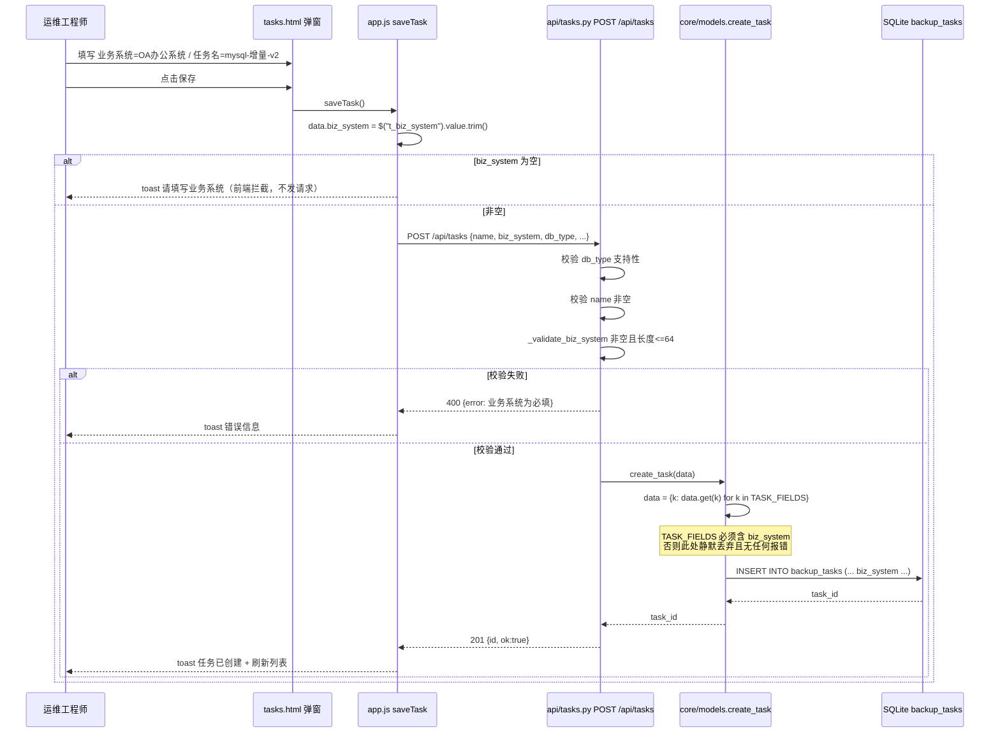
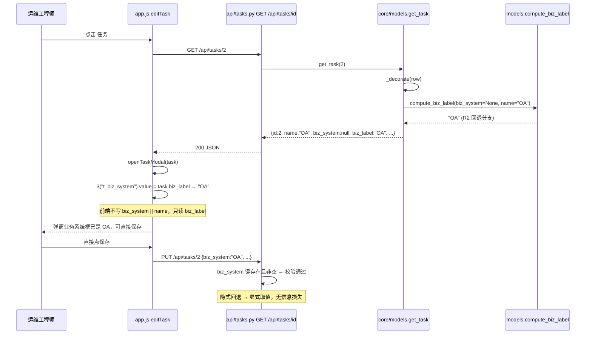
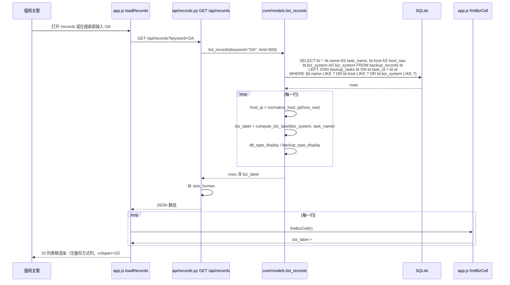
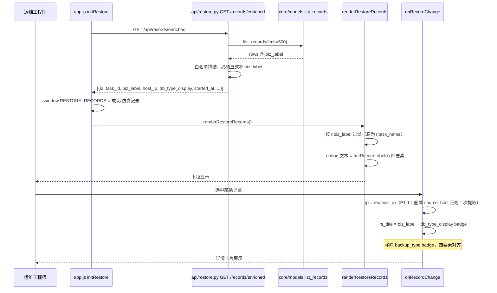
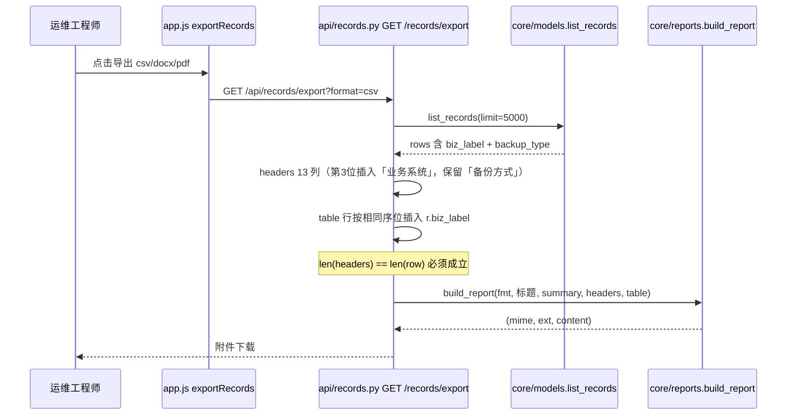
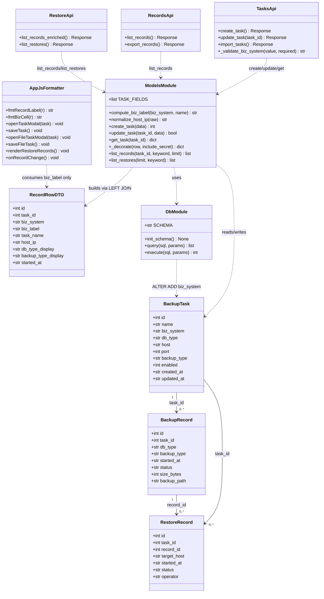
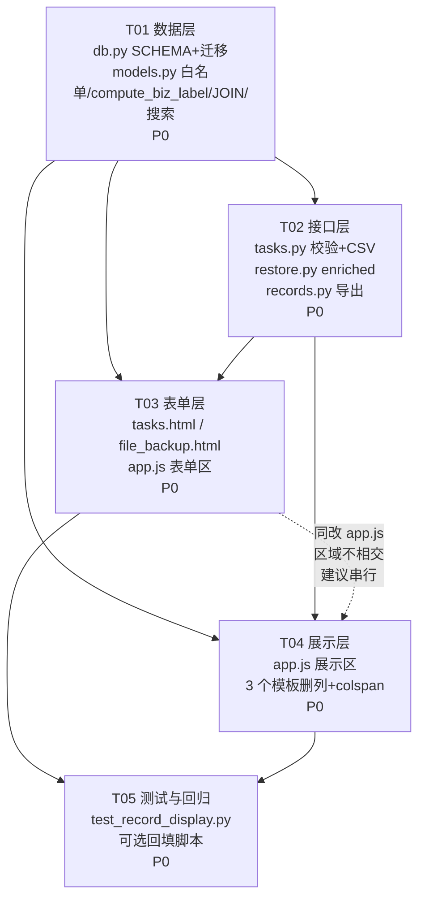

# 业务系统字段化与记录展示四要素 —— 增量架构设计 v2

| 项 | 值 |
|---|---|
| 文档版本 | v2.0（增量设计，对应 `docs/record-display-v2-prd.md` v2.0） |
| 架构师 | 高见远 |
| 日期 | 2026-08-02 |
| 上游输入 | `docs/record-display-v2-prd.md`（产品经理 许清楚）+ 主理人对 Q1–Q4 的拍板 |
| 前序设计 | `docs/record-display-design.md`（v1，已实现） |
| 项目名 | `record_display_v2_biz_system` |
| 代码基线 | 已读实测：`backup_tasks` 42 列无 `biz_system`；14 任务 / 89 备份记录 / 12 恢复记录；`static/js/app.js` 5566 行 |

---

## 0. 主理人拍板结论（已并入设计，不再作为待确认项）

| # | 结论 | 落地位置 |
|---|---|---|
| **D1** | `#id` 差异化：**下拉 = `#{record_id}`**（不变）；**表格「业务系统」单元格 = `#{task_id}`** | `fmtRecordLabel()` 保持 `r.id`；`fmtBizCell()` 改取 `r.task_id`（§4.4） |
| **D2** | 编辑弹窗预填 `biz_label`（`biz_system` 空则回退 `name`），允许直接保存 | `_decorate()` 下发 `biz_label` → `openTaskModal()` / `openFileTaskModal()` 预填（§4.3、§4.5） |
| **D3** | `biz_system` **不加唯一约束**，允许重复 | 迁移仅 `ADD COLUMN biz_system TEXT`，无 UNIQUE、无索引（§3.1） |
| **D4** | 导出报表**保留「备份方式」**并**新增「业务系统」**；仅前端展示层删除备份方式 | `api/records.py` 表头 12 列 → 13 列（§4.6） |

> **D1 的额外收益**：`/restore` 页内嵌表（`app.js:819`）当前把 `#${r.id}` 渲染成**恢复记录 ID**（既不是备份记录 ID 也不是任务 ID），是 v1 的内联手写遗留缺陷。收编为统一 `fmtBizCell()` 后按 D1 取 `task_id`，该缺陷一并消除。

---

## 1. 实现方案与框架选型

### 1.1 选型结论：零新增依赖

| 层 | 现有技术 | 本次是否变动 | 理由 |
|---|---|---|---|
| Web 框架 | Flask + Blueprint（`api/*.py` 挂 `api_bp`） | 不变 | 增量仅新增字段与校验，无新路由 |
| 元数据库 | SQLite（`instance/meta.db`），`core/db.py` 手写封装 | **仅加 1 列** | 项目全程未引入 ORM/Alembic，沿用 `try: ALTER TABLE ... except: pass` 幂等迁移模式 |
| 前端 | Bootstrap 5 + 原生 JS 单文件 `static/js/app.js` | 改 ~10 处 | 无构建链，无模块系统；统一格式化函数即是"单一真源"的唯一可行手段 |
| 模板 | Jinja2（`templates/*.html`） | 改 5 个 | 纯静态表头/表单，无逻辑 |
| 测试 | `unittest`（`tests/test_record_display.py` 已存在） | 扩展 | 复用 v1 的临时库 + `META_DB_PATH` 环境变量夹具 |

**依赖清单：无新增第三方包**（详见 §7）。

### 1.2 核心技术难点与对策

| 难点 | 风险 | 对策 |
|---|---|---|
| **D-1 白名单静默丢弃** | `create_task()`/`update_task()` 用 `TASK_FIELDS` 过滤入参，漏加 `biz_system` 会**无报错地丢数据**——前端提交成功、库里为空、页面走回退，全链路无一处告警 | 把 `TASK_FIELDS` 提升为**共享知识第一条**（§8.1）；并在 T05 用"写后读回"断言（`create_task` → `get_task().biz_system == 输入值`）把它变成硬失败 |
| **D-2 回退逻辑分叉** | R2 回退若在 6 个前端入口各写一遍，等于 v1 问题重演 | 后端单一函数 `models.compute_biz_label()`，在 `_decorate` / `list_records` / `list_restores` 三处调用；**前端不得出现 `biz_system \|\| name` 字样**（§8.2 为可 grep 的禁令） |
| **D-3 存量必填死锁** | 14 个存量任务 `biz_system` 全空，若编辑弹窗不预填，`required` 会让用户**无法保存任何存量任务**（连改端口都改不了） | D2 预填 + 后端 PUT 采用"**存在才校验**"语义（§4.2.2），双保险 |
| **D-4 colspan 错位** | 删列后空数据提示行 `colspan` 不同步，表格塌陷 | §4.4.3 给出**列数-colspan 对照表**，改列必查表；T05 加断言 |
| **D-5 展示与搜索脱节** | 搜索匹配 `name`、展示 `biz_label`，两者可不同 | 搜索取**三字段并集**（`name` OR `host` OR `biz_system`），语义定义为"超集"并显式写入契约（§4.1.3），而非追求严格一致 |
| **D-6 隐藏写入口** | `POST /api/tasks/import`（CSV 批量导入）也建任务，PRD 未覆盖 | 本设计新增覆盖：模板加列、导入映射加字段、**不强制必填**（§4.2.3） |

### 1.3 架构模式

沿用现有**三层分层**，本次不引入新抽象：

```
表现层  templates/*.html（结构）+ static/js/app.js（渲染与交互）
   │  只消费后端下发的 biz_label / host_ip / *_display，不做二次解析
接口层  api/tasks.py（校验）· api/records.py（列表/导出）· api/restore.py（enriched）
   │  只做 HTTP 契约与校验，不做展示计算
数据层  core/models.py（TASK_FIELDS 白名单 · compute_biz_label · JOIN 查询）
        core/db.py（SCHEMA + 幂等迁移）
```

**唯一新增约定**：展示派生字段（`biz_label`）由数据层计算，接口层仅透传，表现层仅渲染。

---

## 2. 文件清单（含行号级指引）

> 行号为**改动前**基线锚点，实施时以就近上下文匹配为准。

### 2.1 后端

| # | 文件 | 性质 | 锚点行 | 改动指引 |
|---|---|---|---|---|
| 1 | `core/db.py` | 修改 | `SCHEMA` L29-62（`backup_tasks` 建表） | 在 L32 `name TEXT NOT NULL,` 之后插入 `biz_system     TEXT,` |
| 2 | `core/db.py` | 修改 | `init_schema()` L575；RT 迁移块 L643-655 | 在 L655 之后追加新迁移块（模式见 §3.2）。**注意 L657-669 是 L643-655 的重复块（历史冗余），新块请追加在 L669 之后，勿插入两者之间** |
| 3 | `core/models.py` | 修改 | `TASK_FIELDS` L15-22 | L16 列表首项 `"name"` 后加 `"biz_system"`（**P0 最易遗漏项**） |
| 4 | `core/models.py` | 新增 | 建议置于 L502 之后（紧邻 `_backup_type_display`） | 新增 `compute_biz_label(biz_system, name)`（§4.1.1） |
| 5 | `core/models.py` | 修改 | `_decorate()` L105-116 | L109 后加 `row["biz_label"] = compute_biz_label(row.get("biz_system"), row.get("name"))` |
| 6 | `core/models.py` | 修改 | `list_records()` L504-527 | SELECT L505 补 `bt.biz_system AS biz_system`；keyword L515 改三字段 OR；行后处理 L522-526 补 `biz_label` |
| 7 | `core/models.py` | 修改 | `list_restores()` L541-567 | SELECT L546 补 `bt.biz_system AS biz_system`；keyword L555 改三字段 OR；行后处理 L562-566 补 `biz_label` |
| 8 | `api/tasks.py` | 修改 | POST L59-69 / PUT L81-89 | 新增 `_validate_biz_system()`；POST 强校验、PUT 存在才校验（§4.2） |
| 9 | `api/tasks.py` | 修改 | 模板 L121-123 / 导入 L167-183 | CSV 表头与导入映射补 `biz_system`（非必填，§4.2.3） |
| 10 | `api/restore.py` | 修改 | `/records/enriched` 白名单 dict L24-45 | L27 后补 `"biz_label": r.get("biz_label", "-")`；同时确认 `task_id` 已在 L26 下发（D1 需要） |
| 11 | `api/records.py` | 修改 | 导出 headers L51-52 / table L53-58 | 表头「任务ID」后插「业务系统」；数据行对应插 `r.get("biz_label")`（D4，**保留「备份方式」**） |

### 2.2 前端 JS（`static/js/app.js`，单文件）

| # | 锚点行 | 函数 | 改动指引 |
|---|---|---|---|
| 12 | L84-96 | `fmtRecordLabel()` | 注释「五要素」→「四要素」；删 L93 `bt` 变量与 L95 拼接中的 `· ${esc(bt)}`；L90 `r.task_name` → `r.biz_label` |
| 13 | L98-106 | `fmtBizCell()` | L101 `r.task_name` → `r.biz_label`；L103 `r.id` → `r.task_id`（**D1**） |
| 14 | L251-301 | `openTaskModal()` | L257 后加 `$("t_biz_system").value = task.biz_label \|\| "";`（**D2**）；else 分支（L274-279）无需处理（`form.reset()` 已清空） |
| 15 | L448-483 | `saveTask()` | data 对象（L457-476）加 `biz_system: $("t_biz_system").value.trim()`；提交前（L477 之前）加必填校验 |
| 16 | L485-505 | `loadTasks()` | **P1-2**：行加 `<td>${esc(t.biz_label \|\| "-")}</td>`；L504 `colspan="10"` → `"11"` |
| 17 | L617-631 | 记录表行渲染 | 删 L621 备份方式 `<td>`；L631 `colspan="11"` → `"10"` |
| 18 | L814-833 | `loadRestores()`（`/restore` 页内表） | L819-820 内联拼装 → `fmtBizCell(r)`；删 L825 备份方式 `<td>`；L832 `colspan="12"` → `"11"` |
| 19 | L1023-1048 | `renderRestoreRecords()` | L1037 `r.task_name` → `r.biz_label` |
| 20 | L1099-1133 | `onRecordChange()` | 删 L1107-1108 IP 正则（**P1-1**），改用 `rec.host_ip`；L1110-1112 `rs_title` 改 `rec.biz_label` + `db_type_display`，**删 `backup_type` badge** |
| 21 | L1531-1570 | `openFileTaskModal()` | L1536 后加 `$("f_biz_system").value = task.biz_label \|\| "";`（**D2**） |
| 22 | L1581-1623 | `saveFileTask()` | data（L1596-1611）加 `biz_system`；L1612 附近加必填校验 |
| 23 | L1625-1652 | `loadFileTasks()` | **P1-2**：行加业务系统 `<td>`；L1651 `colspan="8"` → `"9"` |
| 24 | L2001-2027 | `initRestoreRecords()` | L2006-2007 内联拼装 → `fmtBizCell(r)`；删 L2011 备份方式 `<td>`；L2017 `colspan="12"` → `"11"` |
| 25 | L3374 / L4231 | datamining / clone 下拉 | **无需改动**，随 `fmtRecordLabel()` 自动继承；仅需回归 |

### 2.3 模板

| # | 文件 | 锚点行 | 改动指引 |
|---|---|---|---|
| 26 | `templates/tasks.html` | L44-47（`#t_name`） | 在 L44 之前插入「业务系统」`col-md-6` 块（`#t_biz_system`），置于任务名称**左侧**；原 L44-47 保持 |
| 27 | `templates/tasks.html` | L17-18（thead） | **P1-2**：`<th>名称</th>` 前插 `<th>业务系统</th>`（10 列 → 11 列） |
| 28 | `templates/file_backup.html` | L57-60（`#f_name`） | 在 L57 之前插入「业务系统」`col-md-6` 块（`#f_biz_system`） |
| 29 | `templates/file_backup.html` | L37-38（任务表 thead） | **P1-2**：`<th>名称</th>` 前插 `<th>业务系统</th>`（8 列 → 9 列） |
| 30 | `templates/records.html` | L25 | 删 `<th>备份方式</th>`（11 → 10） |
| 31 | `templates/restore_records.html` | L16 | 删 `<th>备份方式</th>`（12 → 11） |
| 32 | `templates/restore.html` | L232 | 删 `<th>备份方式</th>`（12 → 11） |

### 2.4 测试与文档

| # | 文件 | 性质 | 说明 |
|---|---|---|---|
| 33 | `tests/test_record_display.py` | 修改 | 扩展 R2 回退 / 白名单写后读回 / 三字段搜索 / enriched 契约 用例（§9） |
| 34 | `scripts/backfill_biz_system.py` | 新增（**P1-3，可选**） | 一次性回填脚本，`--dry-run` 默认（§3.4） |

### 2.5 明确不改动（防误伤）

| 文件 | 原因 |
|---|---|
| `templates/protection.html:44` | 「备份方式」属**保护策略**语义（RPO/RTO 配置），与备份记录展示无关 |
| `core/drill.py:36`、`core/ai_alert.py:915/1155`、`api/system.py:32` | `list_records()` 的其他消费方，返回值新增 key 向后兼容，**零改动** |
| `app.js` L640-647（`viewRecordLog` 日志弹窗） | 日志详情属排障场景，`rl_backup_type` 保留原始备份方式，不在四要素收敛范围 |

---

## 3. DB Schema 迁移与回退规则

### 3.1 目标 Schema

```sql
ALTER TABLE backup_tasks ADD COLUMN biz_system TEXT;
```

| 属性 | 取值 | 依据 |
|---|---|---|
| 类型 | `TEXT` | 与 `name` 一致，自由文本 |
| 可空 | **允许 NULL** | 存量 14 行必须能落地；R2 回退依赖 NULL/空串 |
| 默认值 | **无 DEFAULT** | 若给 `DEFAULT ''`，存量行为 `''`，与新建未填无法区分；保持 NULL 语义更干净 |
| 唯一约束 | **无**（D3） | 一个业务系统挂多个任务是预期行为 |
| 索引 | **不建** | 14 任务 / 89 记录量级，`LIKE '%kw%'` 全表扫描成本可忽略；且前缀通配符使 B-tree 索引失效 |

**列位置**：SQLite `ADD COLUMN` 只能追加到末尾，故老库中 `biz_system` 是第 43 列，新库（走 `SCHEMA`）是第 3 列。**列序不一致不影响任何逻辑**——项目全程使用 `dict(row)` 按列名访问（`core/db.py` `query()` 返回 `list[dict]`），无一处依赖位置索引。

### 3.2 迁移实现（幂等）

在 `core/db.py` `init_schema()` 内，**追加在 L669 现有 RT 重复块之后**：

```python
# 迁移：业务系统字段化（record_display_v2）—— backup_tasks 追加 1 列
for col, typedef in [
    ("biz_system", "TEXT"),
]:
    try:
        conn.execute(f"ALTER TABLE backup_tasks ADD COLUMN {col} {typedef}")
    except Exception:
        pass  # 列已存在，忽略
```

**同时**在 `SCHEMA` 常量的 `backup_tasks` 建表语句（L32 `name` 之后）加 `biz_system TEXT,`。

> **为何两处都要改**：`SCHEMA` 用 `CREATE TABLE IF NOT EXISTS`，只对**全新库**生效；`ALTER` 只对**存量库**生效。漏改任一处，新库与老库行为分叉——这是本项目已有的既定模式（`backup_mode`、`policy_id`、`rt_*` 均如此）。

### 3.3 迁移与回退规则

| 场景 | 行为 | 数据影响 |
|---|---|---|
| **首次升级**（老库，42 列） | `ALTER` 成功，新增第 43 列，14 行值为 `NULL` | 无损。全部走 R2 回退，展示等价于升级前 |
| **重复启动** | `ALTER` 抛 `duplicate column name` → 被 `except: pass` 吞掉 | 无 |
| **全新部署** | `SCHEMA` 直接建含 `biz_system` 的表 | 无 |
| **代码回滚（保留列）** ✅ 推荐 | 回退应用代码至上一版本，**保留 `biz_system` 列不删** | 零风险。老代码 `SELECT br.*, bt.name...` 不选该列，`TASK_FIELDS` 不含该列 → 列被完全忽略；已填的值原样保留，二次升级即恢复 |
| **代码回滚（删列）** ⚠️ 不推荐 | `ALTER TABLE backup_tasks DROP COLUMN biz_system;` | 本机 SQLite 3.53.1 支持（≥3.35）。但**已录入的业务系统数据永久丢失**，且若他处部署的 SQLite < 3.35 会失败，需走"建新表 → 拷数据 → 换名"。仅在确认放弃需求时执行 |

**回退前置动作（强制）**：任何回滚前先执行 `backups/` 目录约定的元数据库冷备（拷贝 `instance/meta.db` + `-wal` + `-shm` 三件套），SQLite 处于 WAL 模式（`core/db.py:570`），单拷 `.db` 会丢未 checkpoint 的事务。

### 3.4 存量数据回填（P1-3，可选，非阻塞）

`scripts/backfill_biz_system.py`：

```
默认 --dry-run，仅打印将要写入的 (id, name → biz_system) 清单
加 --apply 才执行 UPDATE backup_tasks SET biz_system = name
                  WHERE biz_system IS NULL OR TRIM(biz_system) = ''
```

**不做也不影响正确性**（R2 已保证展示一致），其价值是把"隐式回退"转为"显式取值"，降低后续认知负担。**建议上线后观察 1 周再决定**——若运维已陆续手工回填，脚本反而会覆盖判断。

---

## 4. 数据结构与接口契约

### 4.1 核心：`biz_label` 计算规则（R2）

#### 4.1.1 唯一实现

`core/models.py`，紧邻 `_backup_type_display()`（L500-501）之后新增：

```python
def compute_biz_label(biz_system, name) -> str:
    """规则 R2：业务系统展示标签。biz_system 优先，空则回退任务名。

    全站唯一实现。前端不得再做 `biz_system || name` 的判空回退
    （见 docs/record-display-design.md §6 确立的约定）。
    """
    s = (biz_system or "").strip()
    if s:
        return s
    n = (name or "").strip()
    return n or "-"
```

| 输入 `biz_system` | 输入 `name` | 输出 `biz_label` | 场景 |
|---|---|---|---|
| `"OA 办公系统"` | `"mysql-增量-v2"` | `"OA 办公系统"` | 新建任务（正常路径） |
| `None` | `"OA"` | `"OA"` | **存量任务（上线首日 100% 走此分支）** |
| `""` / `"   "` | `"phase2-demo-mysql"` | `"phase2-demo-mysql"` | 空串/纯空白等价于未填 |
| `None` | `None` | `"-"` | 理论不可达（`name` 为 `NOT NULL`），兜底防 `undefined` |

**函数命名为 `compute_biz_label`（公开，无下划线前缀）**，区别于 `_db_type_display` 等私有辅助——它需被 `scripts/` 回填脚本与测试直接引用。

#### 4.1.2 三处调用点

| 调用点 | 位置 | 受益接口 |
|---|---|---|
| `_decorate(row, include_secret)` | `core/models.py:105-116` | `GET /api/tasks`、`GET /api/tasks/<id>` → **编辑预填（D2）** 与任务列表列（P1-2） |
| `list_records()` 行后处理 | `core/models.py:522-526` | `GET /api/records`、`/api/records/export`、`/api/records/enriched` |
| `list_restores()` 行后处理 | `core/models.py:562-566` | `GET /api/restores` |

#### 4.1.3 搜索字段扩展契约

```python
# 改前（core/models.py:515 与 :555）
where.append("(bt.name LIKE ? OR bt.host LIKE ?)")
params.extend([kw, kw])

# 改后
where.append("(bt.name LIKE ? OR bt.host LIKE ? OR bt.biz_system LIKE ?)")
params.extend([kw, kw, kw])
```

**参数个数从 2 变 3 —— `params.extend` 必须同步改，否则 `sqlite3.ProgrammingError: Incorrect number of bindings`（会 500，属显性失败，可接受）。**

**搜索语义定义（并集，非严格一致）**：

| 情形 | `biz_system` | `name` | 搜 `"OA"` | 展示 | 说明 |
|---|---|---|---|---|---|
| 存量回退 | `NULL` | `OA` | ✅ 命中（by name） | `OA` | 搜到 = 看到 ✓ |
| 已回填 | `OA办公系统` | `OA` | ✅ 命中（双字段） | `OA办公系统` | 搜到 = 看到 ✓ |
| 改名后 | `OA办公系统` | `phase2-demo-mysql` | 搜 `phase2` ✅ 命中（by name） | `OA办公系统` | **命中项展示的是新名** |

最后一行是**刻意保留的超集行为**：运维记得旧任务名时仍能搜到，是正向体验。`NULL LIKE '%x%'` 在 SQLite 中返回 `NULL`（假值），不会误命中，无需 `COALESCE`。

### 4.2 接口契约：任务写入

#### 4.2.1 `POST /api/tasks`（新建，强校验）

```
Request  { "name": "...", "biz_system": "OA 办公系统", "db_type": "mysql", ... }
200/201  { "id": 33, "ok": true }
400      { "error": "业务系统为必填" }        # 缺失 / 空串 / 纯空白
400      { "error": "业务系统长度不能超过 64 字符" }
```

校验顺序置于现有 `name` 校验（`api/tasks.py:65-66`）之后，复用同款错误结构 `{"error": str}`（前端 `api()` 封装已统一提取 `error` 字段并 toast）。

#### 4.2.2 `PUT /api/tasks/<id>`（编辑，**存在才校验**）

| 请求体中 `biz_system` | 行为 |
|---|---|
| 键不存在 | **跳过校验**，不更新该列（`update_task()` 的 `if k in TASK_FIELDS` 天然按需更新） |
| 存在且非空 | 校验长度后更新 |
| 存在但为空/纯空白 | **400「业务系统不能为空」** |

> **为何 PUT 不做无条件强校验**：`update_task()` 支持部分更新语义。虽然当前仅 `app.js:478` 与 `:1618` 两个调用方且都提交完整对象，但无条件必填会把该端点降级为"全量替换"，未来任何部分更新（如仅切换 enabled）都会 400。"存在才校验"在不牺牲底线的前提下保留了语义弹性。

配合 **D2 预填**，存量任务编辑流为：打开弹窗 → 框内已是 `OA` → 直接保存 → `biz_system` 落库为 `OA`，D-3 死锁解除。

#### 4.2.3 `POST /api/tasks/import`（CSV 批量导入，**PRD 未覆盖，本设计新增**）

| 项 | 决策 |
|---|---|
| 模板表头（`api/tasks.py:121-123`） | `name` 之后插入 `biz_system` |
| 示例行（L125-137，共 4 行） | 各补一个示例值，如 `OA 办公系统` / `核心交易库` |
| 导入映射（L167-183） | 加 `"biz_system": (row.get("biz_system") or "").strip()` |
| **是否必填** | **否**。缺列/空值 → 落 NULL → 走 R2 回退 |

**理由**：CSV 导入是批量运维通道，强制必填会让存量模板文件全部失效、导入整体失败。必填是**交互式表单**的约束（防人手漏填），批量通道有 R2 兜底即可。此差异需在 §8 共享知识中显式声明，避免 QA 误判为 Bug。

### 4.3 接口契约：任务读取（新增 `biz_label`）

`GET /api/tasks` / `GET /api/tasks/<id>` 响应新增 2 个键：

```json
{
  "id": 2,
  "name": "OA",
  "biz_system": null,
  "biz_label": "OA",
  "db_type": "file",
  "host": "root@192.168.220.150:22",
  "db_display_name": "文件"
}
```

- `biz_system`：**原始值**（可为 `null`），供需要区分"已填/未填"的场景（如回填脚本、审计）
- `biz_label`：**展示值**（永不为空），前端一律用它

### 4.4 接口契约：记录读取

#### 4.4.1 `GET /api/records`（`list_records`）行对象

```json
{
  "id": 59,
  "task_id": 2,
  "biz_system": null,
  "biz_label": "OA",
  "task_name": "OA",
  "host_ip": "192.168.220.150",
  "db_type": "file",
  "db_type_display": "文件",
  "backup_type": "full",
  "backup_type_display": "全量",
  "started_at": "2026-07-20 11:31:10",
  "size_human": "12.3 MB"
}
```

**`backup_type` / `backup_type_display` 保留下发**（D4 导出需要，且移除属破坏性变更），仅前端展示层不再渲染。

#### 4.4.2 `GET /api/records/enriched`（`api/restore.py`，显式白名单）

⚠️ **该接口是逐字段拼装的白名单**，不补则数据恢复页拿不到业务系统。必须新增：

```python
"biz_label": r.get("biz_label", "-"),
```

`task_id`（L26）已在白名单内，D1 所需的表格 `#{task_id}` 无需额外补字段。

#### 4.4.3 `GET /api/restores`（`list_restores`）行对象

在 v1 字段基础上新增 `biz_system` / `biz_label`。注意此处 `r.id` 是**恢复记录 ID**、`r.record_id` 是备份记录 ID、`r.task_id` 是任务 ID —— D1 的 `fmtBizCell` 取 `task_id`。

### 4.4 前端契约：两个格式化函数（单一真源）

#### 4.4.1 `fmtRecordLabel(r)` —— 下拉单行串（四要素）

```
#{r.id} {biz_label} @ {host_ip} · {db_type_display} · {started_at}
```

| 项 | v1（五要素） | v2（四要素） |
|---|---|---|
| `#id` | `r.id`（记录 ID） | **不变**（D1：下拉保持 `record_id`） |
| 名称 | `r.task_name` | **`r.biz_label`** |
| 备份方式段 | `· ${bt}` | **删除** |
| 其余分隔符/顺序 | — | **不变**（避免用户重建认知） |

渲染示例（实测数据，均走 R2 回退）：
```
#59  OA @ 192.168.220.150 · 文件 · 2026-07-20 11:31:10
#33  mysql-增量 @ 192.168.220.150 · MySQL · 2026-07-20 10:38:22
#106 123-增量 @ 本地 · 文件 · 2026-07-31 11:10:41
```

消费方（**均自动继承，无需改动**）：`app.js:1046`（restore 下拉）、`:3374`（datamining）、`:4231`（clone）。

#### 4.4.2 `fmtBizCell(r)` —— 表格双行单元格

```html
<div class="fw-bold">{biz_label} <span class="text-muted small">#{task_id}</span></div>
<div class="small text-muted">{host_ip}</div>
```

| 项 | v1 | v2 |
|---|---|---|
| 名称 | `r.task_name` | **`r.biz_label`** |
| `#id` | `r.id` | **`r.task_id`**（D1；缺失时降级为 `-`） |

消费方：`app.js:619`（records 表，已用）、`:819-820`（restore 页内表，**本次收编**）、`:2006-2007`（restore_records 表，**本次收编**）。

> **收编价值**：三处从 3 份内联拼装收敛为 1 个函数，R2 回退与 `#id` 语义只需维护一处；同时修复 `/restore` 页 `#id` 显示恢复记录 ID 的历史缺陷。

#### 4.4.3 列数 ↔ colspan 对照表（**改列必查**）

| 页面 | JS 渲染 | colspan 行 | 表头模板 | 改前 | 改后 |
|---|---|---|---|---|---|
| `/records` 备份记录 | `app.js:617-629` | `app.js:631` | `records.html:25` | 11 | **10** |
| `/restore` 页内恢复表 | `app.js:821-830` | `app.js:832` | `restore.html:232` | 12 | **11** |
| `/restore_records` | `app.js:2008-2015` | `app.js:2017` | `restore_records.html:16` | 12 | **11** |
| `/tasks` 任务表（P1-2） | `app.js:488-503` | `app.js:504` | `tasks.html:17-18` | 10 | **11**（加列） |
| 文件备份任务表（P1-2） | `app.js:1636-1649` | `app.js:1651` | `file_backup.html:37-38` | 8 | **9**（加列） |

**5 处，其中 3 处减列、2 处加列，方向相反，最易出错。**

### 4.5 前端契约：表单字段

| 项 | 数据库备份弹窗 | 文件备份弹窗 |
|---|---|---|
| 模板文件 | `templates/tasks.html` | `templates/file_backup.html` |
| 插入位置 | L44 之前（「基本信息」Tab 首行，任务名称**左侧**） | L57 之前（表单首行，任务名称**左侧**） |
| id | `t_biz_system` | `f_biz_system` |
| label | `业务系统 *` | `业务系统 *` |
| placeholder | `如：OA 办公系统、核心交易库` | 同左 |
| form-text | `用于备份/恢复记录统一展示；任务名称仅用于任务管理` | 同左 |
| 栅格 | `col-md-6` | `col-md-6` |
| HTML 校验 | `required` | `required` |
| 预填（D2） | `openTaskModal()` L257 后：`$("t_biz_system").value = task.biz_label \|\| ""` | `openFileTaskModal()` L1536 后：`$("f_biz_system").value = task.biz_label \|\| ""` |
| 提交 | `saveTask()` data 加 `biz_system: $("t_biz_system").value.trim()` | `saveFileTask()` data 加同名字段 |
| JS 校验 | 提交前 `if (!data.biz_system) { toast("请填写业务系统", "danger"); return; }` | 同左，置于 L1612 `name` 校验之前 |

> **`tasks.html` 的 Tab 陷阱**：业务系统必须放在 `#tab_basic`（默认激活 Tab）内。若放入 `#tab_advanced`，`required` 校验失败时浏览器无法聚焦隐藏元素，会抛 `An invalid form control ... is not focusable` 且**静默阻止提交**。当前设计置于「基本信息」首行，规避此问题。
>
> **`taskForm` 的 `onsubmit="return false"`**（`tasks.html:34`）意味着 HTML5 原生校验不一定触发，因此 **JS 显式校验是主防线，`required` 只是视觉提示**（红星 + 浏览器气泡）。文件备份弹窗 `fileTaskForm`（L54）无 `onsubmit`，行为可能不同——两处都必须有 JS 校验，不依赖浏览器。

### 4.6 导出报表契约（D4）

`api/records.py:51-58`：

```python
headers = ["ID", "任务ID", "业务系统", "类型", "备份方式", "开始时间", "完成时间",
           "耗时(s)", "状态", "大小", "路径", "校验和", "备注"]     # 12 → 13 列
table = [[r.get("id"), r.get("task_id"), r.get("biz_label"),        # ← 新增
          r.get("db_type"), r.get("backup_type"),                    # ← 备份方式保留
          ...]]
```

**表头与数据行必须同步插入在相同序位**（第 3 位）。`core/reports.py` 的 `build_report(fmt, title, summary, headers, table)` 对 csv/docx/pdf 三种格式按位置对齐，错位会导致列标题与数据串位——PDF 因列宽自适应，串位往往不易被肉眼发现，**T05 需加断言 `len(headers) == len(table[0])`**。

---

## 5. 程序调用流程（时序图）

> 完整源文件：`docs/record-display-v2-sequence.mermaid`

### 5.1 新建任务（含必填校验 + 白名单落库）



### 5.2 编辑存量任务（D2 预填，解 D-3 死锁）



### 5.3 备份记录页加载与搜索（四要素下发）



### 5.4 数据恢复页：下拉 + 详情卡片（含 P1-1 正则清理）



### 5.5 导出报表（D4：保留备份方式 + 新增业务系统）



---

## 6. 数据结构（类图）

> 完整源文件：`docs/record-display-v2-class.mermaid`



**关系说明**

- `BackupTask 1—N BackupRecord`（`backup_records.task_id`）：`biz_label` 由任务侧计算后**下沉到记录行**，记录本身不存业务系统，因此任务改名/改业务系统后，历史记录展示**自动跟随**（无需回刷记录表）——这是选择"JOIN 计算"而非"记录冗余存储"的核心理由。
- `BackupRecord 1—N RestoreRecord`（`restore_records.record_id`）：恢复记录的备份时间来自关联备份记录的 `started_at`（v1 已确立）。
- `AppJsFormatter ..> RecordRowDTO`：**单向依赖，且仅消费 `biz_label`**。前端不得访问 `biz_system` 原始字段做判空——这是 D-2 的架构级约束。

---

## 7. 依赖包列表

**本次新增第三方依赖：无。**

复用的既有运行时依赖（均已在 `requirements.txt` 中）：

```
- Flask: Web 框架与 Blueprint 路由（api/*.py）
- sqlite3（Python 标准库）: 元数据库；本机版本 3.53.1，支持 ALTER TABLE ADD/DROP COLUMN
- python-docx: 导出报表 docx 格式（core/reports.py，D4 新增列需其表格渲染）
- reportlab: 导出报表 pdf 格式（core/reports.py）
- unittest（Python 标准库）: 单元测试（tests/test_record_display.py）
```

前端依赖（CDN / 静态，`templates/base.html` 引入，本次不变动）：

```
- Bootstrap 5: 栅格（col-md-6）、Modal、Tab、badge、table
- Bootstrap Icons: 图标
- 原生 JS（无框架、无构建）: static/js/app.js 单文件 IIFE
```

> **为何不引入 Alembic/SQLAlchemy**：本项目 `core/db.py` 已积累 14 处 `try: ALTER TABLE ... except: pass` 幂等迁移，形成了事实标准。为新增 1 列引入迁移框架，需要重写全部既有迁移并处理 SQLite 的 `ALTER` 限制，收益/风险严重倒挂。

---

## 8. 共享知识（跨文件约定）

### 8.1 ⚠️ `TASK_FIELDS` 白名单（头号陷阱）

```python
# core/models.py:15-22
TASK_FIELDS = ["name", "biz_system", "db_type", "host", ...]
                       ^^^^^^^^^^^^ 本次新增
```

| 影响函数 | 过滤方式 | 漏加后果 |
|---|---|---|
| `create_task()` L27 | `{k: data.get(k) for k in TASK_FIELDS}` | 新建时 `biz_system` **被静默丢弃**，落库 NULL |
| `update_task()` L62 | `{k: v for k, v in data.items() if k in TASK_FIELDS}` | 编辑时**被静默丢弃** |

**关键特征：无异常、无日志、HTTP 200、前端 toast「任务已创建」——全链路无任何失败信号，页面因 R2 回退看起来"正常"。**

**自检命令**（实施后必跑）：
```bash
python -c "from core.models import TASK_FIELDS; assert 'biz_system' in TASK_FIELDS; print('OK')"
```

### 8.2 `biz_label` 计算的唯一归属

- **唯一实现**：`core/models.compute_biz_label()`
- **禁止**：前端任何位置出现 `biz_system || name`、`r.biz_system ? ... : r.task_name` 之类的判空回退
- **可 grep 的验收禁令**：
  ```bash
  grep -n "biz_system" static/js/app.js
  # 期望结果：仅出现在 t_biz_system / f_biz_system 两个 DOM id 与 data.biz_system 提交字段中
  # 若出现 "biz_system ||" 或 "biz_system ?" → 违反约定，打回
  ```
- **前端只读 `biz_label`**；`biz_system` 原始值仅用于表单**提交**，不用于**展示判断**

### 8.3 `#id` 语义对照表（D1）

| 场景 | 函数 | `#id` 取值 | 依据 |
|---|---|---|---|
| 下拉选项（restore / datamining / clone） | `fmtRecordLabel(r)` | `r.id` = **备份记录 ID** | 选错备份集是真实风险，安全底线 |
| 表格「业务系统」单元格（records / restore_records / restore 页内表） | `fmtBizCell(r)` | `r.task_id` = **任务 ID** | 记录 ID 已在首列；一个业务系统挂多任务时需区分任务 |

**这是刻意的差异化，不是不一致。** 任何后续新入口必须调用这两个函数之一，不得内联手写。

### 8.4 列数 ↔ colspan 同步纪律

**修改任何表格列数时，必须同时改 3 处**：① 模板 `<th>`；② JS 行渲染 `<td>`；③ JS 空数据提示 `colspan`。

完整对照见 §4.4.3（5 张表，3 减 2 加）。**遗漏 ③ 的表现是"有数据时正常、无数据时错位"**——开发环境有数据，往往到生产空态才暴露。

### 8.5 错误响应与展示格式约定

| 约定 | 值 |
|---|---|
| API 错误响应 | `{"error": "中文提示"}` + 对应 HTTP 状态码（沿用全项目现状，**非** `{code,data,message}`） |
| 校验失败状态码 | `400` |
| 时间格式 | 库内 `YYYY-MM-DD HH:MM:SS` 字符串（`db.now_iso()`），前端 `fmtTime()` 渲染 |
| 类型汉化 | `config.DB_DISPLAY_NAMES`（含 `file→文件`）、`config.BACKUP_TYPE_DISPLAY_NAMES`（`full→全量` / `incremental→增量` / `differential→差异`） |
| IP 归一化 | 后端 `normalize_host_ip()`（规则 R1），**前端不得再用正则解析**（P1-1 即清理此类残留） |
| 空值占位 | 统一 `-`，禁止出现 `undefined` / `null` / 空白 |

### 8.6 必填约束的适用边界

| 通道 | 是否必填 | 理由 |
|---|---|---|
| `POST /api/tasks`（表单新建） | ✅ 必填 | 防人手漏填 |
| `PUT /api/tasks/<id>`（表单编辑） | ⚠️ 存在才校验 | 保留部分更新语义（§4.2.2） |
| `POST /api/tasks/import`（CSV 批量） | ❌ 不必填 | 避免存量模板失效；有 R2 兜底（§4.2.3） |

**QA 注意**：CSV 导入不填业务系统仍成功，是**设计预期**，不是 Bug。

### 8.7 字段语义速查

| 字段 | 含义 | 可为空 | 消费方 |
|---|---|---|---|
| `backup_tasks.biz_system` | 业务系统**原始值** | ✅ | 回填脚本、审计、表单提交 |
| `biz_label` | 业务系统**展示值**（R2 计算后） | ❌ 永不为空 | 所有 UI 展示、导出 |
| `task_name` | 任务名，**内部标识** | ❌ | 任务管理页、R2 回退源 |
| `host_ip` | 归一化 IP（R1） | ❌（空返 `-`） | 四要素之一 |
| `db_type_display` | 备份类型汉化 | ❌ | 四要素之一 |
| `backup_type_display` | 备份方式汉化 | ❌ | **仅导出**，展示层已移除 |

---

## 9. 任务列表（按实现顺序，含依赖）

### T01 · 数据层：Schema 迁移 + 白名单 + `biz_label` 计算 + 搜索扩展

| 项 | 内容 |
|---|---|
| **优先级** | P0 |
| **依赖** | 无 |
| **源文件** | `core/db.py`、`core/models.py` |
| **对应需求** | P0-1、P0-2、P0-7、P0-9 |

**内容**
1. `core/db.py` `SCHEMA` L32 后加 `biz_system TEXT,`
2. `core/db.py` `init_schema()` L669 之后追加幂等迁移块（§3.2）
3. `core/models.py` `TASK_FIELDS` L16 加 `"biz_system"`
4. `core/models.py` L502 后新增 `compute_biz_label()`（§4.1.1）
5. `_decorate()` L109 后补 `row["biz_label"]`
6. `list_records()`：SELECT 补 `bt.biz_system`、keyword 三字段 OR（`params.extend` 改 3 个）、行后处理补 `biz_label`
7. `list_restores()`：同上三项

**验收**
- `PRAGMA table_info(backup_tasks)` 出现 `biz_system`，总列数 42 → 43
- 重复执行 `db.init_schema()` 不报错
- `'biz_system' in models.TASK_FIELDS` 为 `True`
- `compute_biz_label(None, "OA") == "OA"`；`compute_biz_label("  ", "x") == "x"`；`compute_biz_label(None, None) == "-"`
- `list_records()` / `list_restores()` 每行含非空 `biz_label`
- 14 个存量任务全部走回退分支，`biz_label == name`

---

### T02 · 接口层：写入校验 + `enriched` 下发 + 导出列

| 项 | 内容 |
|---|---|
| **优先级** | P0 |
| **依赖** | T01 |
| **源文件** | `api/tasks.py`、`api/restore.py`、`api/records.py` |
| **对应需求** | P0-6、P0-8、P2-1(D4) + 本设计新增的 CSV 导入通道 |

**内容**
1. `api/tasks.py` 新增 `_validate_biz_system(value, required)`，返回错误字符串或 `None`
2. `POST /api/tasks`（L65-66 之后）强校验：空/纯空白 → 400「业务系统为必填」；`len > 64` → 400
3. `PUT /api/tasks/<id>`（L84-86 之间）**存在才校验**（§4.2.2）
4. `api/tasks.py` CSV 模板 L121-123 表头加 `biz_system`，4 个示例行（L125-137）各补值
5. `api/tasks.py` 导入映射 L167-183 加 `"biz_system": (row.get("biz_system") or "").strip()`（**不必填**）
6. `api/restore.py` `/records/enriched` L27 后加 `"biz_label": r.get("biz_label", "-")`
7. `api/records.py` 导出 L51-58：headers 第 3 位插「业务系统」、table 同序位插 `r.get("biz_label")`，**「备份方式」保留**

**验收**
- `POST /api/tasks` 不带 `biz_system` → 400；带 `"  "` → 400；带 65 字符 → 400
- `PUT` 不带该键 → 200 且其他字段更新成功；带 `""` → 400
- CSV 导入不含 `biz_system` 列 → 导入成功，落 NULL
- `GET /api/records/enriched` 每项含 `biz_label` 与 `task_id`
- 导出 csv 首行 13 列，第 3 列为「业务系统」，第 5 列仍为「备份方式」；`len(headers) == len(table[0])`

---

### T03 · 表单层：两个建任务弹窗（模板 + 提交 + 预填 + 校验）

| 项 | 内容 |
|---|---|
| **优先级** | P0 |
| **依赖** | T01、T02 |
| **源文件** | `templates/tasks.html`、`templates/file_backup.html`、`static/js/app.js`（表单区域） |
| **对应需求** | P0-3、P0-4、P0-5、P0-6（前端侧）、P1-2 |

**内容**
1. `tasks.html` L44 前插入 `#t_biz_system` 块（`col-md-6`，label/placeholder/form-text 见 §4.5），置于「基本信息」Tab 首行、任务名称左侧
2. `file_backup.html` L57 前插入 `#f_biz_system` 块
3. `app.js` `openTaskModal()` L257 后预填 `task.biz_label`
4. `app.js` `saveTask()` data 加 `biz_system`，提交前 JS 必填校验
5. `app.js` `openFileTaskModal()` L1536 后预填
6. `app.js` `saveFileTask()` data 加 `biz_system`，L1612 前 JS 必填校验
7. **P1-2**：`tasks.html` L17-18 加 `<th>业务系统</th>` + `app.js:490` 前加 `<td>` + L504 colspan 10→11
8. **P1-2**：`file_backup.html` L37-38 加 `<th>` + `app.js:1638` 前加 `<td>` + L1651 colspan 8→9

**验收**
- 两弹窗均出现带红星的「业务系统」输入框，位于任务名称左侧
- 留空提交 → toast 拦截，不发请求
- 新建后 `SELECT biz_system FROM backup_tasks WHERE id=?` 取到填写值（**验证 T01 白名单真实生效**）
- 打开任一存量任务（如 #2 `OA`）→ 业务系统框预填 `OA` → 直接保存成功（**D-3 死锁解除**）
- 两个任务列表页新增「业务系统」列，空态 colspan 与实际列数一致

---

### T04 · 展示层：四要素收敛 + 删备份方式 + colspan 同步

| 项 | 内容 |
|---|---|
| **优先级** | P0 |
| **依赖** | T01、T02 |
| **源文件** | `static/js/app.js`（展示区域）、`templates/records.html`、`templates/restore_records.html`、`templates/restore.html` |
| **对应需求** | P0-10、P0-11、P0-12、P0-13、P1-1 |

> **与 T03 的关系**：两者均修改 `app.js`，但区域完全不相交（T03 改 L251-301 / L448-505 / L1531-1652 表单区；T04 改 L84-106 / L617-631 / L814-833 / L1023-1133 / L2001-2027 展示区）。**建议在 T03 之后串行执行**，避免同文件并行编辑造成上下文错位。

**内容**
1. `fmtRecordLabel()` L84-96：注释改「四要素」、删 `bt` 变量与拼接段、`task_name` → `biz_label`
2. `fmtBizCell()` L98-106：`task_name` → `biz_label`、`r.id` → `r.task_id`（**D1**）
3. 记录表 L621 删备份方式 `<td>`；L631 colspan 11→10
4. `loadRestores()` L819-820 内联拼装 → `fmtBizCell(r)`；删 L825；L832 colspan 12→11
5. `initRestoreRecords()` L2006-2007 → `fmtBizCell(r)`；删 L2011；L2017 colspan 12→11
6. `renderRestoreRecords()` L1037 `task_name` → `biz_label`（**P0-13**）
7. `onRecordChange()`：删 L1107-1108 IP 正则改用 `rec.host_ip`（**P1-1**）；L1110-1112 `rs_title` 改 `biz_label` + `db_type_display` badge、**删 `backup_type` badge**（**P0-12**）
8. 三个模板删 `<th>备份方式</th>`：`records.html:25`、`restore_records.html:16`、`restore.html:232`

**验收**
- 六处入口（records 表 / restore_records 表 / restore 下拉 + 详情卡片 + 页内表 / datamining 下拉 / clone 下拉）同一条记录四要素**完全一致**，且**均无备份方式**
- 三张表列数分别为 10 / 11 / 11，空态 colspan 一致，无错位
- `/restore` 页内表「业务系统」的 `#id` 显示**任务 ID**（历史缺陷修复）
- 详情卡片「本地」类任务的 IP 正常显示为 `本地`（P1-1 验证）
- `grep "biz_system" static/js/app.js` 仅命中 DOM id 与提交字段
- `templates/protection.html:44` 保持原样

---

### T05 · 测试与回归验收

| 项 | 内容 |
|---|---|
| **优先级** | P0 |
| **依赖** | T01、T02、T03、T04 |
| **源文件** | `tests/test_record_display.py`、（可选）`scripts/backfill_biz_system.py` |

**内容**
1. 扩展 `tests/test_record_display.py`（复用 v1 的 `META_DB_PATH` 临时库夹具）：
   - `TestComputeBizLabel`：R2 四种输入（正常 / NULL 回退 / 纯空白回退 / 双空兜底）
   - `TestTaskFieldsWhitelist`：`create_task({biz_system:"X"})` → `get_task().biz_system == "X"`（**写后读回，D-1 硬失败**）
   - `TestBizLabelInRows`：`list_records()` / `list_restores()` / `_decorate()` 三处均返回正确 `biz_label`，含回退行
   - `TestKeywordThreeFields`：分别按 `biz_system` 新值、旧 `name`、`host` 搜索均命中；空关键字返回全量
   - `TestEnrichedContract`：`/records/enriched` 每项含 `biz_label` 与 `task_id`
   - `TestExportHeaderAlignment`：`len(headers) == len(table[0]) == 13`，第 3 列「业务系统」、第 5 列「备份方式」
2. （P1-3，可选）`scripts/backfill_biz_system.py`，默认 `--dry-run`
3. 执行 PRD §7 的 8 条验收标准回归

**回归清单（人工）**

| # | 项 | 期望 |
|---|---|---|
| 1 | 新建 DB 任务 / 文件任务 | 业务系统必填生效，落库正确 |
| 2 | 编辑 14 个存量任务中任意 3 个 | 预填正确，可直接保存，不死锁 |
| 3 | `/records` `/restore_records` `/restore`(下拉+卡片+页内表) `/datamining` `/clone` | 四要素一致、无备份方式 |
| 4 | 三类关键字搜索（新业务系统名 / 旧任务名 / IP） | 均命中；清空恢复全量 |
| 5 | 三张表空态（用不存在的关键字触发） | colspan 无错位 |
| 6 | 导出 csv / docx / pdf | 13 列，业务系统与备份方式并存，列不串位 |
| 7 | `templates/protection.html` 保护策略页 | 「备份方式」列保持原样 |
| 8 | 重启应用两次 | 迁移幂等，无异常日志 |

---

### 9.1 任务依赖图



**关键路径**：`T01 → T02 → T03 → T04 → T05`（全串行）。
T03 与 T04 理论上可并行（依赖集相同、`app.js` 区域不相交），但因共享单文件，**建议串行以规避编辑冲突**。

---

## 10. 待明确事项

| # | 事项 | 现状 / 建议 | 阻塞性 |
|---|---|---|---|
| **A1** | **CSV 批量导入的必填豁免**（本设计新增发现，PRD 未覆盖） | `POST /api/tasks/import` 是第三个建任务通道。本设计定为**不必填**（模板加列、缺失走 R2 回退），理由见 §4.2.3。若主理人要求"所有通道一律必填"，则需同步废弃旧模板文件并在导入失败信息中提示缺列 | ❌ 不阻塞，已按"不必填"设计 |
| **A2** | **业务系统长度上限 64** | PRD §5.1 控件规格写「长度 1–64」，但未说明是字符数还是字节数。本设计按**字符数**（`len(str)`，中文按 1 计）实现，即最多 64 个汉字 | ❌ 不阻塞 |
| **A3** | **P1-3 回填脚本的执行时机** | 脚本本身低风险，但若运维已开始手工回填，脚本的 `SET biz_system = name` 会与手工值冲突（脚本带 `WHERE biz_system IS NULL OR TRIM='' ` 条件，不覆盖已填值，理论安全）。建议**上线后观察 1 周再决定是否执行**，或干脆不执行 | ❌ 不阻塞，P1 可选 |
| **A4** | **`core/db.py` L643-655 与 L657-669 的重复 RT 迁移块** | 两段完全相同的 `rt_*` 列迁移，第二段是历史冗余（幂等所以无功能影响，仅每次启动多 6 次无效 `ALTER` + 异常捕获）。**本次不清理**（超出需求范围，且清理会扩大回归面），仅记录。新迁移块追加在 L669 之后 | ❌ 不阻塞，仅备案 |
| **A5** | **任务改名后历史记录的展示语义** | 因 `biz_label` 是 JOIN 实时计算（非记录侧冗余），任务的业务系统改名后，**所有历史备份记录的展示会一并变更**。这符合"业务视角"直觉，但意味着历史留档不"冻结"。若审计要求记录时点快照，需在 `backup_records` 冗余存储 `biz_system_snapshot`——**本次不做**，属独立立项 | ❌ 不阻塞，需产品知悉 |
| **A6** | **`fmtBizCell` 的 `task_id` 缺失降级** | `LEFT JOIN` 下若任务已被删除，记录的 `task_id` 仍在（`delete_task()` 会级联删记录，故理论不可达）。设计上仍按 `r.task_id != null ? r.task_id : "-"` 降级，避免渲染出 `#undefined` | ❌ 不阻塞，已按降级设计 |

---

## 11. 附：变更影响面速览

| 维度 | 数量 |
|---|---|
| 新增 DB 列 | 1（`backup_tasks.biz_system TEXT`） |
| 新增后端函数 | 2（`models.compute_biz_label`、`api/tasks._validate_biz_system`） |
| 修改后端文件 | 5（`core/db.py`、`core/models.py`、`api/tasks.py`、`api/restore.py`、`api/records.py`） |
| 修改前端文件 | 5（`app.js` + 4 个模板；含 P1-2 则 5 个模板） |
| `app.js` 改动点 | 13 处（表单 6 + 展示 7） |
| 删除的展示列 | 3 张表各 1 列「备份方式」 |
| 新增的展示列 | 2 张任务表各 1 列「业务系统」（P1-2）+ 导出 1 列 |
| colspan 同步点 | 5（3 减 2 加） |
| 自动继承无需改动的入口 | 3（datamining / restore 下拉 / clone 下拉） |
| 新增第三方依赖 | **0** |
| 存量数据迁移 | **0 行**（R2 回退保证零迁移平滑兼容） |
