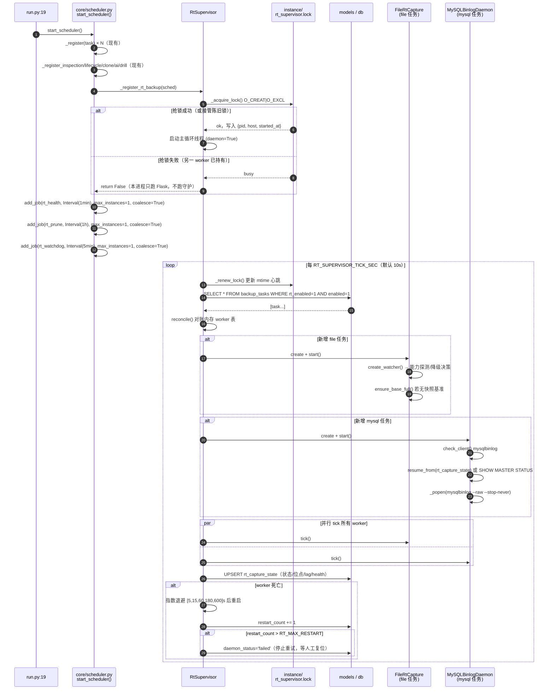
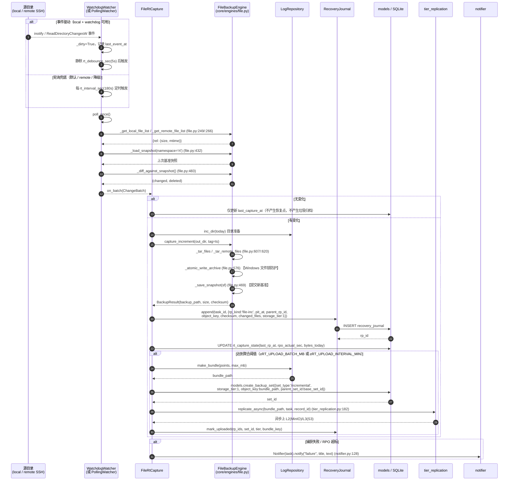
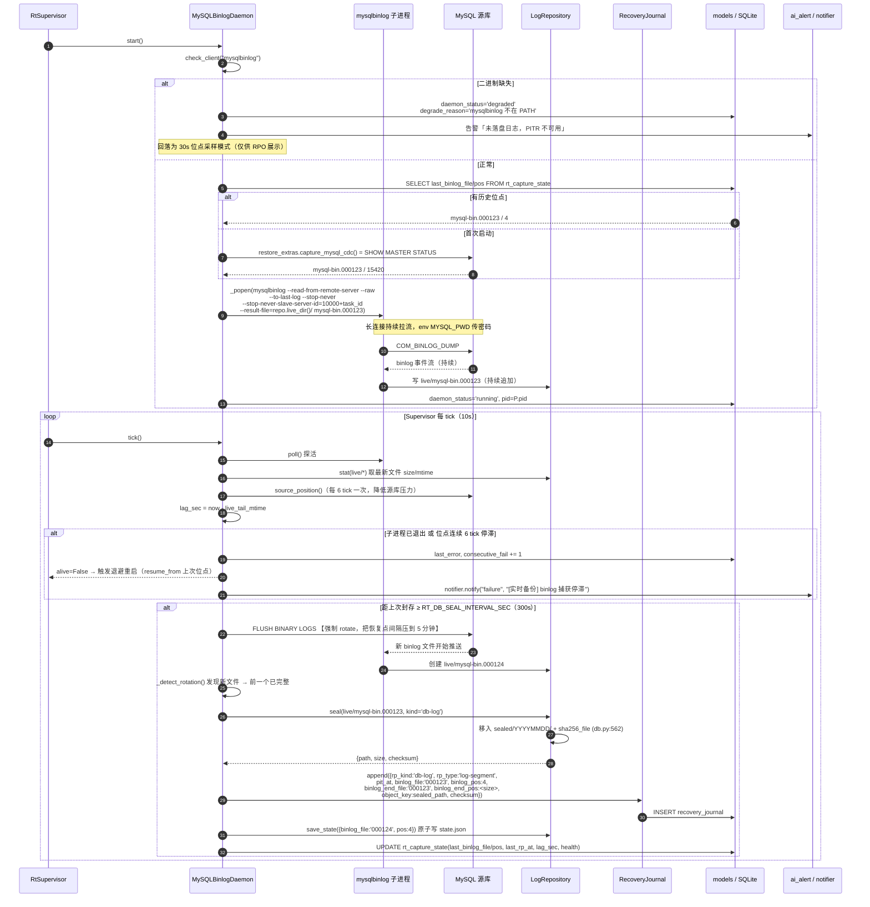
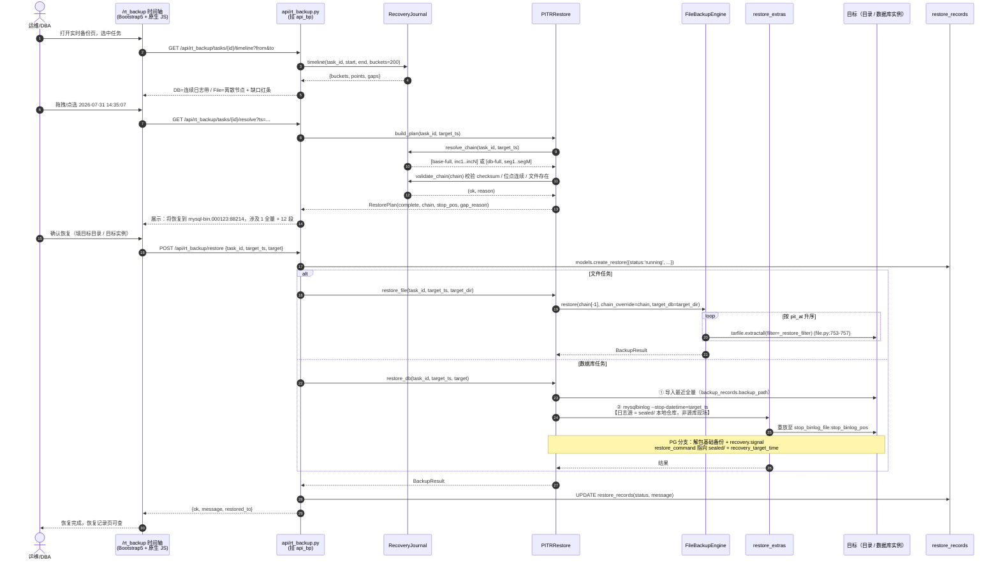
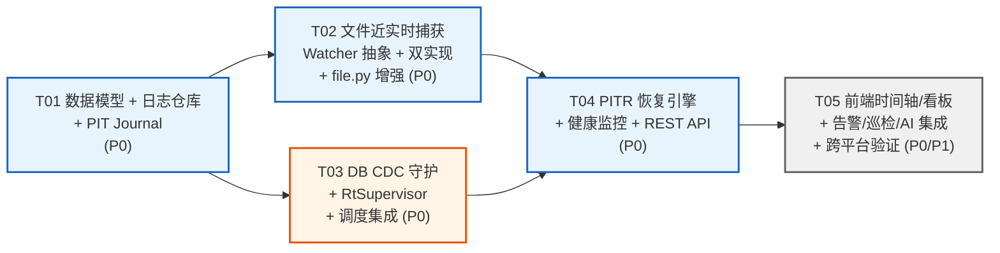

# 准 CDP 实时备份系统设计（数据库 + 文件，跨 Windows/Linux）

> 文档类型：系统架构设计 + 任务分解
> 作者：高见远（架构师）
> 关联输入：`docs/rt-backup-prd.md`（主输入）、`docs/cdp-vm-clone-research.md`（设计哲学借鉴）
> 目标读者：Engineer（实现）、产品、运维
> 项目代号：`rt_backup_db_file`
> 平台现状：Python 3.14.3 + Flask + SQLite + Bootstrap 5 + jQuery/原生 JS + APScheduler

---

## 0. 执行摘要（TL;DR）

| 项 | 结论 |
|---|---|
| **落地形态** | **准 CDP**：DB = 日志流持续捕获（秒级 RPO）；File = 变更跟踪 + 高频增量（分钟级 RPO）。**不做 VM 级 CDP，不做 IO 级真 CDP。** |
| **核心新增** | `core/cdc/`（DB 日志守护）、`core/rt_backup/`（实时编排 + 日志仓库 + PIT Journal + PITR）、`api/rt_backup.py`、`templates/rt_backup.html` |
| **进程模型** | 新增 **`RtSupervisor` 常驻守护线程**（区别于 APScheduler interval 任务），由 `scheduler.start_scheduler()` 拉起；DB 日志捕获走 **子进程**（`mysqlbinlog --stop-never` / `pg_receivewal`），文件捕获走 **线程**（轮询兜底 + watchdog 加速） |
| **正确性底座** | **事件驱动只做"触发器"，不做"真值源"** —— 无论 inotify/RDCW 还是轮询，最终差异一律由现有 `FileBackupEngine._diff_against_snapshot()`（`core/engines/file.py:483`）计算，**杜绝事件丢失导致的静默漏备** |
| **PIT 索引** | 新增 `recovery_journal` 表（恢复点日志）+ `rt_capture_state` 表（守护状态/位点），**不新建平行的备份集体系**，产物仍登记 `backup_records` + `backup_sets` 三级存储 |
| **零新增强依赖** | `watchdog` 为**可选加速**依赖，缺失自动降级为高频轮询；`mysqlbinlog`/`pg_receivewal` 为**外部二进制**，不 pip 安装，缺失时降级为"高频 SHOW MASTER STATUS 位点采样 + 定期全量" |
| **最大风险** | ①Flask 多 worker（gunicorn -w N）下守护进程重复启动 → 单实例文件锁；②高频小日志段对 SQLite/对象存储的写放大 → 本地缓冲 + 周期聚合上云；③`mysqlbinlog --stop-never` 的静默断流 → 心跳 + 位点前进双重探活 |

---

## 1. 实现方案与框架选型

### 1.1 沿用的既有技术栈（不引入新框架）

| 层 | 技术 | 复用点（含文件:行号） |
|---|---|---|
| Web | Flask + `api_bp` 单蓝图 | `api/__init__.py:5` 创建 `api_bp`，`:7` 汇总导入 —— **新模块只 `from . import api_bp` 挂路由，禁止新建 Blueprint** |
| 元数据 | SQLite + `SCHEMA` 常量 + `ALTER TABLE` 轻量迁移 | `core/db.py:28` SCHEMA、`:389` `init_schema()` 的 try/ALTER 迁移模式、`:26` `_write_lock`、`:479` `execute()` / `:490` `query()` |
| 调度 | APScheduler `BackgroundScheduler` | `core/scheduler.py:639` `start_scheduler()`、`:662` `reload_scheduler()`、`:455/:499/:531/:565/:605` 五个 `_register_xxx(sched)` 范式 |
| 引擎 | `BackupEngine` + `ENGINE_REGISTRY` | `core/engines/base.py:65`、`core/engines/__init__.py:31` |
| 文件增量 | 快照基准 + diff + 原子写 + 恢复链 | `core/engines/file.py:423/432/451/469/483/576/607/620/773` |
| DB 位点 | `BackupResult.binlog_file/binlog_pos/wal_lsn` | `core/engines/base.py:57-59`；写库 `core/models.py:711` `update_record_cdc()`；采集 `core/restore_extras.py:34` `capture_mysql_cdc()` / `:56` `capture_pg_cdc()` |
| 三级存储 | `backup_sets` + `tier_replication` | `core/db.py:273` 表结构、`core/models.py:375` `create_backup_set()`、`core/tier_replication.py:182` `replicate_async()` |
| 告警 | `Notifier` / `AIPredictor` | `core/notifier.py:128` `notify(event,title,text,html)`、`core/ai_alert.py:377` `run_all_checks()` |
| 巡检 | `run_inspection` | `core/inspection.py:24` `_inspect_file_task()`、`:128` `_inspect_one()`、`:161` `run_inspection()` |
| 前端 | Bootstrap 5 + 原生 JS 单文件 | `templates/base.html:23-48` 侧边栏、`:210` `app.js?v=` 版本号；`static/js/app.js:56` `api()` 助手、`:2035-2060` `page ===` 分发 |

### 1.2 新增机制一：数据库日志持续捕获（CDC 守护）

#### 1.2.1 为什么必须是常驻守护，而不是 APScheduler interval 任务

| 维度 | APScheduler interval（不可行） | 常驻守护子进程（本方案） |
|---|---|---|
| 连接模型 | 每次 tick 建连 → dump → 断连，binlog 流被反复切断 | 一条长连接持续 `--stop-never` 拉流 |
| RPO | ≥ interval（分钟级） | 秒级（受网络与 flush 影响，≤30s） |
| 位点连续性 | 每轮需重新定位，易漏/重 | 服务端连续推送，位点自然前进 |
| 资源 | 反复起进程，开销大 | 单进程常驻，内存 <30MB |
| 现状约束 | `core/scheduler.py:622-629` 的 `_register()` **未设置 `max_instances`/`coalesce`**，高频 interval 会叠加执行 | 不受影响 |

> ⚠️ **给 Engineer 的现状提醒**：`core/scheduler.py:627` 的 `sched.add_job(...)` 目前只有 `misfire_grace_time=3600`，**没有 `max_instances=1` 与 `coalesce=True`**。本方案新增的所有周期 job（`rt_health`、`rt_prune`、`rt_supervisor_watchdog`）**必须显式带上这两个参数**，否则高频下会叠加实例、竞争日志仓库目录。

#### 1.2.2 MySQL / MariaDB：`mysqlbinlog` 持续拉流

```bash
mysqlbinlog \
  --read-from-remote-server \
  --host=<host> --port=<port> --user=<user> \
  --raw \
  --to-last-log \
  --stop-never \
  --stop-never-slave-server-id=<10000+task_id> \
  --result-file=<RT_LOG_ROOT>/<task_id>/live/ \
  <start_binlog_file>
```

| 要点 | 说明 |
|---|---|
| 密码 | 走环境变量 `MYSQL_PWD`，**不进命令行**（与 `core/restore_extras.py:44` 现有做法一致） |
| 起始位点 | 优先 `rt_capture_state.last_binlog_file`；为空时调用现有 `restore_extras.capture_mysql_cdc()`（`core/restore_extras.py:34`，即 `SHOW MASTER STATUS`）取当前位点作为起点 |
| `--raw` 语义 | 在 `result-file` 目录下**按源端 binlog 同名**逐个写文件。**当新文件出现（rotate）时，上一个文件即已完整** → 触发"封存(seal)" |
| 位点前进探测 | 读 `live/` 下最新文件的 `size` 与 `mtime`：size 增长 = 位点前进；连续 `RT_STALL_TICKS`（默认 6 tick = 60s）不增长且源端 `SHOW MASTER STATUS` 已前进 → 判定**停滞**，触发告警 + 重启 |
| 有界封存 | 后台每 `RT_DB_SEAL_INTERVAL_SEC`（默认 300s）对源库执行一次 `FLUSH BINARY LOGS`，强制 rotate。**这是把"已入库可恢复点"间隔从"源库自然轮转（可能数小时）"压到 5 分钟的关键**；热区 tail 文件同时按 mtime 参与 RPO 计算 |
| 权限 | `REPLICATION SLAVE`、`REPLICATION CLIENT`（+ `RELOAD` 用于 `FLUSH BINARY LOGS`） |
| 崩溃续传 | 子进程退出 → Supervisor 读 `rt_capture_state.last_binlog_file/pos` + `repo/state.json` 双写位点 → 从该 binlog 文件重新起流（`--raw` 会覆盖同名未封存文件，天然幂等） |
| 降级 | `mysqlbinlog` 不在 PATH → `daemon_status='degraded'`，回落为 **APScheduler 30s 间隔的位点采样**（只更新 `binlog_pos` 供 RPO 展示，不落日志段），并明确告警"未落盘日志，PITR 不可用" |

#### 1.2.3 PostgreSQL：`pg_receivewal` 持续 WAL shipping

```bash
pg_receivewal -h <host> -p <port> -U <user> \
  -D <RT_LOG_ROOT>/<task_id>/live/ \
  --slot=rtbk_<task_id> --create-slot --if-not-exists \
  --no-loop -v
```

| 要点 | 说明 |
|---|---|
| 密码 | 环境变量 `PGPASSWORD`（与 `core/restore_extras.py:61` 一致） |
| 段封存 | 写入中的段带 `.partial` 后缀；**`.partial` 消失 = 16MB 段完成** → 封存 |
| 复制槽 | 用 `--slot` 保证源库不提前清理 WAL；**槽会导致源库 WAL 堆积**，必须配套"槽滞后监控 + 任务删除时 `pg_drop_replication_slot`" |
| 位点 | 段文件名 → LSN；同时用现有 `restore_extras.capture_pg_cdc()`（`core/restore_extras.py:56`，`pg_current_wal_lsn()`）采源端 LSN 算延迟 |
| 源库前置 | `wal_level >= replica`、`max_wal_senders > 0`、`max_replication_slots > 0` |
| 降级 | `pg_receivewal` 缺失 → 回落"`archive_command` 归档目录轮询搬运"模式（`rt_pg_mode='archive_poll'`，源库需自行配 `archive_command` 落到共享目录），再不可用则同 MySQL 降级为位点采样 |

#### 1.2.4 守护进程在 Flask 进程内的生命周期

```
run.py:19  scheduler.start_scheduler()
              └─> core/scheduler.py:_register_rt_backup(sched)     【新增】
                     ├─ rt_backup.supervisor.get_supervisor().start()   # 常驻线程
                     ├─ sched.add_job(_rt_health_wrapper,   Interval(minutes=1), max_instances=1, coalesce=True)
                     ├─ sched.add_job(_rt_prune_wrapper,    Interval(hours=1),   max_instances=1, coalesce=True)
                     └─ sched.add_job(_rt_watchdog_wrapper, Interval(minutes=5), max_instances=1, coalesce=True)
```

| 关注点 | 设计 |
|---|---|
| **单实例保证** | `instance/rt_supervisor.lock`：`os.open(path, O_CREAT\|O_EXCL\|O_RDWR)` 抢锁，写入 `{pid, host, started_at}`；持有者每 tick 更新 mtime 作心跳。抢锁失败时若 mtime 超 `3×tick` 视为陈旧锁并接管。**纯 `os` 实现，不用 `fcntl`(仅 Linux)/`msvcrt`(仅 Windows)，跨平台一致** |
| **为何需要** | `run.py:19` 单进程下没问题，但 `gunicorn -w 2 run:app`（README 建议用法）会起多 worker；且 `api/inspection.py:48` 也会调 `start_scheduler()` |
| **线程模型** | Supervisor 主循环 = 1 个 `threading.Thread(daemon=True)`；每个文件任务 1 个 watcher 线程 + 1 个 flush 线程；每个 DB 任务 1 个 `subprocess.Popen` + 1 个 stderr 读取线程 |
| **优雅停止** | `stop_scheduler()`（`core/scheduler.py:680`）内追加 `get_supervisor().stop(timeout=15)`；worker 收 `threading.Event`，子进程先 `terminate()` 等 5s 再 `kill()` |
| **异常隔离** | 每个 worker 的 tick 全包 `try/except`，单任务失败不拖垮 Supervisor；连续失败 `RT_MAX_RESTART`（默认 5）次后置 `daemon_status='failed'` 并停止重试，等人工/API 复位 |
| **DEMO 兜底** | `config.DEMO_MODE == "on"` 或 `task.demo_only` → 使用 `SimulatedCDCDaemon`，按固定节奏伪造位点前进与 journal 行，保证无真实库也能演示时间轴（沿用 `core/engines/base.py:117` `_should_simulate()` 语义） |

#### 1.2.5 Windows / Linux 差异封装

| 差异点 | Windows | Linux | 封装位置 |
|---|---|---|---|
| 子进程创建 | `creationflags=CREATE_NO_WINDOW \| CREATE_NEW_PROCESS_GROUP` | `start_new_session=True` | `core/cdc/base.py::CDCDaemon._popen()` |
| 子进程终止 | `proc.terminate()`（TerminateProcess） | `os.killpg(os.getpgid(pid), SIGTERM)` → `SIGKILL` | `core/cdc/base.py::CDCDaemon._kill()` |
| 客户端二进制 | `mysqlbinlog.exe` / `pg_receivewal.exe`，`shutil.which()` 探测 | 同名无后缀 | `core/cdc/base.py::CDCDaemon.check_client()`（沿用 `core/engines/base.py:111` 写法） |
| 文件事件 API | `ReadDirectoryChangesW`（`watchdog.observers.read_directory_changes`） | `inotify`（`watchdog.observers.inotify`） | `core/rt_backup/watchers/watchdog_watcher.py` |
| 事件上限 | 无（但监控目录数受句柄限制） | `fs.inotify.max_user_watches` 默认 8192，大目录需调大 | 启动自检 + 超限自动降级 polling |
| 路径 | `\` → 统一 `os.path.join` + 写盘前 `.replace("\\","/")` 归一化 | `/` | 复用 `core/engines/file.py:43` 已有做法 |
| 文件被占用 | 防病毒/索引器锁文件 → 必须原子写 | 罕见 | 复用 `core/engines/file.py:576` `_atomic_write_archive()` |
| 一致性快照 | VSS 卷影（P1，`vssadmin`/`diskshadow`） | LVM 快照 / `fsfreeze`（P1） | `core/rt_backup/consistency.py`（P1，本期留接口 `ConsistencyHook`） |

### 1.3 新增机制二：文件近实时变更捕获

#### 1.3.1 核心设计原则：事件是触发器，快照 diff 是真值源

```
        ┌──── 事件驱动（可选加速，watchdog）────┐
源目录 ─┤                                        ├─► 脏标记 dirty=True ─► 去抖 ─┐
        └──── 高频轮询（默认兜底，必选）────────┘                             │
                                                                              ▼
                                              _get_local_file_list / _get_remote_file_list
                                                          （file.py:249 / :266）
                                                                              │
                                                                              ▼
                                              FileBackupEngine._diff_against_snapshot()
                                                          （file.py:483）
                                                                              │
                                                            changed / deleted ▼
                                              _tar_files / _tar_remote_files（file.py:607/:620）
                                                    经 _atomic_write_archive（file.py:576）
                                                                              │
                                                                              ▼
                                              _save_snapshot（file.py:469）+ journal.append()
```

**这样设计的三个理由**：
1. inotify 队列溢出（`IN_Q_OVERFLOW`）、RDCW 缓冲区溢出、网络挂载不产生事件 —— 事件**天然不可靠**；
2. 远程 SSH 源（`source_type=remote`，`core/engines/file.py:266`）根本没有本地事件源，只能轮询；
3. 复用现有 diff 逻辑，**增量归档格式与恢复链 100% 兼容现有 `restore()`（file.py:720）与 `_build_restore_chain()`（file.py:773）**，不产生第二套格式。

#### 1.3.2 `FileChangeWatcher` 抽象与实现矩阵

| 实现 | 平台 | 源类型 | 依赖 | 触发方式 | 默认 |
|---|---|---|---|---|---|
| `PollingWatcher` | Windows + Linux | local + **remote(SSH)** | 无（标准库 + 已有 paramiko） | 定时 tick（`rt_interval_sec`，默认 180s） | ✅ **默认兜底** |
| `WatchdogWatcher` | Windows(RDCW) + Linux(inotify) | 仅 local | `watchdog>=4.0`（可选） | 事件 → 脏标记 → 去抖 `rt_debounce_sec`(5s) 后 flush；同时 `rt_interval_sec` 强制 flush 上限 | 可选加速 |

**选择策略**（`core/rt_backup/watchers/__init__.py::create_watcher()`）：

```
mode = task.rt_mode  ∈ {auto, polling, watchdog}
auto:
   source_type == 'remote'      → PollingWatcher（远程无事件源）
   watchdog 不可导入            → PollingWatcher + degrade_reason='watchdog 未安装'
   Linux 且监控目录数 > max_user_watches*0.8 → PollingWatcher + degrade_reason='inotify watch 不足'
   否则                         → WatchdogWatcher（内部仍持有 PollingWatcher 作强制 flush 兜底）
```

> 降级不是失败：`rt_capture_state.watcher_impl` 记录实际实现，UI 用灰色徽标显示"轮询模式"，并在 tooltip 给出降级原因。

#### 1.3.3 对 `core/engines/file.py` 的增强（非重写）

| 增强 | 位置 | 说明 |
|---|---|---|
| 快照命名空间隔离 | `_snapshot_path()`（`file.py:423`） | 现按"源配置 md5"共享基准。实时任务与普通任务**必须隔离**，否则实时高频 `_save_snapshot()` 会污染普通增量任务的基准 → 增加 `rt` 子目录：`storage_root/file_snapshots/rt/<md5>/snapshot.json`，由新增参数 `namespace: str = ""` 控制 |
| 暴露单次增量 | 新增 `capture_increment(out_dir, tag) -> BackupResult` | 抽取 `_incremental_transfer()`（`file.py:500`）主体，**不改其行为**，供 `FileRtCapture` 直接调用，避免重复实现 diff/打包/快照保存 |
| 基准全量 | 新增 `ensure_base_full() -> BackupResult` | 无快照时先做一次全量（内部即 `_full_transfer()`，`file.py:357`），并把 `last_full_path` 写入快照 meta（`file.py:474-477` 已支持） |
| 恢复链可注入 | `_build_restore_chain()`（`file.py:773`） | 增加可选参数 `chain_override: List[str] = None`；`PITRRestore` 传入由 journal 解析出的精确链，绕开对 `backup_records` 的模糊扫描（现实现 `file.py:836` 的 `LIMIT 200` 在高频场景会漏项） |

### 1.4 新增机制三：PIT 恢复点日志（Recovery Journal）

**为什么新建 `recovery_journal` 而不是复用 `backup_sets`**：

| 维度 | `backup_sets`（`core/db.py:273`） | `recovery_journal`（新增） |
|---|---|---|
| 语义 | **存储对象**：一份产物在哪个 Tier、去重、链头 | **时间点**：某时刻可恢复到什么状态、位点是多少 |
| 主键序 | 按 id | 按 `(task_id, pit_at, pit_seq)` —— 时间轴的一等公民 |
| 位点字段 | 无 `binlog_pos`/`wal_lsn` | 有，PITR 精度依赖它 |
| 生命周期 | 由 `lifecycle` 按容量/年龄流转 | 由 `rt_log_retention_days` 独立 prune（日志段保留窗口远短于全量） |
| 写入频率 | 每次备份任务一条 | **每 5 分钟一条**（日志段）+ 每 3 分钟一条（文件增量），量级高 1~2 个数量级 |

**二者是 1:1 或 1:0 关联，不是替代**：每条 journal 行通过 `set_id` 指向其 `backup_sets` 行（若已上三级存储），通过 `record_id` 指向 `backup_records`（若走了完整备份流程）。**日志段这类高频小产物默认只写 journal + 本地仓库，聚合成 bundle 后才登记 `backup_sets` 并上云**，避免 `backup_sets` 表爆炸。

---

## 2. 文件列表及相对路径

> 路径相对 `E:\备份管理平台\backup_platform`。**新增 18 个文件，修改 9 个文件。**

```
backup_platform/
├── core/
│   ├── cdc/                                   【新增子包：数据库日志持续捕获】
│   │   ├── __init__.py                        # CDC_REGISTRY + get_cdc_daemon(db_type) 惰性工厂
│   │   ├── base.py                            # CDCDaemon 抽象：子进程管理/跨平台 kill/位点续传/探活
│   │   ├── mysql_binlog.py                    # MySQLBinlogDaemon（mysqlbinlog --raw --stop-never）
│   │   ├── pg_wal.py                          # PgWalDaemon（pg_receivewal / archive_poll 双模式）
│   │   └── simulated.py                       # SimulatedCDCDaemon（DEMO_MODE 兜底，伪造位点前进）
│   │
│   ├── rt_backup/                             【新增子包：实时备份编排】
│   │   ├── __init__.py                        # 门面：start/stop/status/trigger_now
│   │   ├── types.py                           # dataclass: RtConfig/ChangeBatch/RecoveryPoint/RtHealth/RestorePlan
│   │   ├── repo.py                            # LogRepository：日志仓库布局/封存/校验/聚合 bundle/prune
│   │   ├── journal.py                         # RecoveryJournal：PIT 日志读写/链解析/最近点查询/prune
│   │   ├── supervisor.py                      # RtSupervisor：常驻守护 + 单实例锁 + worker 生命周期
│   │   ├── file_rt.py                         # FileRtCapture：watcher → 增量归档 → journal
│   │   ├── pitr.py                            # PITRRestore：按时间点解析恢复计划并执行（DB/File）
│   │   ├── health.py                          # RtHealthMonitor：RPO 计算/健康灯/告警派发
│   │   └── watchers/
│   │       ├── __init__.py                    # create_watcher() 工厂 + 能力探测 + 降级决策
│   │       ├── base.py                        # FileChangeWatcher 抽象基类
│   │       ├── polling.py                     # PollingWatcher（默认兜底，支持 local + remote）
│   │       └── watchdog_watcher.py            # WatchdogWatcher（inotify / ReadDirectoryChangesW）
│   │
│   ├── db.py                                  【修改】SCHEMA 追加 2 表 + backup_tasks 追加 6 列迁移
│   ├── models.py                              【修改】追加 journal / rt_state 两组 CRUD
│   ├── scheduler.py                           【修改】_register_rt_backup + 3 个周期 job + stop 钩子
│   ├── engines/file.py                        【修改】快照命名空间 / capture_increment / ensure_base_full / chain_override
│   ├── inspection.py                          【修改】_inspect_rt_task() 并入 _inspect_one()
│   └── ai_alert.py                            【修改】analyze_rt_capture_risk() 并入 run_all_checks()
│
├── api/
│   ├── __init__.py                            【修改】第 7 行导入列表追加 rt_backup
│   └── rt_backup.py                           【新增】REST API（挂 api_bp，见 §5）
│
├── templates/
│   ├── rt_backup.html                         【新增】实时备份健康看板 + 恢复点时间轴 + 配置模态框
│   └── base.html                              【修改】侧边栏"备份管理"组下新增入口；app.js 版本号 +1
│
├── static/js/app.js                           【修改】新增 initRtBackup() + 时间轴渲染 + 分发分支
│
├── app.py                                     【修改】新增 /rt_backup 页面路由
├── config.py                                  【修改】新增 RT_* 配置项（见 §7.1）
├── requirements.txt                           【修改】新增可选依赖 watchdog
│
└── tests/
    ├── test_rt_journal.py                     【新增】journal 链解析 / 最近点 / prune 单测
    ├── test_rt_watcher.py                     【新增】watcher 契约测试（polling 必过，watchdog 可跳过）
    └── test_rt_pitr.py                        【新增】文件 PITR 端到端（临时目录造数据）
```

---

## 3. 数据结构与接口

### 3.1 数据库 Schema 变更

追加到 `core/db.py` 的 `SCHEMA` 常量（`core/db.py:28-377` 之间，紧随 `backup_sets` 之后）：

```sql
-- ① PIT 恢复点日志（Recovery Journal）—— 准 CDP 的核心索引
CREATE TABLE IF NOT EXISTS recovery_journal (
    id             INTEGER PRIMARY KEY AUTOINCREMENT,
    task_id        INTEGER NOT NULL,                  -- → backup_tasks.id
    record_id      INTEGER,                           -- → backup_records.id（可空，日志段默认不建 record）
    set_id         INTEGER,                           -- → backup_sets.id（上云后回填）
    parent_rp_id   INTEGER,                           -- 增量链父节点；NULL = 链头（base-full）
    rp_kind        TEXT NOT NULL DEFAULT 'file-inc',  -- base-full | file-inc | db-log | db-full
    rp_type        TEXT DEFAULT 'incremental',        -- full | incremental | log-segment
    pit_at         TEXT NOT NULL,                     -- 恢复点时刻 ISO8601（db.now_iso()）
    pit_seq        INTEGER DEFAULT 0,                 -- 同秒内序号，与 pit_at 共同唯一定位
    consistency    TEXT DEFAULT 'crash',              -- crash | fs | app
    binlog_file    TEXT,                              -- DB：起始 binlog 文件名
    binlog_pos     INTEGER,                           -- DB：起始位点
    binlog_end_file TEXT,                             -- DB：结束 binlog 文件名（段末）
    binlog_end_pos INTEGER,
    wal_lsn        TEXT,                              -- PG：起始 LSN
    wal_end_lsn    TEXT,                              -- PG：结束 LSN
    file_set_key   TEXT,                              -- File：源配置指纹（同 file.py:_source_config_key）
    changed_files  INTEGER DEFAULT 0,
    deleted_files  INTEGER DEFAULT 0,
    storage_tier   INTEGER DEFAULT 1,                 -- 1=本地 2=MinIO 3=S3（语义同 backup_sets）
    object_key     TEXT NOT NULL,                     -- 本地绝对路径 或 对象键
    bundle_key     TEXT,                              -- 聚合上云后所属 bundle 的 object_key
    size_bytes     INTEGER DEFAULT 0,
    checksum       TEXT,                              -- sha256（db.sha256_file）
    verified       INTEGER DEFAULT 0,
    verify_msg     TEXT,
    is_simulated   INTEGER DEFAULT 0,
    message        TEXT,
    expires_at     TEXT,                              -- 保留策略到期时间
    created_at     TEXT
);
CREATE INDEX IF NOT EXISTS idx_rj_task_time ON recovery_journal(task_id, pit_at DESC);
CREATE INDEX IF NOT EXISTS idx_rj_kind      ON recovery_journal(task_id, rp_kind, pit_at DESC);
CREATE UNIQUE INDEX IF NOT EXISTS idx_rj_obj ON recovery_journal(task_id, object_key);

-- ② 实时捕获运行态（每任务一行，Supervisor 高频更新）
CREATE TABLE IF NOT EXISTS rt_capture_state (
    task_id            INTEGER PRIMARY KEY,           -- → backup_tasks.id
    capture_kind       TEXT,                          -- db-log | file
    engine             TEXT,                          -- mysql | mariadb | postgresql | file
    daemon_status      TEXT DEFAULT 'stopped',        -- stopped|starting|running|degraded|failed
    degrade_reason     TEXT,
    pid                INTEGER,                       -- DB 守护子进程 pid（file 为 NULL）
    watcher_impl       TEXT,                          -- polling | watchdog（file 专用）
    last_heartbeat_at  TEXT,
    last_capture_at    TEXT,                          -- 最近一次成功捕获
    last_rp_at         TEXT,                          -- 最近一个 journal 恢复点时刻
    last_binlog_file   TEXT,
    last_binlog_pos    INTEGER,
    last_wal_lsn       TEXT,
    source_pos_at      TEXT,                          -- 最近一次探测到的源端位点时刻（算延迟用）
    lag_sec            INTEGER DEFAULT 0,             -- 捕获延迟
    rpo_actual_sec     INTEGER DEFAULT 0,             -- now - last_rp_at
    health             TEXT DEFAULT 'unknown',        -- green | yellow | red | unknown
    consecutive_fail   INTEGER DEFAULT 0,
    restart_count      INTEGER DEFAULT 0,
    bytes_today        INTEGER DEFAULT 0,
    rp_count_today     INTEGER DEFAULT 0,
    last_error         TEXT,
    updated_at         TEXT
);
```

`backup_tasks` 追加列（写在 `core/db.py:389 init_schema()` 内，沿用 `:419-429` 的 `for col, typedef` + try/ALTER 迁移写法）：

| 列名 | 类型 | 默认 | 说明 |
|---|---|---|---|
| `rt_enabled` | INTEGER | 0 | 实时保护总开关 |
| `rt_mode` | TEXT | `'auto'` | 文件：auto/polling/watchdog；DB：auto/stream/archive_poll/sample |
| `rt_interval_sec` | INTEGER | 180 | 文件强制 flush 上限（秒）；DB 为封存间隔 |
| `rt_consistency` | TEXT | `'crash'` | crash / fs / app |
| `rt_log_retention_days` | INTEGER | 7 | 日志段/增量的 journal 保留窗口 |
| `rt_rpo_target_sec` | INTEGER | NULL | 每任务 RPO 目标覆盖；NULL 用全局默认 |

> 已有 `protection_level` / `rpo_target_min` / `rto_target_min`（`core/db.py:419-425` 已迁移）继续复用，`rt_rpo_target_sec` 仅作**秒级精度覆盖**。

### 3.2 类图

```mermaid
classDiagram
    %% ================= 现有平台（复用，不改契约） =================
    class BackupEngine {
        <<existing>>
        +str db_type
        +str adapter_tier
        +backup(backup_type) BackupResult
        +restore(backup_path, **kwargs) BackupResult
        +check_client() tuple
        +_should_simulate() tuple
    }
    class FileBackupEngine {
        <<existing, enhanced>>
        +str db_type = "file"
        +_snapshot_path(namespace) str
        +_load_snapshot() dict
        +_save_snapshot(snapshot, full_path) None
        +_diff_against_snapshot(sf, snap) tuple
        +_atomic_write_archive(writer, path) None
        +_build_restore_chain(path, chain_override) list
        +capture_increment(out_dir, tag) BackupResult
        +ensure_base_full() BackupResult
    }
    class BackupResult {
        <<existing dataclass>>
        +bool success
        +str backup_path
        +int size_bytes
        +str checksum
        +str binlog_file
        +int binlog_pos
        +str wal_lsn
    }

    %% ================= 数据类型 core/rt_backup/types.py =================
    class RtConfig {
        <<dataclass>>
        +int task_id
        +str capture_kind
        +str engine
        +bool enabled
        +str mode
        +int interval_sec
        +int debounce_sec
        +str consistency
        +int rpo_target_sec
        +int log_retention_days
        +from_task(task)$ RtConfig
    }
    class ChangeBatch {
        <<dataclass>>
        +str detected_at
        +List~str~ changed
        +List~str~ deleted
        +int total_files
        +str trigger
        +bool is_empty()
    }
    class RecoveryPoint {
        <<dataclass>>
        +int id
        +int task_id
        +int parent_rp_id
        +str rp_kind
        +str rp_type
        +str pit_at
        +int pit_seq
        +str consistency
        +str binlog_file
        +int binlog_pos
        +str wal_lsn
        +str object_key
        +int size_bytes
        +str checksum
        +int storage_tier
    }
    class RtHealth {
        <<dataclass>>
        +int task_id
        +str daemon_status
        +str health
        +int lag_sec
        +int rpo_actual_sec
        +int rpo_target_sec
        +str last_rp_at
        +str position_label
        +bool is_breach()
    }
    class RestorePlan {
        <<dataclass>>
        +int task_id
        +str kind
        +str target_ts
        +RecoveryPoint base_point
        +List~RecoveryPoint~ chain
        +List~str~ archives
        +str stop_binlog_file
        +int stop_binlog_pos
        +str stop_lsn
        +bool complete
        +str gap_reason
    }

    %% ================= 文件变更捕获 =================
    class FileChangeWatcher {
        <<abstract>>
        +str impl_key
        +str display_name
        +List~str~ required_packages
        +is_available(source_cfg)$ tuple
        +__init__(task, rt_config, on_batch, logger)
        +start() None
        +stop(timeout) None
        +is_alive() bool
        +poll_once() ChangeBatch
        +request_flush(reason) None
        +stats() dict
    }
    class PollingWatcher {
        +str impl_key = "polling"
        -Thread _thread
        -Event _stop
        -FileBackupEngine _engine
        +poll_once() ChangeBatch
        -_loop() None
        -_list_source() dict
    }
    class WatchdogWatcher {
        +str impl_key = "watchdog"
        -Observer _observer
        -PollingWatcher _fallback
        -bool _dirty
        -float _last_event_at
        +poll_once() ChangeBatch
        -_on_any_event(event) None
        -_debounce_loop() None
    }
    class WatcherFactory {
        <<module watchers/__init__>>
        +create_watcher(task, rt_config, on_batch, logger)$ FileChangeWatcher
        +probe_capabilities()$ dict
    }

    %% ================= DB 日志捕获 =================
    class CDCDaemon {
        <<abstract>>
        +str engine_key
        +str display_name
        +List~str~ required_clients
        +__init__(task, rt_config, repo, logger)
        +check_client() tuple
        +start() bool
        +stop(timeout) None
        +is_alive() bool
        +tick() dict
        +current_position() dict
        +source_position() dict
        +seal_ready_segments() List~dict~
        +resume_from(state) None
        #_popen(cmd, env, cwd) Popen
        #_kill(proc, timeout) None
    }
    class MySQLBinlogDaemon {
        +str engine_key = "mysql"
        +List~str~ required_clients = ["mysqlbinlog"]
        -Popen _proc
        -str _start_file
        +seal_ready_segments() List~dict~
        -_build_cmd() List~str~
        -_flush_binary_logs() bool
        -_detect_rotation() List~str~
    }
    class PgWalDaemon {
        +str engine_key = "postgresql"
        +List~str~ required_clients = ["pg_receivewal"]
        -Popen _proc
        -str _slot_name
        +seal_ready_segments() List~dict~
        -_ensure_slot() bool
        -_drop_slot() bool
        -_scan_partial() List~str~
    }
    class SimulatedCDCDaemon {
        +str engine_key = "simulated"
        +note : DEMO_MODE 伪造位点前进
    }

    %% ================= 编排与服务 =================
    class LogRepository {
        +__init__(task_id, root)
        +live_dir() str
        +sealed_dir(day) str
        +base_dir() str
        +inc_dir(day) str
        +seal(src_path, kind) dict
        +save_state(state) None
        +load_state() dict
        +make_bundle(points, max_mb) dict
        +disk_usage() dict
        +prune(before_ts) int
    }
    class RecoveryJournal {
        +append(task_id, point) RecoveryPoint
        +list_points(task_id, start, end, kind, limit) List~RecoveryPoint~
        +latest(task_id, kind) RecoveryPoint
        +nearest_before(task_id, target_ts, kind) RecoveryPoint
        +resolve_chain(task_id, target_ts) List~RecoveryPoint~
        +validate_chain(chain) tuple
        +mark_uploaded(rp_id, set_id, tier, bundle_key) None
        +mark_verified(rp_id, ok, msg) None
        +prune(task_id, retention_days) int
        +timeline(task_id, start, end, buckets) dict
    }
    class FileRtCapture {
        +__init__(task, rt_config, repo, journal, logger)
        +start() bool
        +stop(timeout) None
        +is_alive() bool
        +tick() dict
        +flush_now(reason) RecoveryPoint
        -_on_batch(batch) None
        -_ensure_base() RecoveryPoint
    }
    class RtSupervisor {
        <<singleton>>
        +start() bool
        +stop(timeout) None
        +is_running() bool
        +reconcile() dict
        +status() dict
        +status_of(task_id) RtHealth
        +trigger_now(task_id, reason) dict
        +restart_worker(task_id) dict
        -_acquire_lock() bool
        -_renew_lock() None
        -_loop() None
        -_spawn_worker(task) object
    }
    class RtHealthMonitor {
        +check_all() list
        +check_task(task_id) RtHealth
        +compute_rpo(task_id) int
        -_notify_breach(task, health) None
        -_record_ai_metric(task, health) None
    }
    class PITRRestore {
        +__init__(logger)
        +list_points(task_id, start, end) list
        +build_plan(task_id, target_ts) RestorePlan
        +restore_file(task_id, target_ts, target_dir, **kw) BackupResult
        +restore_db(task_id, target_ts, target, **kw) BackupResult
        -_apply_file_chain(plan, target_dir) BackupResult
        -_replay_mysql(plan, target) BackupResult
        -_replay_pg(plan, target) BackupResult
    }

    %% ================= 关系 =================
    BackupEngine <|-- FileBackupEngine
    FileBackupEngine ..> BackupResult : returns

    FileChangeWatcher <|-- PollingWatcher
    FileChangeWatcher <|-- WatchdogWatcher
    WatchdogWatcher o-- PollingWatcher : fallback flush
    WatcherFactory ..> FileChangeWatcher : creates
    FileChangeWatcher ..> ChangeBatch : emits

    CDCDaemon <|-- MySQLBinlogDaemon
    CDCDaemon <|-- PgWalDaemon
    CDCDaemon <|-- SimulatedCDCDaemon

    RtSupervisor o-- FileRtCapture : manages
    RtSupervisor o-- CDCDaemon : manages
    RtSupervisor ..> RtConfig : reads
    RtSupervisor ..> RtHealth : publishes

    FileRtCapture o-- FileChangeWatcher : uses
    FileRtCapture o-- FileBackupEngine : delegates diff/tar
    FileRtCapture o-- LogRepository : writes
    FileRtCapture o-- RecoveryJournal : appends
    CDCDaemon o-- LogRepository : writes

    RecoveryJournal ..> RecoveryPoint : manages
    PITRRestore o-- RecoveryJournal : queries
    PITRRestore o-- FileBackupEngine : reuses restore
    PITRRestore ..> RestorePlan : builds
    RtHealthMonitor ..> RecoveryJournal : queries
    RtHealthMonitor ..> RtHealth : returns
```



### 3.3 关键方法签名

#### `core/rt_backup/watchers/base.py`

```python
class FileChangeWatcher:
    """文件变更捕获抽象。跨平台统一接口，上层不感知 inotify/RDCW/轮询差异。

    契约：
      1. on_batch(ChangeBatch) 回调必须在独立线程调用，不得阻塞事件源；
      2. 事件仅作触发器，changed/deleted 的最终真值由 poll_once() 内部
         的快照 diff 产生（复用 FileBackupEngine._diff_against_snapshot）；
      3. stop() 必须幂等且在 timeout 内返回，不得留下僵尸线程/句柄。
    """
    impl_key: str = "base"
    display_name: str = ""
    required_packages: list[str] = []

    @classmethod
    def is_available(cls, source_cfg: dict) -> tuple[bool, str]:
        """返回 (可用, 原因)。不可用时 create_watcher 会降级到 polling。"""

    def __init__(self, task: dict, rt_config: "RtConfig",
                 on_batch: "Callable[[ChangeBatch], None]", logger=None) -> None: ...

    def start(self) -> None: ...
    def stop(self, timeout: float = 10.0) -> None: ...
    def is_alive(self) -> bool: ...

    def poll_once(self) -> "ChangeBatch":
        """同步执行一次完整差异计算，返回变更批次。所有实现共用同一真值路径。"""

    def request_flush(self, reason: str = "manual") -> None:
        """请求立即触发一次 poll_once + on_batch（供 API 手动捕获使用）。"""

    def stats(self) -> dict:
        """{'impl','events_seen','polls','last_poll_at','last_batch_size','degrade_reason'}"""
```

#### `core/cdc/base.py`

```python
class CDCDaemon:
    """数据库日志持续捕获守护。以子进程方式常驻，跨平台封装启停。"""
    engine_key: str = "base"
    display_name: str = ""
    required_clients: list[str] = []

    def __init__(self, task: dict, rt_config: "RtConfig",
                 repo: "LogRepository", logger=None) -> None: ...

    def check_client(self) -> tuple[bool, str]:
        """PATH 探测外部二进制（写法同 core/engines/base.py:111）。"""

    def start(self) -> bool:
        """启动子进程。已运行时幂等返回 True。失败返回 False 并置 last_error。"""

    def stop(self, timeout: float = 10.0) -> None:
        """优雅停止：terminate → 等待 → kill。Windows/Linux 分支见 _kill()。"""

    def is_alive(self) -> bool: ...

    def tick(self) -> dict:
        """Supervisor 每 tick 调用一次。职责：
             ① 探活（子进程 + 位点前进双重判定）
             ② 到期触发 seal（FLUSH BINARY LOGS / 扫描 .partial）
             ③ 封存完成的段 → repo.seal() → journal.append()
             ④ 返回 {'alive','lag_sec','position','sealed':[...],'error'}"""

    def current_position(self) -> dict:
        """本地已捕获位点 {'binlog_file','binlog_pos'} 或 {'wal_lsn'}。"""

    def source_position(self) -> dict:
        """源库当前位点（复用 restore_extras.capture_mysql_cdc / capture_pg_cdc）。"""

    def seal_ready_segments(self) -> list[dict]:
        """把 live/ 下已完整的段移入 sealed/，返回 [{'path','size','checksum',
           'binlog_file','binlog_pos','binlog_end_pos'|'wal_lsn','wal_end_lsn'}]。"""

    def resume_from(self, state: dict) -> None:
        """崩溃续传：注入上次位点，下次 start() 从此处起流。"""

    # ---- 跨平台内部实现 ----
    def _popen(self, cmd: list[str], env: dict = None) -> "subprocess.Popen":
        """Windows: CREATE_NO_WINDOW|CREATE_NEW_PROCESS_GROUP
           Linux  : start_new_session=True"""

    def _kill(self, proc, timeout: float) -> None:
        """Windows: proc.terminate(); Linux: os.killpg(os.getpgid(pid), SIGTERM)→SIGKILL"""
```

#### `core/rt_backup/journal.py`

```python
class RecoveryJournal:
    """PIT 恢复点日志读写。所有写入经 db.execute()（core/db.py:479，内含 _write_lock）。"""

    def append(self, task_id: int, point: dict) -> "RecoveryPoint":
        """原子追加一个恢复点。自动分配 pit_seq（同 pit_at 内自增），
           自动计算 expires_at = pit_at + rt_log_retention_days。
           object_key 冲突时（唯一索引）走幂等更新而非报错。"""

    def list_points(self, task_id: int, start: str = None, end: str = None,
                    kind: str = None, limit: int = 500) -> list["RecoveryPoint"]: ...

    def latest(self, task_id: int, kind: str = None) -> "RecoveryPoint | None": ...

    def nearest_before(self, task_id: int, target_ts: str,
                       kind: str = None) -> "RecoveryPoint | None":
        """时间轴选点核心：返回 pit_at <= target_ts 的最近一个恢复点。"""

    def resolve_chain(self, task_id: int, target_ts: str) -> list["RecoveryPoint"]:
        """解析到 target_ts 的完整恢复链：
             File: [最近的 base-full] + 其后到 target_ts 的所有 file-inc（pit_at 升序）
             DB  : [最近的 db-full]   + 其后到 target_ts 的所有 db-log 段（pit_at 升序）"""

    def validate_chain(self, chain: list) -> tuple[bool, str]:
        """校验链完整性：①链头必须是 full；②相邻节点 parent_rp_id 连续；
           ③DB 段位点连续（前段 end_pos == 后段 start_pos / LSN 连续）；
           ④object_key 对应文件存在且 checksum 匹配。返回 (ok, 原因)。"""

    def mark_uploaded(self, rp_id: int, set_id: int, tier: int,
                      bundle_key: str = None) -> None: ...
    def mark_verified(self, rp_id: int, ok: bool, msg: str) -> None: ...
    def prune(self, task_id: int, retention_days: int) -> int:
        """删除过期恢复点（DB 行 + 磁盘文件）。**永不删除仍被有效链引用的 full 链头。**"""

    def timeline(self, task_id: int, start: str, end: str,
                 buckets: int = 200) -> dict:
        """给前端时间轴的聚合数据：
           {'kind':'db-log'|'file-inc','buckets':[{'ts','count','bytes','has_gap'}],
            'points':[...最近 N 个明细...],'gaps':[{'from','to','reason'}]}"""
```

#### `core/rt_backup/pitr.py`

```python
class PITRRestore:
    """按时间点恢复。File 复用 FileBackupEngine.restore()；DB 复用 restore_extras 的重放。"""

    def build_plan(self, task_id: int, target_ts: str) -> "RestorePlan":
        """解析恢复计划但不执行。complete=False 时 gap_reason 说明缺口。"""

    def restore_file(self, task_id: int, target_ts: str, target_dir: str,
                     target_host_info: dict = None, operator: str = None) -> "BackupResult":
        """① journal.resolve_chain → ② validate_chain → ③ 调用
           FileBackupEngine.restore(chain[-1], chain_override=chain, target_db=target_dir)
           复用 file.py:753-757 的 tarfile 顺序解包与 _restore_filter 路径穿越防护。
           跨主机时透传 target_host_info，复用 file.py:727-730 分支。"""

    def restore_db(self, task_id: int, target_ts: str, target: dict,
                   operator: str = None) -> "BackupResult":
        """MySQL: 全量导入 + mysqlbinlog --stop-datetime 从【本地日志仓库的段】重放
                  （区别于 restore_extras.mysql_pitr_restore 从源库现场读 binlog）
           PG   : 解包基础备份 + 写 recovery.signal/postgresql.auto.conf，
                  restore_command 指向 sealed/ 目录，recovery_target_time=target_ts"""
```

#### `core/rt_backup/supervisor.py`

```python
def get_supervisor() -> "RtSupervisor":
    """进程内单例。线程安全（double-checked locking）。"""

class RtSupervisor:
    def start(self) -> bool:
        """抢单实例锁 → 起主循环线程。已运行或抢锁失败返回 False（不报错）。"""
    def stop(self, timeout: float = 15.0) -> None:
        """停所有 worker → 停主循环 → 释放锁。幂等。"""
    def reconcile(self) -> dict:
        """对账：DB 中 rt_enabled=1 的任务 ↔ 内存 worker 表，增/删/重启。
           每次任务保存（api/tasks.py 保存后）与每 tick 均调用。"""
    def status(self) -> dict:
        """{'running':bool,'lock_owner':{...},'workers':[RtHealth...]}"""
    def trigger_now(self, task_id: int, reason: str = "manual") -> dict:
        """手动立即捕获一次（文件走 request_flush，DB 走 FLUSH BINARY LOGS + seal）。"""
    def restart_worker(self, task_id: int) -> dict:
        """人工复位：清 consecutive_fail/restart_count，重建 worker。"""
```

---

## 4. 程序调用流程（时序图）

### 4.1 守护启动与对账



### 4.2 文件近实时捕获 → 三级存储



### 4.3 数据库日志流捕获（MySQL 为例）



### 4.4 PITR 恢复（时间轴选点 → 执行）



---

## 5. REST API 设计（`api/rt_backup.py`，挂在共享 `api_bp`）

> **强制**：文件头 `from . import api_bp`，路由用 `@api_bp.route("/rt_backup/...")`，鉴权 `@login_required`（`auth.py`）。**不新建 Blueprint 对象**——与 `api/lifecycle.py:14` 完全一致的写法。

| Method | Path | 说明 |
|---|---|---|
| GET | `/api/rt_backup/overview` | 健康看板汇总：任务数、绿/黄/红、今日增量总量、守护进程状态 |
| GET | `/api/rt_backup/tasks` | 实时任务列表（含 `rt_capture_state` join，返回 RtHealth） |
| GET | `/api/rt_backup/tasks/<id>` | 单任务详情（配置 + 状态 + 最近 20 个恢复点） |
| PUT | `/api/rt_backup/tasks/<id>/config` | 保存实时配置（`rt_enabled/rt_mode/rt_interval_sec/rt_consistency/rt_log_retention_days/rt_rpo_target_sec`）→ 保存后调 `supervisor.reconcile()` |
| POST | `/api/rt_backup/tasks/<id>/start` | 启用并启动 worker |
| POST | `/api/rt_backup/tasks/<id>/stop` | 停止 worker（保留已有恢复点） |
| POST | `/api/rt_backup/tasks/<id>/capture` | 手动立即捕获一次（`supervisor.trigger_now`） |
| POST | `/api/rt_backup/tasks/<id>/restart` | 人工复位 `failed` 状态的 worker |
| GET | `/api/rt_backup/tasks/<id>/timeline` | **时间轴数据**（`from`/`to`/`buckets`），返回桶 + 明细 + 缺口 |
| GET | `/api/rt_backup/tasks/<id>/points` | 恢复点分页明细（`kind`/`limit`/`offset`） |
| GET | `/api/rt_backup/tasks/<id>/resolve` | 解析某时间点的恢复计划（`ts`），**只读预演，不执行** |
| POST | `/api/rt_backup/restore` | 执行 PITR（`task_id`/`target_ts`/`target_dir` 或 `target`/`target_host_id`） |
| POST | `/api/rt_backup/points/<rp_id>/verify` | 校验单个恢复点（checksum + 可解包性） |
| GET | `/api/rt_backup/capabilities` | 环境自检：watchdog 是否可用、mysqlbinlog/pg_receivewal 是否在 PATH、inotify 上限 |
| POST | `/api/rt_backup/prune` | 手动触发一次 journal + 仓库 prune |

**统一响应约定**（与 `api/lifecycle.py:26` 一致）：成功 `{"ok": true, ...}`；失败 `jsonify({"ok": false, "error": "..."}), 4xx/5xx`。

---

## 6. 前端设计（`templates/rt_backup.html` + `static/js/app.js::initRtBackup()`）

### 6.1 页面结构（Bootstrap 5，无新框架）

```
/rt_backup
├── 顶部统计条（4 张 stat 卡）：实时任务数 / 🟢正常 / 🟡延迟 / 🔴异常 · 守护进程状态徽标
├── 环境自检提示条（capabilities）：watchdog 未安装 / mysqlbinlog 缺失 → 黄色 alert + 处置建议
├── 健康看板（卡片网格，每任务一卡）
│     ├─ 模式徽标：[DB 日志流] 蓝 / [文件准CDP] 青 · 实现徽标：[watchdog] / [轮询]
│     ├─ 健康灯：🟢 rpo ≤ target · 🟡 target < rpo ≤ 2×target · 🔴 rpo > 2×target 或 daemon 异常
│     ├─ 实时 RPO 大字："RPO 12s" / "RPO 3m20s"
│     ├─ 位点进度条 + 文本：mysql-bin.000123:88214 / 0/1A2B3C48
│     ├─ 副指标：捕获延迟 · 今日恢复点数 · 今日增量大小 · 重启次数
│     └─ 操作：立即捕获 / 查看时间轴 / 配置 / 停止 / 复位
└── 恢复点时间轴（选中任务后展开）
      ├─ DB 任务：SVG 连续日志带，绿色深浅表示新旧，红条 = journal 缺口
      ├─ 文件任务：SVG 离散节点，节点大小 ∝ 变更文件数
      ├─ 交互：滚轮缩放 / 拖拽平移 / 点击选点 → 右侧详情面板
      └─ 详情面板：pit_at · 位点 · 一致性等级 · 大小 · checksum · 【恢复到此点】按钮
```

### 6.2 与现有前端的接入点

| 改动 | 位置 | 内容 |
|---|---|---|
| 侧边栏 | `templates/base.html:31` 之后（"备份管理"组内，`protection` 之后） | `<a class="nav-link active" href="/rt_backup" title="实时备份"><i class="bi bi-broadcast"></i> <span class="nav-label">实时备份</span></a>` |
| 静态资源版本 | `templates/base.html:210` | `app.js?v=` 版本号 +1，强制刷新缓存 |
| 页面路由 | `app.py`（`datamining_page` 之后） | `@app.route("/rt_backup")` → `render_template("rt_backup.html", page="rt_backup")` |
| JS 分发 | `static/js/app.js:2059` 之后 | `else if (page === "rt_backup") await initRtBackup();` |
| JS 实现 | `static/js/app.js` 文件末尾（IIFE 内） | `async function initRtBackup()` —— 复用 `api()`（`:56`）、`esc()`、`toast()`、`$()`（`:37` Proxy 防御版） |
| 自动刷新 | `initRtBackup()` 内 | `setInterval(loadRtOverview, 15000)`，页面隐藏时（`document.hidden`）跳过，避免后台空转 |

> **时间轴自绘 SVG，不引入第三方插件**：与现有"零 CDN 额外依赖"风格一致（`base.html` 仅引 Bootstrap + Icons）。SVG 宽度按容器自适应，`viewBox` 映射时间范围，节点为 `<rect>`/`<circle>`，交互用原生事件。

---

## 7. 依赖包列表

### 7.1 `config.py` 新增配置项

```python
# ---------- 准 CDP 实时备份（Phase RT） ----------
RT_BACKUP_ENABLED       = os.environ.get("RT_BACKUP_ENABLED", "true").lower() == "true"
RT_LOG_ROOT             = os.environ.get("RT_LOG_ROOT", str(Path(BACKUP_ROOT) / "rt_logs"))
RT_FILE_ROOT            = os.environ.get("RT_FILE_ROOT", str(Path(BACKUP_ROOT) / "rt_files"))
RT_SUPERVISOR_TICK_SEC  = int(os.environ.get("RT_SUPERVISOR_TICK_SEC", "10"))
RT_LOCK_FILE            = str(INSTANCE_DIR / "rt_supervisor.lock")

# 文件近实时
RT_FILE_WATCHER         = os.environ.get("RT_FILE_WATCHER", "auto")    # auto|polling|watchdog
RT_FILE_INTERVAL_SEC    = int(os.environ.get("RT_FILE_INTERVAL_SEC", "180"))   # 强制 flush 上限
RT_FILE_DEBOUNCE_SEC    = int(os.environ.get("RT_FILE_DEBOUNCE_SEC", "5"))     # 事件去抖
RT_FILE_RPO_TARGET_SEC  = int(os.environ.get("RT_FILE_RPO_TARGET_SEC", "300")) # 5 分钟
RT_FILE_RETENTION_DAYS  = int(os.environ.get("RT_FILE_RETENTION_DAYS", "30"))

# 数据库日志流
RT_DB_MODE              = os.environ.get("RT_DB_MODE", "auto")   # auto|stream|archive_poll|sample
RT_DB_SEAL_INTERVAL_SEC = int(os.environ.get("RT_DB_SEAL_INTERVAL_SEC", "300"))
RT_DB_RPO_TARGET_SEC    = int(os.environ.get("RT_DB_RPO_TARGET_SEC", "30"))
RT_DB_LOG_RETENTION_DAYS= int(os.environ.get("RT_DB_LOG_RETENTION_DAYS", "7"))
RT_DB_STALL_TICKS       = int(os.environ.get("RT_DB_STALL_TICKS", "6"))        # 停滞判定 tick 数

# 上云聚合（缓解对象存储写放大）
RT_UPLOAD_BATCH_MB      = int(os.environ.get("RT_UPLOAD_BATCH_MB", "64"))
RT_UPLOAD_INTERVAL_MIN  = int(os.environ.get("RT_UPLOAD_INTERVAL_MIN", "15"))

# 容错
RT_MAX_RESTART          = int(os.environ.get("RT_MAX_RESTART", "5"))
RT_RESTART_BACKOFF_SEC  = [5, 15, 60, 180, 600]
RT_DISK_QUOTA_GB        = int(os.environ.get("RT_DISK_QUOTA_GB", "200"))       # 日志仓库配额，超限告警
```

### 7.2 Python 包（追加 `requirements.txt`）

```
# ---------- 准 CDP 实时备份（可选加速依赖）----------
watchdog>=4.0              # 文件事件驱动加速：Linux=inotify / Windows=ReadDirectoryChangesW
                           # 【可选】未安装时自动降级为高频轮询，功能不缺失，仅 RPO 变差

# 说明（不 pip 安装，仅记录）：
# pyinotify   —— 仅 Linux，功能被 watchdog 覆盖，不引入
# inotify_simple —— 仅 Linux，同上，不引入
# pywin32     —— Windows RDCW 已由 watchdog 内建 ctypes 封装，不引入
```

| 包 | Windows | Linux | 必选 | 理由 |
|---|:---:|:---:|:---:|---|
| `Flask` / `APScheduler` | ✅ | ✅ | ✅ | 已有 |
| `paramiko` | ✅ | ✅ | 可选（已有） | 远程源文件列表与打包（`file.py:129`） |
| **`watchdog>=4.0`** | ✅ | ✅ | **可选（新增）** | 纯 Python + ctypes，无 C 编译；Windows 走 RDCW，Linux 走 inotify，一个包覆盖两端 |
| ~~`pyinotify`~~ | ❌ | ✅ | ❌ 不引入 | 仅 Linux，会造成两平台依赖分叉 |

### 7.3 外部二进制（不 pip 安装）

| 二进制 | 用途 | Windows 获取 | Linux 获取 | 缺失后果 |
|---|---|---|---|---|
| `mysqlbinlog` | MySQL/MariaDB binlog 持续拉流 | MySQL Server / MySQL Shell 安装包，加 PATH | `mysql-client` / `mariadb-client` | 降级为位点采样，**PITR 不可用**（明确告警） |
| `mysql` | `SHOW MASTER STATUS` / `FLUSH BINARY LOGS` | 同上 | 同上 | 无法定位起始位点与强制封存 |
| `pg_receivewal` | PG WAL 持续 shipping | PostgreSQL Windows 安装包 `bin/` | `postgresql-client` | 降级为 `archive_poll` 或位点采样 |
| `psql` | `pg_current_wal_lsn()` | 同上 | 同上 | 无法算延迟 |
| `tar` | 仅 `_tar_local_to_remote`（`file.py:653`）用到；本方案文件路径主要走 Python `tarfile` | Git Bash / MSYS2 自带 | 系统自带 | 影响面小 |

> **环境自检 API**（`GET /api/rt_backup/capabilities`）在页面顶部显式展示每项的可用性与安装建议，遵循平台"缺依赖降级不崩站"的既有风格（参考 `core/engines/base.py:111 check_client()`）。

---

## 8. 共享知识（跨文件横切约定，给 Engineer）

```
1. 【路径】一律 os.path.join 拼接；写盘/日志前用 .replace("\\","/") 归一化。
   绝不硬编码 "/" 或 "\\"。参照 core/engines/file.py:43 的既有做法。

2. 【原子写】任何产物落盘必须经 FileBackupEngine._atomic_write_archive()
   （file.py:576：临时文件 → os.replace）或 LogRepository 内同款实现。
   Windows 防病毒/索引器会锁文件，直接 open(...,"wb") 会写出空包。

3. 【时间】统一 db.now_iso()（core/db.py:537，带时区的 ISO8601，精确到秒）。
   journal.pit_at 必须与 backup_records.started_at 可字典序比较。
   同秒多点用 pit_seq 区分，(task_id, pit_at, pit_seq) 唯一定位一个恢复点。

4. 【DB 写入】一律走 db.execute()/db.query()（core/db.py:479/:490），
   内含 _write_lock（core/db.py:26）。禁止自建 sqlite3 连接。
   rt_capture_state 高频更新用 UPSERT（INSERT ... ON CONFLICT DO UPDATE），
   避免读-改-写竞态。

5. 【Schema 迁移】新表追加到 core/db.py:SCHEMA 常量；已有表加列写在
   init_schema() 内的 for col, typedef + try/ALTER 循环（照抄 core/db.py:419-429）。
   不引入 Alembic。

6. 【蓝图】api/rt_backup.py 顶部 `from . import api_bp`，用 @api_bp.route。
   **禁止 Blueprint(...)**。并在 api/__init__.py:7 的导入列表末尾追加 rt_backup。

7. 【惰性 import】watchdog / paramiko 一律在方法内 import，模块顶层禁止。
   缺失时通过 required_packages 提示并降级，绝不影响平台其余功能启动。
   参照 core/engines/file.py:129 内的 `import paramiko`。

8. 【DEMO 兜底】沿用 BackupEngine._should_simulate()（core/engines/base.py:117）语义：
   config.DEMO_MODE == "on" 或 task["demo_only"] → SimulatedCDCDaemon /
   模拟文件变更，journal 行置 is_simulated=1，UI 用灰色"仿真"徽标区分。

9. 【线程/进程安全】
   - Supervisor 内存 worker 表用 threading.RLock 保护；
   - 每个任务的"捕获 + 打包 + 写快照"临界区用 per-task threading.Lock，
     等价于 APScheduler 的 max_instances=1，绝不允许同任务并发捕获（会撕裂快照基准）；
   - 新增的所有 APScheduler job 必须显式 max_instances=1 + coalesce=True
     （现有 core/scheduler.py:627 未设，是本次必须补齐的差异点）；
   - 子进程 stderr 必须由独立线程持续读取，否则 PIPE 缓冲区满会导致子进程阻塞挂死。

10.【快照命名空间】实时任务的文件快照放
    storage_root/file_snapshots/rt/<md5>/snapshot.json，
    与普通任务的 storage_root/file_snapshots/<md5>/ 严格隔离。
    否则高频 _save_snapshot() 会污染普通增量任务的基准，导致其增量恒为空。

11.【产物契约】与现有模型的对应关系（不新建平行体系）：
    - 单个日志段/增量  → recovery_journal 一行（storage_tier=1，本地）
    - 聚合 bundle      → backup_sets 一行（models.create_backup_set，core/models.py:375）
                         + tier_replication.replicate_async（core/tier_replication.py:182）
                         + journal.mark_uploaded() 回填 set_id/bundle_key
    - 基准全量         → 同时写 backup_records（走完整 _execute_backup 流程）
                         + backup_sets + journal(rp_kind='base-full'/'db-full')
    - 位点             → BackupResult.binlog_file/binlog_pos/wal_lsn
                         （core/engines/base.py:57-59）+ models.update_record_cdc()
                         （core/models.py:711）；journal 内独立存一份用于时间轴。

12.【告警契约】统一 notifier.Notifier(task, logger).notify(event, title, text, html=None)
    （core/notifier.py:128）。event 只有 'success'|'failure'，实时异常一律用 'failure'。
    标题前缀统一 "[实时备份] "，便于告警列表筛选。
    AI 告警走 ai_alert 新增 metric = 'rt_capture_stalled'，写入现有
    alert_predictions 表（core/db.py:355），**不加新表**。

13.【错误分级】三类分别处理：
    - 可重试（网络抖动、源库重启）→ 指数退避 RT_RESTART_BACKOFF_SEC，最多 RT_MAX_RESTART 次
    - 需降级（watchdog 缺失、inotify 超限、二进制缺失）→ 降级 + degrade_reason + 一次性告警
    - 致命（认证失败、权限不足、复制槽创建失败）→ daemon_status='failed'，
      停止重试，等 API /restart 人工复位
    绝不静默失败：任何降级都必须写 rt_capture_state.degrade_reason 并在 UI 可见。

14.【容量守护】LogRepository.disk_usage() 每 tick 检查；
    超 RT_DISK_QUOTA_GB 的 80% → 告警；超 100% → 暂停新段封存并置 degraded，
    优先保证平台不被日志撑爆磁盘（比丢几个恢复点更重要）。

15.【prune 安全】journal.prune() 永不删除仍被"未过期恢复链"引用的 full 链头；
    删除顺序：先删 DB 行 → 再删磁盘文件（反过来会留孤儿文件且无法索引）。
    删除前必须 validate 该点不在任何 in-flight 恢复任务中。

16.【日志】统一 db.get_logger("rt.<模块>")（core/db.py:570），
    如 rt.supervisor / rt.cdc.mysql / rt.watcher。关键事件同时 db.add_log()
    （core/db.py:585）写 system_logs，便于系统日志页排查。
    **日志中禁止输出明文密码**（沿用 core/engines/base.py:138-139 的脱敏做法）。
```

---

## 9. 任务列表（有序，含依赖与验收标准）

> **说明**：团队约定单次分解**上限 5 个任务**，每任务≥3 个相关文件、按模块分层。
> 团队负责人建议的 9 个步骤已完整映射为下表 5 个任务的子步骤，无遗漏。

### 9.0 建议步骤 → 任务映射

| 建议步骤 | 落入任务 |
|---|---|
| ① 数据模型与日志仓库 | **T01** |
| ② 文件近实时捕获器 | **T02** |
| ③ DB CDC 守护 | **T03** |
| ④ PIT 日志与恢复链 | T01（journal 读写）+ **T04**（恢复链/PITR） |
| ⑤ 调度/守护集成 | **T03**（Supervisor + scheduler 注册） |
| ⑥ API | **T04** |
| ⑦ 前端时间轴/健康看板 | **T05** |
| ⑧ 三级存储/告警/巡检集成 | T02/T03（三级存储写入点）+ **T05**（告警/巡检/AI） |
| ⑨ 跨平台验证 | **T05**（收尾验证 + tests） |

---

### T01 — 数据模型 + 日志仓库 + PIT Journal（基础设施）

- **优先级**：P0
- **依赖**：无
- **源文件**：
  - `config.py`【修改】新增全部 `RT_*` 配置项（§7.1）
  - `core/db.py`【修改】`SCHEMA` 追加 `recovery_journal` + `rt_capture_state` + 3 个索引；`init_schema()` 内追加 `backup_tasks` 6 列 ALTER 迁移
  - `core/models.py`【修改】追加两组 CRUD：`create_recovery_point / list_recovery_points / get_recovery_point / update_recovery_point / delete_recovery_points`、`upsert_rt_state / get_rt_state / list_rt_states`
  - `core/rt_backup/__init__.py`【新增】门面导出
  - `core/rt_backup/types.py`【新增】`RtConfig / ChangeBatch / RecoveryPoint / RtHealth / RestorePlan`
  - `core/rt_backup/repo.py`【新增】`LogRepository`
  - `core/rt_backup/journal.py`【新增】`RecoveryJournal`
  - `requirements.txt`【修改】追加可选 `watchdog>=4.0`
  - `tests/test_rt_journal.py`【新增】
- **验收标准**：
  1. 删除 `instance/meta.db` 后重启，两张新表与 `backup_tasks` 6 个新列自动创建；**在已有旧库上重启不报错、不丢数据**（幂等迁移）；
  2. `RecoveryJournal.append()` 连续写入 1000 个恢复点（含同秒多点），`pit_seq` 正确自增，唯一索引不冲突；
  3. `resolve_chain()` 对"1 全量 + 20 增量"返回长度 21 且按 `pit_at` 升序；对缺失中间节点的链，`validate_chain()` 返回 `(False, 具体原因)`；
  4. `LogRepository.seal()` 在 Windows 下对被占用的目标文件仍能原子替换成功；`make_bundle()` 产物可被 `tarfile` 正常解开；
  5. `prune(retention_days=7)` 删除过期点且**不删除仍被有效链引用的 full 链头**；DB 行与磁盘文件同步清理，无孤儿文件；
  6. `tests/test_rt_journal.py` 全绿。

---

### T02 — 文件近实时捕获（Watcher 抽象 + 双实现 + file.py 增强）

- **优先级**：P0
- **依赖**：T01
- **源文件**：
  - `core/rt_backup/watchers/__init__.py`【新增】`create_watcher()` + `probe_capabilities()`
  - `core/rt_backup/watchers/base.py`【新增】`FileChangeWatcher`
  - `core/rt_backup/watchers/polling.py`【新增】`PollingWatcher`
  - `core/rt_backup/watchers/watchdog_watcher.py`【新增】`WatchdogWatcher`
  - `core/rt_backup/file_rt.py`【新增】`FileRtCapture`（含三级存储聚合上云）
  - `core/engines/file.py`【修改】`_snapshot_path(namespace)`、`capture_increment()`、`ensure_base_full()`、`_build_restore_chain(chain_override)`
  - `tests/test_rt_watcher.py`【新增】
- **验收标准**：
  1. `PollingWatcher` 在 **Windows 本地目录**、**Linux 本地目录**、**远程 SSH 目录** 三种源下均能正确产出 `ChangeBatch`（新增/修改/删除各覆盖）；
  2. 未安装 `watchdog` 时 `create_watcher(mode='auto')` 返回 `PollingWatcher` 且 `degrade_reason` 非空，**平台不报错**；安装后返回 `WatchdogWatcher`；
  3. `WatchdogWatcher` 在事件风暴（1 秒内 500 个文件写入）下只触发 **1 次** flush（去抖生效），且捕获到全部 500 个变更（真值来自 diff 而非事件计数）；
  4. **强制 flush 上限生效**：即使无任何事件，超过 `rt_interval_sec` 也会执行一次 `poll_once`；
  5. 实时任务的快照落在 `file_snapshots/rt/<md5>/`，**同源的普通增量任务基准不受影响**（回归验证：普通任务增量仍能正常产出）；
  6. 无变化时**不产生空归档、不产生 journal 行**；有变化时产物经 `_atomic_write_archive` 落盘，journal 行的 `checksum` 与 `db.sha256_file()` 一致；
  7. 累计达 `RT_UPLOAD_BATCH_MB` 或 `RT_UPLOAD_INTERVAL_MIN` 后生成 bundle，成功写入 `backup_sets` 并调用 `tier_replication.replicate_async()`，journal 行 `set_id/bundle_key` 被回填；
  8. `tests/test_rt_watcher.py` 中 polling 用例必过，watchdog 用例在缺依赖时 `skip` 而非 `fail`。

---

### T03 — DB CDC 守护 + Supervisor + 调度集成

- **优先级**：P0
- **依赖**：T01（可与 T02 并行开发，集成在本任务收口）
- **源文件**：
  - `core/cdc/__init__.py`【新增】`CDC_REGISTRY` + `get_cdc_daemon()`
  - `core/cdc/base.py`【新增】`CDCDaemon`（跨平台 `_popen`/`_kill`/探活/续传）
  - `core/cdc/mysql_binlog.py`【新增】`MySQLBinlogDaemon`
  - `core/cdc/pg_wal.py`【新增】`PgWalDaemon`（stream + archive_poll 双模式）
  - `core/cdc/simulated.py`【新增】`SimulatedCDCDaemon`
  - `core/rt_backup/supervisor.py`【新增】`RtSupervisor`（单实例锁 + worker 生命周期）
  - `core/scheduler.py`【修改】`_register_rt_backup()` + 3 个周期 job + `stop_scheduler()` 钩子 + `reload_scheduler()` 同步
- **验收标准**：
  1. **单实例保证**：`gunicorn -w 3 run:app` 或手工起 3 个进程调 `start_scheduler()`，`instance/rt_supervisor.lock` 仅一个持有者，`mysqlbinlog` 子进程**只有一份**；杀掉持有者后 3×tick 内由另一进程接管；
  2. MySQL 任务开启后，`mysqlbinlog --raw --stop-never` 子进程正常起来，`live/` 目录出现 binlog 文件且 size 持续增长；`rt_capture_state.last_binlog_file/pos` 随之前进；
  3. 每 `RT_DB_SEAL_INTERVAL_SEC` 触发一次 `FLUSH BINARY LOGS`，上一段被封存到 `sealed/YYYYMMDD/` 并产生一条 `rp_kind='db-log'` journal 行，`binlog_end_pos` 正确；
  4. **崩溃续传**：手工 `kill` 子进程，Supervisor 在退避后自动重启，从 `last_binlog_file` 续流，**日志段无空洞**（`validate_chain` 通过）；
  5. **停滞检测**：源库停写时不误报；源库有写但捕获停滞（模拟：暂停子进程）时，6 tick 内置 `health='red'` 并发出 `[实时备份]` 告警；
  6. PG 任务：`pg_receivewal` 正常拉流，`.partial` 消失后段被封存；任务删除时复制槽被 `pg_drop_replication_slot` 清理（**不留槽导致源库 WAL 堆积**）；
  7. **跨平台停止**：Windows 与 Linux 上 `stop_scheduler()` 后，`ps`/任务管理器中**无残留 `mysqlbinlog`/`pg_receivewal` 进程**；
  8. 二进制缺失时 `daemon_status='degraded'` + `degrade_reason` 明确，平台其余功能完全不受影响；`DEMO_MODE=on` 时 `SimulatedCDCDaemon` 正常产出仿真恢复点；
  9. 新增的 3 个 APScheduler job 均带 `max_instances=1` + `coalesce=True`；`reload_scheduler()` 后 job 不重复、Supervisor 不重启。

---

### T04 — PITR 恢复引擎 + 健康监控 + REST API

- **优先级**：P0
- **依赖**：T02、T03
- **源文件**：
  - `core/rt_backup/pitr.py`【新增】`PITRRestore`
  - `core/rt_backup/health.py`【新增】`RtHealthMonitor`
  - `api/rt_backup.py`【新增】全部 15 个端点（§5）
  - `api/__init__.py`【修改】第 7 行导入列表追加 `rt_backup`
  - `app.py`【修改】`/rt_backup` 页面路由
  - `tests/test_rt_pitr.py`【新增】
- **验收标准**：
  1. **文件 PITR 端到端**：造 1 基准 + 5 个增量（每次改动不同文件），选任意中间时间点恢复到空目录，结果与该时刻源目录**逐文件 byte 级一致**（含删除文件不应出现）；
  2. `build_plan()` 对链中缺失/checksum 不符的情况返回 `complete=False` + 明确 `gap_reason`，**API 拒绝执行并给出可读提示**，不静默恢复出错误数据；
  3. **DB PITR**：MySQL 全量 + 本地 sealed 段重放到指定 `--stop-datetime`，目标库数据正确；日志源确认为**本地仓库**而非源库现场（断开源库网络后仍可恢复）；
  4. `RtHealthMonitor.compute_rpo()` 与 UI 展示值一致；健康灯三态阈值符合 §6.1 定义；RPO 违约触发 `notifier` 告警且 15 分钟内不重复轰炸（抑制窗口）；
  5. 所有 API 挂在 `api_bp` 上（`grep -c "Blueprint(" api/rt_backup.py` 结果为 0），未登录返回 401/重定向；响应格式 `{"ok":...}` 与 `api/lifecycle.py` 一致；
  6. `/api/rt_backup/capabilities` 在 Windows 与 Linux 上分别正确报告 watchdog / mysqlbinlog / pg_receivewal / inotify 上限；
  7. 恢复动作写入 `restore_records`（`core/db.py:99`），在现有"恢复记录"页可见；
  8. `tests/test_rt_pitr.py` 全绿。

---

### T05 — 前端时间轴与看板 + 告警/巡检/AI 集成 + 跨平台验证

- **优先级**：P0（前端与集成）/ P1（AI 增强）
- **依赖**：T04
- **源文件**：
  - `templates/rt_backup.html`【新增】健康看板 + SVG 时间轴 + 配置模态框
  - `templates/base.html`【修改】侧边栏入口 + `app.js` 版本号
  - `static/js/app.js`【修改】`initRtBackup()` + 时间轴渲染 + 分发分支
  - `core/inspection.py`【修改】`_inspect_rt_task()` 并入 `_inspect_one()`
  - `core/ai_alert.py`【修改】`analyze_rt_capture_risk()` 并入 `run_all_checks()`
- **验收标准**：
  1. 侧边栏出现"实时备份"入口，`page='rt_backup'` 时高亮；页面在 Windows Chrome / Edge 与 Linux Firefox 下渲染一致；
  2. 健康看板卡片正确显示模式徽标、实现徽标（watchdog/轮询）、健康灯、实时 RPO、位点文本；15s 自动刷新且页面隐藏时暂停；
  3. **时间轴**：DB 任务渲染连续日志带（含缺口红条），文件任务渲染离散节点；滚轮缩放 / 拖拽平移 / 点选正常；选中点显示位点、一致性等级、大小、checksum；
  4. 「恢复到此点」→ 先调 `resolve` 预演（展示涉及全量 + N 段），二次确认后才 `POST /restore`；
  5. **巡检集成**：`run_inspection()` 报告中出现实时备份检查项（守护存活 / 位点前进 / journal 完整性 / 仓库容量），异常任务被标 `warn`/`fail`；
  6. **AI 告警集成**：`AIPredictor.run_all_checks()` 输出含 `rt_capture_stalled` metric，写入 `alert_predictions`，`critical` 时触发 `_fire_critical()`；智能告警页可见；
  7. **跨平台验收矩阵全过**（下表逐项打勾）：

| 验证项 | Windows Server | Linux |
|---|:---:|:---:|
| 平台启动，Supervisor 拿锁并运行 | ☐ | ☐ |
| 文件实时任务：轮询模式捕获 → journal → 恢复 | ☐ | ☐ |
| 文件实时任务：watchdog 模式（RDCW / inotify）加速生效 | ☐ | ☐ |
| watchdog 缺失时自动降级且 UI 提示 | ☐ | ☐ |
| MySQL binlog 持续捕获 + 封存 + 续传 | ☐ | ☐ |
| PG WAL 持续捕获 + 段封存 + 槽清理 | ☐ | ☐ |
| 停止平台后无残留子进程 | ☐ | ☐ |
| 产物进入 `backup_sets` 并完成 L2/L3 复制 | ☐ | ☐ |
| 告警（邮件/Webhook）正常送达 | ☐ | ☐ |
| 时间轴 UI 与 PITR 恢复端到端 | ☐ | ☐ |

---

### 9.1 任务依赖图



> **并行建议**：T02（文件）与 T03（DB）在 T01 完成后可**并行**推进，二者仅通过 `LogRepository` / `RecoveryJournal` 接口交互，无代码交叉。T04 是唯一的汇合点。

---

## 10. 技术风险与缓解

| # | 风险 | 等级 | 影响 | 缓解措施 |
|---|---|:---:|---|---|
| R1 | **多 worker 重复启动守护** —— `gunicorn -w N`（README 建议用法）+ `api/inspection.py:48` 也会调 `start_scheduler()` | 🔴 高 | binlog 重复拉流、日志仓库目录互相覆盖、位点错乱 | `instance/rt_supervisor.lock` 单实例锁（`O_CREAT\|O_EXCL` + mtime 心跳 + 陈旧锁接管），纯 `os` 实现跨平台一致；抢锁失败的进程只跑 Flask |
| R2 | **APScheduler job 叠加** —— 现有 `core/scheduler.py:627` 未设 `max_instances`/`coalesce` | 🟠 中 | 高频下同任务并发捕获，撕裂快照基准 → **静默漏备（最危险）** | 新增 job 全部显式 `max_instances=1 + coalesce=True`；捕获临界区再加 per-task `threading.Lock` 双保险 |
| R3 | **事件丢失导致静默漏备** —— inotify `IN_Q_OVERFLOW`、RDCW 缓冲溢出、网络盘无事件 | 🔴 高 | 用户以为在保护，实际没备 | **事件只做触发器，真值一律走 `_diff_against_snapshot`**；强制 flush 上限兜底；`WatchdogWatcher` 内置 `PollingWatcher` 作定时校正 |
| R4 | **快照基准污染** —— 实时任务与普通任务共享 `_snapshot_path()`（`file.py:423` 按源配置 md5） | 🔴 高 | 普通增量任务恒为空，用户以为"无变化" | 实时任务快照独立命名空间 `file_snapshots/rt/<md5>/`；T02 验收项 5 专门回归 |
| R5 | **`mysqlbinlog --stop-never` 静默断流** —— TCP 半开、源库重启、`max_allowed_packet` | 🟠 中 | 位点停在某处，RPO 无限增大但进程仍"活着" | **双重探活**：子进程 `poll()` + 位点前进比对（本地 tail size vs 源端 `SHOW MASTER STATUS`）；连续 6 tick 停滞即重启 + 告警 |
| R6 | **SQLite 写入压力** —— journal 高频写（5min/段 × N 任务 + 3min/增量 × M 任务） | 🟠 中 | 锁竞争、DB 膨胀 | 已有 `_write_lock`（`core/db.py:26`）+ WAL 模式（`:384`）；`rt_capture_state` 用 UPSERT 单行更新而非追加；journal 加索引 + 按 `rt_log_retention_days` prune；**任务数 > 50 时建议评估拆表或换 PG** |
| R7 | **对象存储写放大** —— 每 5 分钟一个小日志段直传 S3 | 🟠 中 | 请求数暴涨、成本上升、限流 | **本地 Tier1 缓冲 + 周期聚合 bundle 上云**（`RT_UPLOAD_BATCH_MB=64` / `RT_UPLOAD_INTERVAL_MIN=15`）；journal 记录 bundle 内成员，恢复时先拉 bundle 再解 |
| R8 | **日志仓库撑爆磁盘** —— binlog/WAL 持续增长，PG 复制槽还会阻止源库回收 | 🔴 高 | 平台与源库双双磁盘打满（生产事故） | `RT_DISK_QUOTA_GB` 配额 + 每 tick 检查：80% 告警、100% 暂停封存并 degraded；PG 槽滞后单独监控；任务删除**必须** `pg_drop_replication_slot` |
| R9 | **Windows 文件锁/防病毒** —— 归档写出空包 | 🟠 中 | 备份产物损坏且 checksum 通过（空文件也有 hash） | 全部经 `_atomic_write_archive`（`file.py:576`）；封存后校验 `size > 0` 才写 journal |
| R10 | **Python 3.14.3 生态** —— `watchdog>=4.0` 在 3.14 的实测兼容性未验证 | 🟡 低 | 加速模式不可用 | 它是**可选依赖**，不可用即降级轮询，功能不缺失；T02 第一天做 `pip install watchdog` spike |
| R11 | **一致性等级** —— 默认 crash-consistent，DB 文件级捕获可能捕到半写状态 | 🟠 中 | 恢复后需 crash recovery | journal 行记录 `consistency` 字段并在 UI 明示；P1 引入 VSS(Windows)/LVM+fsfreeze(Linux)；**DB 任务优先走日志流而非文件捕获**（本方案已如此设计） |
| R12 | **权限不足** —— MySQL 缺 `REPLICATION SLAVE`、PG 缺 replication 角色 | 🟡 低 | 守护起不来 | `check_client()` 之外增加**权限预检**（试连一次并读一个事件），失败即 `failed` + 明确提示所需权限，不做无谓重试 |

---

## 11. 待明确事项（对应 PRD §5 六项，含架构建议默认值）

| PRD# | 问题 | **架构建议默认值** | 理由 | 需用户拍板 |
|:---:|---|---|---|:---:|
| 1 | 文件实时捕获机制：事件驱动 vs 高频轮询？ | **双轨：`RT_FILE_WATCHER=auto`** —— 默认 `PollingWatcher` 兜底，`watchdog` 可用且源为 local 时自动升级为事件驱动加速 | 轮询是唯一能覆盖 remote SSH 源与所有平台的方案；事件驱动做加速不做真值源，正确性不打折 | 确认接受"默认不装 watchdog 也能用，装了 RPO 更好" |
| 2 | DB 日志捕获形态：常驻守护 vs APScheduler？ | **常驻守护子进程**（`mysqlbinlog --stop-never` / `pg_receivewal`），由 `RtSupervisor` 线程管理，**不用 APScheduler interval** | 见 §1.2.1 对比表：interval 模式 RPO 无法做到秒级，且现有 `_register()` 未设 `max_instances` 会叠加 | 确认允许平台常驻外部子进程（有些环境有进程审计策略） |
| 3 | 默认频率与保留策略 | **DB 日志保留 7 天**（`RT_DB_LOG_RETENTION_DAYS=7`）<br>**文件增量间隔 3 分钟**（`RT_FILE_INTERVAL_SEC=180`）<br>**文件恢复点保留 30 天**（`RT_FILE_RETENTION_DAYS=30`）<br>**DB 段封存间隔 5 分钟**（`RT_DB_SEAL_INTERVAL_SEC=300`） | 3 分钟是"RPO 可接受"与"扫描开销/归档数量"的平衡点（1 分钟对大目录轮询开销过大，5 分钟 RPO 偏松）；日志 7 天 ≈ 覆盖一个工作周的误操作回溯窗口，且容量可控 | ①日志 7 天是否够？②大目录（>50 万文件）是否需要单独放宽到 5~10 分钟？ |
| 4 | RPO 目标默认值 | **DB `RT_DB_RPO_TARGET_SEC=30`，File `RT_FILE_RPO_TARGET_SEC=300`，全局默认 + 每任务 `rt_rpo_target_sec` 可覆盖** | 与 PRD KR1/KR2 一致；健康灯阈值：绿 ≤target、黄 ≤2×target、红 >2×target | 确认 2 倍作为黄→红分界是否合适 |
| 5 | 日志仓库与三级存储关系 | **本地 Tier1 为唯一写入路径；每 64MB 或 15 分钟聚合成 bundle 后才走 `tier_replication` 上 L2/L3**；journal 记 `bundle_key` + 成员偏移 | 直传小段会造成对象存储请求数暴涨（5min/段 × 30 任务 = 8640 次/天/任务组）与成本失控；聚合后请求数降 1~2 个数量级 | ①64MB/15min 的聚合阈值是否合适？②是否需要"关键任务实时直传，普通任务聚合"的分级策略？ |
| 6 | MVP 范围：R-13 即时恢复/克隆到测试是否纳入首版？ | **建议后置到 P2，不入本次 T01~T05** | 本次 5 个任务已覆盖 P0 全部 8 项（R-01~R-08）；R-13 依赖 `cross_host`/`clone_service` 的额外编排，会把关键路径拉长约 40%，且 PITR 恢复到临时目录/临时库已能满足大部分演练诉求 | 确认后置 |

### 11.1 额外需要拍板的架构级默认值（PRD 未覆盖）

| # | 事项 | 建议默认 | 影响 |
|:---:|---|---|---|
| A1 | Supervisor tick 间隔 | `RT_SUPERVISOR_TICK_SEC=10` | 越小状态越实时、CPU 越高；10s 下单任务 CPU 占用可忽略 |
| A2 | 事件去抖窗口 | `RT_FILE_DEBOUNCE_SEC=5` | 太小导致大文件写入中途被打包（撕裂）；5s 覆盖多数写入完成 |
| A3 | 日志仓库磁盘配额 | `RT_DISK_QUOTA_GB=200` | 达 80% 告警、100% 暂停封存。**必须按实际磁盘调整** |
| A4 | 守护最大重启次数 | `RT_MAX_RESTART=5`，退避 `[5,15,60,180,600]s` | 超限置 `failed` 等人工复位，避免无限重启刷屏 |
| A5 | 告警抑制窗口 | 同任务同类告警 15 分钟内不重复 | 避免停滞期间告警轰炸 |
| A6 | PG 复制槽策略 | 默认**创建**（`--slot --create-slot --if-not-exists`） | 保证不丢 WAL，但**源库有堆积风险**；若用户拒绝创建槽，改用 `archive_command` 模式（需源库配合改配置） |
| A7 | 是否对源库执行 `FLUSH BINARY LOGS` | 默认**是**（每 5 分钟） | 这是把恢复点间隔压到 5 分钟的关键，但会增加源库 binlog 文件数；若 DBA 反对，可关闭并接受"恢复点间隔 = 源库自然轮转间隔" |

---

## 12. 范围边界复述（与 PRD §6 一致）

- ❌ **不做 VM 级 CDP / 克隆**：不实现 CBT/RCT/dirty-bitmap、不对接 Proxmox/vSphere Provider。`docs/cdp-vm-clone-research.md` 仅作**设计哲学参考**（准 CDP = 变更跟踪 + 高频增量 + PIT Journal），其 `core/vm/` 方案本期**不落地**。
- ❌ **不做真 CDP（IO 级拦截）**：不做写 IO 过滤驱动、不维护 Journal 卷做连续回放。
- ✅ **仅覆盖数据库 + 文件**两个层面。
- ✅ **必须复用**（本设计已逐一落实）：`core/engines/file.py` 快照/diff/原子写/恢复链、`BackupResult.binlog_pos/wal_lsn` + `models.update_record_cdc()`、`backup_sets` 三级存储 + `tier_replication`、`notifier`/`ai_alert`/`inspection`、`api_bp` 单蓝图模式、`core/db.py` SCHEMA + ALTER 迁移模式、`core/scheduler.py` 的 `_register_xxx` 范式。
- ✅ **跨平台**仅指 Windows / Linux **管理端部署兼容**；被保护对象所在主机的差异由引擎层封装。

---

*文档结束*
