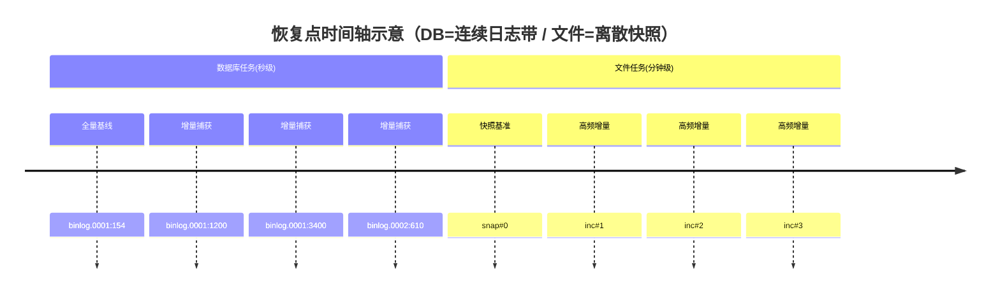
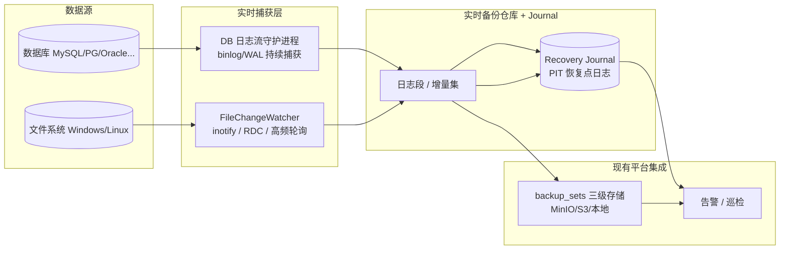

# 准 CDP 实时备份 PRD（数据库 + 文件级，跨 Windows/Linux）

> 文档类型：简单 PRD（默认档，不含竞品分析）
> 关联调研：`docs/cdp-vm-clone-research.md`（设计哲学借鉴：**准 CDP = 变更跟踪 + 高频增量 + PIT 日志**；落地对象为 **DB + File，非 VM**）
> 平台现状：Python 3.14.3 + Flask + SQLite + Bootstrap 5（前端 jQuery + Bootstrap，**非 React**）

---

## 0. 项目信息

| 项 | 内容 |
|---|---|
| Language | 中文（zh-CN） |
| Programming Language | 后端 Python 3.14.3 + Flask + SQLite；前端 Bootstrap 5 + jQuery（**非 React**，沿用现有栈）；调度 APScheduler |
| Project Name | `rt_backup_db_file` |
| 原始需求复述 | 不做 VM 级实时备份/克隆；实现 **数据库** 与 **文件** 两个层面的准 CDP 实时备份（混合保护模型）：DB 秒级日志 PITR（基于已埋点 `binlog_pos`/`wal_lsn` 做持续日志捕获 + 任意时间点恢复），文件分钟级准 CDP（在 `core/engines/file.py` 增量能力上增强为高频变更捕获 + PIT 恢复点日志 journal）；管理端同时兼容 Windows 与 Linux 部署；复用现有三级存储/告警/巡检/恢复记录页，不另起炉灶 |

---

## 1. 产品目标

**一句话**：在不引入虚拟化层的前提下，为数据库与文件提供准 CDP 级实时保护（DB 秒级日志 PITR + 文件分钟级近实时变更捕获），并支持 Windows/Linux 管理端一致接入与任意时间点恢复。

**3 条关键结果（KR）**

| KR | 目标 | 量化标准 |
|---|---|---|
| KR1｜数据库 RPO | 数据库达到秒级 RPO，可恢复到任意时间点 | 日志持续捕获延迟 ≤ 30s（默认）；恢复精度到 `binlog_pos` / `wal_lsn` |
| KR2｜文件 RPO | 文件达到分钟级准 CDP RPO，可回到任意备份点 | 默认捕获周期 ≤ 5 分钟；基于现有快照基准 + 增量链 + journal 可拼接恢复 |
| KR3｜跨平台与集成 | 同一套配置/UI 在 Windows 与 Linux 管理端均可运行，数据自动进入三级存储/告警/巡检闭环 | Windows Server 与 Linux 上实时任务均可创建、运行、监控；产物进入 `backup_sets` 三级存储并被告警/巡检覆盖 |

---

## 2. 用户故事

| 视角 | 用户故事 |
|---|---|
| **DBA（数据库管理员）** | 作为 DBA，我希望平台持续捕获 MySQL/PostgreSQL 的 binlog/WAL，并能在时间轴上选择任意时间点恢复，以便在误删表/勒索攻击后把核心库恢复到故障前 1 秒。 |
| **运维（SRE/运维）** | 作为运维，我希望在管理端一眼看到所有实时备份任务的健康度、最新恢复点与实时 RPO 值，以便在出问题时第一时间判断是否满足 SLA。 |
| **开发/测试** | 作为开发/测试，我希望把生产库或关键配置目录克隆到测试环境的某个时间点，以便用接近真实的近期数据做回归测试与缺陷复现。 |
| **合规/管理员**（补充） | 作为合规管理员，我希望实时备份自动纳入保留策略与容量告警，以满足审计要求并控制存储预算。 |

---

## 3. 需求池（P0 / P1 / P2）

> 优先级：P0=Must，P1=Should，P2=Nice-to-have。验收标准尽量可度量。

### P0（MVP 必须）

| 编号 | 需求 | 优先级 | 验收标准 | 跨平台说明 |
|---|---|---|---|---|
| R-01 | **数据库日志流持续捕获（CDC 守护进程）** | P0 | 守护进程启动后，新产生的 binlog/WAL 在 ≤30s 内被捕获落盘；位点（`binlog_file`,`binlog_pos` / `wal_lsn`）持续前进；进程崩溃可基于上次位点重启续传；复用/补全 `models.update_record_cdc()` 记录位点 | binlog/WAL 本身是文件流，逻辑跨平台一致；MySQL 用 `mysqlbinlog --read-from-remote-server --to-last-log --stop-never`，PG 用 `pg_receivewal`/`archive_command` 流；Windows/Linux 均通过对应客户端实现，无平台语义差 |
| R-02 | **文件近实时变更捕获** | P0 | 在 `file.py` 现有 `snapshot 基准 + _diff_against_snapshot + 原子写入 + _build_restore_chain` 之上，新增高频增量；默认「高频轮询 + 快照基准」跨平台通用方案（间隔可配，默认 1~5 分钟），可选增强：Linux `inotify` / Windows `ReadDirectoryChangesW` 事件驱动触发增量 | 通用轮询方案全平台一致；`inotify`(Linux) / `ReadDirectoryChangesW`(Windows) 为可选加速，统一抽象为 `FileChangeWatcher` 接口，上层无差异 |
| R-03 | **PIT 恢复点日志（Recovery Journal）** | P0 | 每个实时任务维护 journal：记录每次恢复点的时间戳、类型（`snapshot`/`log-segment`/`incremental`）、对应位点（`binlog_pos`/`wal_lsn`/`file-set-id`）、存储位置、校验和；journal 可列出/查询，任意恢复点可由 `(timestamp, lsn/pos)` 唯一定位；落盘原子、崩溃可恢复 | journal 为平台内部 SQLite/JSON，全平台一致，无平台差 |
| R-04 | **PITR 恢复引擎** | P0 | DB：基于最近全量/合成全量 + journal 日志段重放至选定时间点（精确到 `binlog_pos`/`wal_lsn`），提供位点校验；File：基于快照基准 + 增量链 + journal 回到选定 PIT；复用现有 `restore()`/`_build_restore_chain()` | 恢复逻辑与平台无关；Windows/Linux 行为一致 |
| R-05 | **PITR 恢复 UI（时间轴选择恢复点）** | P0 | 在恢复页提供时间轴组件，展示可用恢复点（DB 连续日志带 + 文件离散快照点），用户点选/拖拽时间点后，后端返回该点位点与可恢复集并触发恢复；UI 在 Windows/Linux 浏览器一致渲染（Bootstrap 5 + jQuery） | 纯前端组件，跨平台一致 |
| R-06 | **跨平台管理端兼容** | P0 | 实时备份守护进程/调度在 Windows 与 Linux 均可启动、注册、运行；路径分隔符、卷影/LVM 差异被封装在引擎层；同一套代码两平台通过 | 路径/权限：Windows `\` vs Linux `/` 统一用 `os.path`；快照机制 Windows=卷影副本(VSS)，Linux=LVM 快照，统一封装 |
| R-07 | **与现有三级存储集成** | P0 | 实时备份产物（日志段/增量/快照）登记为 `backup_sets`（`set_type`/`parent_set_id`/`storage_tier`/`object_key`），进入 MinIO/S3/本地三级存储并被生命周期策略管理（冷归档/到期） | 存储后端跨平台一致（对象存储/本地路径抽象） |
| R-08 | **与现有告警集成** | P0 | 捕获延迟超阈、位点停滞、捕获失败、容量超阈触发现有告警（复用 `notifier` / `ai_alert`）；在告警列表可见实时备份相关条目 | 告警通道（邮件/Webhook）跨平台一致 |

### P1（应做）

| 编号 | 需求 | 优先级 | 验收标准 | 跨平台说明 |
|---|---|---|---|---|
| R-09 | **容量预估与配额** | P1 | 基于变更速率估算每个实时任务的日增/保留占用并展示；超配额预警 | 容量计算与平台无关 |
| R-10 | **与现有巡检集成** | P1 | 巡检任务覆盖实时备份健康度（守护进程存活、位点前进、journal 完整性），巡检报告含实时备份状态项 | 巡检脚本跨平台一致 |
| R-11 | **一致性保障** | P1 | 文件捕获时 Linux 用 LVM 快照 / Windows 用卷影副本(VSS) 保证一致性；DB 用事务一致性位点；提供一致性等级标识（crash/fs/app-consistent） | Windows=VSS，Linux=LVM/fsfreeze，统一封装为一致性快照接口 |
| R-12 | **实时备份任务配置项** | P1 | 任务创建/编辑可配置：实时开关、捕获模式（轮询/inotify/ReadDirectoryChangesW）、频率、保留周期、一致性等级，并落库（`backup_tasks` 已有 `protection_level`/`rpo_target_min`/`rto_target_min` 可复用扩展） | 配置项与平台无关 |

### P2（增强）

| 编号 | 需求 | 优先级 | 验收标准 | 跨平台说明 |
|---|---|---|---|---|
| R-13 | **即时恢复/克隆到测试** | P2 | DB 克隆到测试实例某 PIT；File 即时挂载某 PIT 为只读视图（可选） | 依赖跨主机恢复（现有 `cross_host`） |
| R-14 | **异地实时复制** | P2 | 实时备份集同步到异地 Tier（复用 `tier_replication`） | 传输层跨平台一致 |
| R-15 | **勒索异常检测** | P2 | 基于变更速率突变的 AI 告警增强（复用 `ai_alert`） | 模型跨平台一致 |

---

## 4. UI 设计要点

### 4.1 恢复点时间轴（PITR 选择）
- **DB 任务**：横向连续日志带（绿色=已捕获位点，颜色越深越新），可缩放/拖拽，选中时间点显示 `binlog_file:binlog_pos` 或 `wal_lsn` 与「恢复 / 克隆到测试」按钮。
- **文件任务**：离散快照点（每个增量一个 PIT 节点），点击节点显示变更文件清单与「恢复」按钮。
- 技术：Bootstrap 5 卡片 + jQuery 时间轴插件（或自绘 SVG），**非 React**。

### 4.2 实时备份状态 / 健康度看板
每个实时任务一张卡片，展示：
- 模式徽标：`DB 日志流` / `文件准 CDP`
- 最新恢复点时间 + **实时 RPO 值**（如「RPO 12s」/「RPO 3min」）
- 位点进度条（`binlog_pos` / `wal_lsn` 前进情况）
- 健康灯：🟢 正常 / 🟡 延迟 / 🔴 停滞或失败
- 捕获延迟、今日增量大小

### 4.3 配置项（任务编辑页）
- 实时开关（启用准 CDP）
- 捕获模式：轮询（通用兜底）/ inotify(Linux) / ReadDirectoryChangesW(Windows)
- 频率：DB 日志捕获延迟目标；文件轮询间隔（默认 1~5 分钟）
- 保留周期与存储层级（Tier 1/2/3）
- 一致性等级（crash / fs / app-consistent）

### 4.4 实时备份数据流（架构草图）

---

## 5. 待确认问题（需用户拍板）

1. **文件实时捕获机制**：采用 `inotify`(Linux) / `ReadDirectoryChangesW`(Windows) 事件驱动，还是先上「高频轮询 + 快照基准」跨平台通用兜底？建议双轨：通用轮询兜底 + 可选事件驱动加速。
2. **DB 日志捕获形态**：持续 dump（`mysqlbinlog --stop-never` / `pg_receivewal` 常驻守护进程）还是 tail+ship？是否需要独立常驻守护进程（而非仅 APScheduler 高频 interval 任务）？
3. **默认频率与保留策略**：DB 日志保留天数？文件增量默认频率（1/3/5 分钟）？保留窗口（如 7/30 天）？
4. **RPO 目标默认值**：DB 秒级（≤30s）、文件分钟级（≤5min）是否作为全局默认，且每任务可覆盖？
5. **日志仓库与三级存储关系**：高频小日志段是否也走 MinIO/S3？如何缓解对象存储写放大（本地缓冲 + 周期聚合上云）？
6. **MVP 范围**：「即时恢复/克隆到测试」(R-13) 是否纳入首版，还是后置到 P2？

---

## 6. 范围边界（明确排除）

- ❌ **不做 VM 级 CDP / 克隆**：不实现块级 CBT / RCT / dirty-bitmap、虚拟机克隆、live-restore 成新 VM。相关能力见 `docs/cdp-vm-clone-research.md`，本功能不落地。
- ❌ **不做真 CDP（IO 级拦截）**：本平台采用**准 CDP**（变更跟踪 + 高频增量 + PIT 日志），不拦截每次写 IO、不维护 Journal 卷做连续回放。
- ✅ **仅覆盖数据库 + 文件**两个层面，复用现有引擎、三级存储、告警、巡检、恢复记录页。
- ✅ 跨平台仅指 **Windows / Linux 管理端部署兼容**；被保护对象（DB/文件）所在主机的操作系统差异由对应引擎封装处理。

---

## 附：与现有代码/模型的落点映射（供架构师参考）

| PRD 需求 | 现有代码落点 |
|---|---|
| DB 位点记录 | `core/engines/base.BackupResult.binlog_pos/wal_lsn`、`core/models.update_record_cdc()` |
| 文件增量/快照/恢复链 | `core/engines/file.py`：`_save_snapshot`/`_load_snapshot`、`_diff_against_snapshot`、`_atomic_write_archive`、`_build_restore_chain` |
| 备份集/三级存储 | `core/models.backup_sets`（`set_type`/`storage_tier`/`parent_set_id`/`object_key`）、`core/storage_backends` |
| 调度 | `core/scheduler.py`（APScheduler `IntervalTrigger`/`CronTrigger`）；DB 日志流需新增常驻守护进程 |
| 告警/巡检 | `core/notifier.py`、`core/ai_alert.py`、`core/inspection.py` |
| 任务配置 | `core/models.backup_tasks`（`protection_level`/`rpo_target_min`/`rto_target_min` 可扩展实时参数） |
