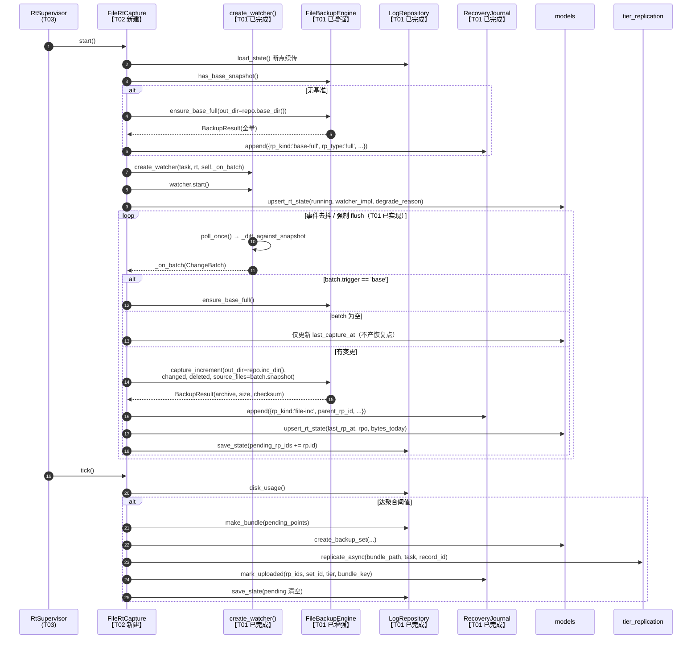
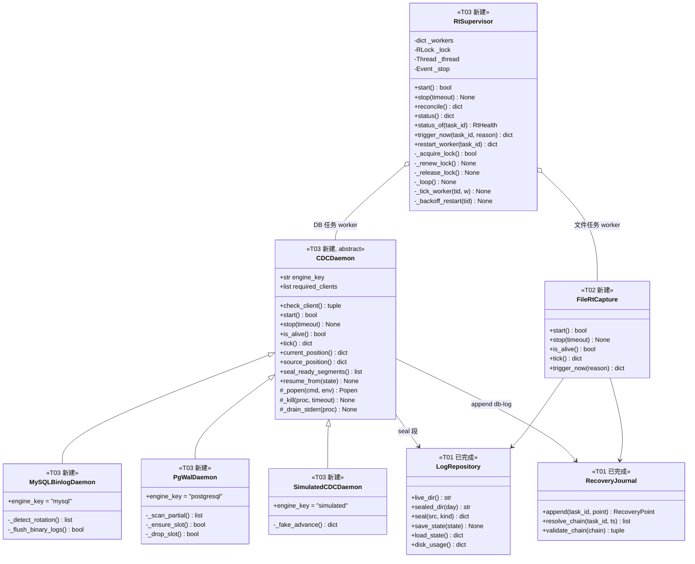
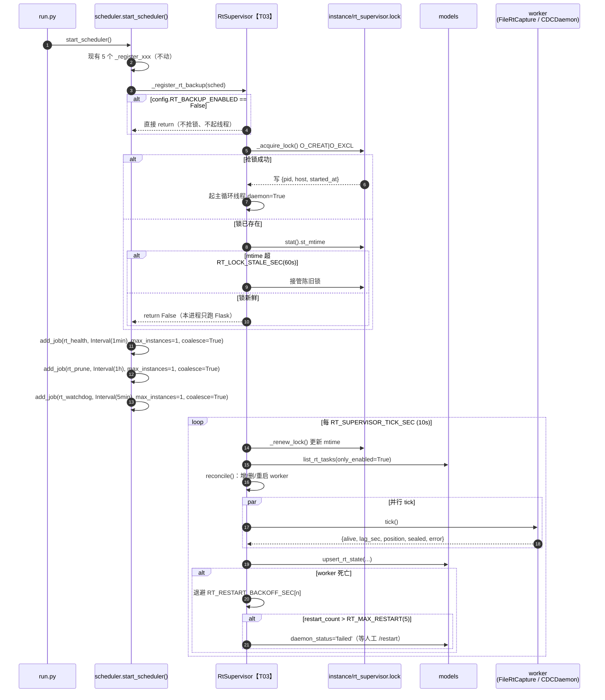
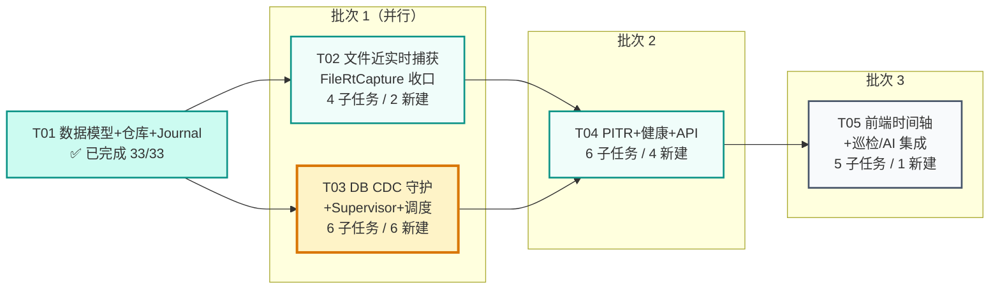

# 准 CDP 实时备份 T02–T05 增量设计 + 可执行任务列表

> 文档类型：增量设计（落地步骤 + 文件级改动 + 衔接点）
> 作者：高见远（架构师）
> 委派：齐活林（主理人）｜ 执行：寇豆码（工程师）
> 基线文档：`docs/rt-backup-design.md`（架构）、`docs/rt-backup-prd.md`（需求）
> 代码基线核对时间：T01 完成后（33/33 测试全绿）
> 项目路径：`E:\备份管理平台\backup_platform`

---

## 0. 执行摘要（先看这里）

| 项 | 结论 |
|---|---|
| **最重要发现** | **T01 实际交付大幅超出原设计范围**：`core/engines/file.py` 的四项增强（原 T02 范围）**已全部完成**；`watchers/` 三个实现**已全部写完并可运行**（含去抖、强制 flush、观察者猝死降级）。**T02 剩余工作量仅约原计划的 30%** |
| **T02 真实剩余** | 只差 `core/rt_backup/file_rt.py`（FileRtCapture 编排器）+ 断点续传接线 + 测试。**2 个新文件，0 个修改文件** |
| **T03 是真正的大头** | `core/cdc/` 整个子包（5 文件）+ `supervisor.py` + `scheduler.py` 集成，**7 个文件，其中 6 个纯新增** |
| **T04 需拍板** | 用户指定 API 前缀 `/api/rt/*`，与原设计 `/api/rt_backup/*` **冲突**，见 CH-4 |
| **T05 需拍板** | 用户指定 `rt_timeline.html` + `initRtTimeline()`，与原设计 `rt_backup.html` + `initRtBackup()` **冲突**，见 CH-5 |
| **设计变更** | 共 **6 项**（CH-1 ~ CH-6），其中 CH-1/CH-2 是 T01 遗留的**技术债，建议在 T03 顺手清理** |
| **子任务总数** | **21 个**（T02:4 / T03:6 / T04:6 / T05:5） |
| **推荐批次** | 3 批：**B1 = T02 ∥ T03**（并行）→ **B2 = T04** → **B3 = T05** |
| **关键风险** | 开发机**缺全部外部二进制**（mysqlbinlog / pg_receivewal / mysql / psql）与 `watchdog`，T03 必须以 `SimulatedCDCDaemon` 为**主要可测路径**，否则 T03 无法自验 |

---

## 1. T01 已落地资产核对（T02–T05 的复用底座）

> 这一节是**防止重复造轮子的核心依据**。工程师在动手前必须逐行确认。

### 1.1 已完成文件清单

| 文件 | 行数 | 状态 | T02–T05 可直接复用的能力 |
|---|---:|---|---|
| `config.py` | — | ✅ 完成 | 全部 `RT_*`，**且比原设计多 4 项**：`RT_LOCK_STALE_SEC`、`RT_DB_FLUSH_LOGS`、`RT_PG_CREATE_SLOT`、`RT_ALERT_SUPPRESS_MIN` |
| `core/db.py` | — | ✅ 完成（含债） | 4 张表：`recovery_journal`、`rt_capture_state`、`rt_tasks`、`log_repository`；`backup_tasks` 6 个新列已迁移 |
| `core/models.py` | — | ✅ 完成 | 20+ 个 CRUD，见 §1.2 |
| `core/rt_backup/types.py` | 343 | ✅ 完成 | `RtConfig` / `ChangeBatch` / `RecoveryPoint` / `RtHealth` / `RestorePlan` + 全部常量 + `norm_path()` |
| `core/rt_backup/repo.py` | 449 | ✅ 完成 | `LogRepository`：目录布局、`atomic_write`、`seal`、`save/load_state`、`make_bundle`、`disk_usage`、`prune` |
| `core/rt_backup/journal.py` | ~430 | ✅ 完成 | `RecoveryJournal`：`append` / `resolve_chain` / `validate_chain` / `timeline` / `prune` / `mark_uploaded` |
| `core/rt_backup/__init__.py` | 140 | ✅ 完成 | **门面已预留全部 T02–T05 入口**（惰性导入），见 §1.3 |
| `core/rt_backup/watchers/base.py` | 277 | ✅ 完成 | `FileChangeWatcher`：`poll_once` / `_emit` / `start` / `stop` / `request_flush` / `stats` / `_wait` / `_consume_flush` |
| `core/rt_backup/watchers/polling.py` | 54 | ✅ 完成 | `PollingWatcher`（短是因为基类已承载全部逻辑，**不是骨架**） |
| `core/rt_backup/watchers/watchdog_watcher.py` | 287 | ✅ 完成 | `WatchdogWatcher`：事件去抖、强制 flush 上限、**观察者猝死自动降级轮询**、`_teardown` |
| `core/rt_backup/watchers/__init__.py` | 187 | ✅ 完成 | `create_watcher()` 全套降级决策 + `probe_capabilities()` + `estimate_watch_cost()` |
| `core/rt/log_repo.py` | 243 | ✅ 完成 | DB 持久化版仓库（`log_repository` 表）：`init_repo` / `check_quota` / `cleanup_expired` / `snapshot_dir` |
| `core/rt/journal.py` | 151 | ✅ 完成 | T01 验收接口适配层，**内部委托 `rt_backup.journal`** |
| `core/engines/file.py` | 1150+ | ✅ **增强已完成** | 见 §1.4 —— **这是最容易被重复实现的部分** |

### 1.2 `core/models.py` 可复用 CRUD（禁止重写）

```
恢复点：create_recovery_point / get_recovery_point / list_recovery_points(task_id,start,end,kind,limit,order)
        count_recovery_points / update_recovery_point / delete_recovery_points(ids)
运行态：upsert_rt_state(task_id, data) / get_rt_state / list_rt_states / delete_rt_state
实时任务：list_rt_tasks(only_enabled)  ← 直接返回 rt_enabled=1 的 backup_tasks 行（含明文密码，供守护用）
          update_rt_config(task_id, data)  ← 已内置 6 字段白名单 + 强类型转换
rt_tasks 扩展：create_rt_task / get_rt_task / update_rt_task / delete_rt_task
日志仓库：create_log_repo / get_log_repo / update_log_repo
位点回写：update_record_cdc(record_id, binlog_file, binlog_pos, wal_lsn)   ← models.py:711
备份集：create_backup_set(...)                                            ← models.py:375
```

### 1.3 门面已预留的入口（T02–T05 只需补实现，不改门面）

`core/rt_backup/__init__.py` 已定义并惰性导入以下入口，**对应模块尚不存在**：

| 门面函数 | 期望模块 | 归属任务 |
|---|---|---|
| `get_supervisor()` / `start()` / `stop()` / `status()` / `status_of()` / `reconcile()` / `trigger_now()` / `restart_worker()` | `core/rt_backup/supervisor.py` | **T03** |
| `get_pitr()` | `core/rt_backup/pitr.py` | **T04** |
| `get_health_monitor()` | `core/rt_backup/health.py` | **T04** |
| `probe_capabilities()` 中的 `from core.cdc import probe_clients` | `core/cdc/__init__.py` | **T03** |

> ✅ 好消息：`probe_capabilities()` 已用 `try/except` 包住 `core.cdc` 导入，**当前不会崩**。
> ⚠️ 注意：`get_supervisor()` 等**没有** try/except，在 T03 完成前调用会 `ModuleNotFoundError`。**T03 必须先于任何调用 `rt_backup.start()` 的代码上线。**

### 1.4 ⭐ `core/engines/file.py` 增强已完成（原 T02 范围，请勿重复实现）

| 方法 | 行号 | 签名 | 说明 |
|---|---:|---|---|
| `snapshot_namespace` | 303 | `str = ""` | 实例属性，Watcher 基类已设为 `"rt"` |
| `_snapshot_path` | 429 | `(namespace: str = None) -> str` | `namespace=None` 时用 `self.snapshot_namespace` |
| `_load_snapshot` | 453 | `(namespace=None) -> Optional[Dict]` | 无基准返回 `None` |
| `_load_snapshot_meta` | 472 | `(namespace=None) -> dict` | 含 `last_full_path` / `last_full_checksum` |
| `_save_snapshot` | 490 | `(snapshot, full_path=None, ...)` | 提交新基准 |
| `_diff_against_snapshot` | 505 | `(sf, snapshot) -> (changed, deleted)` | **唯一真值源** |
| `list_source_files` | 598 | `() -> Optional[Dict[str,(size,mtime)]]` | 本地/远程统一；远程失败返回 `None` |
| `has_base_snapshot` | 622 | `() -> bool` | 判断是否需要 `ensure_base_full` |
| **`ensure_base_full`** | 632 | `(out_dir="", force=False) -> BackupResult` | 已存在基准时返回「复用」 |
| **`capture_increment`** | 684 | `(out_dir="", tag="", changed=None, deleted=None, source_files=None) -> BackupResult` | 接受 Watcher 预算好的 diff，避免二次扫描；空包自动丢弃 |
| `_tar_manifest_only` | 777 | `(archive_path, deleted) -> bool` | 纯删除批次也产出可校验产物 |
| `_atomic_write_archive` | 798 | `(writer, archive_path)` | Windows 文件锁防护 |
| **`_build_restore_chain`** | 998 | `(backup_path, chain_override: List[str] = None)` | **T04 PITR 直接传 `chain_override`** |
| `restore` | 942 | `(backup_path, **kwargs)` | 支持 `target_db` / 跨主机 |

---

## 2. ⚠️ 设计变更（6 项）

### CH-1 ⚠️ 数据表由 2 张扩为 4 张，且 `rt_mode` 语义冲突

**现状**：原设计只有 `recovery_journal` + `rt_capture_state`；T01 额外新增 `rt_tasks`（db.py:511）与 `log_repository`（db.py:529）。

**冲突点**：两个 `rt_mode` 取值域完全不同 ——

| 字段 | 取值域 | 用途 |
|---|---|---|
| `backup_tasks.rt_mode` | `auto` \| `polling` \| `watchdog`（文件）/ `auto` \| `stream` \| `archive_poll` \| `sample`（DB） | **捕获实现选择**，`RtConfig.from_task()` 读取 |
| `rt_tasks.rt_mode` | `file_polling` \| `db_cdc` \| `mixed` | **任务类型分类** |

**决策（架构师定）**：
- `backup_tasks.rt_mode` 为**唯一权威**的捕获实现选择字段，`RtConfig` 只读它；
- `rt_tasks.rt_mode` **重命名语义为「任务类型」**，T03 起在代码中一律通过常量 `RT_TASK_KIND_*` 引用，**禁止**与 `RtConfig.mode` 混用；
- 用户需求「新增 rt_tasks 任务类型 `db_cdc`」——**DB schema 已支持**（`file_polling|db_cdc|mixed`），T03 只需在代码侧定义常量与写入逻辑，**无需改表**。

### CH-2 ⚠️ `core/db.py` 中 `recovery_journal` / `rt_capture_state` 被定义了两次

`SCHEMA` 常量内 **290–351 行**与 **447–508 行**各有一份完整定义（`CREATE TABLE IF NOT EXISTS` 故不报错，但存在漂移风险：两份 `recovery_journal` 的列注释已有细微差异）。

**决策**：**保留 445 行起的「准 CDP 实时备份（Phase RT）」区块**（有分组注释、与 `rt_tasks`/`log_repository` 相邻，内聚更好），**删除 289–351 行的先出现版本**。列在 T03-S6 收尾子任务中执行，需回归 `test_rt_t01.py`。

### CH-3 ⚠️ `core/rt/` 与 `core/rt_backup/` 双层结构 —— 依赖方向必须单向

**现状**：`core/rt/journal.py` **导入** `core/rt_backup/journal.py`（`from core.rt_backup.journal import RecoveryJournal as _InnerJournal`），而 `core/rt/__init__.py` 的注释却声称「本包不反向依赖 rt_backup」——**注释与实现矛盾**。

**决策（硬性约定）**：

```
core/rt_backup/   = 核心实现层（T02–T05 一律依赖此层）
core/rt/          = T01 验收接口适配层（仅供 tests/test_rt_t01.py 使用，冻结不再扩展）

依赖方向：core/rt  ──依赖──▶  core/rt_backup      （单向，禁止反向）
```

- **T02–T05 新代码禁止 `import core.rt`**，一律 `from core.rt_backup import ...`；
- 唯一例外：`core/rt/log_repo.py` 的 `log_repository` **表持久化**能力在 `rt_backup/repo.py` 中没有对应实现。T03 若需要仓库元数据落库，**通过 `models.get_log_repo/create_log_repo/update_log_repo` 直接访问**，不要 import `core.rt.LogRepository`；
- 顺手修正 `core/rt/__init__.py` 中矛盾的注释（T03-S6）。

### CH-4 ⚠️ REST API 前缀冲突：`/api/rt/*`（用户指定） vs `/api/rt_backup/*`（原设计）

**决策建议**：**采纳用户指定的 `/api/rt/` 短前缀**，理由：① 用户已明确给出两个端点签名；② 与 `core/rt` 命名呼应；③ 更短。
原设计 15 个端点全部平移到 `/api/rt/*`，映射见 §5.2。**文件名仍用 `api/rt_backup.py`**（与 `core/rt_backup` 对应，避免与 `core/rt` 混淆）。

> ⛳ **需主理人确认**：是否接受把原设计的 `/api/rt_backup/*` 全量改为 `/api/rt/*`。

### CH-5 ⚠️ 前端页面命名冲突：`rt_timeline.html` / `initRtTimeline()`（用户指定） vs `rt_backup.html` / `initRtBackup()`（原设计）

**决策建议**：**采纳用户命名**，且**只做一个页面**——`templates/rt_timeline.html` 同时承载「健康看板」与「恢复点时间轴」两个区块，JS 入口 `initRtTimeline()`。
理由：拆两个页面会新增两个侧边栏入口，而看板与时间轴是同一心智流程（看健康 → 选点 → 恢复），合并更顺。

> ⛳ **需主理人确认**：单页合并（推荐）还是双页拆分。

### CH-6 ✅ T02 范围缩减：`file.py` 增强 + watchers 三实现已提前完成

原设计 T02 含 7 个源文件，现**实际只剩 2 个**（`file_rt.py` + `tests/test_rt_watcher.py`）。
**这不是偷工减料**——T01 把它们一并做了。T02 的验收标准（原设计 8 条）**全部保留**，只是其中 1–5 条变成了**回归验证**而非新开发。

---

## 3. T02 — 文件近实时捕获引擎（FileChangeWatcher 编排收口）

- **优先级**：P0 ｜ **依赖**：T01 ｜ **可与 T03 完全并行**

### 3.1 文件列表

| # | 路径 | 动作 | 说明 | 预估行数 |
|---|---|---|---|---:|
| 1 | `core/rt_backup/file_rt.py` | **新建** | `FileRtCapture` 编排器：Watcher 回调 → 基准/增量 → journal → 状态 → 聚合上云 | ~380 |
| 2 | `tests/test_rt_watcher.py` | **新建** | Watcher 契约测试 + FileRtCapture 端到端 | ~260 |
| 3 | `core/rt_backup/watchers/base.py` | 修改（微） | 仅补 `poll_once()` 对 `snapshot` 字段的落盘复用（见 S2） | ~10 |
| 4 | `core/rt_backup/__init__.py` | 修改（微） | 导出 `FileRtCapture`（可选，便于 Supervisor import） | ~3 |

> **注意**：`core/engines/file.py`、`watchers/{base,polling,watchdog_watcher,__init__}.py` **均不需要重写**。

### 3.2 数据结构与接口

```python
# core/rt_backup/file_rt.py

class FileRtCapture:
    """单个文件型实时任务的捕获编排器。

    职责边界（严格）：
      - 不实现 diff / 打包 / 快照   → 全部委托 FileBackupEngine
      - 不实现事件监听 / 去抖        → 全部委托 FileChangeWatcher
      - 只负责「批次到了之后怎么办」：基准检查 → 增量 → journal → 状态 → 聚合上云
    """

    def __init__(self, task: dict, rt_config: RtConfig, logger=None) -> None:
        """构造。内部创建 LogRepository(capture_kind=KIND_FILE) 与 RecoveryJournal，
        并通过 create_watcher(task, rt_config, self._on_batch) 组装 Watcher（未启动）。"""

    # ---- 生命周期（供 RtSupervisor 调用，签名与 CDCDaemon 对齐）----
    def start(self) -> bool:
        """① 确保基准全量（ensure_base_full → journal 写 base-full 行）
           ② 启动 watcher；③ UPSERT rt_capture_state(daemon_status='running',
              watcher_impl, degrade_reason)。幂等。"""

    def stop(self, timeout: float = 10.0) -> None:
        """停 watcher（幂等），flush 未成包的 pending 成员，置 stopped。"""

    def is_alive(self) -> bool: ...

    def tick(self) -> dict:
        """Supervisor 每 tick 调用。职责：
             ① watcher 存活探测（死了返回 alive=False 交由 Supervisor 退避重启）
             ② 到期触发聚合上云（RT_UPLOAD_BATCH_MB / RT_UPLOAD_INTERVAL_MIN）
             ③ 容量守护（repo.disk_usage() → over_hard 时暂停捕获并 degraded）
             ④ 返回 {'alive','rpo_sec','last_rp_at','watcher_impl','sealed':[],'error'}"""

    def trigger_now(self, reason: str = "manual") -> dict:
        """手动立即捕获：委托 watcher.request_flush(reason)。"""

    # ---- 核心回调 ----
    def _on_batch(self, batch: ChangeBatch) -> None:
        """Watcher 回调（在 watcher 线程内执行）。全流程包 try/except，
        并由 per-task 锁保证同任务绝不并发捕获（共享知识 #9）。"""

    # ---- 内部 ----
    def _ensure_base(self) -> Optional[RecoveryPoint]: ...
    def _do_increment(self, batch: ChangeBatch) -> Optional[RecoveryPoint]: ...
    def _maybe_bundle(self, force: bool = False) -> Optional[dict]:
        """达阈值则 repo.make_bundle → models.create_backup_set →
           tier_replication.replicate_async → journal.mark_uploaded。"""
    def _update_state(self, **fields) -> None:
        """models.upsert_rt_state(task_id, {...})，高频单行 UPSERT。"""
    def _resume(self) -> None:
        """断点续传：repo.load_state() 读回 pending 成员与 last_rp_id。"""
    def _persist(self) -> None:
        """repo.save_state({'pending_rp_ids','last_rp_id','last_bundle_at'})。"""
```

**断点续传状态结构**（`repo.save_state()` 落 `state.json`）：

```json
{
  "last_rp_id": 1234,
  "last_rp_at": "2026-07-31T14:35:07+08:00",
  "pending_rp_ids": [1230, 1231, 1232],
  "pending_bytes": 18874368,
  "last_bundle_at": "2026-07-31T14:20:00+08:00",
  "saved_at": "2026-07-31T14:35:07+08:00"
}
```

### 3.3 时序图（T02 增量部分）



### 3.4 子任务列表（有序）

| ID | 子任务 | 优先级 | 文件数 | 依赖 | 交付要点 |
|---|---|:---:|:---:|---|---|
| **T02-S1** | `FileRtCapture` 骨架 + 生命周期 | P0 | 1 新建 | — | `__init__` / `start` / `stop` / `is_alive` / `trigger_now`；组装 `create_watcher`；`upsert_rt_state` 写 `watcher_impl` 与 `degrade_reason` |
| **T02-S2** | 基准 + 增量主链路（`_on_batch`） | P0 | 1 改（+`base.py` 微调） | S1 | 处理 `trigger=='base'`；调 `capture_increment(source_files=batch.snapshot)` 复用扫描结果；per-task `threading.Lock`；空批次不产恢复点 |
| **T02-S3** | 聚合上云 + 容量守护 + 断点续传 | P0 | 1 改 | S2 | `_maybe_bundle` / `_resume` / `_persist`；`disk_usage().over_hard` 时暂停封存置 `degraded` |
| **T02-S4** | 测试 `tests/test_rt_watcher.py` | P0 | 1 新建 | S3 | polling 用例必过；watchdog 用例 `pytest.importorskip("watchdog")`；快照命名空间隔离回归 |

### 3.5 与 T01 代码衔接点（关键，避免重复造轮子）

```python
# file_rt.py 头部应当出现的 import —— 全部是 T01 已有资产
import config
import core.db as db
import core.models as models
from core.engines.file import FileBackupEngine
from core.tier_replication import replicate_async
from .journal import RecoveryJournal
from .repo import LogRepository
from .types import (ChangeBatch, RecoveryPoint, RtConfig,
                    KIND_FILE, RP_BASE_FULL, RP_FILE_INC,
                    STATUS_RUNNING, STATUS_DEGRADED, STATUS_STOPPED)
from .watchers import create_watcher
```

| 需要的能力 | **直接调用**（勿重写） |
|---|---|
| 源扫描 | `watcher.poll_once()` 内部已调 `engine.list_source_files()` |
| 差异计算 | `ChangeBatch.changed/deleted`（Watcher 已算好） |
| 避免二次扫描 | `capture_increment(source_files=batch.snapshot)` ← `ChangeBatch.snapshot` 就是为此设计 |
| 基准全量 | `engine.ensure_base_full(out_dir=repo.base_dir())` |
| 增量归档 | `engine.capture_increment(out_dir=repo.inc_dir(), tag=ts, changed=..., deleted=...)` |
| 快照隔离 | Watcher 基类已设 `engine.snapshot_namespace = "rt"`；`FileRtCapture` 用 `watcher.engine` **同一实例** |
| 恢复点写入 | `RecoveryJournal().append(task_id, {...})` |
| 运行态更新 | `models.upsert_rt_state(task_id, {...})` |
| 聚合 bundle | `repo.make_bundle(points, max_mb=config.RT_UPLOAD_BATCH_MB)` |
| 三级存储 | `models.create_backup_set(...)` + `tier_replication.replicate_async(...)` + `journal.mark_uploaded(...)` |
| 容量守护 | `repo.disk_usage()` → `{'over_soft','over_hard','used_percent'}` |
| 断点续传 | `repo.save_state()` / `repo.load_state()` |

> ⚠️ **务必复用 `watcher.engine`**（`FileChangeWatcher.engine` 属性），不要在 `FileRtCapture` 里另建 `FileBackupEngine`——否则 `snapshot_namespace` 与快照缓存会分叉。

### 3.6 待明确事项

| # | 事项 | 架构建议 |
|---|---|---|
| Q2-1 | 基准全量是否也写 `backup_records`？ | **建议写**（共享知识 #11 要求 base-full 走完整流程），但 T02 先只写 `journal + backup_sets`，`backup_records` 留到 T04 与恢复记录页一起打通 |
| Q2-2 | `pending_rp_ids` 在进程崩溃且 bundle 已生成但未 `mark_uploaded` 时如何自愈？ | 建议 `_resume()` 时校验 bundle 文件存在性，存在则补做 `mark_uploaded`，不存在则重新聚合 |

---

## 4. T03 — DB CDC 守护 + RtSupervisor + 调度集成

- **优先级**：P0 ｜ **依赖**：T01 ｜ **可与 T02 完全并行** ｜ **本期最大任务**

### 4.1 文件列表

| # | 路径 | 动作 | 说明 | 预估行数 |
|---|---|---|---|---:|
| 1 | `core/cdc/__init__.py` | **新建** | `CDC_REGISTRY` + `get_cdc_daemon(db_type)` + `probe_clients()` | ~120 |
| 2 | `core/cdc/base.py` | **新建** | `CDCDaemon` 抽象：跨平台 `_popen`/`_kill`、探活、续传、stderr 读取线程 | ~330 |
| 3 | `core/cdc/mysql_binlog.py` | **新建** | `MySQLBinlogDaemon` | ~300 |
| 4 | `core/cdc/pg_wal.py` | **新建** | `PgWalDaemon`（stream + archive_poll 双模式 + 槽清理） | ~320 |
| 5 | `core/cdc/simulated.py` | **新建** | `SimulatedCDCDaemon`（**开发机唯一可测路径**） | ~150 |
| 6 | `core/rt_backup/supervisor.py` | **新建** | `RtSupervisor` + 单实例锁 + worker 生命周期 + 退避重启 | ~420 |
| 7 | `core/scheduler.py` | 修改 | `_register_rt_backup()` + 3 个周期 job + `stop_scheduler()` 钩子 + `reload_scheduler()` | ~70 |
| 8 | `core/db.py` | 修改（债） | 删除 289–351 行重复表定义（CH-2） | -63 |
| 9 | `core/rt/__init__.py` | 修改（债） | 修正矛盾注释（CH-3） | ~3 |
| 10 | `tests/test_rt_cdc.py` | **新建** | Simulated 守护 + Supervisor 锁 + 退避重启单测 | ~240 |

### 4.2 类图（T03 新增部分）



> **worker 鸭子类型契约**：`FileRtCapture` 与 `CDCDaemon` 必须暴露**同名同义**的 `start/stop/is_alive/tick/trigger_now`，`RtSupervisor` 对二者一视同仁。这是 T02 与 T03 并行开发的**唯一接口约定**，两边必须严格遵守。

### 4.3 CDC 注册表设计（含信创三库处置）

```python
# core/cdc/__init__.py
CDC_REGISTRY = {
    "mysql":      "core.cdc.mysql_binlog:MySQLBinlogDaemon",
    "mariadb":    "core.cdc.mysql_binlog:MySQLBinlogDaemon",
    "postgresql": "core.cdc.pg_wal:PgWalDaemon",
}

# core_self 轨道（oracle / kingbase / dameng）：本期不做真实日志流
CORE_SELF_ENGINES = ("oracle", "kingbase", "dameng")

def get_cdc_daemon(db_type, task, rt_config, repo, logger=None) -> "CDCDaemon":
    """惰性工厂。
       DEMO_MODE 或 task.demo_only          → SimulatedCDCDaemon
       db_type ∈ CDC_REGISTRY               → 对应守护
       db_type ∈ CORE_SELF_ENGINES          → SampleOnlyDaemon（degraded，仅位点采样）
       其它                                  → None（Supervisor 跳过该任务）"""
```

**⚠️ 设计变更提示（信创三库）**：用户任务描述提到「Oracle/Kingbase/Dameng 走自研适配（core_self 轨道）」。**原设计 T03 不含信创三库 CDC**（`docs/rt-backup-design.md` §1.2 只覆盖 MySQL/PG）。

**架构建议**：本期 T03 **只留注册表占位**——信创三库统一走 `SampleOnlyDaemon`：
- 复用现有 `ENGINE_REGISTRY` 的 `adapter_tier == "core_self"` 判定（`core/engines/__init__.py:57 get_adapter_tier()`）；
- 行为：`daemon_status='degraded'` + `degrade_reason='<引擎> 日志流适配未实现，当前仅位点采样'`，周期性写 `rt_capture_state` 供 UI 展示，**不产生 db-log 恢复点**；
- 理由：Oracle LogMiner / Kingbase sys_receivewal / Dameng DMHS 三者机制差异巨大，真实适配工作量 ≈ 当前整个 T03，会把关键路径拉长一倍以上。

> ⛳ **需主理人拍板**：信创三库 CDC 是否后置到独立任务（T06）？

### 4.4 时序图（Supervisor 单实例锁 + worker 对账）



### 4.5 子任务列表（有序）

| ID | 子任务 | 优先级 | 文件数 | 依赖 | 交付要点 |
|---|---|:---:|:---:|---|---|
| **T03-S1** | `CDCDaemon` 抽象 + 注册表 + Simulated | P0 | 3 新建 | — | `base.py` 跨平台 `_popen`/`_kill`/`_drain_stderr`；`__init__.py` 工厂 + `probe_clients()`；`simulated.py` **优先做**，让后续子任务在无 MySQL 环境下可自验 |
| **T03-S2** | `RtSupervisor` 单实例锁 + 主循环 + 对账 | P0 | 1 新建 | S1 | `O_CREAT\|O_EXCL` 纯 `os` 实现；`RT_LOCK_STALE_SEC` 陈旧锁接管；`RLock` 保护 worker 表；退避重启 |
| **T03-S3** | `scheduler.py` 集成 | P0 | 1 改 | S2 | `_register_rt_backup()`；3 个 job **必须** `max_instances=1 + coalesce=True`；`stop_scheduler()` 追加 `rt_backup.stop()`；`reload_scheduler()` 不重启 Supervisor |
| **T03-S4** | `MySQLBinlogDaemon` | P0 | 1 新建 | S1 | `--raw --stop-never`；`MYSQL_PWD` 环境变量传密码；rotate 检测 → `repo.seal()` → `journal.append(db-log)`；`FLUSH BINARY LOGS`（受 `RT_DB_FLUSH_LOGS` 开关控制）；停滞双重探测 |
| **T03-S5** | `PgWalDaemon` | P0 | 1 新建 | S1 | `pg_receivewal --slot`（受 `RT_PG_CREATE_SLOT` 控制）；`.partial` 消失即封存；**任务删除必须 `pg_drop_replication_slot`**；`archive_poll` 降级模式 |
| **T03-S6** | 技术债清理 + 测试 | P0 | 2 改 + 1 新建 | S3 | 删 `db.py` 289–351 重复定义（CH-2）；修 `core/rt/__init__.py` 注释（CH-3）；`tests/test_rt_cdc.py`；回归 `test_rt_t01.py` 33/33 |

### 4.6 与 T01 代码衔接点

| 需要的能力 | **直接调用**（勿重写） |
|---|---|
| 仓库目录 | `LogRepository(task_id, capture_kind=KIND_DB_LOG)` → `.live_dir()` / `.sealed_dir()` |
| 段封存 | `repo.seal(src_path, kind='db-log')` → 返回 `{path,size,checksum,sealed_at}`，**已含 size>0 校验（R9）** |
| 续传状态 | `repo.save_state({'binlog_file','binlog_pos'})` / `repo.load_state()` |
| 恢复点 | `RecoveryJournal().append(task_id, {'rp_kind':'db-log','rp_type':'log-segment', ...})` |
| 运行态 | `models.upsert_rt_state(task_id, {...})` / `models.get_rt_state(task_id)` |
| 任务清单 | `models.list_rt_tasks(only_enabled=True)`（已过滤 `rt_enabled=1 AND enabled=1`，**含明文密码**） |
| 配置解析 | `RtConfig.from_task(task)` → `.mode` / `.interval_sec` / `.rpo_target_sec` / `.can_stream` / `.demo_only` |
| 源端位点 | `core/restore_extras.py:34 capture_mysql_cdc(task, password)` / `:56 capture_pg_cdc(task, password)` |
| 位点回写 | `models.update_record_cdc(record_id, binlog_file, binlog_pos, wal_lsn)` |
| 二进制探测 | 沿用 `core/engines/base.py:111 check_client()` 的 `shutil.which()` 写法 |
| DEMO 判定 | 沿用 `core/engines/base.py:117 _should_simulate()` 语义 |
| 容量守护 | `repo.disk_usage()` |
| 告警 | `core/notifier.py:128 Notifier(task, logger).notify('failure', title, text)` |
| 日志 | `db.get_logger("rt.cdc.mysql")` + `db.add_log()` |

### 4.7 待明确事项

| # | 事项 | 架构建议 |
|---|---|---|
| Q3-1 | 信创三库（Oracle/Kingbase/Dameng）CDC 是否本期做？ | **建议后置**为独立 T06，本期只留 `SampleOnlyDaemon` 占位（见 §4.3） |
| Q3-2 | 开发机无 mysqlbinlog/pg_receivewal，T03-S4/S5 如何验收？ | 建议：单测覆盖**命令行组装 + rotate 检测 + 封存逻辑**（用假文件模拟 `live/` 目录），真实拉流验收放到有 MySQL/PG 的联调环境，作为 T05 跨平台矩阵的一项 |
| Q3-3 | `api/inspection.py:48` 也会调 `start_scheduler()`，是否会二次注册 Supervisor？ | 已由单实例锁 + `_scheduler is not None` 双重保护，但需在 S3 显式回归 |

---

## 5. T04 — PITR 恢复引擎 + 健康监控 + REST API

- **优先级**：P0 ｜ **依赖**：T02 + T03（唯一汇合点）

### 5.1 文件列表

| # | 路径 | 动作 | 说明 | 预估行数 |
|---|---|---|---|---:|
| 1 | `core/rt_backup/pitr.py` | **新建** | `PITRRestore`：`build_plan` / `restore_file` / `restore_db` | ~340 |
| 2 | `core/rt_backup/health.py` | **新建** | `RtHealthMonitor`：RPO 计算、健康灯、告警抑制 | ~200 |
| 3 | `api/rt_backup.py` | **新建** | 全部端点（挂 `api_bp`，前缀 `/rt`） | ~420 |
| 4 | `api/__init__.py` | 修改 | 第 7 行导入列表**末尾**追加 `rt_backup` | 1 |
| 5 | `app.py` | 修改 | 新增 `/rt_timeline` 页面路由（`datamining_page` 之后） | ~5 |
| 6 | `tests/test_rt_pitr.py` | **新建** | 文件 PITR 端到端 + 计划校验 | ~280 |

### 5.2 REST API 端点（⚠️ CH-4：前缀改为 `/api/rt`）

> **强制写法**：文件头 `from . import api_bp`；`@api_bp.route("/rt/...")`；`@login_required`；**禁止 `Blueprint(...)`**。响应格式 `{"ok": true, ...}` / `{"ok": false, "error": "..."}`，与 `api/lifecycle.py` 一致。

| Method | Path | 原设计路径 | 说明 |
|---|---|---|---|
| POST | **`/api/rt/recover`** | `/api/rt_backup/restore` | ⭐ **用户指定**。body `{task_id, target_time, target_path?, target?, target_host_id?}` |
| GET | **`/api/rt/points?task_id=`** | `/api/rt_backup/tasks/<id>/points` | ⭐ **用户指定**。恢复点时间轴列表，支持 `kind`/`limit`/`offset`/`start`/`end` |
| GET | `/api/rt/overview` | `/api/rt_backup/overview` | 看板汇总 |
| GET | `/api/rt/tasks` | 同 | 实时任务列表（join `rt_capture_state`） |
| GET | `/api/rt/tasks/<id>` | 同 | 单任务详情 + 最近 20 恢复点 |
| PUT | `/api/rt/tasks/<id>/config` | 同 | 保存实时配置 → `models.update_rt_config()` → `supervisor.reconcile()` |
| POST | `/api/rt/tasks/<id>/start` | 同 | 启用并启动 worker |
| POST | `/api/rt/tasks/<id>/stop` | 同 | 停止 worker |
| POST | `/api/rt/tasks/<id>/capture` | 同 | 手动立即捕获（`trigger_now`） |
| POST | `/api/rt/tasks/<id>/restart` | 同 | 人工复位 `failed` |
| GET | `/api/rt/tasks/<id>/timeline` | 同 | 时间轴聚合桶（`journal.timeline()`） |
| GET | `/api/rt/resolve?task_id=&ts=` | `/api/rt_backup/tasks/<id>/resolve` | **只读预演**，返回 `RestorePlan` |
| POST | `/api/rt/points/<rp_id>/verify` | 同 | 单点校验 |
| GET | `/api/rt/capabilities` | 同 | 环境自检（`rt_backup.probe_capabilities()`） |
| POST | `/api/rt/prune` | 同 | 手动 prune |

**`POST /api/rt/recover` 请求/响应契约**：

```jsonc
// 请求
{ "task_id": 7, "target_time": "2026-07-31T14:35:07+08:00",
  "target_path": "D:/restore_out",      // 文件任务
  "target": {"host":"...","port":3306,"database":"..."},  // DB 任务
  "dry_run": false }

// 成功
{ "ok": true, "restore_id": 331, "summary": "恢复至 ... ：1 个基准全量 + 12 个增量",
  "restored_to": "D:/restore_out", "chain_length": 13 }

// 链不完整（HTTP 409，拒绝执行）
{ "ok": false, "error": "恢复链不完整：缺失 rp_id=1204 的归档文件",
  "plan": { "complete": false, "gap_reason": "...", "chain_length": 9 } }
```

### 5.3 子任务列表（有序）

| ID | 子任务 | 优先级 | 文件数 | 依赖 | 交付要点 |
|---|---|:---:|:---:|---|---|
| **T04-S1** | `PITRRestore.build_plan()` | P0 | 1 新建 | T02,T03 | 调 `journal.resolve_chain` + `validate_chain`；组装 `RestorePlan`；`complete=False` 时 `gap_reason` 必须可读 |
| **T04-S2** | `restore_file()` 文件 PITR | P0 | 1 改 | S1 | `engine.restore(chain[-1], chain_override=[p.object_key...], target_db=target_dir)`；跨主机透传 |
| **T04-S3** | `restore_db()` 数据库 PITR | P0 | 1 改 | S1 | MySQL：全量导入 + `mysqlbinlog --stop-datetime` 从**本地 sealed/** 重放；PG：`recovery.signal` + `restore_command` 指向 sealed/ |
| **T04-S4** | `RtHealthMonitor` | P0 | 1 新建 | T03 | `compute_rpo()`；健康灯三态（复用 `RtHealth.compute_health()`，**已在 T01 实现**）；`RT_ALERT_SUPPRESS_MIN` 抑制窗口 |
| **T04-S5** | `api/rt_backup.py` 全部端点 | P0 | 3 改/新建 | S1–S4 | 挂 `api_bp`；`api/__init__.py` 追加导入；`app.py` 加 `/rt_timeline` 路由；恢复写 `restore_records` |
| **T04-S6** | 测试 `tests/test_rt_pitr.py` | P0 | 1 新建 | S5 | 造 1 基准 + 5 增量，中间点恢复**逐文件 byte 级一致**；`grep -c "Blueprint(" api/rt_backup.py == 0` |

### 5.4 与 T01 代码衔接点

| 需要的能力 | **直接调用**（勿重写） |
|---|---|
| 恢复链解析 | `journal.resolve_chain(task_id, target_ts)` → `List[RecoveryPoint]` |
| 链完整性校验 | `journal.validate_chain(chain)` → `(ok, reason)`（**已含 checksum / 位点连续 / 文件存在三重校验**） |
| 时间轴数据 | `journal.timeline(task_id, start, end, buckets)` → `{buckets, points, gaps}` |
| 最近点 | `journal.nearest_before(task_id, target_ts, kind)` |
| 计划对象 | `RestorePlan`（**T01 已定义**，含 `summary()` / `to_dict()`） |
| 健康对象 | `RtHealth`（**T01 已定义 `compute_health()` / `is_breach()`，直接用**） |
| 文件恢复 | `FileBackupEngine.restore(path, chain_override=..., target_db=...)` |
| DB 重放 | `core/restore_extras.py:78 mysql_pitr_restore()` / `:128 pg_pitr_restore()`（**改日志源为本地 sealed/**） |
| 恢复记录 | `models.create_restore(...)` / 更新 `restore_records` |
| 能力自检 | `rt_backup.probe_capabilities()`（**T01 门面已就绪**） |
| 配置写入 | `models.update_rt_config(task_id, data)`（**已含白名单**） |

### 5.5 待明确事项

| # | 事项 | 架构建议 |
|---|---|---|
| Q4-1 | `/api/rt/*` 前缀是否最终采纳？ | 见 CH-4，**建议采纳** |
| Q4-2 | `restore_db()` 在开发机无 mysqlbinlog 时如何验收？ | 建议 T04-S3 只做**命令组装 + 计划生成**单测，真实重放放联调环境 |
| Q4-3 | PITR 恢复是否允许覆盖现有目录？ | 建议默认**拒绝非空目标目录**，需显式 `force=true` |

---

## 6. T05 — 前端时间轴 UI + 告警/巡检/AI 集成

- **优先级**：P0（前端/集成）/ P1（AI 增强）｜ **依赖**：T04

### 6.1 文件列表

| # | 路径 | 动作 | 说明 | 预估行数 |
|---|---|---|---|---:|
| 1 | `templates/rt_timeline.html` | **新建** | 健康看板 + SVG 时间轴 + 配置模态框（CH-5 单页合并） | ~320 |
| 2 | `static/js/app.js` | 修改 | `initRtTimeline()` + 分发分支（2288 行后） | ~420 |
| 3 | `templates/base.html` | 修改 | 侧边栏入口（31 行后）+ `app.js?v=` 版本号 +1（211 行） | 2 |
| 4 | `static/css/app.css` | 修改 | 时间轴专属样式（**必须引用 Design Tokens**） | ~90 |
| 5 | `core/inspection.py` | 修改 | `_inspect_rt_task()` 并入 `_inspect_one()`（128 行） | ~60 |
| 6 | `core/ai_alert.py` | 修改 | `analyze_rt_capture_risk()` 并入 `run_all_checks()`（944 行） | ~80 |

### 6.2 侧边栏落位（已确认）

**分组决策：「备份管理」组，放在「保护策略」之后**（`templates/base.html:31` 之后插入）。

理由：实时备份的主视角是**保护能力与保护状态**（与「保护策略」同族），而非事后恢复动作；虽然页面内含 PITR 恢复入口，但用户心智路径是「看健康 → 选点 → 恢复」，起点在保护侧。

```html
<!-- templates/base.html:31 之后 -->
<a class="nav-link active" href="/rt_timeline" title="实时备份">
  <i class="bi bi-broadcast"></i> <span class="nav-label">实时备份</span>
</a>
```

命名取**「实时备份」**而非「准CDP」——与侧边栏其余中文业务词（数据库备份/文件备份/保护策略）风格一致，「准CDP」是技术术语，放到页面副标题里说明即可。

### 6.3 UI 规范（Slate + Teal，强制引用 Design Tokens）

`static/css/app.css` 已定义完整 Token（第 11–60 行），**新增样式一律引用变量，禁止硬编码色值**：

| 用途 | Token | 值 |
|---|---|---|
| 主色 / 选中恢复点 | `var(--primary)` | `#0D9488` teal-600 |
| 悬停 | `var(--primary-hover)` | `#0F766E` |
| 时间轴带底色 | `var(--primary-light)` | `#CCFBF1` |
| 面板背景 | `var(--primary-bg)` | `#F0FDFA` |
| 🟢 健康 | `var(--success)` | `#059669` |
| 🟡 延迟 | `var(--warning)` | `#D97706` |
| 🔴 停滞/失败 | `var(--error)` | `#DC2626` |
| 缺口红条 | `var(--error-light)` + `var(--error)` 描边 | — |
| 卡片 | `var(--card-bg)` / `var(--shadow-card)` / `var(--radius-lg)` | — |
| 间距 | `var(--space-sm/md/lg)` | — |
| 位点等宽文本 | `var(--font-family-code)` | — |

**时间轴自绘 SVG，不引第三方插件**（与平台零额外 CDN 依赖风格一致）。SVG 内的 `fill`/`stroke` 同样用 `var(--...)`。

### 6.4 页面结构

```
/rt_timeline
├── 顶部统计条（4 张 stat 卡）：实时任务数 / 🟢 / 🟡 / 🔴 · 守护进程状态徽标
├── 环境自检提示条（GET /api/rt/capabilities）
│     └─ watchdog 未装 / mysqlbinlog 缺失 → 黄色 alert + 安装建议
├── 健康看板（卡片网格，每任务一卡）
│     ├─ 模式徽标 [DB 日志流] / [文件准CDP] · 实现徽标 [watchdog] / [轮询]
│     ├─ 健康灯 + 实时 RPO 大字（"RPO 12s"）
│     ├─ 位点文本（var(--font-family-code)）+ 进度条
│     ├─ 副指标：延迟 · 今日恢复点数 · 今日增量大小 · 重启次数
│     └─ 操作：立即捕获 / 查看时间轴 / 配置 / 停止 / 复位
└── 恢复点时间轴（选中任务后展开）
      ├─ DB 任务：SVG 连续日志带（teal 深浅表新旧）+ 缺口红条
      ├─ 文件任务：SVG 离散节点（大小 ∝ 变更文件数）
      ├─ 交互：滚轮缩放 / 拖拽平移 / 点击选点
      └─ 详情面板：pit_at · 位点 · 一致性 · 大小 · checksum · 【恢复到此点】
```

**恢复交互（两段式，防误操作）**：
点击「恢复到此点」→ `GET /api/rt/resolve` 预演 → 展示 `plan.summary()`（如「1 个基准全量 + 12 个增量」）→ 二次确认 → `POST /api/rt/recover`。

### 6.5 子任务列表（有序）

| ID | 子任务 | 优先级 | 文件数 | 依赖 | 交付要点 |
|---|---|:---:|:---:|---|---|
| **T05-S1** | 页面骨架 + 路由 + 导航 | P0 | 3 改/新建 | T04 | `rt_timeline.html`；`base.html` 入口 + 版本号 +1；`app.js` 分发分支；`page='rt_timeline'` 高亮 |
| **T05-S2** | 健康看板 + 环境自检条 | P0 | 2 改 | S1 | 卡片渲染；15s 自动刷新且 `document.hidden` 时跳过；复用 `api()`/`esc()`/`toast()` |
| **T05-S3** | SVG 时间轴 + 交互 | P0 | 2 改 | S2 | 自绘 SVG；缩放/平移/选点；DB 连续带 vs 文件离散点；缺口红条；全部色值走 Token |
| **T05-S4** | PITR 选择器（两段式恢复） | P0 | 1 改 | S3 | `resolve` 预演 → 二次确认 → `recover`；链不完整时禁用按钮并显示 `gap_reason` |
| **T05-S5** | 巡检 + AI 告警集成 | P1 | 2 改 | T04 | `_inspect_rt_task()` 并入 `_inspect_one()`；`analyze_rt_capture_risk()` 产出 `metric='rt_capture_stalled'` 写 `alert_predictions`（**不加新表**） |

### 6.6 与现有前端的衔接点

| 能力 | 复用 |
|---|---|
| API 助手 | `app.js:56 api(url, opts)` |
| HTML 转义 | `esc()` |
| 提示 | `toast()` |
| DOM 取值 | `$()`（Proxy 防御版，`app.js:37`） |
| 分发 | `app.js:2288` 后追加 `else if (page === "rt_timeline") await initRtTimeline();` |
| 页面路由 | `app.py` 在 `datamining_page`（147 行）之后追加 |
| 巡检 | `core/inspection.py:128 _inspect_one()` |
| AI 告警 | `core/ai_alert.py:944 run_all_checks()` + `:1036 _fire_critical()` |

### 6.7 待明确事项

| # | 事项 | 架构建议 |
|---|---|---|
| Q5-1 | 单页合并还是双页拆分？ | 见 CH-5，**建议单页 `rt_timeline.html`** |
| Q5-2 | 侧边栏分组确认？ | **建议「备份管理」组，「保护策略」之后**，见 §6.2 |
| Q5-3 | 时间轴默认时间窗？ | 建议默认**最近 24 小时**，提供 1h/6h/24h/7d 快捷切换 |

---

## 7. 依赖包

### 7.1 当前环境实测（本机 Git Bash / Python 3.13.12 探针）

| 依赖 | 类型 | requirements.txt | 实测 | 影响 |
|---|---|---|---|---|
| `watchdog>=4.0` | pip（可选） | ✅ 第 12 行已声明 | ❌ **未安装** | T02 `WatchdogWatcher` 无法实测，自动降级轮询。测试须 `importorskip` |
| `paramiko>=3.0` | pip（可选） | ✅ 第 8 行 | ✅ 5.0.0 | 远程源可测 |
| `APScheduler` | pip（必选） | 需确认 | ⚠️ 探针未测到 | 探针 Python 与项目运行环境（3.14.3）不同，**需在项目环境复测** |
| `mysqlbinlog` | 外部二进制 | 不 pip 装 | ❌ 缺失 | T03-S4 无法真实拉流 |
| `mysql` | 外部二进制 | 不 pip 装 | ❌ 缺失 | 无法 `SHOW MASTER STATUS` / `FLUSH BINARY LOGS` |
| `pg_receivewal` | 外部二进制 | 不 pip 装 | ❌ 缺失 | T03-S5 无法真实拉流 |
| `psql` | 外部二进制 | 不 pip 装 | ❌ 缺失 | 无法算 PG 延迟 |
| `tar` | 外部二进制 | — | ✅ | 影响面小 |

### 7.2 安装建议

```bash
# ① 可选加速依赖（装了 RPO 更好，不装自动降级，功能不缺失）
pip install "watchdog>=4.0"

# ② 项目运行环境自检（务必用项目的 Python 3.14.3 执行，而非系统 Python）
python -c "import apscheduler, flask, paramiko; print('core deps ok')"

# ③ MySQL 客户端（Windows）：安装 MySQL Server / MySQL Shell，把 bin 加入 PATH
#    Linux：apt install mysql-client   或   yum install mysql

# ④ PostgreSQL 客户端（Windows）：PostgreSQL 安装包的 bin/
#    Linux：apt install postgresql-client
```

### 7.3 ⚠️ 关于 `mysql-replication` / `psycopg` —— 明确不引入

用户任务描述提到「MySQL/PostgreSQL 走标准库」，可能被理解为引入 `mysql-replication`（`python-mysql-replication`）或 `psycopg`。**原设计明确选择外部二进制方案，本增量设计维持该决策**：

| 方案 | 结论 | 理由 |
|---|---|---|
| `mysqlbinlog --stop-never`（**采用**） | ✅ | 官方工具，`--raw` 产出的段**与源库 binlog 格式完全一致**，可直接用 `mysqlbinlog --stop-datetime` 重放；无 Python 侧解析风险 |
| `python-mysql-replication`（不引入） | ❌ | 需自行把事件流**再序列化**成可重放格式，等于重造 binlog 编码器；且对 MySQL 8.x 新事件类型跟进滞后 |
| `pg_receivewal`（**采用**） | ✅ | 官方工具，产出标准 WAL 段，`restore_command` 可直接消费 |
| `psycopg` 逻辑复制（不引入） | ❌ | 逻辑复制产出的是**逻辑变更流**，无法用于物理 PITR（`recovery_target_time` 需要物理 WAL） |

> 「零新增强依赖」是本方案的既定原则（设计文档 §0）：唯一新增 pip 包是**可选**的 `watchdog`。

---

## 8. 共享知识（跨文件约定）与 A1–A7 默认值关系

### 8.1 T02–T05 必须遵守的横切约定（摘自设计文档 §8，标注本期落点）

| # | 约定 | 本期落点 |
|---|---|---|
| 1 | 路径用 `os.path.join`，写盘/日志前 `.replace("\\","/")` | 直接用 `types.norm_path()`（T01 已提供） |
| 2 | 落盘必经原子写 | `repo.atomic_write()` / `engine._atomic_write_archive()` |
| 3 | 时间统一 `db.now_iso()`；同秒多点用 `pit_seq` | `journal.append()` 已自动分配 `pit_seq` |
| 4 | DB 写入走 `db.execute()/query()`；`rt_capture_state` 用 UPSERT | `models.upsert_rt_state()` |
| 5 | Schema 迁移写 `SCHEMA` + `try/ALTER` | T01 已完成，**T03 只做 CH-2 去重** |
| 6 | `api/rt_backup.py` 顶部 `from . import api_bp`，**禁止 `Blueprint(...)`** | T04-S5 验收项 |
| 7 | `watchdog`/`paramiko` 惰性 import（方法内） | T01 已遵守，T02–T03 延续 |
| 8 | DEMO 兜底：`config.DEMO_MODE=='on'` 或 `task.demo_only` | `RtConfig.demo_only` 已解析；T03 `SimulatedCDCDaemon` |
| 9 | Supervisor worker 表 `RLock`；per-task `Lock`；**新 job 必须 `max_instances=1 + coalesce=True`**；子进程 stderr 独立线程读 | T02-S2（per-task 锁）、T03-S2/S3 |
| 10 | 实时快照命名空间 `file_snapshots/rt/<md5>/` | T01 已实现（`snapshot_namespace="rt"`） |
| 11 | 产物契约：单段→journal；bundle→`backup_sets`+`tier_replication`；基准→`backup_records` | T02-S3、T03-S4/S5 |
| 12 | 告警统一 `Notifier.notify('failure', ...)`，标题前缀 `"[实时备份] "`；AI metric `rt_capture_stalled` | T04-S4、T05-S5 |
| 13 | 错误分级：可重试退避 / 需降级记 `degrade_reason` / 致命置 `failed` | T03-S2 |
| 14 | 容量守护：80% 告警、100% 暂停封存 | `repo.disk_usage()` 已返回 `over_soft/over_hard` |
| 15 | prune 永不删有效链头；先删 DB 行再删文件 | `journal.prune()` 已实现 |
| 16 | 日志 `db.get_logger("rt.<模块>")`；**禁输出明文密码** | 全部 |

### 8.2 A1–A7 默认值 → 代码落点（全部已在 `config.py` 就位）

| # | 事项 | 建议默认 | `config.py` 常量 | 消费方 |
|:--:|---|---|---|---|
| A1 | Supervisor tick | 10s | `RT_SUPERVISOR_TICK_SEC` | T03 `RtSupervisor._loop()` |
| A2 | 事件去抖窗口 | 5s | `RT_FILE_DEBOUNCE_SEC` | T01 `WatchdogWatcher._debounce_loop()`（已用） |
| A3 | 日志仓库配额 | 200GB | `RT_DISK_QUOTA_GB` | T01 `repo.disk_usage()`（已用）；T02-S3 / T03 消费 |
| A4 | 最大重启次数 | 5，退避 `[5,15,60,180,600]` | `RT_MAX_RESTART` / `RT_RESTART_BACKOFF_SEC` | T03-S2 |
| A5 | 告警抑制窗口 | 15 分钟 | **`RT_ALERT_SUPPRESS_MIN`**（T01 额外补充） | T04-S4 `RtHealthMonitor` |
| A6 | PG 复制槽策略 | 默认创建 | **`RT_PG_CREATE_SLOT`**（T01 额外补充） | T03-S5 |
| A7 | 是否 `FLUSH BINARY LOGS` | 默认是（每 5min） | **`RT_DB_FLUSH_LOGS`** + `RT_DB_SEAL_INTERVAL_SEC` | T03-S4 |

> ✅ **A1–A7 无需再拍板**：T01 已把 A5/A6/A7 做成开关型配置项，DBA 反对时改环境变量即可关闭，无需改代码。
> 额外：`RT_LOCK_STALE_SEC=60`（陈旧锁接管阈值）也已就位，供 T03-S2 使用。

---

## 9. 实现顺序总览与批次建议

### 9.1 依赖图



### 9.2 批次交付范围

| 批次 | 内容 | 子任务 | 可并行 | 交付物 | 出口验收 |
|:---:|---|:---:|:---:|---|---|
| **B1** | **T02 ∥ T03** | 10 | ✅ 两条线**零代码交叉**，仅靠 worker 鸭子类型契约（§4.2）对接 | 文件实时捕获可跑通；DB 守护在 Simulated 模式可跑通；Supervisor 单实例锁生效 | `tests/test_rt_watcher.py` + `tests/test_rt_cdc.py` 全绿；`test_rt_t01.py` 33/33 不回归；平台启动无残留子进程 |
| **B2** | **T04** | 6 | ❌ 汇合点 | PITR 引擎 + 15 个 API + 健康监控 | 文件 PITR **byte 级一致**；`grep -c "Blueprint(" api/rt_backup.py == 0`；`tests/test_rt_pitr.py` 全绿 |
| **B3** | **T05** | 5 | 部分（S5 可与 S1–S4 并行） | 时间轴 UI + 巡检/AI 集成 | 侧边栏入口高亮；时间轴渲染与两段式恢复正常；跨平台矩阵打勾 |

### 9.3 B1 并行开发的接口冻结（开工前必须约定）

T02 与 T03 并行的**唯一耦合点**是 worker 契约。**建议 B1 开工第一件事就冻结下面这段**：

```python
class _RtWorker(Protocol):
    """RtSupervisor 管理的 worker 统一契约。
    FileRtCapture（T02）与 CDCDaemon（T03）必须同时满足。"""
    def start(self) -> bool: ...
    def stop(self, timeout: float = 10.0) -> None: ...
    def is_alive(self) -> bool: ...
    def tick(self) -> dict: ...
        # 必返回：{'alive': bool, 'lag_sec': int, 'rpo_sec': int,
        #          'position': dict, 'sealed': list, 'error': str}
    def trigger_now(self, reason: str = "manual") -> dict: ...
```

### 9.4 建议开工顺序（单人串行时）

若寇豆码单人推进，建议顺序：**T03-S1（Simulated 优先）→ T03-S2 → T03-S3 → T02 全部 → T03-S4/S5 → T03-S6 → T04 → T05**。
理由：先把 `SimulatedCDCDaemon` + Supervisor + 调度打通，能**立刻获得一个可运行、可观测的骨架**，后续每个模块接上去都能马上验证，避免长时间「写了一堆但跑不起来」。

---

## 10. 任务总数估算

| 任务 | 子任务数 | 新建文件 | 修改文件 | 预估新增行数 | 复杂度 |
|---|:---:|:---:|:---:|---:|:---:|
| **T02** 文件近实时捕获 | 4 | 2 | 2（微调） | ~650 | 🟢 中低（底座已备齐） |
| **T03** DB CDC + Supervisor + 调度 | 6 | 6 | 3 | ~1,950 | 🔴 高（本期最大） |
| **T04** PITR + 健康 + API | 6 | 4 | 2 | ~1,250 | 🟠 中高 |
| **T05** 前端 + 巡检/AI | 5 | 1 | 5 | ~970 | 🟠 中 |
| **合计** | **21** | **13** | **12** | **~4,820** | — |

> 对照原设计「新增 18 个文件、修改 9 个文件」：本期实际 **新增 13 + 修改 12**。差异来自 T01 已提前交付 5 个新文件（types/repo/journal/watchers×4 中的一部分）与 `file.py` 增强转为「修改已完成」。

---

## 11. 待明确事项汇总（需主理人/用户拍板）

| # | 事项 | 归属 | 架构建议 | 阻塞谁 |
|:--:|---|:---:|---|---|
| **Q-A** | API 前缀 `/api/rt/*` 全量替代 `/api/rt_backup/*`？ | CH-4 | **建议采纳**用户指定的 `/api/rt/` | T04-S5 |
| **Q-B** | 前端单页 `rt_timeline.html`（看板+时间轴合一）还是双页？ | CH-5 | **建议单页** | T05-S1 |
| **Q-C** | 侧边栏放「备份管理」组 /「保护策略」之后，命名「实时备份」？ | §6.2 | **建议如此** | T05-S1 |
| **Q-D** | 信创三库（Oracle/Kingbase/Dameng）CDC 本期是否实现？ | §4.3 | **建议后置**为 T06，本期只留 `SampleOnlyDaemon` 占位 | T03-S1 |
| **Q-E** | 无 mysqlbinlog/pg_receivewal 的开发机，T03-S4/S5 与 T04-S3 如何验收？ | Q3-2/Q4-2 | 单测覆盖命令组装与封存逻辑，真实拉流放联调环境 | T03/T04 |
| **Q-F** | `db.py` 重复表定义是否本期清理？ | CH-2 | **建议清理**（T03-S6，低风险） | — |
| **Q-G** | 基准全量是否同时写 `backup_records`？ | Q2-1 | 建议 T04 统一打通 | T02-S2 |
| **Q-H** | PITR 是否允许覆盖非空目标目录？ | Q4-3 | 建议默认拒绝，需 `force=true` | T04-S2 |

> A1–A7 七项默认值**无需再拍板**：T01 已全部实现为可配置项（见 §8.2）。
> 其余 Q-A~Q-H 八项已于 **§13 决策锁定** 中按架构师推荐默认全部锁定，工程师可无条件开工，无需再等待主理人拍板。

---

## 12. 与原设计的一致性声明

- ✅ **完全保持一致**：进程模型（常驻守护 + 单实例锁）、正确性底座（事件只做触发器、快照 diff 为真值源）、PIT 索引（`recovery_journal` 不另起备份集体系）、三级存储聚合上云、零新增强依赖（仅可选 `watchdog`）、`api_bp` 单蓝图、`SCHEMA + ALTER` 迁移、`_register_xxx` 调度范式、R1–R12 全部缓解措施。
- ⚠️ **6 项标注变更**：CH-1（表 2→4 + `rt_mode` 语义）、CH-2（重复表定义清理）、CH-3（双层包依赖方向）、CH-4（API 前缀）、CH-5（前端命名与页面数）、CH-6（T02 范围缩减）。
- ➕ **1 项范围提示**：信创三库 CDC 原设计未覆盖，建议后置（Q-D）。

---

## 13. 决策锁定（执行就绪确认）

> **锁定依据**：主理人齐活林在「继续推进」指令中授权架构师按推荐默认锁定 §11 全部待拍板项。即日起 Q-A~Q-H 由「待确认」转为「已锁定」，工程师寇豆码可无条件开工。
> **回退风险**：仅 **Q-A（API 前缀）** 与 **Q-D（信创三库是否本期做）** 若被推翻会产生少量返工，但二者均为低风险变更（前者仅改路由前缀常量，后者仅改注册表分支），可随时回退且**不影响 B1 并行开发**。

### 13.1 八项决策锁定表

| # | 事项 | 锁定结论 | 主要受影响子任务 | 若需回退成本 |
|---|---|---|---|---|
| Q-A | REST API 前缀 | **采用用户指定的 `/api/rt/`**，全量替代原设计 `/api/rt_backup/*` | T04-S5 | 低（改路由前缀常量 + 前端 fetch 基址常量） |
| Q-B | 前端页面数 | **单页 `rt_timeline.html`**（健康看板 + 恢复点时间轴合一） | T05-S1~S4 | 低 |
| Q-C | 侧边栏落位 | **「备份管理」组、「保护策略」之后，命名「实时备份」** | T05-S1 | 极低（单行 HTML） |
| Q-D | 信创三库 CDC（Oracle/Kingbase/Dameng） | **本期不做真实日志流，后置为 T06**；本期仅 `SampleOnlyDaemon` 占位（degraded + 位点采样） | T03-S1 | 低（注册表加分支） |
| Q-E | 开发机缺 mysqlbinlog/pg_receivewal/psql | **单测覆盖命令行组装 + rotate 检测 + 段封存逻辑；真实拉流放联调环境验收** | T03-S4/S5、T04-S3 | 无（仅为验收策略） |
| Q-F | `db.py` 重复表定义（recovery_journal / rt_capture_state 各两份） | **本期清理**：T03-S6 删除 289–351 行的较早一份（保留 445 起 Phase RT 区块） | T03-S6 | 无 |
| Q-G | 基准全量是否写 `backup_records` | **T02 仅写 `journal + backup_sets`；`backup_records` 行在 T04 与恢复记录页统一打通** | T02-S2、T04-S5 | 无 |
| Q-H | PITR 是否允许覆盖非空目标目录 | **默认拒绝；需显式 `force=true` 才覆盖** | T04-S2 | 无 |

> ✅ A1–A7 七项默认值**无需再拍板**：T01 已全部实现为可配置项（见 §8.2）。

### 13.2 工程师执行清单（按批、按子任务，含 DoD）

**批次 B1（T02 ∥ T03 并行，开工第一件事：冻结 §9.3 worker 契约）**

| 顺序 | 子任务 | 交付文件（新建/改） | 定义完成（DoD） |
|:--:|---|---|---|
| 1 | T03-S1 `CDCDaemon` 抽象 + 注册表 + `SimulatedCDCDaemon` | 新建 `core/cdc/{__init__,base,simulated}.py` | `SimulatedCDCDaemon` 在无外部二进制下可 start/stop/tick/is_alive；`get_cdc_daemon()` 按 db_type 分派；`probe_clients()` 返回环境能力 dict |
| 2 | T02-S1 `FileRtCapture` 骨架 + 生命周期 | 新建 `core/rt_backup/file_rt.py` | `__init__/start/stop/is_alive/trigger_now` 齐备；组装 `create_watcher`；`upsert_rt_state` 写出 `watcher_impl`/`degrade_reason`；幂等 |
| 3 | T03-S2 `RtSupervisor` 单实例锁 + 主循环 + 对账 | 新建 `core/rt_backup/supervisor.py` | 纯 `os` O_CREAT\|O_EXCL 锁；陈旧锁按 `RT_LOCK_STALE_SEC` 接管；`RLock` 保护 worker 表；退避重启达 `RT_MAX_RESTART` 置 `failed` |
| 4 | T03-S3 `scheduler.py` 集成 | 改 `core/scheduler.py` | `_register_rt_backup()` 注册 3 个 job **均 `max_instances=1 + coalesce=True`**；`stop_scheduler()` 追加 `rt_backup.stop()`；`reload_scheduler()` 不重启 Supervisor |
| 5 | T02-S2 基准 + 增量主链路 `_on_batch` | 改 `file_rt.py` + 微调 `watchers/base.py` | 处理 `trigger=='base'`；`capture_increment(source_files=batch.snapshot)` 复用扫描；per-task `threading.Lock`；空批次不产恢复点 |
| 6 | T02-S3 聚合上云 + 容量守护 + 断点续传 | 改 `file_rt.py` | `_maybe_bundle/_resume/_persist`；`disk_usage().over_hard` 时暂停封存置 `degraded` |
| 7 | T03-S4 `MySQLBinlogDaemon` | 新建 `core/cdc/mysql_binlog.py` | 组装 `--raw --stop-never`（`MYSQL_PWD` 传密）；rotate 检测 → `repo.seal()` → `journal.append(db-log)`；单测覆盖命令组装 + 封存逻辑（假 live/ 目录） |
| 8 | T03-S5 `PgWalDaemon` | 新建 `core/cdc/pg_wal.py` | `pg_receivewal --slot`（受 `RT_PG_CREATE_SLOT`）；`.partial` 消失即封存；任务删除 `pg_drop_replication_slot`；`archive_poll` 降级；单测覆盖 |
| 9 | T02-S4 测试 `tests/test_rt_watcher.py` | 新建 | polling 用例必过；watchdog 用例 `pytest.importorskip("watchdog")`；快照命名空间隔离回归 |
| 10 | T03-S6 技术债清理 + 测试 | 改 `core/db.py`(-63)/`core/rt/__init__.py`(+注释) + 新建 `tests/test_rt_cdc.py` | 删 289–351 重复表定义；修正 `core/rt` 矛盾注释；`test_rt_cdc.py` 全绿；**回归 `test_rt_t01.py` 33/33** |

**批次 B2（T04，依赖 B1 完成）**

| 顺序 | 子任务 | 交付文件 | DoD |
|:--:|---|---|---|
| 11 | T04-S1 `PITRRestore.build_plan()` | 新建 `core/rt_backup/pitr.py` | 调 `journal.resolve_chain`+`validate_chain`；`complete=False` 时 `gap_reason` 可读 |
| 12 | T04-S4 `RtHealthMonitor` | 新建 `core/rt_backup/health.py` | `compute_rpo()`；健康灯三态复用 `RtHealth.compute_health()`；`RT_ALERT_SUPPRESS_MIN` 抑制窗口 |
| 13 | T04-S2 `restore_file()` | 改 `pitr.py` | `engine.restore(chain[-1], chain_override=[...], target_db=...)`；非空目标默认拒绝 + `force` |
| 14 | T04-S3 `restore_db()` | 改 `pitr.py` | MySQL：`mysqlbinlog --stop-datetime` 从本地 sealed/ 重放；PG：`recovery.signal`+`restore_command` 指向 sealed/；单测覆盖命令组装 + 计划生成 |
| 15 | T04-S5 `api/rt_backup.py` 全部端点 | 新建 `api/rt_backup.py` + 改 `api/__init__.py` + 改 `app.py` | 挂 `api_bp`；**`grep -c "Blueprint(" api/rt_backup.py == 0`**；`/api/rt/recover` 与 `/api/rt/points` 按 §5.2 契约；恢复写 `restore_records` |
| 16 | T04-S6 测试 `tests/test_rt_pitr.py` | 新建 | 1 基准 + 5 增量，中间点恢复**逐文件 byte 级一致** |

**批次 B3（T05，依赖 B2 完成；S5 可与 S1–S4 并行）**

| 顺序 | 子任务 | 交付文件 | DoD |
|:--:|---|---|---|
| 17 | T05-S1 页面骨架 + 路由 + 导航 | 新建 `templates/rt_timeline.html` + 改 `base.html`/`app.js`/`app.py` | 侧边栏入口高亮（`page='rt_timeline'`）；分发分支 `else if (page==="rt_timeline") await initRtTimeline();` |
| 18 | T05-S2 健康看板 + 环境自检条 | 改 `rt_timeline.html`/`app.js` | 卡片渲染；15s 自动刷新且 `document.hidden` 跳过；复用 `api()/esc()/toast()` |
| 19 | T05-S3 SVG 时间轴 + 交互 | 改 `rt_timeline.html`/`app.css` | 自绘 SVG；缩放/平移/选点；DB 连续带 vs 文件离散点；缺口红条；**色值全走 Design Tokens** |
| 20 | T05-S4 PITR 选择器（两段式恢复） | 改 `app.js` | `resolve` 预演 → 二次确认 → `recover`；链不完整禁用按钮 + 显 `gap_reason` |
| 21 | T05-S5 巡检 + AI 告警集成 | 改 `core/inspection.py`/`core/ai_alert.py` | `_inspect_rt_task()` 并入 `_inspect_one()`；`analyze_rt_capture_risk()` 产 `metric='rt_capture_stalled'` 写 `alert_predictions`（不加新表） |

### 13.3 开工前必读的硬约定

1. **worker 契约冻结**（§9.3）：`FileRtCapture` 与 `CDCDaemon` 严格满足 `_RtWorker` Protocol（`start/stop/is_alive/tick/trigger_now`），B1 第一件事即冻结，**不得新增方法**。
2. **API 前缀集中常量**：后端 `api/rt_backup.py` 路由前缀统一引用单一来源（建议 `config.RT_API_PREFIX = "rt"`，`@api_bp.route(f"{RT_API_PREFIX}/recover")`），前端 `app.js` 同常量拼 `/api/{RT_API_PREFIX}/...`；**禁止散落硬编码 `/api/rt`**。
3. **零新增强依赖**：唯一可选新增是 `watchdog`（不装自动降级，功能不缺失）；**不引入** `mysql-replication` / `psycopg`（§7.3）。
4. **颜色一律走 Design Tokens**：`app.css` 已定义（§6.3）；新增样式禁止硬编码色值。
5. **依赖方向**：`core/rt_backup` 为唯一核心实现层；T02–T05 新代码禁止 `import core.rt`（CH-3）。
6. **原子写 / 不输出明文密码**：所有落盘走 `repo.atomic_write()` 或 `engine._atomic_write_archive()`；日志禁打密码（共享知识 #16）。

### 13.4 交付总览（最终）

| 批次 | 子任务数 | 新建 / 修改文件 | 出口验收（一句话） |
|---|:--:|:--:|---|
| B1 | 10 | 9 新建 / 5 修改 | `test_rt_watcher.py`+`test_rt_cdc.py` 全绿；`test_rt_t01.py` 33/33 不回归；启动无残留子进程 |
| B2 | 6 | 4 新建 / 2 修改 | 文件 PITR byte 级一致；`api/rt_backup.py` 无 `Blueprint(`；`test_rt_pitr.py` 全绿 |
| B3 | 5 | 1 新建 / 5 修改 | 侧边栏高亮；时间轴 + 两段式恢复可用；巡检/AI 集成生效 |

> 总子任务 **21**，新建 **13** + 修改 **12**，预估新增 **~4,820 行**（详见 §10）。

---

*文档结束 —— 高见远（架构师）*
