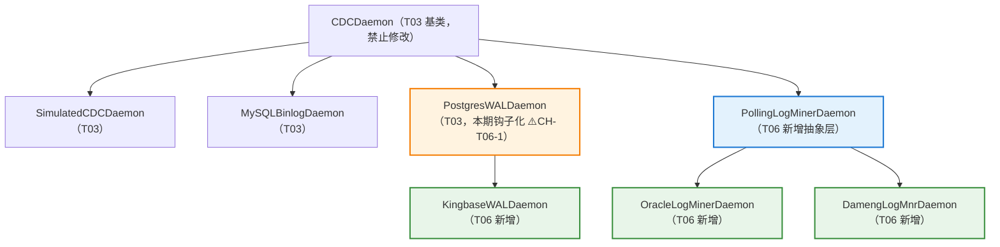
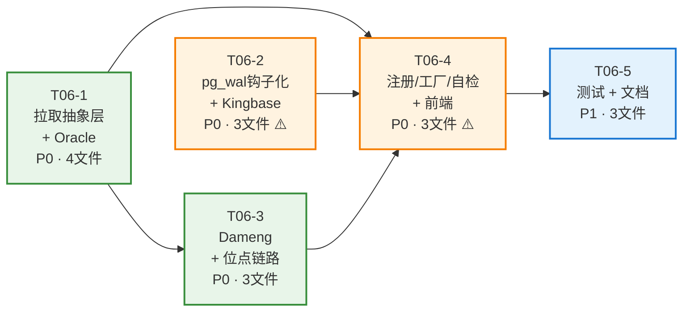

# T06 信创库 CDC 增量设计 + 任务列表

> 文档类型：增量设计（Incremental Design）+ 可执行任务分解
> 作者：高见远（Architect）
> 面向：寇豆码（Engineer）
> 上游依赖：`docs/rt-backup-prd.md`、`docs/rt-backup-design.md`、`docs/rt-backup-t02-t05-tasks.md`
> 配套图：`docs/rt-t06-class.mmd`、`docs/rt-t06-sequence.mmd`
> 范围：为 **Oracle / Kingbase / Dameng** 三种信创数据库补齐真实 CDC 守护（自研适配器轨道）

---

## 0. 执行摘要

| 项目 | 结论 |
|------|------|
| **本期目标** | 把 T03 中"后置"的三个信创库从 `deferred_engines` 转为真实 CDC 实现，接入既有 `CDCDaemon` 骨架 |
| **架构策略** | **零侵入扩展**：不改 `CDCDaemon` 基类、不改 `create_daemon()` 主流程，仅新增子类 + 注册表登记 |
| **技术分轨** | Kingbase 走**流式 push**（继承 PostgresWALDaemon）；Oracle / Dameng 走**拉取 pull**（新增 PollingLogMinerDaemon 抽象层） |
| **新增文件** | 5 个（`polling_base.py`、`oracle_logminer.py`、`kingbase_wal.py`、`dameng_logmnr.py`、`tests/test_rt_t06_cdc.py`） |
| **修改文件** | 8 个（`cdc/__init__.py`、`cdc/pg_wal.py`、`rt_backup/types.py`、`rt_backup/db_rt.py`、`core/probe.py`、`static/js/app.js`、`requirements.txt`、`tests/test_rt_t02_t05.py`） |
| **任务总数** | **5 个主任务**（T06-1 ~ T06-5），拆 21 个子步骤，建议分 **4 批**交付 |
| **设计变更** | 3 项（CH-T06-1 pg_wal 钩子化、CH-T06-2 位点列复用、CH-T06-3 前端可见列表补全），均已在下文标注 ⚠️ |
| **降级承诺** | 任何驱动缺失 / 客户端缺失 / 权限不足 / 非归档模式 → 一律降级 `SimulatedCDCDaemon` + `degrade_reason`，**永不抛异常到调用方** |

---

## 1. 技术选型判定

### 1.1 三库 CDC 机制对比与 MVP 路线

| 维度 | Oracle | Kingbase（人大金仓） | Dameng（达梦） |
|------|--------|---------------------|----------------|
| **日志机制** | Redo Log / Archive Log | WAL（PostgreSQL 同源） | Redo Log / 归档日志 |
| **官方 CDC 能力** | LogMiner（`DBMS_LOGMNR`）、XStream（需 GoldenGate 授权）、CDC 表（已废弃） | 物理/逻辑复制槽、`sys_receivewal` 流式接收 | `DBMS_LOGMNR`（Oracle 兼容包）、DMHS（需商业授权） |
| **MVP 选型** | ✅ **LogMiner + SCN 区间拉取** | ✅ **物理复制槽 + sys_receivewal 流式落盘** | ✅ **DM_LOGMNR + LSN 区间拉取** |
| **为何不选替代方案** | XStream/GoldenGate 需额外商业授权，客户环境不可假设；归档文件直搬需平台与 DB 同机或共享目录，可达性不可假设 | 逻辑复制槽需 `wal_level=logical` + 插件（pgoutput/wal2json），金仓版本差异大；物理槽 + 段文件最稳 | DMHS 需商业授权；文件直搬同样受可达性限制 |
| **交互形态** | **拉取式（pull）**，无常驻子进程 | **流式（push）**，常驻 `sys_receivewal` 子进程 | **拉取式（pull）**，无常驻子进程 |
| **产物形态** | `.jsonl` 逻辑变更段（含 SQL_REDO / SQL_UNDO） | 16MB WAL 物理段（24 位十六进制文件名） | `.jsonl` 逻辑变更段 |
| **位点语义** | SCN（单调递增整数） | LSN（`X/XXXXXXXX` 十六进制） | LSN（`V$RLOG.CUR_LSN`，单调递增整数） |

> **关键判定：为什么 LogMiner 远程可用？**
> `DBMS_LOGMNR.ADD_LOGFILE` 的文件路径是 **数据库服务端路径**，由 Oracle 服务进程读取；客户端只需连接后查询 `V$LOGMNR_CONTENTS` 视图。因此**平台与数据库不同机也能工作**，无需共享文件系统。达梦 `DBMS_LOGMNR` 同理。这是选它作为 MVP 的决定性原因。

### 1.2 类属性声明清单（工程师照此实现，逐字对齐）

| 类 | `engine_key` | `display_name` | `required_clients` | `is_simulated` | `seal_all_immediately` | `_import_driver()` 返回 |
|----|-------------|----------------|-------------------|----------------|------------------------|------------------------|
| `OracleLogMinerDaemon` | `"oracle_logminer"` | `"Oracle LogMiner 日志捕获"` | `[]`（纯驱动，无外部命令） | `False` | `True` | `oracledb` → 回落 `cx_Oracle` |
| `KingbaseWALDaemon` | `"kingbase_wal"` | `"Kingbase WAL 流式捕获"` | `["sys_receivewal"]`（`check_client()` 重写为"任一候选可用即可"） | `False` | `False`（沿用 PG 段完整性判定） | `ksycopg2` → 回落 `psycopg2` |
| `DamengLogMnrDaemon` | `"dameng_logmnr"` | `"达梦 DM_LOGMNR 日志捕获"` | `[]`（纯驱动） | `False` | `True` | `dmPython` |

> ⚠️ `required_clients = []` 时，基类 `check_client()` 需返回 `(True, "")`。请先确认 `core/cdc/base.py::check_client()` 对空列表的行为——若它对空列表返回 True 则无需改动；若不是，在**子类**重写 `check_client()`，**不要改基类**。

### 1.3 降级策略矩阵（统一契约）

| 触发条件 | 检出位置 | `degrade_reason` 文案（中文，直接面向用户） |
|---------|---------|-------------------------------------------|
| `DEMO_MODE=on` / `demo_only` / `rt_mode=sample` | `create_daemon()` 第 1、2 步（**已有，不改**） | 沿用现有文案 |
| Python 驱动未安装 | `is_available()` → `_import_driver()` | `未安装 oracledb 驱动，已降级为仿真日志流（pip install oracledb 后重启生效）` |
| 外部客户端缺失（Kingbase） | `check_client()` | `未找到 sys_receivewal / pg_receivewal 命令，已降级为仿真日志流` |
| 连接失败 / 认证失败 | `start()` → `_connect()` 抛异常 | 由 `DbRtCapture.start()` 既有 try 捕获，就地降级并写 `连接 Oracle 失败: {exc}` |
| 数据库非归档模式 | `start()` → `_probe_source()` | `Oracle 未开启 ARCHIVELOG 模式，无法捕获日志，已降级为仿真` |
| 缺少 LogMiner 权限 | `start()` → `_probe_source()` | `当前账号缺少 LOGMINING/SELECT ANY TRANSACTION 权限，已降级为仿真` |
| 达梦未安装系统包 | `start()` → `_ensure_packages()` | `达梦未安装 DBMS_LOGMNR 系统包，请以 SYSDBA 执行 SP_CREATE_SYSTEM_PACKAGES(1)，已降级为仿真` |
| 运行中连接断开 | `tick()` 捕获异常 | 记 `last_error`，`consecutive_fail++`，由 supervisor 既有重启策略处理；连续失败超阈值后 `DbRtCapture` 降级 |

**铁律**：`create_daemon()` 与三个守护的 `is_available()` / `check_client()` **绝不抛异常**，一律返回 `(False, 原因)`。

---

## 2. 架构增量总览

### 2.1 类继承结构（新增部分）



**为什么要新增 `PollingLogMinerDaemon` 抽象层？**

`CDCDaemon` 基类的 `is_alive()`、`_is_stalled()`、`_kill()` 全部围绕 **子进程模型（self.proc）** 设计，而 Oracle / Dameng 是"驱动连接 + 周期查询"的**无子进程**模型。若让两个守护各自重写这套逻辑，会出现大量重复代码且行为易漂移。因此在**基类之下、具体实现之上**插一层拉取式抽象，承载：

- `_running` 标志与 `is_alive()` 重写（不依赖 `self.proc`）
- 统一的"取位点 → 抽变更 → 原子写段 → 交给基类 seal"的 `tick()` 骨架
- 统一的段命名、位点持久化、连接生命周期管理

> ✅ 这是**在基类之下新增子类**，完全不触碰 `CDCDaemon`，符合"严禁重写基类"的约束。

### 2.2 数据流（Oracle 为例）

```mermaid
graph LR
    A["V$DATABASE.CURRENT_SCN<br/>取 to_scn"] --> B{"to_scn > last_scn?"}
    B -->|否| C["返回空，本轮无产物"]
    B -->|是| D["ADD_LOGFILE 挂载<br/>[from_scn, to_scn] 归档/在线日志"]
    D --> E["START_LOGMNR<br/>DICT_FROM_ONLINE_CATALOG"]
    E --> F["查 V$LOGMNR_CONTENTS<br/>过滤 SEG_OWNER / OPERATION"]
    F --> G["END_LOGMNR"]
    G --> H["原子写 inflight/<br/>ora_&lt;from&gt;_&lt;to&gt;.jsonl"]
    H --> I["基类 seal_ready_segments()<br/>seal_all_immediately=True"]
    I --> J["repo.seal(kind='db-log')"]
    J --> K["DbRtCapture._register_segments()"]
    K --> L["RecoveryJournal.append<br/>wal_lsn=from, wal_end_lsn=to"]
    L --> M["repo.save_state({'scn': to_scn})"]
```



---

## 3. 各守护详细设计

### 3.1 Oracle — `core/cdc/oracle_logminer.py`

#### 3.1.1 依赖与预检

| 项 | 内容 |
|----|------|
| **驱动优先级** | ① `oracledb`（新官方驱动，**thin 模式无需 Instant Client**，强烈推荐）② `cx_Oracle`（旧驱动，thick 模式需 Instant Client） |
| **连接串** | thin：`oracledb.connect(user=U, password=P, dsn=f"{host}:{port}/{service}")`；service 取 `task['database']` 或 `task['service_name']`，缺省回落 `ORCL` |
| **端口默认** | `1521`（`config.DEFAULT_PORTS['oracle']`） |
| **必需权限** | `SELECT ANY TRANSACTION`、`LOGMINING`（12c+）或 `EXECUTE_CATALOG_ROLE`（11g）、`SELECT ON V_$LOGMNR_CONTENTS`、`SELECT ON V_$ARCHIVED_LOG` |
| **数据库前置** | 必须 `ARCHIVELOG` 模式；**强烈建议**开启补充日志：`ALTER DATABASE ADD SUPPLEMENTAL LOG DATA;`（否则 UPDATE 的 SQL_REDO 可能缺主键定位条件） |

#### 3.1.2 关键 SQL 清单（工程师直接抄用）

```sql
-- ① 预检：归档模式
SELECT LOG_MODE FROM V$DATABASE;                    -- 期望 'ARCHIVELOG'
-- ② 预检：补充日志（不阻断，仅告警写 degrade_reason 附注）
SELECT SUPPLEMENTAL_LOG_DATA_MIN FROM V$DATABASE;   -- 期望 'YES'/'IMPLICIT'
-- ③ 当前位点
SELECT CURRENT_SCN FROM V$DATABASE;
-- ④ 区间内归档日志（挂载用）
SELECT NAME, SEQUENCE#, FIRST_CHANGE#, NEXT_CHANGE#
  FROM V$ARCHIVED_LOG
 WHERE STANDBY_DEST='NO' AND DELETED='NO' AND NAME IS NOT NULL
   AND NEXT_CHANGE# > :from_scn AND FIRST_CHANGE# <= :to_scn
 ORDER BY SEQUENCE#;
-- ⑤ 在线重做日志（补齐尚未归档的尾部）
SELECT L.GROUP#, F.MEMBER, L.FIRST_CHANGE#, L.NEXT_CHANGE#
  FROM V$LOG L JOIN V$LOGFILE F ON L.GROUP#=F.GROUP#
 WHERE L.NEXT_CHANGE# > :from_scn OR L.STATUS='CURRENT';
-- ⑥ 挂载 + 启动
BEGIN DBMS_LOGMNR.ADD_LOGFILE(LOGFILENAME=>:p, OPTIONS=>DBMS_LOGMNR.NEW/ADDFILE); END;
BEGIN DBMS_LOGMNR.START_LOGMNR(STARTSCN=>:f, ENDSCN=>:t,
      OPTIONS=>DBMS_LOGMNR.DICT_FROM_ONLINE_CATALOG
             + DBMS_LOGMNR.COMMITTED_DATA_ONLY
             + DBMS_LOGMNR.NO_ROWID_IN_STMT); END;
-- ⑦ 抽取变更
SELECT SCN, TIMESTAMP, SEG_OWNER, TABLE_NAME, OPERATION, SQL_REDO, SQL_UNDO
  FROM V$LOGMNR_CONTENTS
 WHERE OPERATION IN ('INSERT','UPDATE','DELETE','DDL')
   AND SEG_OWNER NOT IN ('SYS','SYSTEM','SYSAUX','XDB','DBSNMP','OUTLN')
 ORDER BY SCN;
-- ⑧ 收尾
BEGIN DBMS_LOGMNR.END_LOGMNR; END;
```

#### 3.1.3 类骨架

```python
class OracleLogMinerDaemon(PollingLogMinerDaemon):
    engine_key = "oracle_logminer"
    display_name = "Oracle LogMiner 日志捕获"
    required_clients = []          # 纯 Python 驱动，无外部命令依赖
    is_simulated = False
    seal_all_immediately = True    # 拉取式：每轮产物天然完整，可立即封存
    POSITION_LABEL = "SCN"
    DEFAULT_PORT = 1521
    SEGMENT_EXT = ".jsonl"

    # --- 抽象方法实现 ---
    def _import_driver(self) -> tuple:        # → (module, reason)
    def _connect(self):                       # → connection
    def _probe_source(self, conn) -> tuple:   # → (ok, reason)  归档模式/权限校验
    def _current_position_value(self, conn) -> str:   # → str(CURRENT_SCN)
    def _fetch_changes(self, conn, from_pos, to_pos) -> tuple:  # → (rows, actual_to)

    # --- 私有工具 ---
    def _dsn(self) -> str
    def _add_logfiles(self, conn, from_scn, to_scn) -> int
    def _start_logmnr(self, conn, from_scn, to_scn) -> None
    def _end_logmnr(self, conn) -> None       # 必须在 finally 中调用
```

#### 3.1.4 `start()` 实现要点（按序）

1. `state = self.repo.load_state() or {}`；`self.resume_from(state)` 恢复 `_last_pos`
2. `mod, reason = self._import_driver()`；失败 → `raise RuntimeError(reason)`（由 `DbRtCapture.start()` 捕获降级）
3. `self._conn = self._connect()`
4. `ok, reason = self._probe_source(self._conn)`；失败 → `self._close()` 后 `raise RuntimeError(reason)`
5. 若 `_last_pos` 为空 → 用当前 `CURRENT_SCN` 作为起点（**只捕获启动之后的变更**，避免首次拉全历史把磁盘打爆）
6. `self._start_pos = self._last_pos`；`self._running = True`；`self.started_at = db.now_iso()`
7. `self.logger.info("[rt.cdc] task=%s Oracle LogMiner 启动，起始 SCN=%s", ...)`

#### 3.1.5 位点结构

```python
def current_position(self) -> dict:
    return {
        "wal_lsn":     self._start_pos or "",   # 本段起始 SCN（复用列，见 CH-T06-2）
        "wal_end_lsn": self._last_pos or "",    # 本段结束 SCN
        "scn":         self._last_pos or "",    # 语义别名，供 UI/日志可读
        "position_kind": "scn",
    }

def source_position(self) -> dict:
    # 实时查库拿源端 SCN，用于 lag 估算；失败返回 {}
    return {"wal_end_lsn": scn, "scn": scn, "position_kind": "scn"}

def lag_seconds(self) -> int:
    # MVP：用「最后一次成功抽取时刻 → 现在」的墙钟差，而非 SCN 差
    # 理由：SCN 是逻辑时钟，与时间无固定换算关系
    # P1 增强：SELECT SCN_TO_TIMESTAMP(:scn) FROM DUAL 精确换算（需 10g+，且 SCN 需在 AWR 保留期内）
```

> ⚠️ `SCN_TO_TIMESTAMP` 对过旧 SCN 会抛 `ORA-08181`，必须 try/except 兜底回落墙钟差。

#### 3.1.6 段文件格式（`.jsonl`，每行一条变更）

```json
{"scn":"1245332","ts":"2026-08-01T10:22:31","owner":"APP","table":"ORDERS","op":"UPDATE","redo":"update \"APP\".\"ORDERS\" set ...","undo":"update \"APP\".\"ORDERS\" set ..."}
```

段文件头部写一行元信息（便于 PITR 阶段快速定位）：

```json
{"_meta":true,"engine":"oracle","task_id":12,"from_scn":"1245200","to_scn":"1245980","rows":347,"created_at":"2026-08-01T10:22:35"}
```

---

### 3.2 Kingbase — `core/cdc/kingbase_wal.py`

#### 3.2.1 判定：继承 `PostgresWALDaemon`，而非复制一份

Kingbase 是 PostgreSQL 演进版，WAL 段文件名规则（24 位十六进制）、`.partial` 语义、复制槽概念、流式接收工具行为**完全一致**。差异仅集中在 5 个点：

| 差异点 | PostgreSQL | Kingbase | 处理方式 |
|-------|-----------|----------|---------|
| 接收命令 | `pg_receivewal` | `sys_receivewal`（部分版本仍叫 `pg_receivewal`） | 类属性 `CLIENT_CANDIDATES` 元组，按序探测 |
| 默认端口 | 5432 | **54321** | 类属性 `DEFAULT_PORT` |
| 复制槽创建函数 | `pg_create_physical_replication_slot` | `sys_create_physical_replication_slot` | 类属性 `SLOT_CREATE_SQL` |
| 当前 LSN 函数 | `pg_current_wal_lsn()` | `sys_current_wal_lsn()`，V8R3 老版本为 `sys_current_xlog_location()` | 类属性 `CURRENT_LSN_SQL` + `_current_lsn_fallbacks()` 回落链 |
| 密码环境变量 | `PGPASSWORD` | `KINGBASEPASSWORD`（部分版本），同时兼容 `PGPASSWORD` | 类属性 `PASSWORD_ENV_KEYS` 元组，**全部注入** |
| Python 驱动 | `psycopg2` | `ksycopg2`（金仓官方）→ 协议兼容可回落 `psycopg2` | 重写 `_import_driver()` |

> **⚠️ 设计变更 CH-T06-1：`core/cdc/pg_wal.py` 钩子化重构**
> 现有 `PostgresWALDaemon` 把 `pg_receivewal`、SQL 语句、端口 5432、`PGPASSWORD` **硬编码**在方法体内。要让 Kingbase 通过继承复用，必须先把这些提取为**类属性 + 小钩子方法**。
> - 影响范围：仅 `core/cdc/pg_wal.py` 内部结构调整
> - 行为契约：**PostgreSQL 路径的对外行为必须逐字不变**（同样的命令、同样的 SQL、同样的环境变量）
> - 验收方式：现有 `tests/test_rt_t02_t05.py` 中 PG 相关用例必须全绿，不得修改断言
> - 若工程师评估重构风险过高，**备选方案**：新建 `KingbaseWALDaemon(CDCDaemon)` 独立实现（复制 ~200 行）。但**首选继承**，避免双份维护。

#### 3.2.2 `pg_wal.py` 需提取的钩子（改造清单）

```python
class PostgresWALDaemon(CDCDaemon):
    # === 新增类属性（PG 取现有硬编码值，保证行为不变）===
    CLIENT_CANDIDATES  = ("pg_receivewal",)
    DEFAULT_PORT       = 5432
    PASSWORD_ENV_KEYS  = ("PGPASSWORD",)
    SLOT_CREATE_SQL    = "SELECT pg_create_physical_replication_slot(%s)"
    SLOT_EXISTS_SQL    = "SELECT 1 FROM pg_replication_slots WHERE slot_name=%s"
    CURRENT_LSN_SQL    = "SELECT pg_current_wal_lsn()"

    # === 新增/改造钩子 ===
    @classmethod
    def _resolve_client(cls) -> str:
        """按 CLIENT_CANDIDATES 顺序 shutil.which，返回首个可用绝对路径，全无则返回 ''。"""

    @classmethod
    def check_client(cls) -> tuple:
        """改为基于 _resolve_client()，文案列出所有候选名。"""

    def _import_driver(self) -> tuple:
        """PG 返回 _import_psycopg2()；子类覆写。"""

    def _current_lsn_fallbacks(self) -> list:
        """返回 [CURRENT_LSN_SQL]；子类可追加老版本回落 SQL。"""

    def _auth_env(self) -> dict:
        """遍历 PASSWORD_ENV_KEYS 全部注入同一密码值。"""

    def _receive_cmd(self, binary: str, outdir: str) -> list:
        """把原 start() 中拼命令的代码抽出来，便于子类微调参数。"""
```

改造后 `start()`、`seal_ready_segments()`、`_position_for_segment()`、`lag_seconds()` **完全不需要在 Kingbase 子类重写**。

#### 3.2.3 Kingbase 子类骨架（预计 ~90 行）

```python
class KingbaseWALDaemon(PostgresWALDaemon):
    engine_key = "kingbase_wal"
    display_name = "Kingbase WAL 流式捕获"
    required_clients = ["sys_receivewal"]      # 展示用；实际探测走 CLIENT_CANDIDATES
    is_simulated = False

    CLIENT_CANDIDATES = ("sys_receivewal", "pg_receivewal")
    DEFAULT_PORT      = 54321
    PASSWORD_ENV_KEYS = ("KINGBASEPASSWORD", "KBPASSWORD", "PGPASSWORD")
    SLOT_CREATE_SQL   = "SELECT sys_create_physical_replication_slot(%s)"
    SLOT_EXISTS_SQL   = "SELECT 1 FROM sys_replication_slots WHERE slot_name=%s"
    CURRENT_LSN_SQL   = "SELECT sys_current_wal_lsn()"

    def _import_driver(self):
        """ksycopg2 优先 → psycopg2 回落 → (None, 中文原因)。"""

    def _current_lsn_fallbacks(self):
        return [
            "SELECT sys_current_wal_lsn()",
            "SELECT pg_current_wal_lsn()",
            "SELECT sys_current_xlog_location()",   # V8R3 及更早
        ]
```

> **金仓兼容性提示**：`sys_replication_slots` 视图在部分版本仍名为 `pg_replication_slots`。`_ensure_slot()` 中对 `SLOT_EXISTS_SQL` 查询失败时应 try 回落到 `pg_` 前缀版本，失败则跳过存在性检查直接尝试创建（创建时捕获"已存在"错误视为成功）。

#### 3.2.4 位点结构

与 PG 完全一致：`{"wal_lsn": "0/1A000060", "wal_end_lsn": "0/1B000000", "position_kind": "lsn"}`。**无需任何 db_rt.py 适配**——这是继承方案的额外红利。

---

### 3.3 Dameng — `core/cdc/dameng_logmnr.py`

#### 3.3.1 依赖与预检

| 项 | 内容 |
|----|------|
| **驱动** | `dmPython`（达梦官方 Python 驱动，需随 DM 客户端安装，**不在 PyPI**，`pip install` 不可得 → 缺失是常态，降级路径必须走通） |
| **连接** | `dmPython.connect(user=U, password=P, server=host, port=port)` |
| **端口默认** | `5236`（`config.DEFAULT_PORTS['dameng']`） |
| **必需权限** | `SYSDBA` 或具备 `SELECT ON V$LOGMNR_CONTENTS`、`EXECUTE ON DBMS_LOGMNR` |
| **数据库前置** | ① 归档模式开启：`SELECT ARCH_MODE FROM V$DATABASE` 期望 `'Y'`；② 系统包已安装：`SP_CREATE_SYSTEM_PACKAGES(1)`（幂等，可在预检时尝试调用并捕获异常） |

#### 3.3.2 关键 SQL 清单

```sql
-- ① 预检：归档模式
SELECT ARCH_MODE FROM V$DATABASE;                   -- 期望 'Y'
-- ② 预检：LOGMNR 包
SELECT COUNT(*) FROM ALL_OBJECTS WHERE OBJECT_NAME='DBMS_LOGMNR';
-- 缺失时（需 SYSDBA）：SP_CREATE_SYSTEM_PACKAGES(1);
-- ③ 当前位点（达梦当前重做 LSN）
SELECT CUR_LSN FROM V$RLOG;
-- ④ 归档日志文件列表
SELECT PATH, CLSN, CREATE_TIME FROM V$ARCH_FILE
 WHERE CLSN >= :from_lsn ORDER BY CLSN;
-- ⑤ 挂载 + 启动（达梦兼容 Oracle 语法）
DBMS_LOGMNR.ADD_LOGFILE(:path, DBMS_LOGMNR.NEW / DBMS_LOGMNR.ADDFILE);
DBMS_LOGMNR.START_LOGMNR(OPTIONS => 2109);   -- 达梦常用组合值，需按现场版本核实
-- ⑥ 抽取
SELECT SCN, START_TIME, OPERATION, SEG_OWNER, TABLE_NAME, SQL_REDO, SQL_UNDO
  FROM V$LOGMNR_CONTENTS
 WHERE SCN > :from_lsn AND SCN <= :to_lsn
   AND OPERATION IN ('INSERT','UPDATE','DELETE')
 ORDER BY SCN;
-- ⑦ 收尾
DBMS_LOGMNR.END_LOGMNR();
```

> **⚠️ 达梦版本差异大**（DM7 / DM8、不同 build 的 `V$ARCH_FILE` 字段名与 `START_LOGMNR` OPTIONS 取值可能不同）。实现时**所有 SQL 都要 try/except 包裹**，任一失败即记 `degrade_reason` 并降级仿真，**不允许把异常抛到 supervisor**。

#### 3.3.3 类骨架（与 Oracle 同构，共用 `PollingLogMinerDaemon`）

```python
class DamengLogMnrDaemon(PollingLogMinerDaemon):
    engine_key = "dameng_logmnr"
    display_name = "达梦 DM_LOGMNR 日志捕获"
    required_clients = []
    is_simulated = False
    seal_all_immediately = True
    POSITION_LABEL = "LSN"
    DEFAULT_PORT = 5236
    SEGMENT_EXT = ".jsonl"

    def _import_driver(self) -> tuple      # dmPython，缺失文案要说明"需随达梦客户端安装"
    def _connect(self)
    def _probe_source(self, conn) -> tuple # ARCH_MODE + DBMS_LOGMNR 包
    def _current_position_value(self, conn) -> str   # V$RLOG.CUR_LSN
    def _fetch_changes(self, conn, from_pos, to_pos) -> tuple
    def _ensure_packages(self, conn) -> bool
    def _add_arch_files(self, conn, from_lsn) -> int
```

#### 3.3.4 位点结构

```python
{"wal_lsn": "<from_lsn>", "wal_end_lsn": "<to_lsn>", "dm_lsn": "<to_lsn>", "position_kind": "dm_lsn"}
```

---

### 3.4 新增抽象层 — `core/cdc/polling_base.py`

```python
class PollingLogMinerDaemon(CDCDaemon):
    """拉取式 CDC 守护抽象基类（Oracle / Dameng 共用）。

    与流式守护的区别：无常驻子进程，靠 tick() 周期性连库抽取变更并落盘成段。
    子类只需实现 5 个抽象钩子，生命周期/位点/落盘/封存全部由本层统一处理。
    """
    seal_all_immediately = True
    POSITION_KEY   = "wal_lsn"       # 复用 recovery_journal 既有位点列（CH-T06-2）
    POSITION_LABEL = "POS"           # UI 展示前缀：SCN / LSN
    SEGMENT_EXT    = ".jsonl"
    FETCH_LIMIT    = 5000            # 单轮最多抽取行数，防内存打爆
    MAX_SEGMENT_BYTES = 64 * 1024 * 1024   # 单段上限，超出即切段

    # ---- 生命周期 ----
    def start(self):
        """① load_state → resume_from ② _import_driver ③ _connect
           ④ _probe_source ⑤ 无位点则以当前位点为起点 ⑥ _running=True"""

    def tick(self) -> list:
        """① 取 to_pos ② 无新变更则返回 [] ③ _fetch_changes
           ④ _write_segment（原子写）⑤ 更新 _last_pos ⑥ 返回段路径列表
           全程 try/except，异常写 last_error 并返回 []，不外抛。"""

    def stop(self):
        """seal_ready_segments(force=True) → _close() → _running=False"""

    def is_alive(self) -> bool:
        return bool(self._running)          # ⚠️ 不依赖 self.proc

    # ---- 位点 ----
    def resume_from(self, position: dict):
        """从 state 中按 POSITION_KEY / 'wal_end_lsn' / POSITION_LABEL.lower() 依次取值。"""

    def current_position(self) -> dict
    def source_position(self) -> dict
    def lag_seconds(self) -> int            # 默认：now - 最后成功抽取时刻（墙钟差）

    # ---- 落盘 ----
    def _write_segment(self, rows, pos_from, pos_to) -> str:
        """写到 repo.inflight_dir()，先写 .tmp 再 os.replace（共享知识 #2 原子写）。
           首行写 _meta 元信息行，随后逐行 json.dumps(ensure_ascii=False)。"""

    def _segment_name(self, pos_from, pos_to) -> str:
        """f"{engine_key}_{seq:06d}_{pos_from}_{pos_to}{SEGMENT_EXT}"，seq 单调递增。"""

    # ---- 抽象钩子（子类必须实现）----
    def _import_driver(self) -> tuple:               raise NotImplementedError
    def _connect(self):                              raise NotImplementedError
    def _probe_source(self, conn) -> tuple:          raise NotImplementedError
    def _current_position_value(self, conn) -> str:  raise NotImplementedError
    def _fetch_changes(self, conn, from_pos, to_pos) -> tuple:  raise NotImplementedError
```

---

## 4. 与 T03 代码的衔接点（逐文件）

| # | 文件 | 位置 | 改动内容 | 风险 |
|---|------|------|---------|------|
| S1 | `core/cdc/__init__.py` | 顶部 import | 新增 3 行惰性 import（放 try/except 中，任一模块导入失败不影响其余引擎） | 低 |
| S2 | `core/cdc/__init__.py` | `CDC_REGISTRY` | 追加 `oracle_logminer` / `kingbase_wal` / `dameng_logmnr` 三项 | 低 |
| S3 | `core/cdc/__init__.py` | `ENGINE_DAEMON_MAP` | 追加 `"oracle"`、`"kingbase"`、`"dameng"` 三个 db_type 映射 | 低 |
| S4 | `core/cdc/__init__.py` | `create_daemon()` | **不改主流程**。第 3 步 `ENGINE_DAEMON_MAP.get(engine)` 自动命中新实现 | 无 |
| S5 | `core/cdc/__init__.py` | 第 96 行降级文案 | `"（已排期：Oracle/Kingbase/Dameng）"` 改为 `"（当前支持：MySQL/MariaDB/PostgreSQL/Oracle/Kingbase/Dameng）"` | 低 |
| S6 | `core/cdc/__init__.py` | `probe_clients()` | ① implementations 遍历列表加 3 个新类 ② `deferred_engines` 由 `["oracle","kingbase","dameng"]` 改为 `[]` ③ `optional_packages` 追加 `oracledb`、`dmPython`、`ksycopg2` 三项 | **中**（现有测试断言 `deferred_engines`，需同步改） |
| S7 | `core/cdc/pg_wal.py` | 类属性 + 6 个钩子 | ⚠️ CH-T06-1 钩子化重构，PG 行为零变更 | **中** |
| S8 | `core/cdc/__init__.py` | 文档字符串 | 更新模块 docstring 的选择策略说明（第 5-16 行），移除"本期后置"表述 | 无 |
| S9 | `core/rt_backup/types.py` | `STREAMABLE_ENGINES` | ⚠️ 由 `("mysql","mariadb","postgresql")` 扩展为 `("mysql","mariadb","postgresql","oracle","kingbase","dameng")` | 低（已确认该常量仅被 `RtConfig.can_stream` 使用，未被 supervisor 强制校验） |
| S10 | `core/rt_backup/db_rt.py` | `_daemon_position_fields()`（第 523-536 行） | Oracle/Dameng 位点复用 `wal_lsn`/`wal_end_lsn` 列，**当前代码已能正确映射**，仅需确认字符串化。若要加 `position_kind` 展示需在 payload 中额外带 | 低 |
| S11 | `core/rt_backup/db_rt.py` | `health()` label 分支（第 565-573 行） | 追加分支：`position.get("position_kind")` 为 `scn`/`dm_lsn` 时，label 加前缀 `SCN:` / `LSN:` | 低 |
| S12 | `core/rt_backup/db_rt.py` | `_persist_state()`（第 614-619 行） | `last_wal_lsn` 已能承接 SCN/DM_LSN，**无需改**；仅确认非空判断 | 无 |
| S13 | `core/probe.py` | `_DB_PROBES` | `oracle`/`kingbase`/`dameng` 三项由 `_probe_unimplemented` 改为真实探测（复用各自 `check_client()` + 驱动可用性） | 低 |
| S14 | `static/js/app.js` | 第 ~256-280 行 | ⚠️ CH-T06-3：可见列表 `["mysql","mariadb","postgresql","kingbase"]` → 追加 `"oracle"`、`"dameng"` | 低 |
| S15 | `templates/rt_timeline.html` | 位点展示区 | 位点标签文案适配（`binlog`/`WAL`/`SCN`/`LSN`），**颜色必须引用 `static/css/app.css` Design Tokens，禁止硬编码色值** | 低 |
| S16 | `requirements.txt` | 尾部 | 追加 4 行可选依赖注释（见 §5） | 无 |
| S17 | `tests/test_rt_t02_t05.py` | `test_probe_clients_reports_capabilities` | `deferred_engines` 断言从"含三库"改为"为空"；工厂遍历列表可扩展 | **中**（必须同步，否则回归红） |

### 4.1 **不需要**改的地方（明确划界，防止工程师过度改动）

| 文件/位置 | 为何不改 |
|----------|---------|
| `core/cdc/base.py` | **绝对禁止修改**。所有差异通过子类吸收 |
| `core/cdc/__init__.py::create_daemon()` 主流程 | 第 1、2 步（DEMO/sample 判定）与第 3 步选型逻辑完全通用，注册即生效 |
| `core/rt_backup/supervisor.py` | `_build_worker` 按 `db_type` 判 file/db，db 类一律走 `DbRtCapture`，三库已覆盖 |
| `core/rt_backup/repo.py` | `seal(kind="db-log")` 与段文件格式无关 |
| `api/rt.py` | `/api/rt/capabilities` 透传 `probe_clients()` 结果，字段结构未变 |
| 数据库 Schema（`recovery_journal` / `rt_capture_state`） | ⚠️ CH-T06-2 决策：**复用 `wal_lsn` / `wal_end_lsn` 列**存 SCN 与 DM_LSN，零迁移 |
| `templates/tasks.html` | 下拉已含 oracle/kingbase/dameng，无需改 |

> **⚠️ 设计变更 CH-T06-2：位点列复用决策**
> Oracle SCN 与 Dameng LSN 都是**单调递增的整数型逻辑位点**，与 PostgreSQL LSN 语义等价（都是"日志中的一个可比较的点"）。为避免 Schema 迁移带来的升级风险（共享知识 #5 迁移模式成本），决定 **复用 `wal_lsn` / `wal_end_lsn` 两列**，通过守护返回的 `position_kind` 字段（`lsn` / `scn` / `dm_lsn`）在 UI 层区分展示前缀。
> 代价：SQL 层无法按引擎类型直接过滤位点语义。评估结论：可接受——`recovery_journal` 查询一律带 `task_id`，而任务的 `db_type` 唯一确定位点语义。

---

## 5. 依赖包清单

### 5.1 `requirements.txt` 追加内容

```
# ---- T06 信创库 CDC（全部可选，缺失自动降级仿真，不影响平台启动）----
# oracledb>=2.0.0        # Oracle LogMiner CDC；thin 模式无需 Instant Client，推荐
# cx_Oracle>=8.3.0       # Oracle 旧驱动（thick 模式，需 Instant Client），oracledb 的回落
# psycopg2-binary>=2.9.9 # Kingbase LSN 探测（与 PostgreSQL 共用；金仓协议兼容）
# ksycopg2               # 人大金仓官方驱动，随 Kingbase 客户端提供，非 PyPI 包
# dmPython               # 达梦官方驱动，随达梦客户端安装（DM 安装目录 /drivers/python），非 PyPI 包
#
# 外部命令（非 Python 包，需现场安装数据库客户端）：
#   sys_receivewal / pg_receivewal  —— Kingbase WAL 流式接收（Kingbase bin 目录或 PG 客户端）
#   Oracle / Dameng 无外部命令依赖，纯驱动实现
```

> **重要**：全部**注释掉**，与现有 `mysql-replication` / `psycopg2` 的处理方式保持一致。原因：`ksycopg2` 与 `dmPython` **不在 PyPI**，若写成非注释行会导致 `pip install -r requirements.txt` 整体失败，破坏平台安装体验。

### 5.2 惰性导入实现规范（共享知识 #7）

```python
_ORACLE_DRIVER = None
_ORACLE_REASON = ""

def _import_oracledb():
    """惰性导入 Oracle 驱动，结果缓存。返回 (module, reason)。绝不抛异常。"""
    global _ORACLE_DRIVER, _ORACLE_REASON
    if _ORACLE_DRIVER is not None or _ORACLE_REASON:
        return _ORACLE_DRIVER, _ORACLE_REASON
    for name in ("oracledb", "cx_Oracle"):
        try:
            mod = __import__(name)
            _ORACLE_DRIVER = mod
            return mod, ""
        except Exception:
            continue
    _ORACLE_REASON = "未安装 oracledb / cx_Oracle 驱动（pip install oracledb）"
    return None, _ORACLE_REASON
```

**规范要点**：① 模块级缓存，避免每次 tick 重复 import ② 遍历候选驱动 ③ 失败返回中文原因，**不 raise** ④ 与现有 `_import_psycopg2()` / `_import_mysql_replication()` 签名一致。

---

## 6. 共享知识（T06 补充，与 T03 契约一致）

沿用 `docs/rt-backup-design.md` §8 共享知识 #1-16，本期**新增 5 条**：

| # | 约定 | 说明 |
|---|------|------|
| **#17** | **降级永不抛异常** | 三个守护的 `check_client()` / `is_available()` / `_import_driver()` 全部返回 `(ok, 中文原因)`，绝不 raise。仅 `start()` 允许 raise，由 `DbRtCapture.start()` 既有 try 捕获并就地降级仿真 |
| **#18** | **位点统一走 `wal_lsn` / `wal_end_lsn` 列** | Oracle SCN、Dameng LSN、PG/Kingbase LSN 共用两列；守护额外返回 `position_kind ∈ {lsn, scn, dm_lsn, binlog}` 供 UI 区分前缀 |
| **#19** | **拉取式守护 `is_alive()` 不看 `self.proc`** | `PollingLogMinerDaemon` 及其子类以 `self._running` 为准；`DbRtCapture` / supervisor 的探活调用 `daemon.is_alive()`，天然兼容 |
| **#20** | **逻辑段文件格式统一 `.jsonl`** | 首行 `{"_meta": true, ...}` 元信息，其后每行一条变更。UTF-8 无 BOM，`ensure_ascii=False`。写入走"先 `.tmp` 后 `os.replace`"的原子写（共享知识 #2） |
| **#21** | **单轮抽取上限保护** | `FETCH_LIMIT=5000` 行 + `MAX_SEGMENT_BYTES=64MB`，超限则本轮只推进到已抽取位置，剩余留给下一轮。防止首次启动或长时间停机后一次性拉爆内存/磁盘（对应设计文档风险 R8 磁盘配额） |

### 6.1 沿用的既有约定（工程师务必遵守，此处仅列与 T06 强相关者）

- **#2 原子写**：所有段文件、state 文件必须"临时文件 + `os.replace`"
- **#3 时间戳**：一律 `db.now_iso()`，禁止 `datetime.now().isoformat()`
- **#4 DB 写入**：一律走 `core.db.execute` / `query`，禁止裸 `sqlite3`
- **#7 惰性 import**：可选驱动全部延迟到实际调用时导入
- **#8 DEMO 兜底**：`DEMO_MODE=on` 时**绝不建立任何真实数据库连接**
- **#16 日志脱敏**：`_popen()` 记录命令行时必须掩码密码；LogMiner 的 `SQL_REDO` 可能含敏感数据 —— **段文件本身不脱敏**（PITR 需要原文），但**日志输出中禁止打印 SQL_REDO 内容**，只打印行数与位点区间

---

## 7. 任务列表

> **交付原则**：按"能独立自测的功能切片"分组，共 **5 个主任务**。T06-1 与 T06-2 无相互依赖，可并行开工。

### T06-1 — 拉取式 CDC 抽象层 + Oracle LogMiner 守护 【P0】

| 项 | 内容 |
|----|------|
| **源文件** | 新建 `core/cdc/polling_base.py`、新建 `core/cdc/oracle_logminer.py`、修改 `core/rt_backup/types.py`、修改 `requirements.txt` |
| **预估文件数** | 4（新建 2 / 修改 2） |
| **依赖** | 无（可立即开工） |
| **预估代码量** | polling_base ~260 行，oracle_logminer ~280 行 |

**子步骤**：

1. 新建 `core/cdc/polling_base.py`，按 §3.4 骨架实现 `PollingLogMinerDaemon`。重点：`is_alive()` 返回 `_running`；`tick()` 全 try/except；`_write_segment()` 原子写。
2. 新建 `core/cdc/oracle_logminer.py`：`_import_oracledb()` 模块级惰性导入（§5.2）+ `OracleLogMinerDaemon` 类。
3. 实现 `_probe_source()`：查 `V$DATABASE.LOG_MODE`，非 `ARCHIVELOG` 返回 `(False, 中文原因)`；查 `SUPPLEMENTAL_LOG_DATA_MIN`，非 YES 时不阻断，只在 `degrade_reason` 追加提示。
4. 实现 `_fetch_changes()`：ADD_LOGFILE → START_LOGMNR → 查 `V$LOGMNR_CONTENTS` → **`finally` 中 END_LOGMNR**（务必，否则会话残留 LogMiner 上下文）。
5. 修改 `core/rt_backup/types.py`：`STREAMABLE_ENGINES` 扩展为六元组（⚠️ CH-T06-1 关联变更）。
6. 修改 `requirements.txt`：追加 §5.1 注释块。

**验收标准**：
- `python -c "from core.cdc.oracle_logminer import OracleLogMinerDaemon as C; print(C.engine_key, C.display_name, C.required_clients, C.is_simulated)"` 输出正确
- 无 `oracledb` 环境下 `OracleLogMinerDaemon.is_available({})` 返回 `(False, "未安装 oracledb...")` 且**不抛异常**
- `RtConfig.from_task({"db_type":"oracle"}).can_stream` 返回 `True`

---

### T06-2 — pg_wal 钩子化重构 + Kingbase WAL 守护 【P0】⚠️ 含设计变更

| 项 | 内容 |
|----|------|
| **源文件** | 修改 `core/cdc/pg_wal.py`（⚠️ CH-T06-1）、新建 `core/cdc/kingbase_wal.py`、修改 `core/probe.py`（kingbase 分支） |
| **预估文件数** | 3（新建 1 / 修改 2） |
| **依赖** | 无（可与 T06-1 并行） |
| **预估代码量** | pg_wal 改动 ~70 行，kingbase_wal ~90 行 |

**子步骤**：

1. **重构 `pg_wal.py`**：按 §3.2.2 清单提取 6 个类属性 + 6 个钩子方法。**每提取一个立刻跑一遍 PG 相关测试**，确保行为零变更。
2. 新建 `core/cdc/kingbase_wal.py`：`KingbaseWALDaemon(PostgresWALDaemon)`，仅覆写类属性 + `_import_driver()` + `_current_lsn_fallbacks()`。
3. `_ensure_slot()` 兼容处理：`sys_replication_slots` 查询失败时回落 `pg_replication_slots`；创建槽时捕获"已存在"错误视为成功。
4. 修改 `core/probe.py` 的 `_DB_PROBES["kingbase"]`：由 `_probe_unimplemented` 改为调用 `KingbaseWALDaemon.check_client()`（惰性 import，失败静默）。

**验收标准**：
- 现有 `tests/test_rt_t02_t05.py` 中所有 PG 用例**不修改断言即全绿**
- `KingbaseWALDaemon.CLIENT_CANDIDATES == ("sys_receivewal","pg_receivewal")`，`DEFAULT_PORT == 54321`
- 无客户端环境下 `check_client()` 返回 `(False, "未找到 sys_receivewal / pg_receivewal ...")`
- `_auth_env()` 返回的 dict 同时包含 `KINGBASEPASSWORD` 与 `PGPASSWORD` 键

---

### T06-3 — Dameng DM_LOGMNR 守护 + 位点链路打通 【P0】

| 项 | 内容 |
|----|------|
| **源文件** | 新建 `core/cdc/dameng_logmnr.py`、修改 `core/rt_backup/db_rt.py`、修改 `core/probe.py`（oracle/dameng 分支） |
| **预估文件数** | 3（新建 1 / 修改 2） |
| **依赖** | **T06-1**（复用 `PollingLogMinerDaemon`） |
| **预估代码量** | dameng_logmnr ~260 行，db_rt 改动 ~25 行 |

**子步骤**：

1. 新建 `core/cdc/dameng_logmnr.py`，继承 `PollingLogMinerDaemon`，按 §3.3 实现。**所有 SQL 单独 try/except**（达梦版本差异大）。
2. `_ensure_packages()`：检测 `DBMS_LOGMNR` 是否存在；不存在时**不自动执行** `SP_CREATE_SYSTEM_PACKAGES`（需 SYSDBA，有副作用），改为返回 False + 明确的中文操作指引写入 `degrade_reason`。
3. 修改 `db_rt.py::health()` 第 565-573 行 label 分支：按 `position_kind` 加前缀（`SCN:` / `LSN:`），保持 binlog/wal 既有分支不变。
4. 修改 `db_rt.py::_daemon_position_fields()`：确认 SCN/DM_LSN 经 `str()` 正确落入 `wal_lsn`/`wal_end_lsn`；如需透传 `position_kind` 到 journal payload，仅在**内存 health** 中使用，**不写库**（避免 Schema 变更）。
5. 修改 `core/probe.py` 的 `_DB_PROBES["oracle"]` 与 `["dameng"]`：改为基于驱动可用性的真实探测。

**验收标准**：
- 无 `dmPython` 环境下 `DamengLogMnrDaemon.is_available({})` 返回 `(False, "...随达梦客户端安装...")` 且不抛异常
- 构造一个位点 `{"wal_lsn":"100","wal_end_lsn":"200","position_kind":"scn"}`，`_daemon_position_fields()` 正确产出 `{"wal_lsn":"100","wal_end_lsn":"200"}`
- `health().position_label == "SCN:200"`

---

### T06-4 — 注册表 / 工厂 / 自检集成 + 前端类型可见性 【P0】

| 项 | 内容 |
|----|------|
| **源文件** | 修改 `core/cdc/__init__.py`、修改 `static/js/app.js`（⚠️ CH-T06-3）、修改 `templates/rt_timeline.html` |
| **预估文件数** | 3 |
| **依赖** | **T06-1、T06-2、T06-3** |
| **预估代码量** | `__init__.py` 改动 ~60 行，前端 ~20 行 |

**子步骤**：

1. `core/cdc/__init__.py` 顶部新增 3 个 import，**逐个包在 try/except 中**并提供 None 兜底——任一模块导入失败（例如语法错误、驱动 import 副作用）不得拖垮 MySQL/PG 既有能力。
2. 注册 `CDC_REGISTRY` 三项 + `ENGINE_DAEMON_MAP` 三项（值为 None 时跳过注册，自动回落仿真）。
3. 更新 `__all__`、模块 docstring（第 5-16 行选择策略表）、第 96 行降级文案。
4. `probe_clients()`：implementations 遍历列表加 3 类；`deferred_engines` 改为 `[]`；`optional_packages` 追加 `oracledb`、`ksycopg2`、`dmPython` 三项（结构与现有 `psycopg2` 项完全一致：`installed` / `reason` / `hint`）。
5. `static/js/app.js` 第 ~256-280 行：数据库选择器可见列表补 `"oracle"`、`"dameng"`（⚠️ CH-T06-3）。核对第 ~2089-2132 行三库默认参数映射端口是否为 1521 / 54321 / 5236。
6. `templates/rt_timeline.html`：守护状态栏位点标签支持 SCN/LSN 文案。**颜色一律引用 `static/css/app.css` 的 Design Tokens（CSS 变量），严禁硬编码色值**。

**验收标准**：
- `python -c "from core.cdc import probe_clients; import json; print(json.dumps(probe_clients(), ensure_ascii=False, indent=2))"` 输出含 6 个 implementations、`deferred_engines: []`、5 个 optional_packages
- `GET /api/rt/capabilities` 返回结构不破坏前端渲染
- 手动把 `oracle_logminer.py` 改出语法错误 → 平台仍能正常启动，MySQL/PG 能力不受影响（**故障隔离验证，必做**）
- 任务编辑页数据库类型下拉可见 6 类，选中 oracle/dameng 后端口自动填 1521/5236

---

### T06-5 — 测试与文档收口 【P1】

| 项 | 内容 |
|----|------|
| **源文件** | 新建 `tests/test_rt_t06_cdc.py`、修改 `tests/test_rt_t02_t05.py`、修改 `docs/rt-backup-design.md` |
| **预估文件数** | 3 |
| **依赖** | **T06-4** |
| **预估代码量** | 新测试 ~280 行 |

**子步骤**：

1. 新建 `tests/test_rt_t06_cdc.py`，覆盖 4 组：
   - `TestT06Registry`：三个 engine_key 在 `CDC_REGISTRY` 中；`ENGINE_DAEMON_MAP` 三个 db_type 命中正确类；`supported_engines()` 含六项
   - `TestT06Degrade`：DEMO_MODE=on 时三个 db_type 一律得 `SimulatedCDCDaemon`；驱动缺失时 `is_available()` 返回 `(False, 非空中文原因)` 且不抛异常
   - `TestT06Position`：Mock 位点字典，验证 `_daemon_position_fields()` 映射与 `health().position_label` 前缀
   - `TestT06Probe`：`probe_clients()` 的 `deferred_engines == []`、`optional_packages` 含 `oracledb`/`dmPython`/`ksycopg2`
2. 修改 `tests/test_rt_t02_t05.py::test_probe_clients_reports_capabilities`：`deferred_engines` 断言同步为空列表；工厂遍历列表扩展为六个 db_type。
3. 修改 `docs/rt-backup-design.md`：追加 §T06 章节（引用本文档），更新 §8 共享知识增补 #17-#21，更新风险表（新增 R13 达梦版本兼容性、R14 LogMiner 会话资源占用）。

**验收标准**：
- `python -m pytest tests/ -q` 全绿，**无新增 warning**
- 测试全程不需要真实 Oracle/Kingbase/Dameng 环境（全 Mock + 降级路径）

---

## 8. 任务依赖图



---

## 9. 实现顺序总览与批次交付建议

| 批次 | 任务 | 可并行 | 交付物 | 自测方式 | 建议节奏 |
|------|------|--------|--------|---------|---------|
| **批次 A** | T06-1 + T06-2 | ✅ 两者无依赖 | 拉取抽象层、Oracle 守护、Kingbase 守护、pg_wal 钩子化 | ① 三个类可 import ② 无驱动时 `is_available()` 优雅返回 False ③ **PG 既有测试不改断言即全绿** | 先交 A，验收通过再进 B |
| **批次 B** | T06-3 | — | Dameng 守护、位点 label 链路 | 位点映射单测 + `health()` 前缀验证 | — |
| **批次 C** | T06-4 | — | 注册表/工厂/自检打通、前端六类可见 | `probe_clients()` 输出核验 + **故障隔离验证**（人为改坏一个新模块，平台仍启动） | 关键批次，含用户可见变更 |
| **批次 D** | T06-5 | — | 完整测试套 + 设计文档更新 | `pytest tests/ -q` 全绿 | 收口 |

**为什么 T06-2 排在批次 A 而非最后？**
`pg_wal.py` 钩子化是本期**唯一触碰既有稳定代码**的改动，风险最高。越早做，回归验证的时间窗越长；若发现风险不可控，还有时间切换到"独立实现"备选方案（§3.2.1 末）。**不要把它压到最后一批**。

### 9.1 工作量估算

| 任务 | 新增行数（估） | 修改行数（估） | 建议投入 |
|------|--------------|--------------|---------|
| T06-1 | ~540 | ~10 | 1.5 人日 |
| T06-2 | ~90 | ~80 | 1.0 人日 |
| T06-3 | ~260 | ~30 | 1.0 人日 |
| T06-4 | ~20 | ~80 | 0.5 人日 |
| T06-5 | ~280 | ~30 | 0.5 人日 |
| **合计** | **~1190** | **~230** | **4.5 人日** |

---

## 10. 设计变更登记

| 变更号 | 内容 | 影响 | 缓解措施 |
|-------|------|------|---------|
| **⚠️ CH-T06-1** | `core/cdc/pg_wal.py` 钩子化重构（硬编码值提为类属性 + 6 个钩子方法），以支持 Kingbase 继承复用 | 触碰 T03 已稳定代码，PG 路径存在回归风险 | ① 行为契约"逐字不变" ② 现有 PG 测试不改断言必须全绿 ③ 排在最早批次留足回归时间 ④ 备选方案：Kingbase 独立实现（复制 ~200 行） |
| **⚠️ CH-T06-2** | Oracle SCN / Dameng LSN **复用** `recovery_journal.wal_lsn` / `wal_end_lsn` 列，不新增列、不做 Schema 迁移 | SQL 层无法按位点语义直接区分引擎 | 通过 `position_kind` 在**内存/UI 层**区分；`task_id` 已唯一确定 `db_type`，语义可推导 |
| **⚠️ CH-T06-3** | `static/js/app.js` 数据库选择器可见列表由 4 类补齐为 6 类（追加 `oracle`、`dameng`） | 用户可见能力扩大；若后端降级仿真，用户可能误以为是真实捕获 | 时间轴页与任务详情页必须显著展示 `degrade_reason`（黄色提示，T03 已有机制），文案明确写"当前为仿真日志流" |
| **附带** | `STREAMABLE_ENGINES` 由三元组扩为六元组 | 已核实该常量仅被 `RtConfig.can_stream` 引用，未参与强制校验 | 低风险，随 T06-1 交付 |
| **附带** | `probe_clients().deferred_engines` 由 `["oracle","kingbase","dameng"]` 改为 `[]` | 现有测试断言需同步 | T06-5 中同步修改 |

---

## 11. 待明确事项（请主理人齐活林拍板）

| 编号 | 问题 | 架构师建议默认值 | 影响面 |
|------|------|----------------|--------|
| **Q1** | 三库是否有**真实测试环境**可供联调？若无，交付验收只能覆盖"降级路径 + 契约正确性"，真实抽取逻辑需现场调试 | **默认无真实环境**：本期交付以"代码结构 + 降级路径 + 单元测试"为验收基线，真实联调列为现场实施项 | 验收标准 |
| **Q2** | Oracle 首次启动时，是否需要**回溯捕获**启动前的历史归档日志？ | **默认否**：以启动时刻 `CURRENT_SCN` 为起点，只捕获此后变更。理由：回溯可能拉取数 GB 日志打爆磁盘（风险 R8） | RPO 语义 |
| **Q3** | `.jsonl` 逻辑段的 **PITR 回放** 由谁实现？本期是否需要？ | **默认本期不含**：T06 只做"捕获与封存"，回放（`pitr.py` 的 oracle/kingbase/dameng 分支）另开 T07。当前 `pitr.py` 的 `_MYSQL_ENGINES`/`_PG_ENGINES` 不含三库，会返回"暂不支持 PITR"——**这是预期行为** | 范围边界 ⚠️ |
| **Q4** | Kingbase 是否也应纳入 `pitr.py::_PG_ENGINES`？（同源，`sys_restore`/WAL 回放机制与 PG 一致） | **默认否，但建议单列**：Kingbase 与 PG 同源，回放大概率可复用，但需真实环境验证。建议 T07 一并处理，本期不动 `pitr.py` | 范围边界 |
| **Q5** | LogMiner 抽取是否需要**表级过滤**（只捕获业务 Schema）？ | **默认排除系统 Schema**（SYS/SYSTEM/SYSAUX/XDB/DBSNMP/OUTLN），不做用户级白名单配置 | 段体积 |
| **Q6** | `dmPython` / `ksycopg2` 不在 PyPI，现场如何安装？是否需要平台内提供**安装向导页**？ | **默认仅在自检面板给文字指引**（"请从达梦客户端安装目录 /drivers/python 执行 setup.py install"），不做向导页 | 用户体验 |
| **Q7** | LogMiner 会话在长时间运行下的**资源占用**（PGA、临时表空间）是否需要设上限并周期重连？ | **默认每 N 轮重连一次**（N=50，可配 `RT_LOGMNR_RECONNECT_ROUNDS`），并在每轮 `finally` 中 `END_LOGMNR` 释放上下文 | 稳定性（风险 R14） |

---

## 12. 风险登记（增补）

| 编号 | 风险 | 等级 | 应对 |
|------|------|------|------|
| **R13** | 达梦版本差异大（DM7/DM8、不同 build），`V$ARCH_FILE` 字段名与 `START_LOGMNR` OPTIONS 取值可能不同 | 高 | 全部 SQL 独立 try/except，任一失败即降级仿真并写明确原因；SQL 常量集中在类属性便于现场改配 |
| **R14** | LogMiner 长会话占用 PGA / 临时表空间，可能拖慢源库 | 中 | 每轮 `finally` 中 `END_LOGMNR`；周期重连（Q7）；`FETCH_LIMIT` 限制单轮行数 |
| **R15** | `pg_wal.py` 钩子化重构引入 PostgreSQL 回归 | 中 | 行为契约逐字不变 + 既有测试不改断言全绿 + 早批次交付留回归窗口 |
| **R16** | 逻辑段（`.jsonl`）体积在高写入库下暴涨 | 中 | `MAX_SEGMENT_BYTES` 切段 + 沿用 T03 已有的 `repo.disk_usage()` / `prune()` 容量守护 |
| **R17** | `SQL_REDO` 含业务敏感数据，段文件明文落盘 | 中 | 沿用现有备份产物的存储策略；**日志输出严禁打印 SQL_REDO**（共享知识 #16 延伸）；如需加密，走 T07 与全量备份加密统一方案 |

---

*文档结束 — 高见远（Architect）*
