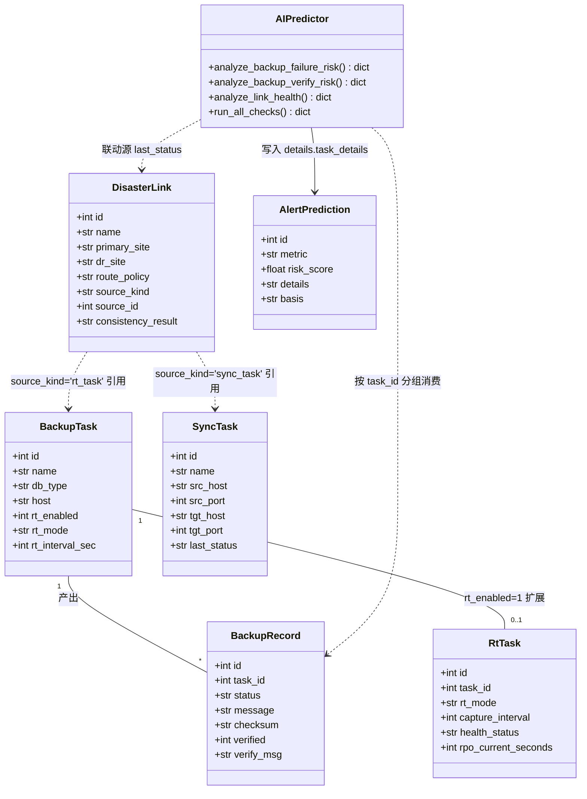
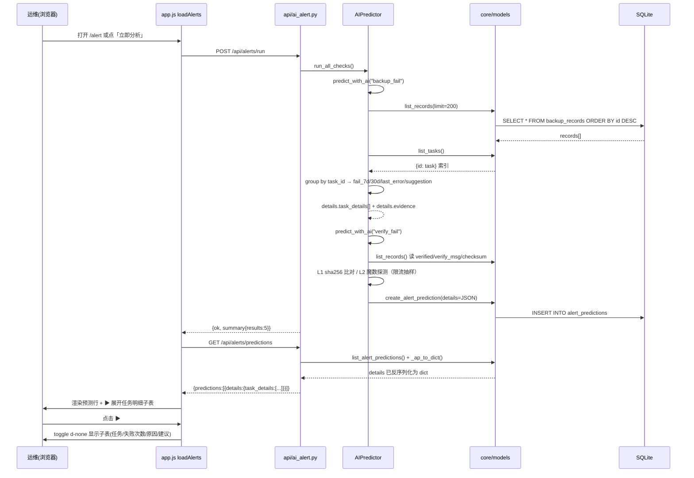
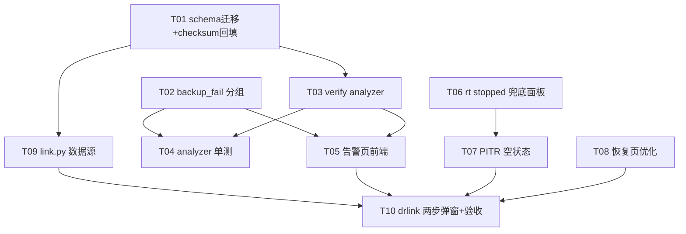

# UX 反馈增量系统设计（2026-08-01）

> 文档类型：**增量架构设计 + 任务分解**
> 上游：`docs/ux-feedback-20260801-prd.md`
> 栈：Python 3.14 + Flask + SQLite + Bootstrap 5 + 原生 JS（沿用，不引入新框架）

---

## 0. 读码后的前置纠正（工程师务必按此为准）

PRD / 任务书中的部分文件名与实际仓库不符，已核对修正：

| PRD 写法 | **实际文件** | 说明 |
|---|---|---|
| `api/alert.py` | **`api/ai_alert.py`** | 路由前缀 `/api/alerts/*` |
| `api/drlink.py` | **`api/link.py`** | 路由前缀 `/api/disaster-links` |
| `static/js/restore.js` | **`static/js/app.js`** | 全站单文件 JS（4682 行），无分页 JS |
| `analyze_verify_fail()` | **`analyze_backup_verify_risk()`** | 函数名，metric 值为 `verify_fail` |

**三个必须知道的既有实现事实：**

1. `api/ai_alert.py:37` 已对每行调用 `models._ap_to_dict(r)`，会把 `details` JSON 反序列化成 dict 下发。**因此只要把 `task_details` / `evidence` 塞进 `details`，API 层零改动即可透传到前端**——这是本次"只加字段不改结构"能成立的技术前提。
2. `_parse_response()`（ai_alert.py:613）在走 LLM 时保留 `rule_result["details"]` 原样，只覆盖 `basis`。**所以 evidence 必须放 `details` 而非 `basis`**，否则模型启用时会被 LLM 输出冲掉。
3. `PUT /api/rt/tasks/<id>/config` → `models.update_rt_config()` **只更新 `backup_tasks` 的 6 个 rt_* 列，不会创建 `rt_tasks` 扩展行**。PRD 假设"复用该接口即可创建实时保护任务"是不成立的，必须在接口内补 rt_tasks upsert（见模块 B）。

---

## 1. 增量变更总览表

| 模块 | 改动类型 | 影响文件 | 兼容性 |
|---|---|---|---|
| A1 备份失败任务级明细 | 改逻辑（details 加字段） | `core/ai_alert.py` | ✅ 纯新增字段，老记录 `details.task_details` 缺失时前端降级为无展开箭头 |
| A2 数据验证新 metric | 加 analyzer + 加配置 | `core/ai_alert.py`、`core/scheduler.py`、`core/models.py` | ✅ 新 metric，不影响既有 4 个 |
| A3 告警前端 | 改前端 | `templates/alert.html`、`static/js/app.js` | ✅ 加卡片/列，不动既有渲染 |
| B 实时备份任务选择 | 改逻辑 + 改前端 | `api/rt.py`、`templates/rt_timeline.html`、`static/js/app.js` | ✅ 有任务时行为完全不变 |
| C 恢复页优化 | 改文案 + 改前端 | `templates/restore.html`、`static/js/app.js` | ✅ 无后端改动 |
| D 容灾 HA 数据源 | **加字段**（ALTER）+ 加端点 + 改前端 | `core/db.py`、`core/models.py`、`api/link.py`、`templates/drlink.html`、`static/js/app.js` | ⚠️ 需 ALTER 迁移；存量行回填 `manual` 后读取零回归 |

---

## 2. 各模块详细设计

### 模块 A — AI 告警任务级明细 + 数据验证

#### A1 `analyze_backup_failure_risk()` 按任务分组

**不改数据库结构**，只扩 `details`。改造要点：

- `models.list_records(limit=50)` → `list_records(limit=200)`，取到足够跨 30 天的样本；全局分数计算逻辑（consecutive / rate7 / rate30 / dur_spike / size_anom）**原样保留**，保证既有单测不回归。
- 新增分组阶段：`records` 按 `task_id` 分桶 → 每桶算 `fail_7d` / `fail_30d` / `last_fail_at` / `last_error`（最近一条 `status='failed'` 的 `message[:80]`）→ 任务级分数 `task_risk_score`（复用同一套阈值，只作用于该桶）→ 按分数倒序取 Top 10。
- 任务名/db_type 用一次 `models.list_tasks()` 建 `{id: task}` 索引，避免 N+1 查询。
- **建议动作**：纯关键词映射，不调 LLM。

```python
SUGGESTION_RULES = [  # (关键词元组, 建议动作)
    (("connection refused", "can't connect", "timed out", "unreachable", "拒绝"), "检查源库端口可达性与网络策略"),
    (("access denied", "permission", "authentication", "权限", "密码"),        "检查备份账号权限与凭据有效性"),
    (("no space", "disk full", "磁盘", "空间不足"),                            "清理 L1 暂存目录或扩容备份分区"),
    (("timeout", "超时", "lock wait"),                                         "调大超时阈值或避开业务高峰重试"),
]  # 均不命中 → "查看任务日志定位失败原因"
```

- `basis` 保持 `list[str]`（人类可读），追加任务级条目；机器可读 ID 放 `details.evidence = {"task_ids": [...], "record_ids": [...]}`。

#### A2 新增第 5 个 analyzer `analyze_backup_verify_risk()`（metric = `verify_fail`）

消费 `backup_records.verified` / `verify_msg` / `checksum`，三层校验：

| 层 | 手段 | 评分 | 默认 |
|---|---|---|---|
| L1 完整性 | 文件存在 + size>0 + sha256 与落库 `checksum` 比对 | 失败 → 90（critical） | 开 |
| L2 可用性 | gzip 魔数 + 尾部 CRC 探测 / SQL dump 关键标记扫描 | 失败 → 70 | 开 |
| L3 可恢复性 | 抽样 dry-run 恢复 | 预留空实现 | **关（P2）** |
| 派生 | `verified=0` 占比 ≥30% → 55；距上次成功验证 >7 天 → 45 | | |

**IO 限流（回应 PRD 待确认 3）**：单次最多校验 `verify_sample_limit=20` 条最近记录；`size_bytes > verify_max_file_mb(512)` 的文件跳过全量 sha256，退化为"头 8KB + 尾 8KB + 大小"轻指纹。触发周期跟随 `ai_alert_interval_hours`，不新增独立调度器。

**`checksum` 为空的兜底**：不判 L1 失败（否则存量数据全线误报 critical），只计入 `unverified_ratio`，并在 `basis` 提示"N 条记录无校验和，建议执行回填"。

`details` 输出：`{layers:{l1:{checked,failed},l2:{...}}, unverified_ratio, last_verified_at, task_details:[...], evidence:{record_ids:[...]}}`，与 A1 **同构**，前端展开子表组件可复用。

**接线清单（易漏，共 5 处）**：
1. `DEFAULT_AI_CONFIG` 加 `"verify_fail": {...}` 子表；
2. `save_config()` 的子表元组 `("backup_fail","storage_full","link_degraded","drill_overdue")` → 追加 `"verify_fail"`；
3. `predict_with_ai()` 内**三处** `fn_map`（第 634 / 649 / 666 行）均需加 `"verify_fail"`；
4. `run_all_checks()` 的 `analyzers` 列表追加；
5. `_verify_backup()`（scheduler.py:390）增强：成功后 `db.sha256_file(path)` 落 `checksum`，与上一条同任务记录的 checksum 相同时在 `verify_msg` 标注"与上次一致（疑似源未变更）"。

#### A3 前端

- `alert.html`：`metricCards` 加第 6 张卡（`data-metric="verify_fail"`，图标 `bi-patch-check`）；`predMetricFilter` 加 `<option value="verify_fail">数据验证</option>`；预测表头首列插入空 `<th style="width:32px">`。
- `app.js`：`METRIC_META`（4104 行）加 `verify_fail: "数据验证"`；`loadAlerts()` 渲染行时，若 `p.details?.task_details?.length` 则首列输出 `▶` 展开钮，并紧随其后插入一行 `<tr class="pred-detail-row d-none">` 承载子表（任务/类型/近7天/近30天/最近失败/原因摘要/建议）。展开态用 `classList.toggle('d-none')`，不引入新库。

---

### 模块 B — 实时备份任务选择

**关系确认**：实时保护任务 = `backup_tasks.rt_enabled=1`（6 个 rt_* 列）+ `rt_tasks` 扩展行（`task_id` UNIQUE，1:1），非独立实体。`GET /api/rt/tasks` 读的是 `models.list_rt_tasks()`（查 `backup_tasks`）。

**后端 upsert 已存在，T06 不在 API 层重造（关键修正）**：追链确认 `rt_tasks` 扩展行**已由守护进程自动建立**，无需 `api/rt.py` 再写一份：

```
PUT /api/rt/tasks/<id>/config   api/rt.py:318
 └─ models.update_rt_config()         置 backup_tasks.rt_enabled=1
 └─ rt_backup.reconcile()    api/rt.py:336  ← 注释原文「并立即对账使其生效」
     └─ supervisor.reconcile()    supervisor.py:334 按 rt_enabled 对账
         └─ _spawn_worker()        supervisor.py:370 新开启任务→建 worker
             └─ worker.start()     db_rt.py:131
                 └─ _sync_rt_task_row()   db_rt.py:674 / file_rt.py:549
                     └─ get_rt_task() 无 → create_rt_task()  ✅ rt_tasks 行自动建立
```

该 upsert 在 **db_cdc**（`db_rt.py:674`）与 **file_polling**（`file_rt.py:549`）两种模式下各有一份（填不同 retention 字段），已挂在被复用的 `PUT /config` 端点上。

**结论：T06 严禁在 API 层新增第三份 upsert**——那会与上述两份形成三处并行演进，反而制造我们刚排除的漂移风险。本段原 upsert 代码片段作废；T06 重定界见 §7。

**单一事实来源（回应 PRD §7 遗留待办：两套并行 rt_* 字段）**：读码确认——守护进程 `TaskConfig` 由 `core/rt_backup/types.py:180,184` 从 `backup_tasks.rt_interval_sec` / `rt_log_retention_days` 构建；`api/rt.py:118,120` 的列表接口与前端任务选择器也都读 `backup_tasks.rt_*`。而 `rt_tasks.capture_interval` / `db_log_retention_days` 是**守护进程回写**的运行时镜像（`db_rt.py:678`、`file_rt.py:553` 写 `self.rt.interval_sec`），**不是配置输入**。结论：
- **配置唯一真相源 = `backup_tasks.rt_*`**（守护进程与前端均已如此）。PM 担心的「界面改了间隔但 daemon 仍按 180 跑」**不会发生**——daemon 从不读 `rt_tasks.capture_interval` 来决定行为。
- `rt_tasks.*` 运行时列（`capture_interval` / `health_status` / `rpo_current_seconds` / `disk_quota_gb` / `is_running` / `last_tick_at`）归守护进程所有，仅供健康展示。佐证：`rt_rpo_target_sec` 仅存 `backup_tasks`（配置目标），`rpo_current_seconds` 仅存 `rt_tasks`（实测值）——天然 config/state 职责分离。
- `rt_tasks` 扩展行由守护进程 `reconcile()` → `_sync_rt_task_row()` 自动建立（见上方链路），`update_rt_config` 不建行本身**不是 bug**——只要守护在跑，行会自动出现。唯一真实缺口是**守护 stopped 时 `reconcile` 不拉起 worker → 行不建、不真正开始捕获，但界面显示创建成功（静默失败）**，这正是 T06 重定界后的兜底面板要解决的。原 PRD §7 遗留待办已关闭并升级为决策 11/12。

候选任务列表**复用已有 `GET /api/tasks`**（`_decorate` 透传全列，含 `rt_enabled`），前端过滤 `rt_enabled != 1`，**不新增端点**。

**前端**：
- `rt_timeline.html`：在 `.page-card`（时间轴卡）前插入 `<div id="rtEmptyState" class="page-card text-center d-none">`——含标题「尚未开启任何实时保护任务」、3 步说明、`[创建实时保护任务]` 主按钮 + `[了解实时保护]`；再加一个 `rtCreateModal`（选备份任务 → 选 `rt_mode`（db_cdc / file_polling）→ 捕获间隔）。
- `app.js` `rtLoadTasks()`：`RT.tasks.length === 0` 时 `rtEmptyState` 显形 + 时间轴/统计区加 `d-none`；非空时反向。
- **分组下拉**：`db_type ∈ {mysql, mariadb, postgresql}` 且 `rt_mode ∈ {db_cdc, auto}` → `<optgroup label="数据库 · 秒级日志 PITR">`，其余 → `<optgroup label="文件 · 分钟级变更捕获">`；选项文本尾部拼 `health.rpo_actual_sec` 实际 RPO。
- 未选任务时禁用 `rtTriggerBtn` / `rtRecoverBtn`；`initRtTimeline()` 起始解析 `?task_id=` 深链。
- 创建成功后：`await rtLoadTasks(); RT.taskId = newId; await rtLoadTimeline()`，**无需刷新页面**。

---

### 模块 C — 数据恢复页面优化

- `templates/restore.html:6` → `从备份记录恢复到源实例或跨主机恢复`（全仓 `grep -ri "鼎甲\|迪备"` 现仅此 1 处命中，另 4 处在 PRD 文档内，属预期）。
- `r_record_info_row` 由 `alert-info` 单行长文本改为**卡片**：任务名 / 时间 / 大小 / 校验状态（`verified` → ✅已校验 / ⚠️未校验）/ 存储层（`storage_tier`）/ 记录号，5 项独立 `<span>`，改 `onRecordChange()` 渲染。
- `submitRestore()`：提交即 `btn.disabled = true` + spinner + 不确定态进度条；完成后 `renderRestoreRecords()` 并给首行加 `table-success` 高亮 3 秒。纯前端，无 API 变更。

---

### 模块 D — 容灾 HA 与数据同步整合

**建模裁决：`disaster_links` 加两列，不建 `dr_sources` 关联表。**

理由：① 现表 `primary_site` / `dr_site` 是**单值**语义，`DisasterLinkEngine.select_route/fill_log_gap/run_consistency_check` 与 `analyze_link_health()` 全部按"一链路一站点对"实现，引入 1:N 后无任何下游消费者，属过度设计；② 本仓已有 15+ 处 `ALTER TABLE ... ADD COLUMN` try/except 兜底迁移的成熟范式，加列成本≈0；③ 未来真要多源，可另建 `dr_sources` 并用 `source_kind='multi'` 作为过渡标记，加列方案不构成阻塞。

**连接信息裁决：引用 + 快照双轨。** `source_kind`/`source_id` 是**引用**（真相源，用于卡片展示源任务名与 `last_status`、供 `analyze_link_health()` 联动）；`primary_site`/`dr_site`/`route_policy` 是**创建时快照回填**（可手工改，链路执行以此为准）。理由：现有渲染与告警逻辑全依赖这三个文本字段，不落库必然回归；且源任务改地址不应静默改变已生效的容灾配置。差异检测放前端——卡片检测到源当前地址 ≠ 快照时显示「源已变更 ↻重新回填」提示。

**源任务状态要求（回应 PRD 待确认 7）**：`enabled=1` 即可入选，不强制 `status='running'`；`last_status='failed'` 的源在下拉中标红但可选，由 `analyze_link_health()` 追加 `+25` 分劣化因子（低于 `switch_count_high` 的 70 分，避免压过既有权重）。

**新增端点** `GET /api/disaster-links/sources`，归一化输出两类源：

```json
{"ok": true, "items": [
  {"kind":"sync_task","id":3,"name":"北京→上海 订单库同步","status":"running",
   "primary_site":"10.10.0.5:3306","dr_site":"10.20.0.1:3306","db_type":"mysql"},
  {"kind":"rt_task","id":7,"name":"核心交易库","status":"green",
   "primary_site":"10.10.0.9:3306","dr_site":"","rt_mode":"db_cdc","rpo_sec":12}
]}
```

`sync_tasks` 取 `src_host:src_port` / `tgt_host:tgt_port`（**不下发任何密码字段**，`list_sync_tasks(include_secret=False)`）；rt 源取 `list_rt_tasks()` 的 `host:port`，`dr_site` 留空由用户填。

**弹窗两步**：`drlink.html` 的 modal-body 拆为 `#linkStep1`（数据源单选 + 分组下拉）与 `#linkStep2`（现有字段，选源后回填并解锁）。`items` 为空 → step1 显示「暂无可用数据源，请先创建数据同步任务 →」链接到 `/sync`，`saveLink` 按钮 `disabled`。编辑存量 `manual` 链路时跳过 step1（兼容 P2 手工模式）。

---

## 3. 数据模型变更

只有一处 DDL 变更，落在 `core/db.py`：`SCHEMA` 的 `disaster_links` 定义补两列（新库直建），`init_schema()` 内追加 ALTER 兜底（老库迁移）：

```sql
-- SCHEMA 内 disaster_links 追加
source_kind  TEXT DEFAULT 'manual',   -- sync_task | rt_task | manual
source_id    INTEGER,

-- init_schema() 内（沿用既有 for col, typedef 循环范式）
ALTER TABLE disaster_links ADD COLUMN source_kind TEXT DEFAULT 'manual';
ALTER TABLE disaster_links ADD COLUMN source_id   INTEGER;
UPDATE disaster_links SET source_kind='manual' WHERE source_kind IS NULL OR source_kind='';
```

`models._DISASTER_LINK_FIELDS`（1021 行）追加 `"source_kind"`, `"source_id"`；`_dl_to_dict()` 加 `d["source_id"] = int(d["source_id"]) if d.get("source_id") else None`。

**其他表零 DDL 变更**：`ai_predictions.details` 是 TEXT JSON，`task_details` / `evidence` 直接进 JSON；`backup_records.checksum/verified/verify_msg` 三列已存在。

---

## 4. API 变更清单

| 端点 | 变更 | 字段变化 |
|---|---|---|
| `GET /api/alerts/predictions` | **无代码改动** | 响应 `details` 内新增 `task_details[]`、`evidence{task_ids,record_ids}`；`metric` 新增枚举值 `verify_fail` |
| `POST /api/alerts/run` | 无 | `summary.results` 由 4 项变 5 项 |
| `GET/POST /api/alerts/config` | 无 | 配置体新增 `verify_fail` 子表（`l1_enabled`/`l2_enabled`/`l3_enabled`/`verify_sample_limit`/`verify_max_file_mb`/`unverified_ratio_warn`/`stale_days`） |
| `PUT /api/rt/tasks/<id>/config` | **改逻辑** | 请求不变；`rt_enabled=1` 时额外 upsert `rt_tasks` 行，响应 `task` 增加 `rt_task` 子对象 |
| `GET /api/tasks` | 无 | 前端新用途：筛 `rt_enabled != 1` 作创建候选 |
| `GET /api/disaster-links/sources` | **新增** | 见模块 D |
| `POST/PUT /api/disaster-links` | 加字段 | 请求体新增 `source_kind`、`source_id`；`POST` 校验：`source_kind ∉ {sync_task,rt_task,manual}` → 400；`source_kind != 'manual'` 且 `source_id` 为空 → 400 |
| `GET /api/disaster-links` | 加字段 | 每项新增 `source_kind`、`source_id`、`source_name`、`source_last_status`（后两项由 `api/link.py` 联查填充，不落库） |

---

## 5. 类图：容灾链路与数据源关系



## 6. 时序图：AI 告警任务级明细数据流



---

## 7. 任务列表（T01–T10）

| ID | 任务名 | 输入 | 输出（文件） | 依赖 | 工作量 |
|---|---|---|---|---|---|
| **T01** | DB schema 迁移 + checksum 回填脚本 | 本文档 §3 | `core/db.py`（SCHEMA + ALTER + UPDATE 回填 manual）、`core/models.py`（`_DISASTER_LINK_FIELDS`、`_dl_to_dict`）、`scripts/backfill_checksum.py`（遍历 `checksum IS NULL` 且文件存在的记录，`db.sha256_file` 回填，支持 `--dry-run --limit`） | — | 0.5d |
| **T02** | `analyze_backup_failure_risk` 任务级分组 | §2 A1 | `core/ai_alert.py`（分组逻辑 + `SUGGESTION_RULES` + `details.task_details/evidence`） | — | 1d |
| **T03** | 新增 `analyze_backup_verify_risk` + 5 处接线 | §2 A2 | `core/ai_alert.py`（新 analyzer + `DEFAULT_AI_CONFIG.verify_fail` + `save_config` 子表 + 3 处 `fn_map` + `run_all_checks`）、`core/scheduler.py`（`_verify_backup` 落 sha256） | T01 | 1.5d |
| **T04** | 告警 analyzer 单测 | T02/T03 产物 | `tests/test_ai_alert_taskdetail.py`（沿用 `tests/test_ai_alert.py` 的 tmpdir+DEMO_MODE 范式；覆盖：≥2 任务有失败时 `task_details` 长度≥2 且 8 字段齐全、`evidence.record_ids` 可查、`run_all_checks` 返回 5 metric、篡改文件后 `verify_fail ≥ high`、checksum 全空时不误报 critical） | T02,T03 | 1d |
| **T05** | 告警页前端：明细展开 + 数据验证卡片 | §2 A3 | `templates/alert.html`（第 6 张卡 + filter 选项 + 表头列）、`static/js/app.js`（`METRIC_META`、`loadAlerts` 展开行、子表渲染） | T02,T03 | 1d |
| **T06** | PITR 守护 stopped 兜底面板 + 回归验证 | §2 B（修正后） | `templates/rt_timeline.html`（stopped 提示条 + 启动按钮）、`static/js/app.js`（`rtLoadTasks` 检测守护态、创建后自动选中渲染不依赖 `rt_tasks` 行） | — | 0.2d |
| **T07** | PITR 页空状态 + 创建入口 + 分组下拉 | §2 B、T06 | `templates/rt_timeline.html`（`rtEmptyState`、`rtCreateModal`）、`static/js/app.js`（`rtLoadTasks` 空态分支、optgroup 分组、`?task_id=` 深链、未选任务禁用按钮） | T06 | 1d |
| **T08** | 恢复页文案清理 + 体验优化 | §2 C | `templates/restore.html`（第 6 行文案）、`static/js/app.js`（`onRecordChange` 卡片、`submitRestore` 禁用+进度+高亮） | — | 0.5d |
| **T09** | `api/link.py` 支持数据源 + `/sources` 端点 | §2 D、T01 | `api/link.py`（新增 `GET /api/disaster-links/sources`、POST/PUT 校验与写入 `source_kind/source_id`、列表联查 `source_name/source_last_status`）、`core/ai_alert.py`（`analyze_link_health` 追加源失败 +25 分因子） | T01 | 1d |
| **T10** | `drlink.html` 两步弹窗 + 联动 & 集成验收 | §2 D、T09 | `templates/drlink.html`（step1/step2）、`static/js/app.js`（`openLinkModal` 两步、源选中回填、空源禁用保存、卡片展示源名与状态、「源已变更」提示）、`docs/ux-feedback-20260801-verification.md`（按 PRD §6 四组验收标准逐条记录结果） | T09,T05,T07,T08 | 1.5d |

**依赖图**



并行建议：T01 / T02 / T06 / T08 四条线无相互依赖，可同时开工。

---

## 8. 共享知识（跨文件约定）

**JSON 字段命名**
- 全部 `snake_case`；时间一律 ISO 8601 带时区，产出用 `db.now_iso()`，解析用 `AIPredictor._parse_ts()`（已容错无时区格式）。
- `details.task_details[]` 每项**固定 8 字段**：`task_id, task_name, db_type, fail_7d, fail_30d, last_fail_at, last_error, task_risk_score`，外加 `suggestion`；缺值填 `null`，**不省略键**。
- `details.evidence` 固定 `{"task_ids": [int], "record_ids": [int]}`。
- 机器可读 ID **只进 `details`**，`basis` 永远是人类可读 `list[str]`（LLM 路径会覆盖 `basis`，不会覆盖 `details`）。

**错误码与响应格式**（沿用现状，勿统一改造）
- `api/rt.py`：失败 `{"ok": false, "message": "...", "error": "..."}` + 400/404/500，用模块内 `_fail()`。
- `api/link.py` / `api/ai_alert.py`：失败 `{"error": "..."}` + HTTP 码；成功 `{"ok": true, ...}`。前端 `api()` 助手读 `data.error`，新增端点必须带 `error` 键。

**前端约定**
- 全站 JS 只改 `static/js/app.js`，不新建 JS 文件；所有字符串输出必须过 `esc()`；提示统一 `toast(msg, "success"|"danger"|"dark")`。
- 颜色只用 `app.css` 的 Design Token（`var(--success)` 等），**禁止硬编码色值**。
- 展开/折叠用 `classList.toggle('d-none')`，不引第三方组件。

**风险分级**：`0-40 low / 40-65 medium / 65-85 high / 85-100 critical`（`RISK_LEVELS`），新 analyzer 必须走 `_level_from_score()`，禁止自行判级。

**测试策略**
- 后端：`tests/` 下新建文件，复用 `test_ai_alert.py` 的 `tempfile.mkdtemp` + `DEMO_MODE=on` + `META_DB_PATH` 环境隔离范式，用真实 SQLite 临时库而非 mock，与现有测试一致。
- 前端：无自动化框架，T10 按 PRD §6 的 12 条验收标准做手工集成测试并出报告。

---

## 9. 待明确事项裁决

| # | 问题 | 裁决 | 理由 |
|---|---|---|---|
| 1 | HA 数据源：加列 vs 关联表 | **加列**（`source_kind`+`source_id`） | 现表单站点对语义，无 1:N 消费者；仓内 ALTER 兜底范式成熟；未来可用 `source_kind='multi'` 平滑演进 |
| 2 | 连接信息：引用 vs 快照 | **双轨**：ID 引用做展示/告警联动，站点与路由策略做创建时快照回填 | 三个文本字段是既有渲染与 `analyze_link_health` 的依赖，不落库必回归；源改址不应静默改变生效中的容灾配置，改为前端「源已变更 ↻重新回填」提示 |
| 3 | `checksum` 存量影响 | **加一次性回填脚本**（T01 内 `scripts/backfill_checksum.py`），且 L1 遇空 checksum **不判失败**只计未验证占比 | 现网 `instance/meta.db` 为空库，但 `scheduler.py:232` 的 `result.checksum` 在部分 driver / DEMO 下为空，存量必然稀疏；直接判失败会全线误报 critical |
| 4 | L3 抽样恢复演练 | **本期只留配置开关 + 空实现，默认关** | 成本高且需 vDB 环境，`vdb_instances` 表已具备承载能力，留作 P2 独立迭代 |
| 5 | 验证触发时机与 IO | **跟随 `ai_alert_interval_hours`**，抽样 20 条上限 + 512MB 以上文件走头尾轻指纹 | 不新增调度器；避免大文件全量 sha256 打满 IO |
| 6 | 源任务状态门槛 | `enabled=1` 即可选，`last_status='failed'` 标红可选并计 **+25** 劣化分 | 低于 `switch_count_high`(70) 与 `consistency_fail_score`(60)，不压过既有权重 |
| 7 | `rt_mode=file_polling` 是否同一时间轴 | **是**，复用同组件；分桶精度 60/120/240 格对分钟级捕获足够 | `recovery_journal` 已统一承载 `file-inc` 与 `db-log` 两类 `rp_kind` |
| 8 | `backup_tasks.rt_*` 与 `rt_tasks.*` 双列以谁为准（PRD §7 遗留待办） | **`backup_tasks.rt_*` 为配置唯一真相源**；`rt_tasks.capture_interval` 等是守护进程回写的运行时镜像，非输入 | `types.py:180,184` 与 `api/rt.py:118,120` 均读 `backup_tasks.rt_*`；`db_rt.py:678`/`file_rt.py:553` 回写 `rt_tasks.capture_interval`；PM 担心的配置漂移不会发生，原遗留待办可关闭 |
